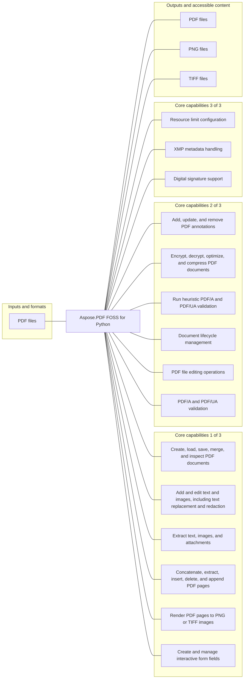

# Aspose.PDF FOSS for Python

[](https://github.com/aspose-pdf-foss/Aspose-PDF-FOSS-for-Python/tree/737d26451ed5c58e53017e3c9460e834f99d20ed)   [](LICENSE) [](https://github.com/aspose-pdf-foss/Aspose-PDF-FOSS-for-Python/graphs/contributors)

Aspose.PDF FOSS for Python provides developers using Python a way to create, load, save, merge, and inspect PDF documents. Its verified scope also includes add and edit text and images, including text replacement and redaction, and extract text, images, and attachments.

## Navigation

- [At a glance](#at-a-glance)
- [Key capabilities](#key-capabilities)
- [Installation](#installation)
- [Quick start](#quick-start)
- [API reference](#api-reference)
- [Scope and limitations](#scope-and-limitations)
- [Development and testing](#development-and-testing)
- [Contributing](#contributing)
- [Security](#security)
- [License](#license)

## At a glance



## Key capabilities

- Create, load, save, merge, and inspect PDF documents.
- Add and edit text and images, including text replacement and redaction.
- Extract text, images, and attachments.
- Concatenate, extract, insert, delete, and append PDF pages.
- Render PDF pages to PNG or TIFF images.
- Create and manage interactive form fields.
- Add, update, and remove PDF annotations.
- Encrypt, decrypt, optimize, and compress PDF documents.
- Run heuristic PDF/A and PDF/UA validation.
- Document lifecycle management.
- PDF file editing operations.
- PDF/A and PDF/UA validation.
- Resource limit configuration.
- XMP metadata handling.
- Digital signature support.

## Installation

Install the verified immutable repository revision from a local checkout:

```bash
git clone https://github.com/aspose-pdf-foss/Aspose-PDF-FOSS-for-Python.git
cd Aspose-PDF-FOSS-for-Python
git checkout --detach 737d26451ed5c58e53017e3c9460e834f99d20ed
python -m pip install .
```

`aspose-pdf-foss-for-python` was installed and exercised from this exact source revision in an isolated, network-disabled verification environment. The matching PyPI receipt did not find a published package, so this README does not present a PyPI package installation command.

Optional dependency groups declared in `pyproject.toml`:
- `dev`: `python -m pip install ".[dev]"`
- `fuzz`: `python -m pip install ".[fuzz]"`
- `images`: `python -m pip install ".[images]"`
- `text-layout`: `python -m pip install ".[text-layout]"`
- `woff2`: `python -m pip install ".[woff2]"`

Required runtime dependencies declared in `pyproject.toml`: `cryptography>=42`, `asn1crypto>=1.5`.

- optional capability: `python -m pip install Pillow`

## Quick start

### Minimal verified example

```python
from aspose_pdf import Document

with Document() as document:
    page = document.pages.add()
    page.add_text(
        "Hello from Aspose.PDF FOSS for Python!",
        x=72,
        y=720,
        font_size=18,
    )
    document.save("hello.pdf")
```

## API reference

The package declares 96 public exports in its static `__all__` surface.

<details>
<summary>View MCP and public API details</summary>

### `aspose_pdf`

- `Annotation`
- `AnnotationCollection`
- `AnnotationFlags`
- `AnnotationType`
- `ByteArrayDataSource`
- `CertificationLevel`
- `DataSource`
- `Document`
- `Field`
- `FieldType`
- `FileDataSource`
- `FileFontSource`
- `FileSpecification`
- `FolderFontSource`
- `FontDescriptor`
- `FontEmbeddingException`
- `FontRepository`
- `FontSource`
- `Form`
- `FormType`
- `LinkAnnotation`
- `MarkupAnnotation`
- `MemoryFontSource`
- `MergeOptions`
- `Merger`
- `NamespaceProvider`
- `OperationResult`
- `OptimizationOptions`
- `OptimizeOptions`
- `Optimizer`
- `Page`
- `PageCollection`
- `PdfAValidateOptions`
- `PdfAValidationResult`
- `PdfAValidator`
- `PdfExtractor`
- `PdfFileEditor`
- `PdfLoadLimits`
- `PdfPlugin`
- `PdfResourceLimitException`
- `PdfSignature`
- `PdfUaValidateOptions`
- `PdfUaValidationResult`
- `PdfUaValidator`
- `Plugin`
- `PluginOptions`
- `RasterizedPage`
- `ResultContainer`
- `RevocationStatus`
- `SplitOptions`
- `Splitter`
- `StreamDataSource`
- `StructureElement`
- `SystemFontSource`
- `TaggedContent`
- `TextExtractor`
- `TextExtractorOptions`
- `TextLayoutOptions`
- `TrustStatus`
- `UnsignedContent`
- `UnsignedContentAbsorber`
- `UnsupportedFeatureException`
- `ValidationMethod`
- `ValidationMode`
- `ValidationOptions`
- `ValidationResult`
- `ValidationStatus`
- `XmpArray`
- `XmpField`
- `XmpPacket`
- `XmpProperty`
- `XmpStruct`
- `__version__`
- `parse_xmp`
- `serialize_xmp`

### `aspose_pdf.annotations`

- `Annotation`
- `AnnotationCollection`
- `AnnotationFlags`
- `AnnotationType`
- `LinkAnnotation`
- `MarkupAnnotation`
- `Name`

### `aspose_pdf.clustering`

- `Cluster`
- `ClusterCollection`
- `DataPoint`

### `aspose_pdf.engine.data`

- `Color`
- `Encoding`
- `EncodingType`
- `FilterType`
- `PdfNull`
- `PdfObjectID`
- `PdfObjectRegistry`
- `PdfTrailerable`

### `aspose_pdf.engine.primitives`

- `Matrix`

### `aspose_pdf.security`

- `CompromiseCheckResult`
- `SignaturesCompromiseDetector`

### `FileSpecification` members

- `name: str`
- `contents: bytes`
- `mime_type: str | None`
- `description: str | None`
- `creation_date: datetime | None`
- `mod_date: datetime | None`
- `size: int`
- `save(path) -> None`

### `DataPoint` members

- `get_centroid(cluster) -> DataPoint`

### `Cluster` members

- `empty() -> Cluster`
- `count: int`
- `contains(item) -> bool`
- `clone() -> Cluster`

### `Color` members

- `pattern_color_space: GradientAxialShading | None`
- `r: float`

### `Document` members

- `load_limits: PdfLoadLimits`
- `pages: PageCollection`
- `form: Form`
- `tagged_content: TaggedContent`
- `attachments`
- `add_attachment(name, content, mime, description, creation_date, mod_date, compress) -> Document`
- `embedded_files: list[FileSpecification]`
- `get_embedded_file(name) -> FileSpecification | None`
- `page_count: int`
- `info: dict[str, str]`
- `info(value)`
- `xmp_metadata: XmpPacket`
- `xmp_metadata(value) -> None`
- `sync_metadata(direction) -> Document`
- `is_encrypted: bool`
- `id: list[bytes] | None`
- `version: str`
- `version(value) -> None`
- `outlines: OutlineCollection`
- `permissions: int`
- `open_streaming(path, password, limits) -> Document`
- `iter_pages() -> Iterator[Page]`
- `iter_page_content_streams() -> Generator[bytes, None, None]`
- `render_page(page_index, dpi, scale, background, antialias) -> RasterizedPage`
- `save_page_as_image(page_index, destination, dpi, scale, background, antialias) -> Path`
- `replace_text(search, replacement, page_index, case_sensitive, max_count) -> int`
- `redact_text(search, page_index, case_sensitive, max_count, overlay, overlay_color) -> int`
- `load_from(source, password, limits) -> Document`
- `optimize(options=None, compress_streams) -> Document`
- `optimize_resources(options=None) -> Document`
- `compress_streams() -> Document`
- `is_pdfa_compliant(level='1b') -> bool`
- `validate_pdfa(level='1b') -> PdfAValidationResult`
- `is_pdfua_compliant: bool`
- `validate_pdfua() -> PdfUaValidationResult`
- `convert_to_pdfa(level='1b', font_lookup_directory) -> list[str]`
- `convert_to_pdfua(language, title, auto_tag) -> list[str]`
- `auto_tag(image_alt='Image') -> int`
- `save(destination, save_format=None, overwrite, incremental) -> Document`
- `dispose() -> None`
- `close() -> None`
- `merge(*documents) -> Document`
- `encrypt(user_password, owner_password=None, permissions) -> Document`
- `decrypt(password) -> Document`
- `change_passwords(old_password, new_user_password, new_owner_password=None) -> Document`
- `validate() -> bool`
- `check() -> bool`
- `repair() -> Document`
- `flatten() -> Document`
- `generate_appearances(force) -> int`
- `generate_field_appearances() -> int`
- `free_memory() -> Document`

### `Color` members

- `r: float`
- `g: float`
- `b: float`
- `a: float`
- `aqua() -> Color`
- `blue() -> Color`
- `azure() -> Color`
- `red() -> Color`
- `green() -> Color`
- `yellow() -> Color`
- `black() -> Color`
- `white() -> Color`
- `gray() -> Color`
- `Aqua() -> Color`
- `Blue() -> Color`
- `Azure() -> Color`
- `Red() -> Color`
- `Green() -> Color`
- `Yellow() -> Color`
- `Black() -> Color`
- `White() -> Color`
- `Gray() -> Color`

### `XmpField` members

- `prefix: str`
- `name: str`
- `namespace_uri: str`
- `value: Any`
- `language: str | None`
- `is_uri: bool`
- `qualifiers: list[XmpField]`

### `XmpArray` members

- `items: list[XmpField]`
- `namespace_provider: XmpNamespaceProvider | None`
- `kind: str`
- `add(item) -> None`
- `remove(item) -> bool`

### `XmpStruct` members

- `fields: list[XmpField]`
- `namespace_provider: XmpNamespaceProvider | None`
- `add(item) -> None`
- `get(name) -> XmpField | None`

### `XmpProperty` members

- `field: XmpField`
- `namespace_provider: XmpNamespaceProvider | None`
- `qualifiers: list[XmpField]`
- `add_qualifier(qualifier) -> None`
- `remove_qualifier(qualifier) -> None`

### `XmpPacket` members

- `fields: list[XmpField | XmpArray | XmpProperty]`
- `qualifiers: list[XmpField]`
- `namespace_provider: XmpNamespaceProvider | None`
- `add(value) -> None`
- `parse(data, provider) -> XmpPacket`
- `serialize(**kwargs) -> bytes`
- `to_bytes(**kwargs) -> bytes`
- `get(prefix_or_uri, name) -> XmpField | None`
- `set_value(prefix, name, value, uri) -> XmpField`
- `set_date(prefix, name, value, uri) -> XmpField`
- `get_date(prefix_or_uri, name) -> datetime | None`
- `set_localized_text(prefix, name, text, uri, lang) -> XmpField`
- `get_localized_text(prefix_or_uri, name, lang) -> str | None`
- `set_array(prefix, name, values, uri, kind) -> XmpField`
- `get_array(prefix_or_uri, name) -> list[str] | None`
- `set_bool(prefix, name, value, uri) -> XmpField`
- `get_bool(prefix_or_uri, name) -> bool | None`
- `set_int(prefix, name, value, uri) -> XmpField`
- `get_int(prefix_or_uri, name) -> int | None`
- `set_real(prefix, name, value, uri) -> XmpField`
- `get_real(prefix_or_uri, name) -> float | None`

### `Matrix` members

- `a: float`
- `b: float`
- `c: float`
- `d: float`
- `e: float`
- `f: float`
- `translate(x, y) -> None`
- `multiply(other) -> Matrix`

### `RasterizedPage` members

- `width: int`
- `height: int`
- `pixels: bytes`
- `dpi: float`
- `get_pixel(x, y) -> Color`
- `to_png() -> bytes`
- `to_tiff() -> bytes`
- `save(path) -> Path`

### `PageCollection` members

- `count: int`
- `is_read_only: bool`
- `contains(page) -> bool`
- `index_of(page) -> int`
- `item(index) -> Any`
- `get_enumerator()`

### `PdfExtractor` members

- `close() -> None`
- `dispose() -> None`
- `password: str | None`
- `password(value) -> None`
- `bind_pdf(source, password=None, limits) -> None`
- `extract_text() -> None`
- `get_text() -> str`
- `get_next_page_text() -> str`
- `has_next_page_text() -> bool`
- `extract_image() -> None`
- `has_next_image() -> bool`
- `get_next_image() -> Any`
- `extract_attachment() -> None`
- `get_attachment(name) -> Any`
- `get_attach_names() -> list[str]`

### `PdfFileEditor` members

- `last_exception: BaseException | None`
- `close() -> None`
- `dispose() -> None`
- `concatenate(inputs, output) -> bool`
- `extract(source, destination, page_from=None, page_to=None) -> bool`
- `insert(source, insert_file, destination, position) -> bool`
- `delete(source, destination, pages_to_delete=None, page_to=None, page_from=None) -> bool`
- `append(source, append_source, destination) -> bool`
- `add_page_break(input_path, output_path) -> bool`

### `FontDescriptor` members

- `has_font_data: bool`
- `get_font_bytes(limits) -> bytes`
- `matches(query) -> bool`

### `FontSource` members

- `get_font_definitions() -> list[FontDescriptor]`

### `FileFontSource` members

- `get_font_definitions() -> list[FontDescriptor]`

### `FolderFontSource` members

- `get_font_definitions() -> list[FontDescriptor]`

### `MemoryFontSource` members

- `get_font_definitions() -> list[FontDescriptor]`

### `SystemFontSource` members

- `get_font_definitions() -> list[FontDescriptor]`

### `FontRepository` members

- `add_source(source) -> None`
- `clear_sources() -> None`
- `reset_sources() -> None`
- `get_sources() -> list[FontSource]`
- `get_available_fonts() -> list[FontDescriptor]`
- `find_font(font_name) -> FontDescriptor | None`
- `search(font_name) -> FontDescriptor | None`
- `open_font(font_name) -> bytes | None`

### `FormType` members

- `from_string(value) -> FormType`

### `Field` members

- `name: str`
- `value: Any`
- `value(val)`
- `field_type: str`
- `remove() -> Field`

### `Form` members

- `fields: list[Field]`
- `add_text_field(name, page, rect, value, font_size, multiline, alignment, read_only, required) -> Field`
- `add_checkbox(name, page, rect, checked, on_value, read_only, required) -> Field`
- `add_radio_group(name, page, options, value, read_only, required) -> Field`
- `add_list_box(name, page, rect, options, value, multiselect, font_size, alignment, read_only, required) -> Field`
- `add_combo_box(name, page, rect, options, value, editable, font_size, alignment, read_only, required) -> Field`
- `add_push_button(name, page, rect, caption, read_only, required) -> Field`
- `remove_field(name) -> Field`
- `generate_appearances() -> int`
- `flatten() -> None`

### `UnsignedContent` members

- `add_page(page) -> None`
- `remove_page(page) -> None`
- `add_form_field(field) -> None`
- `remove_form_field(field) -> None`
- `add_annotation(annotation) -> None`
- `remove_annotation(annotation) -> None`
- `reset() -> None`

### `UnsignedContentAbsorber` members

- `reset() -> None`
- `get_extracted() -> UnsignedContent | None`
- `has_extracted() -> bool`
- `extract() -> UnsignedContent`

### `Document` members

- `load_limits: PdfLoadLimits`
- `load_from(source, password, limits) -> Document`
- `save(destination, save_format=None, overwrite) -> Document`
- `close(*args, **kwargs)`
- `dispose(*args, **kwargs) -> None`
- `merge(*documents) -> Document`
- `optimize(compress_images) -> Document`
- `optimize_resources(remove_unused) -> Document`
- `repair() -> Document`
- `flatten() -> Document`
- `free_memory() -> None`
- `encrypt(password) -> Document`
- `decrypt(password) -> Document`
- `change_passwords(old_password, new_password) -> Document`
- `validate() -> bool`
- `check() -> bool`
- `is_disposed: bool`
- `page_count: int`

### `UnsignedContentAbsorber` members

- `extract(*args, **kwargs) -> UnsignedContent`
- `reset() -> None`
- `get_extracted() -> UnsignedContent | None`
- `has_extracted() -> bool`

### `UnsignedContent` members

- `add_page(page) -> None`
- `remove_page(page) -> None`
- `add_form_field(field) -> None`
- `remove_form_field(field) -> None`
- `add_annotation(annotation) -> None`
- `remove_annotation(annotation) -> None`
- `reset() -> None`

### `PdfAValidateOptions` members

- `pdfa_version: Any`
- `optimize_file_size: Any`
- `is_low_memory_mode: Any`
- `log_output_source: Any`
- `add_input(*args, **kwargs)`
- `reset() -> None`
- `set_option(key, value) -> None`
- `get_options() -> dict[str, Any]`

### `PdfAValidationResult` members

- `reset() -> None`
- `add_error(error) -> None`
- `to_dict() -> dict[str, Any]`

### `PdfLoadLimits` members

- `max_input_bytes: int | None`
- `max_objects: int | None`
- `max_xref_sections: int | None`
- `max_nesting_depth: int | None`
- `max_container_items: int | None`
- `max_object_bytes: int | None`
- `max_decoded_stream_bytes: int | None`
- `max_codec_work_bytes: int | None`
- `max_compression_ratio: int | None`
- `max_content_stream_bytes: int | None`
- `max_total_decoded_bytes: int | None`
- `max_stream_filters: int | None`
- `max_pages: int | None`
- `max_image_pixels: int | None`
- `max_raster_pixels: int | None`
- `max_content_tokens: int | None`
- `unlimited() -> PdfLoadLimits`

### `DataSource` members

- `read_bytes(limits) -> bytes`
- `write_bytes(data) -> None`

### `FileDataSource` members

- `read_bytes(limits) -> bytes`
- `write_bytes(data) -> None`

### `StreamDataSource` members

- `read_bytes(limits) -> bytes`
- `write_bytes(data) -> None`

### `ByteArrayDataSource` members

- `read_bytes(limits) -> bytes`
- `write_bytes(data) -> None`

### `OperationResult` members

- `is_string() -> bool`
- `is_byte_array() -> bool`
- `to_array() -> bytes`
- `to_string() -> str`
- `save(destination) -> None`

### `PluginOptions` members

- `add_input(source) -> PluginOptions`
- `add_output(source) -> PluginOptions`
- `add_data_source(source) -> PluginOptions`

### `PdfPlugin` members

- `process(options) -> ResultContainer`

### `Merger` members

- `process(options) -> ResultContainer`

### `Optimizer` members

- `process(options) -> ResultContainer`

### `Splitter` members

- `process(options) -> ResultContainer`

### `TextExtractor` members

- `process(options) -> ResultContainer`

### `OptimizationOptions` members

- `remove_unused_objects: bool`
- `remove_unused_streams: bool`
- `allow_reuse_page_content: bool`
- `link_duplicate_streams: bool`
- `unembed_fonts: bool`
- `image_compression_quality: int | None`
- `image_max_dimension: int | None`
- `image_target_dpi: int | None`
- `image_progressive: bool`
- `remove_duplicate_images: bool`
- `compress_fonts: bool`
- `use_object_streams: bool`
- `subset_fonts: bool`
- `to_dict() -> dict[str, object]`

### `Page` members

- `index: int`
- `index(value)`
- `rect: tuple[float, float, float, float]`
- `annotations: AnnotationCollection`
- `media_box: tuple[float, float, float, float]`
- `rotation: int`
- `rotation(value) -> None`
- `crop_box: tuple[float, float, float, float]`
- `crop_box(value) -> None`
- `content: bytes`
- `add_text(text, x, y, font_size, font_name, font, color, tag, actual_text, layout) -> Page`
- `add_image(image, x, y, width=None, height=None, pixel_width, pixel_height, color_space, bits_per_component, name, tag, alt, actual_text) -> str`
- `draw_rectangle(x, y, width, height, stroke_color, fill_color, line_width, tag, alt, actual_text) -> Page`
- `draw_line(x1, y1, x2, y2, stroke_color, line_width, tag, alt, actual_text) -> Page`
- `accept(visitor) -> None`
- `render(dpi, scale, background, antialias) -> RasterizedPage`
- `save_as_image(path, dpi, scale, background, antialias) -> Path`
- `replace_text(search, replacement, case_sensitive, max_count) -> int`
- `redact_text(search, case_sensitive, max_count, overlay, overlay_color) -> int`

### `PageCollection` members

- `item(index) -> Page`
- `get_enumerator() -> Iterator[Page]`
- `add(page=None) -> Page`
- `insert(index, page=None) -> Page`
- `delete(index) -> None`
- `Delete(index) -> None`
- `clear() -> None`
- `contains(page) -> bool`
- `index_of(page) -> int`

### `PdfAValidationResult` members

- `HEURISTIC_VALIDATION_NOTICE: str`
- `is_valid: bool`
- `add_error(error) -> None`
- `add_warning(warning) -> None`
- `to_dict() -> dict`

### `PdfAValidateOptions` members

- `add_input(source) -> PdfAValidateOptions`
- `inputs: list[Path | bytes]`

### `PdfAValidator` members

- `process(options) -> list[PdfAValidationResult]`

### `PdfUaValidationResult` members

- `HEURISTIC_VALIDATION_NOTICE: str`
- `is_valid: bool`
- `add_error(error) -> None`
- `add_warning(warning) -> None`
- `to_dict() -> dict`

### `PdfUaValidateOptions` members

- `add_input(source) -> PdfUaValidateOptions`
- `inputs: list[Path | bytes]`

### `PdfUaValidator` members

- `process(options) -> list[PdfUaValidationResult]`

### `PdfSignature` members

- `name: str`
- `contents: bytes`
- `byte_range: list[int]`
- `reference_data: bytes`
- `date: str | None`
- `reason: str | None`
- `location: str | None`
- `contact_info: str | None`
- `sub_filter: str | None`
- `docmdp_level: int | None`
- `load_limits: PdfLoadLimits | None`
- `valid: bool`
- `validate(options=None) -> ValidationResult`

### `TaggedContent` members

- `root_elements: list[StructureElement]`
- `add_element(structure_type, parent, index, page_number, mcids, alt_text, actual_text) -> StructureElement`
- `move(element, parent, index) -> None`
- `set_reading_order(elements, parent) -> None`
- `remove(element) -> None`
- `element_for_mcid(page_number, mcid) -> StructureElement | None`

### `StructureElement` members

- `structure_type: str`
- `structure_type(value) -> None`
- `alt_text: str | None`
- `alt_text(value) -> None`
- `actual_text: str | None`
- `actual_text(value) -> None`
- `page_number: int | None`
- `mcids: tuple[int, ...]`
- `parent: StructureElement | None`
- `children: list[StructureElement]`
- `add_child(structure_type, index, page_number, mcids, alt_text, actual_text) -> StructureElement`
- `move_to(parent=None, index) -> None`
- `set_reading_order(elements) -> None`
- `remove() -> None`

### `TextLayoutOptions` members

- `direction: str`
- `language: str | None`
- `script: str | None`
- `features: Mapping[str, int | bool]`
- `fallback_fonts: Sequence[Any]`
- `max_width: float | None`
- `line_height: float | None`
- `alignment: str`

### `ValidationOptions` members

- `validation_mode: ValidationMode`
- `validation_method: ValidationMethod`
- `trusted_certificates: list[Any]`
- `allow_self_signed: bool`
- `check_revocation: bool`
- `check_timestamp: bool`
- `use_system_trust: bool`
- `network_timeout: float`
- `to_dict() -> dict`

### `ValidationResult` members

- `status: ValidationStatus`
- `message: str`
- `errors: list[str]`
- `signer: str | None`
- `trust_status: TrustStatus | None`
- `revocation_status: RevocationStatus | None`
- `timestamp: Any | None`
- `certification_level: CertificationLevel | None`
- `signed_at: str | None`
- `pades_level: PadesLevel | None`
- `is_valid: bool`

### `NamespaceProvider` members

- `get_namespace_uri(prefix) -> str | None`

</details>

## Scope and limitations

- Page rendering supports common page content; it is not represented as complete PDF graphics coverage.
- PDF/A and PDF/UA checks are heuristic signals, not certification-grade conformance.
- OCR is not implemented, and layout reflow remains outside the prerelease scope.
- The lightweight signature check does not perform full PKCS#7 certificate-chain validation.
- Compatibility surfaces may name features that are unavailable and must fail explicitly.
- The documented feature set is bounded by the active test suite rather than every exposed compatibility name.

The package manifest classifies this release as **Alpha**. The distribution includes the [`src/aspose_pdf/py.typed`](src/aspose_pdf/py.typed) type marker.

Review [`supported-features.md`](supported-features.md) for the repository's detailed implementation boundaries.

[Aspose.PDF FOSS for Python](https://products.aspose.org/pdf/) and [Aspose.PDF Enterprise Edition](https://products.aspose.com/pdf/) are separate products. This README documents the FOSS implementation; do not assume API or feature parity beyond verified behavior.

## Development and testing

The repository includes 176 test files, 2 source-bound validation commands.

<details>
<summary>View development and testing resources</summary>

### Tests

- [`tests/conftest.py`](tests/conftest.py)
- [`tests/helpers_make_pdfs.py`](tests/helpers_make_pdfs.py)
- [`tests/test_acc01_font_embedding.py`](tests/test_acc01_font_embedding.py)
- [`tests/test_aes_key_derivation.py`](tests/test_aes_key_derivation.py)
- [`tests/test_algorithm_2b_v5r6.py`](tests/test_algorithm_2b_v5r6.py)
- [`tests/test_annotation_appearance_decorations.py`](tests/test_annotation_appearance_decorations.py)
- [`tests/test_annotation_appearance_generation.py`](tests/test_annotation_appearance_generation.py)
- [Browse all test files](tests)

### Focused commands and repository scripts

```bash
scripts/build.sh
```

```bash
scripts/check.sh
```


</details>

## Contributing

Validate a proposed change with the checked-in repository scripts:

- [`scripts/build.sh`](scripts/build.sh)
- [`scripts/check.sh`](scripts/check.sh)

## Security

Follow the [`SECURITY.md`](SECURITY.md) policy and use [GitHub private vulnerability reporting](https://github.com/aspose-pdf-foss/Aspose-PDF-FOSS-for-Python/security/advisories/new) for security issues.

`PdfLoadLimits` exposes 16 source-defined limits for bounding untrusted input and authored assets.

Pass a `PdfLoadLimits` policy through the source-defined `__init__`, `load_from`, `open_streaming` entry points when tighter limits are required.

Lazy decoding and streaming work continue to consume the document's shared resource limits.

`PdfLoadLimits.unlimited()` disables every safeguard and is appropriate only for trusted input with external resource controls.

These limits reduce known parser and allocation risks but are not a complete denial-of-service sandbox. Isolate highly hostile PDF workloads at the process boundary.

## License

This project is available under the [MIT License](LICENSE). It permits use, modification, distribution, and commercial use when the license and copyright notice are retained.
