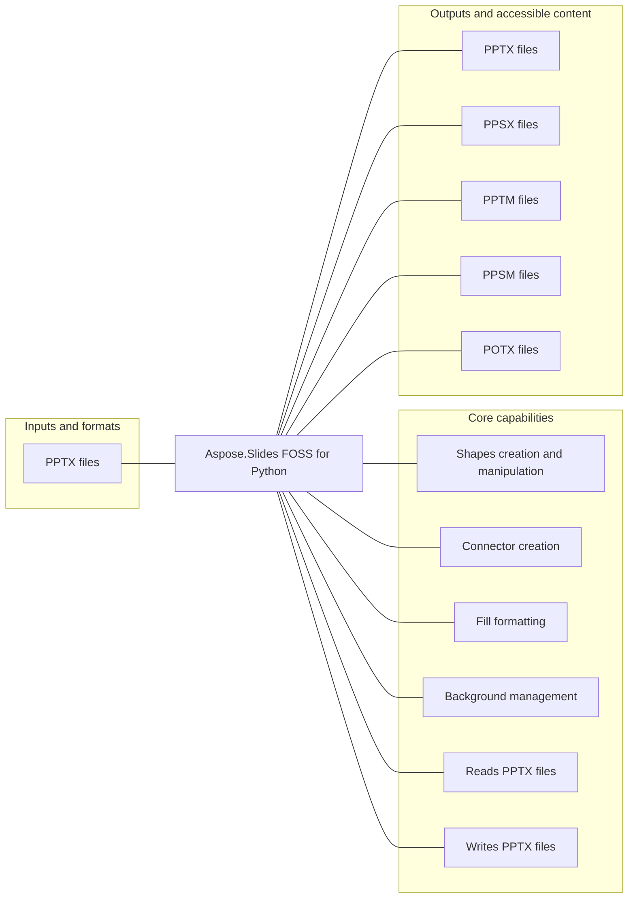

# Aspose.Slides FOSS for Python

[](https://pypi.org/project/aspose-slides-foss/)   [](LICENSE) [](https://github.com/aspose-slides-foss/Aspose.Slides-FOSS-for-Python/graphs/contributors)

Aspose.Slides FOSS for Python provides Shapes creation and manipulation for developers using Python.

## Navigation

- [At a glance](#at-a-glance)
- [Key capabilities](#key-capabilities)
- [Installation](#installation)
- [Quick start](#quick-start)
- [Scope and limitations](#scope-and-limitations)
- [Development and testing](#development-and-testing)
- [License](#license)

## At a glance



## Key capabilities

- Shapes creation and manipulation.
- Connector creation.
- Fill formatting.
- Background management.

## Installation

```bash
python -m pip install aspose-slides-foss
```

Requires Python 3.10 or later.

Required runtime dependencies declared in `pyproject.toml`: `lxml>=4.9`.

## Quick start

### Minimal verified example

```python
from aspose.slides_foss import ShapeType
import aspose.slides_foss as slides
from aspose.slides_foss.export import SaveFormat

with slides.Presentation() as prs:
    slide = prs.slides[0]
    shape = slide.shapes.add_auto_shape(ShapeType.RECTANGLE, 50, 50, 300, 100)
    shape.add_text_frame("Hello, world!")
    prs.save("shapes.pptx", SaveFormat.PPTX)
```

## Scope and limitations

[Aspose.Slides FOSS for Python](https://products.aspose.org/slides/python/) and [Aspose.Slides Enterprise Edition](https://products.aspose.com/slides/python/) are separate products. This README documents the FOSS implementation; do not assume API or feature parity beyond verified behavior.

## Development and testing

The repository includes 29 test files.

<details>
<summary>View development and testing resources</summary>

### Tests

- [`tests/conftest.py`](tests/conftest.py)
- [`tests/test_animation.py`](tests/test_animation.py)
- [`tests/test_axis_formatting.py`](tests/test_axis_formatting.py)
- [`tests/test_background.py`](tests/test_background.py)
- [`tests/test_bubble_scatter.py`](tests/test_bubble_scatter.py)
- [`tests/test_chart_markers.py`](tests/test_chart_markers.py)
- [`tests/test_chart_plot_area.py`](tests/test_chart_plot_area.py)
- [`tests/test_charts.py`](tests/test_charts.py)
- [Browse all test files](tests)


</details>

## License

This project is available under the [MIT License](LICENSE). It permits use, modification, distribution, and commercial use when the license and copyright notice are retained.
