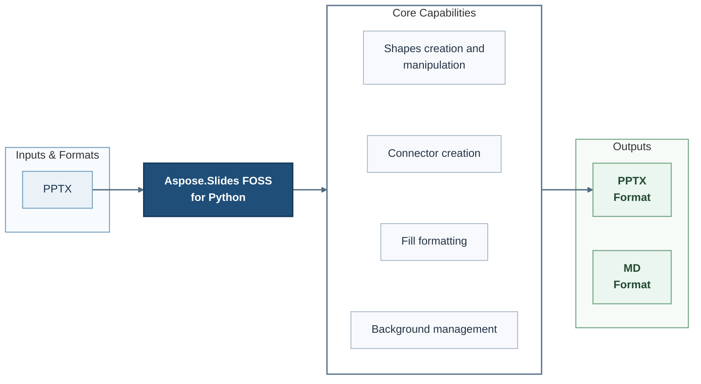

# Aspose.Slides FOSS for Python

[](https://pypi.org/project/aspose-slides-foss/)   [](LICENSE) [](https://github.com/aspose-slides-foss/Aspose.Slides-FOSS-for-Python/graphs/contributors)


Aspose.Slides FOSS for Python is an open-source library for developers using Python. It reads PPTX files and writes PPTX files and MD files.

## Navigation

- [At a Glance](#at-a-glance)
- [Key Capabilities](#key-capabilities)
- [Installation](#installation)
- [Quick Start](#quick-start)
- [Additional Examples](#additional-examples)
- [API Reference](#api-reference)
- [Documentation and Resources](#documentation-and-resources)
- [Scope and Limitations](#scope-and-limitations)
- [Development and Testing](#development-and-testing)
- [License](#license)

## At a Glance



## Key Capabilities

- **Work with Shapes creation and manipulation** - Use the public `Shape` API in application workflows.
- **Extract rich text and formatting from PPTX files** - Access text and its formatting data.

## Installation

```bash
python -m pip install aspose-slides-foss
```

Requires Python 3.10 or later.

Required runtime dependencies declared in `pyproject.toml`: `lxml>=4.9`.

## Quick Start

```python
from aspose.slides_foss import ShapeType
import aspose.slides_foss as slides
from aspose.slides_foss.export import SaveFormat

with slides.Presentation() as prs:
    slide = prs.slides[0]
    shape = slide.shapes.add_auto_shape(ShapeType.RECTANGLE, 50, 50, 300, 100)
    shape.add_text_frame("Hello, world!")
    prs.save("shapes.pptx", SaveFormat.PPTX)
```

## Additional Examples

Expand this section to view examples for exploring the SaveFormat APIs, text Formatting, table, and connector, plus 8 more workflows.

<details>
<summary>View additional examples and results</summary>

### Explore the SaveFormat APIs

```python
import aspose.slides_foss as slides
from aspose.slides_foss.export import SaveFormat

with slides.Presentation("input.pptx") as prs:
    print(f"Slides: {len(prs.slides)}")
    prs.save("output.pptx", SaveFormat.PPTX)

with slides.Presentation() as prs:
    slide = prs.slides[0]
    prs.save("new.pptx", SaveFormat.PPTX)
```

### Text Formatting

```python
from aspose.slides_foss import ShapeType, NullableBool, FillType
from aspose.slides_foss.drawing import Color
import aspose.slides_foss as slides
from aspose.slides_foss.export import SaveFormat

with slides.Presentation() as prs:
    shape = prs.slides[0].shapes.add_auto_shape(ShapeType.RECTANGLE, 50, 50, 400, 150)
    tf = shape.add_text_frame("Formatted text")
    fmt = tf.paragraphs[0].portions[0].portion_format
    fmt.font_height = 24
    fmt.font_bold = NullableBool.TRUE
    fmt.fill_format.fill_type = FillType.SOLID
    fmt.fill_format.solid_fill_color.color = Color.from_argb(255, 0, 70, 127)
    prs.save("text.pptx", SaveFormat.PPTX)
```

### Table

```python
import aspose.slides_foss as slides
from aspose.slides_foss.export import SaveFormat

with slides.Presentation() as prs:
    table = prs.slides[0].shapes.add_table(50, 50, [120.0, 120.0, 120.0], [40.0, 40.0])
    table.rows[0][0].text_frame.text = "Name"
    table.rows[0][1].text_frame.text = "Value"
    prs.save("table.pptx", SaveFormat.PPTX)
```

### Connector

```python
from aspose.slides_foss import ShapeType
import aspose.slides_foss as slides
from aspose.slides_foss.export import SaveFormat

with slides.Presentation() as prs:
    slide = prs.slides[0]
    box1 = slide.shapes.add_auto_shape(ShapeType.RECTANGLE, 50, 100, 150, 60)
    box2 = slide.shapes.add_auto_shape(ShapeType.RECTANGLE, 350, 100, 150, 60)
    conn = slide.shapes.add_connector(ShapeType.BENT_CONNECTOR3, 0, 0, 10, 10)
    conn.start_shape_connected_to = box1
    conn.start_shape_connection_site_index = 3
    conn.end_shape_connected_to = box2
    conn.end_shape_connection_site_index = 1
    prs.save("connector.pptx", SaveFormat.PPTX)
```

### Fill

```python
from aspose.slides_foss import ShapeType, FillType
from aspose.slides_foss.drawing import Color
import aspose.slides_foss as slides
from aspose.slides_foss.export import SaveFormat

with slides.Presentation() as prs:
    shape = prs.slides[0].shapes.add_auto_shape(ShapeType.RECTANGLE, 50, 50, 300, 150)
    shape.fill_format.fill_type = FillType.SOLID
    shape.fill_format.solid_fill_color.color = Color.from_argb(255, 30, 120, 200)
    prs.save("fill.pptx", SaveFormat.PPTX)
```

### Notes

```python
import aspose.slides_foss as slides
from aspose.slides_foss.export import SaveFormat

with slides.Presentation() as prs:
    notes = prs.slides[0].notes_slide_manager.add_notes_slide()
    notes.notes_text_frame.text = "Speaker notes go here."
    prs.save("notes.pptx", SaveFormat.PPTX)
```

### Comments

```python
from aspose.slides_foss.drawing import PointF
from datetime import datetime
import aspose.slides_foss as slides
from aspose.slides_foss.export import SaveFormat

with slides.Presentation() as prs:
    author = prs.comment_authors.add_author("Jane Smith", "JS")
    slide = prs.slides[0]
    author.comments.add_comment("Review this slide", slide, PointF(2.0, 2.0), datetime.now())
    prs.save("comments.pptx", SaveFormat.PPTX)
```

### Document Properties

```python
import aspose.slides_foss as slides
from aspose.slides_foss.export import SaveFormat

with slides.Presentation() as prs:
    prs.document_properties.title = "Q1 Results"
    prs.document_properties.author = "Finance Team"
    prs.document_properties.set_custom_property_value("Version", 3)
    prs.save("deck.pptx", SaveFormat.PPTX)
```

### Chart

```python
from aspose.slides_foss.charts import ChartType
import aspose.slides_foss as slides
from aspose.slides_foss.export import SaveFormat

with slides.Presentation() as prs:
    slide = prs.slides[0]

    chart = slide.shapes.add_chart(ChartType.CLUSTERED_COLUMN, 50, 50, 600, 400, False)
    chart.chart_title.add_text_frame_for_overriding("Quarterly Sales")

    cd = chart.chart_data
    wb = cd.chart_data_workbook

    cd.series.clear()
    cd.categories.clear()

    for row, name in enumerate(["Q1", "Q2", "Q3", "Q4"], start=1):
        cd.categories.add(wb.get_cell(0, row, 0, name))

    s1 = cd.series.add(wb.get_cell(0, 0, 1, "Revenue"), chart.type)
    for row, value in enumerate([1200, 1500, 1800, 2100], start=1):
        s1.data_points.add_data_point_for_bar_series(wb.get_cell(0, row, 1, value))

    s2 = cd.series.add(wb.get_cell(0, 0, 2, "Expenses"), chart.type)
    for row, value in enumerate([800, 900, 1000, 1100], start=1):
        s2.data_points.add_data_point_for_bar_series(wb.get_cell(0, row, 2, value))

    prs.save("chart.pptx", SaveFormat.PPTX)
```

### Slide Transition

```python
from aspose.slides_foss.slideshow import TransitionType
import aspose.slides_foss as slides
from aspose.slides_foss.export import SaveFormat

with slides.Presentation() as prs:
    slide = prs.slides[0]
    slide.slide_show_transition.type = TransitionType.CIRCLE
    slide.slide_show_transition.advance_on_click = True
    slide.slide_show_transition.advance_after_time = 3000
    prs.save("transition.pptx", SaveFormat.PPTX)
```

### Group Shape

```python
from aspose.slides_foss import ShapeType
import aspose.slides_foss as slides
from aspose.slides_foss.export import SaveFormat

with slides.Presentation() as prs:
    slide = prs.slides[0]
    group = slide.shapes.add_group_shape()
    group.shapes.add_auto_shape(ShapeType.RECTANGLE, 300, 100, 100, 100)
    group.shapes.add_auto_shape(ShapeType.RECTANGLE, 500, 100, 100, 100)
    group.name = "TwoRectangles"
    prs.save("group.pptx", SaveFormat.PPTX)
```

### Markdown Export

```python
import aspose.slides_foss as slides
from aspose.slides_foss.export import SaveFormat, MarkdownSaveOptions, Flavor, NewLineType

with slides.Presentation("input.pptx") as prs:

    prs.save("output.md", SaveFormat.MD)

    options = MarkdownSaveOptions()
    options.flavor = Flavor.GITHUB
    options.new_line_type = NewLineType.UNIX
    options.show_slide_number = True
    options.slide_number_format = "## Slide {0}"
    options.show_hidden_slides = True
    options.show_comments = True
    prs.save("custom.md", SaveFormat.MD, options)

    prs.save("subset.md", [2, 1], SaveFormat.MD, options)
```

</details>

## API Reference

The package documents 458 public types across 8 namespaces. Package namespaces include `aspose.slides_foss`, `aspose.slides_foss.animation`, `aspose.slides_foss.charts`, `aspose.slides_foss.drawing`, `aspose.slides_foss.effects`, `aspose.slides_foss.export`, `aspose.slides_foss.slideshow`, `aspose.slides_foss.theme`. See the complete API reference under Documentation and Resources for members, signatures, and inherited APIs.

<details>
<summary>View public API by namespace</summary>

### Aspose.Slides Namespace (`aspose.slides_foss`)

| Type | Description |
| --- | --- |
| `AdjustValue()` | Represents an Adjust Value in the public slides FOSS API for Aspose.Slides. Inherits from `IAdjustValue`. |
| `AdjustValueCollection()` | Represents an Adjust Value Collection in the public slides FOSS API for Aspose.Slides. Inherits from `BaseCollection`, `IAdjustValueCollection`. |
| `Shape()` | Represents an Auto Shape in the public slides FOSS API for Aspose.Slides. Supports adding text frames. Inherits from `GeometryShape`, `IAutoShape`. |
| `Background` | Represents a Background in the public slides FOSS API for Aspose.Slides. Supports retrieving effective. Inherits from `PVIObject`, `IBackground`. |
| `BackgroundType` | Enumerates background type values. |
| `BaseHandoutNotesSlideHeaderFooterManager` | Represents a Base Handout Notes Slide Header Footer Manager in the public slides FOSS API for Aspose.Slides. |
| `BasePortionFormat()` | Represents a Base Portion Format in the public slides FOSS API for Aspose.Slides. Inherits from `PVIObject`, `IBasePortionFormat`. |
| `BaseShapeLock` | Represents a Base Shape Lock in the public slides FOSS API for Aspose.Slides. |
| `BaseSlide()` | Represents a Base Slide in the public slides FOSS API for Aspose.Slides. Inherits from `IBaseSlide`, `IThemeable`, `ISlideComponent`, `IPresentationComponent`. |
| `BevelPresetType` | Enumerates bevel preset type values. |
| `BulletFormat` | Represents a Bullet Format in the public slides FOSS API for Aspose.Slides. Inherits from `PVIObject`, `ISlideComponent`, `IPresentationComponent`, `IBulletFormat`. |
| `BulletType` | Enumerates bullet type values. |
| `Camera` | Represents a Camera in the public slides FOSS API for Aspose.Slides. Supports retrieving rotation and setting rotation. Inherits from `PVIObject`, `ISlideComponent`, `IPresentationComponent`, `ICamera`. |
| `CameraPresetType` | Enumerates camera preset type values. |
| `Cell` | Represents a Cell in the public slides FOSS API for Aspose.Slides. Inherits from `ICell`, `ISlideComponent`, `IPresentationComponent`. |
| `CellCollection` | Represents a Cell Collection in the public slides FOSS API for Aspose.Slides. Inherits from `BaseCollection`, `ICellCollection`. |
| `CellFormat` | Represents a Cell Format in the public slides FOSS API for Aspose.Slides. Inherits from `PVIObject`, `ISlideComponent`, `IPresentationComponent`, `ICellFormat`. |
| `ColorFormat` | Represents a Color Format in the public slides FOSS API for Aspose.Slides. Inherits from `PVIObject`, `ISlideComponent`, `IPresentationComponent`, `IColorFormat`, `IFillParamSource`. |
| `ColorType` | Enumerates color type values. |
| `Column` | Represents a Column in the public slides FOSS API for Aspose.Slides. Supports setting text format. Inherits from `CellCollection`, `IColumn`. |
| `ColumnCollection` | Represents a Column Collection in the public slides FOSS API for Aspose.Slides. Supports adding clones and inserting clone. Inherits from `BaseCollection`, `IColumnCollection`. |
| `Comment` | Represents a Comment in the public slides FOSS API for Aspose.Slides. Supports removing content. Inherits from `IComment`. |
| `CommentAuthor` | Represents a Comment Author in the public slides FOSS API for Aspose.Slides. Supports removing content. Inherits from `ICommentAuthor`. |
| `CommentAuthorCollection` | Represents a Comment Author Collection in the public slides FOSS API for Aspose.Slides. Supports adding authors, clearing content, and finding by name. Inherits from `BaseCollection`, `ICommentAuthorCollection`. |
| `CommentCollection` | Represents a Comment Collection in the public slides FOSS API for Aspose.Slides. Supports adding comments, clearing content, and finding comment by idx. Inherits from `BaseCollection`, `ICommentCollection`. |
| `Shape()` | Represents a Connector in the public slides FOSS API for Aspose.Slides. Inherits from `GeometryShape`, `IConnector`. |
| `DocumentProperties` | Represents a Document Properties in the public slides FOSS API for Aspose.Slides. Supports clearing built in properties, clearing custom properties, and containsing custom property. Inherits from `IDocumentProperties`. |
| `EffectFormat` | Represents an Effect Format in the public slides FOSS API for Aspose.Slides. Supports disabling blur effect, disabling fill overlay effect, and disabling glow effect. Inherits from `PVIObject`, `ISlideComponent`, `IPresentationComponent`, `IEffectFormat`, `IEffectParamSource`. |
| `FillBlendMode` | Enumerates fill blend mode values. |
| `FillFormat` | Represents a Fill Format in the public slides FOSS API for Aspose.Slides. Inherits from `PVIObject`, `ISlideComponent`, `IPresentationComponent`, `IFillFormat`, `IFillParamSource`. |
| `FillType` | Enumerates fill type values. |
| `FontAlignment` | Enumerates font alignment values. |
| `FontData(font_name)` | Represents a Font Data in the public slides FOSS API for Aspose.Slides. Supports retrieving font name. Inherits from `IFontData`. |
| `Fonts` | Represents a Fonts in the public slides FOSS API for Aspose.Slides. Inherits from `IFonts`. |
| `Shape()` | Represents a Geometry Shape in the public slides FOSS API for Aspose.Slides. Inherits from `Shape`, `IGeometryShape`, `ABC`. |
| `GlobalLayoutSlideCollection` | Represents a Global Layout Slide Collection in the public slides FOSS API for Aspose.Slides. Supports retrieving by type. Inherits from `LayoutSlideCollection`, `IGlobalLayoutSlideCollection`. |
| `GradientDirection` | Enumerates gradient direction values. |
| `GradientFormat` | Represents a Gradient Format in the public slides FOSS API for Aspose.Slides. Inherits from `PVIObject`, `ISlideComponent`, `IPresentationComponent`, `IGradientFormat`, `IFillParamSource`. |
| `GradientShape` | Enumerates gradient shape values. |
| `GradientStop` | Represents a Gradient Stop in the public slides FOSS API for Aspose.Slides. Inherits from `PVIObject`, `ISlideComponent`, `IPresentationComponent`, `IGradientStop`. |
| `GradientStopCollection` | Represents a Gradient Stop Collection in the public slides FOSS API for Aspose.Slides. Supports clearing content and inserting content. Inherits from `PVIObject`, `ISlideComponent`, `IPresentationComponent`, `IGradientStopCollection`. |
| `Shape()` | Represents a Graphical Object in the public slides FOSS API for Aspose.Slides. Inherits from `Shape`, `IGraphicalObject`, `ABC`. |
| `GraphicalObjectLock` | Represents a Graphical Object Lock in the public slides FOSS API for Aspose.Slides. Inherits from `BaseShapeLock`. |
| `GroupShape()` | Represents a Group Shape in the public slides FOSS API for Aspose.Slides. Inherits from `Shape`, `IGroupShape`. |
| `GroupShapeLock()` | Represents a Group Shape Lock in the public slides FOSS API for Aspose.Slides. Inherits from `BaseShapeLock`, `IGroupShapeLock`. |
| `HeadingPair` | Represents a Heading Pair in the public slides FOSS API for Aspose.Slides. Inherits from `IHeadingPair`. |
| `IAdjustValue` | Represents an I Adjust Value in the public slides FOSS API for Aspose.Slides. Inherits from `ABC`. |
| `IAdjustValueCollection` | Represents an I Adjust Value Collection in the public slides FOSS API for Aspose.Slides. Inherits from `ABC`. |
| `ShapeType` | Enumerates shape type values. |
| `PresetColor` | Enumerates preset color values. |
| `TableStylePreset` | Enumerates table style preset values. |
| `PatternStyle` | Enumerates pattern style values. |
| `TextShapeType` | Enumerates text shape type values. |
| `NumberedBulletStyle` | Enumerates numbered bullet style values. |
| `IDocumentProperties` | Represents an I Document Properties in the public slides FOSS API for Aspose.Slides. Supports clearing built in properties, clearing custom properties, and containsing custom property. Inherits from `ABC`. |
| `SlideLayoutType` | Enumerates slide layout type values. |
| `LightRigPresetType` | Enumerates light rig preset type values. |
| `IBasePortionFormat` | Represents an I Base Portion Format in the public slides FOSS API for Aspose.Slides. Inherits from `ABC`. |
| `IEffectFormat` | Represents an I Effect Format in the public slides FOSS API for Aspose.Slides. Supports disabling blur effect, disabling fill overlay effect, and disabling glow effect. Inherits from `IEffectParamSource`, `ABC`. |
| `IShape` | Represents an I Shape in the public slides FOSS API for Aspose.Slides. Inherits from `ISlideComponent`, `IPresentationComponent`, `IHyperlinkContainer`, `ABC`. |
| `Shape()` | Represents a Shape in the public slides FOSS API for Aspose.Slides. Inherits from `IShape`, `ISlideComponent`, `IPresentationComponent`, `IHyperlinkContainer`, `ABC`. |
| `ICell` | Represents an I Cell in the public slides FOSS API for Aspose.Slides. Inherits from `ISlideComponent`, `IPresentationComponent`, `ABC`. |
| `PresetShadowType` | Enumerates preset shadow type values. |
| `ShapeCollection()` | Represents a Shape Collection in the public slides FOSS API for Aspose.Slides. Supports adding auto shapes, adding charts, and adding connectors. Inherits from `BaseCollection`, `IShapeCollection`. |
| `TextUnderlineType` | Enumerates text underline type values. |
| `IShapeCollection` | Represents an I Shape Collection in the public slides FOSS API for Aspose.Slides. Supports adding auto shapes, adding connectors, and adding group shapes. Inherits from `ABC`. |
| `SchemeColor` | Enumerates scheme color values. |
| `TextFrameFormat()` | Represents a Text Frame Format in the public slides FOSS API for Aspose.Slides. Inherits from `PVIObject`, `ISlideComponent`, `IPresentationComponent`, `ITextFrameFormat`. |
| `IPictureFillFormat` | Represents an I Picture Fill Format in the public slides FOSS API for Aspose.Slides. Inherits from `IFillParamSource`, `ABC`. |
| `PictureFillFormat` | Represents a Picture Fill Format in the public slides FOSS API for Aspose.Slides. Inherits from `PVIObject`, `ISlideComponent`, `IPresentationComponent`, `IPictureFillFormat`, `IFillParamSource`. |
| `ILineFormat` | Represents an I Line Format in the public slides FOSS API for Aspose.Slides. Inherits from `ILineParamSource`, `ABC`. |
| `IParagraphFormat` | Represents an I Paragraph Format in the public slides FOSS API for Aspose.Slides. Inherits from `ABC`. |
| `LineFormat` | Represents a Line Format in the public slides FOSS API for Aspose.Slides. Inherits from `PVIObject`, `ISlideComponent`, `IPresentationComponent`, `ILineFormat`, `ILineParamSource`. |
| `MaterialPresetType` | Enumerates material preset type values. |
| `ParagraphFormat()` | Represents a Paragraph Format in the public slides FOSS API for Aspose.Slides. Inherits from `PVIObject`, `ISlideComponent`, `IPresentationComponent`, `IParagraphFormat`. |
| `Shape()` | Represents a Table in the public slides FOSS API for Aspose.Slides. Supports merging cells and setting text format. Inherits from `GraphicalObject`, `ITable`. |
| `ITextFrameFormat` | Represents an I Text Frame Format in the public slides FOSS API for Aspose.Slides. Inherits from `ABC`. |
| `Presentation(*args, **kwargs)` | Represents a Presentation in the public slides FOSS API for Aspose.Slides. Supports saving document output. Inherits from `IPresentation`, `IPresentationComponent`. |
| `ITable` | Represents an I Table in the public slides FOSS API for Aspose.Slides. Supports merging cells and setting text format. Inherits from `IGraphicalObject`, `IBulkTextFormattable`, `ABC`. |
| `NotesSlideHeaderFooterManager` | Represents a Notes Slide Header Footer Manager in the public slides FOSS API for Aspose.Slides. Supports setting date time text, setting date time visibility, and setting footer text. Inherits from `BaseHandoutNotesSlideHeaderFooterManager`, `INotesSlideHeaderFooterManager`. |
| `ParagraphCollection` | Represents a Paragraph Collection in the public slides FOSS API for Aspose.Slides. Supports clearing content, locating items, and inserting content. Inherits from `BaseCollection`, `IParagraphCollection`, `ISlideComponent`, `IPresentationComponent`. |
| `LineDashStyle` | Enumerates line dash style values. |
| `ShapeFrame(x, y, width, height, flip_h, flip_v, rotation_angle)` | Represents a Shape Frame in the public slides FOSS API for Aspose.Slides. Supports cloning content and cloning t. Inherits from `IShapeFrame`. |
| `IPresentation` | Represents an I Presentation in the public slides FOSS API for Aspose.Slides. Supports saving document output. Inherits from `IPresentationComponent`, `ABC`. |
| `PictureFrameLock` | Represents a Picture Frame Lock in the public slides FOSS API for Aspose.Slides. Inherits from `BaseShapeLock`, `IPictureFrameLock`. |
| `IPictureFrameLock` | Represents an I Picture Frame Lock in the public slides FOSS API for Aspose.Slides. Inherits from `ABC`. |
| `IShapeFrame` | Represents an I Shape Frame in the public slides FOSS API for Aspose.Slides. Supports cloning t. Inherits from `ABC`. |
| `IBulletFormat` | Represents an I Bullet Format in the public slides FOSS API for Aspose.Slides. Inherits from `ABC`. |
| `IColorFormat` | Represents an I Color Format in the public slides FOSS API for Aspose.Slides. Inherits from `IFillParamSource`, `ABC`. |
| `ISlideCollection` | Represents an I Slide Collection in the public slides FOSS API for Aspose.Slides. Supports adding clones, adding empty slides, and locating items. Inherits from `ABC`. |
| `IThreeDFormat` | Represents an I Three D Format in the public slides FOSS API for Aspose.Slides. Inherits from `IThreeDParamSource`, `ABC`. |
| `PortionCollection` | Represents a Portion Collection in the public slides FOSS API for Aspose.Slides. Supports clearing content, locating items, and inserting content. Inherits from `BaseCollection`, `IPortionCollection`. |
| `RectangleAlignment` | Enumerates rectangle alignment values. |
| `SlideCollection` | Represents a Slide Collection in the public slides FOSS API for Aspose.Slides. Supports adding clones, adding empty slides, and locating items. Inherits from `BaseCollection`, `ISlideCollection`. |
| `ThreeDFormat` | Represents a Three D Format in the public slides FOSS API for Aspose.Slides. Inherits from `PVIObject`, `ISlideComponent`, `IPresentationComponent`, `IThreeDFormat`, `IThreeDParamSource`. |
| `ICommentAuthorCollection` | Represents an I Comment Author Collection in the public slides FOSS API for Aspose.Slides. Supports adding authors, clearing content, and finding by name. Inherits from `ABC`. |
| `IPortionCollection` | Represents an I Portion Collection in the public slides FOSS API for Aspose.Slides. Supports clearing content, locating items, and inserting content. Inherits from `ABC`. |
| `LightingDirection` | Enumerates lighting direction values. |
| `TextFrame` | Represents a Text Frame in the public slides FOSS API for Aspose.Slides. Inherits from `ITextFrame`, `ISlideComponent`, `IPresentationComponent`. |
| `IBackground` | Represents an I Background in the public slides FOSS API for Aspose.Slides. Supports retrieving effective. Inherits from `ISlideComponent`, `IPresentationComponent`, `IFillParamSource`, `ABC`. |
| `ICommentCollection` | Represents an I Comment Collection in the public slides FOSS API for Aspose.Slides. Supports adding comments, clearing content, and inserting comment. Inherits from `ABC`. |
| `IGroupShapeLock` | Represents an I Group Shape Lock in the public slides FOSS API for Aspose.Slides. Inherits from `IBaseShapeLock`, `ABC`. |
| `IPPImage` | Represents an IPP Image in the public slides FOSS API for Aspose.Slides. Supports replacing image. Inherits from `ABC`. |
| `IParagraphCollection` | Represents an I Paragraph Collection in the public slides FOSS API for Aspose.Slides. Supports clearing content, inserting content, and removing content. Inherits from `ISlideComponent`, `IPresentationComponent`, `ABC`. |
| `PPImage` | Represents a PP Image in the public slides FOSS API for Aspose.Slides. Supports replacing image. Inherits from `IPPImage`. |
| `TextVerticalType` | Enumerates text vertical type values. |
| `ICellFormat` | Represents an I Cell Format in the public slides FOSS API for Aspose.Slides. Inherits from `ABC`. |
| `IComment` | Represents an I Comment in the public slides FOSS API for Aspose.Slides. Supports removing content. Inherits from `ABC`. |
| `IConnector` | Represents an I Connector in the public slides FOSS API for Aspose.Slides. Inherits from `IGeometryShape`, `ABC`. |
| `ISlideShowTransition` | Represents an I Slide Show Transition in the public slides FOSS API for Aspose.Slides. Inherits from `ABC`. |
| `LineArrowheadStyle` | Enumerates line arrowhead style values. |
| `Paragraph(*args, **kwargs)` | Represents a Paragraph in the public slides FOSS API for Aspose.Slides. Inherits from `IParagraph`, `ISlideComponent`, `IPresentationComponent`. |
| `BaseSlide()` | Represents a Slide in the public slides FOSS API for Aspose.Slides. Supports retrieving slide comments and removing content. Inherits from `BaseSlide`, `ISlide`. |
| `TextAlignment` | Enumerates text alignment values. |
| `IFillFormat` | Represents an I Fill Format in the public slides FOSS API for Aspose.Slides. Inherits from `IFillParamSource`, `ABC`. |
| `IGradientFormat` | Represents an I Gradient Format in the public slides FOSS API for Aspose.Slides. Inherits from `IFillParamSource`, `ABC`. |
| `IGradientStopCollection` | Represents an I Gradient Stop Collection in the public slides FOSS API for Aspose.Slides. Supports clearing content and inserting content. Inherits from `ABC`. |
| `ISlide` | Represents an I Slide in the public slides FOSS API for Aspose.Slides. Supports retrieving slide comments and removing content. Inherits from `IBaseSlide`, `ABC`. |
| `ITextFrame` | Represents an I Text Frame in the public slides FOSS API for Aspose.Slides. Inherits from `ISlideComponent`, `IPresentationComponent`, `ABC`. |
| `LineStyle` | Enumerates line style values. |
| `Picture` | Represents a Picture in the public slides FOSS API for Aspose.Slides. Inherits from `ISlidesPicture`, `ISlideComponent`, `IPresentationComponent`. |
| `Shape()` | Represents a Picture Frame in the public slides FOSS API for Aspose.Slides. Inherits from `GeometryShape`, `IPictureFrame`. |
| `Portion(*args, **kwargs)` | Represents a Portion in the public slides FOSS API for Aspose.Slides. Inherits from `IPortion`, `ISlideComponent`, `IPresentationComponent`. |
| `TextAnchorType` | Enumerates text anchor type values. |
| `ICamera` | Represents an I Camera in the public slides FOSS API for Aspose.Slides. Supports retrieving rotation and setting rotation. Inherits from `ABC`. |
| `IColumnCollection` | Represents an I Column Collection in the public slides FOSS API for Aspose.Slides. Supports adding clones and inserting clone. Inherits from `ABC`. |
| `ILineFillFormat` | Represents an I Line Fill Format in the public slides FOSS API for Aspose.Slides. Inherits from `IFillParamSource`, `ABC`. |
| `IRowCollection` | Represents an I Row Collection in the public slides FOSS API for Aspose.Slides. Supports adding clones and inserting clone. Inherits from `ABC`. |
| `LineFillFormat` | Represents a Line Fill Format in the public slides FOSS API for Aspose.Slides. Inherits from `PVIObject`, `ISlideComponent`, `IPresentationComponent`, `ILineFillFormat`, `IFillParamSource`. |
| `Row` | Represents a Row in the public slides FOSS API for Aspose.Slides. Supports setting text format. Inherits from `CellCollection`, `IRow`. |
| `RowCollection` | Represents a Row Collection in the public slides FOSS API for Aspose.Slides. Supports adding clones and inserting clone. Inherits from `BaseCollection`, `IRowCollection`. |
| `TileFlip` | Enumerates tile flip values. |
| `IAutoShape` | Represents an I Auto Shape in the public slides FOSS API for Aspose.Slides. Supports adding text frames. Inherits from `IGeometryShape`, `ABC`. |
| `ICommentAuthor` | Represents an I Comment Author in the public slides FOSS API for Aspose.Slides. Supports removing content. Inherits from `ABC`. |
| `IImage` | Represents an I Image in the public slides FOSS API for Aspose.Slides. Supports saving document output. Inherits from `ABC`. |
| `ILightRig` | Represents an I Light Rig in the public slides FOSS API for Aspose.Slides. Supports retrieving rotation and setting rotation. Inherits from `ABC`. |
| `INotesSlide` | Represents an I Notes Slide in the public slides FOSS API for Aspose.Slides. Inherits from `IBaseSlide`, `ABC`. |
| `IParagraph` | Represents an I Paragraph in the public slides FOSS API for Aspose.Slides. Inherits from `ISlideComponent`, `IPresentationComponent`, `ABC`. |
| `IPictureFrame` | Represents an I Picture Frame in the public slides FOSS API for Aspose.Slides. Inherits from `IGeometryShape`, `ABC`. |
| `IRow` | Represents an I Row in the public slides FOSS API for Aspose.Slides. Supports setting text format. Inherits from `ICellCollection`, `IBulkTextFormattable`, `ABC`. |
| `Image` | Represents an Image in the public slides FOSS API for Aspose.Slides. Supports saving document output. Inherits from `IImage`. |
| `LightRig` | Represents a Light Rig in the public slides FOSS API for Aspose.Slides. Supports retrieving rotation and setting rotation. Inherits from `PVIObject`, `ISlideComponent`, `IPresentationComponent`, `ILightRig`. |
| `LineArrowheadLength` | Enumerates line arrowhead length values. |
| `LineArrowheadWidth` | Enumerates line arrowhead width values. |
| `LineCapStyle` | Enumerates line cap style values. |
| `LineJoinStyle` | Enumerates line join style values. |
| `BaseSlide()` | Represents a Notes Slide in the public slides FOSS API for Aspose.Slides. Inherits from `BaseSlide`, `INotesSlide`. |
| `TextAutofitType` | Enumerates text autofit type values. |
| `TextCapType` | Enumerates text cap type values. |
| `TextStrikethroughType` | Enumerates text strikethrough type values. |
| `IAnimationTimeLine` | Represents an I Animation Time Line in the public slides FOSS API for Aspose.Slides. Inherits from `ABC`. |
| `IBackgroundEffectiveData` | Represents an I Background Effective Data in the public slides FOSS API for Aspose.Slides. Inherits from `IFillParamSource`, `ABC`. |
| `IBaseSlide` | Represents an I Base Slide in the public slides FOSS API for Aspose.Slides. Inherits from `IThemeable`, `ISlideComponent`, `IPresentationComponent`, `ABC`. |
| `ICellCollection` | Represents an I Cell Collection in the public slides FOSS API for Aspose.Slides. Inherits from `ISlideComponent`, `IPresentationComponent`, `ABC`. |
| `IColumn` | Represents an I Column in the public slides FOSS API for Aspose.Slides. Supports setting text format. Inherits from `ICellCollection`, `IBulkTextFormattable`, `ABC`. |
| `IFonts` | Represents an I Fonts in the public slides FOSS API for Aspose.Slides. Inherits from `ABC`. |
| `IGeometryShape` | Represents an I Geometry Shape in the public slides FOSS API for Aspose.Slides. Inherits from `IShape`, `ABC`. |
| `IGroupShape` | Represents an I Group Shape in the public slides FOSS API for Aspose.Slides. Inherits from `IShape`, `ABC`. |
| `IImageCollection` | Represents an I Image Collection in the public slides FOSS API for Aspose.Slides. Supports adding images. Inherits from `ABC`. |
| `ILayoutSlideCollection` | Represents an I Layout Slide Collection in the public slides FOSS API for Aspose.Slides. Supports retrieving by type. Inherits from `ABC`. |
| `IMasterSlideCollection` | Represents an I Master Slide Collection in the public slides FOSS API for Aspose.Slides. Supports adding clones. Inherits from `ABC`. |
| `INotesSlideManager` | Represents an I Notes Slide Manager in the public slides FOSS API for Aspose.Slides. Supports adding notes slides and removing notes slide. Inherits from `ABC`. |
| `IPatternFormat` | Represents an I Pattern Format in the public slides FOSS API for Aspose.Slides. Inherits from `ABC`. |
| `IPortion` | Represents an I Portion in the public slides FOSS API for Aspose.Slides. Inherits from `ISlideComponent`, `IPresentationComponent`, `ABC`. |
| `IShapeBevel` | Represents an I Shape Bevel in the public slides FOSS API for Aspose.Slides. Inherits from `ABC`. |
| `ISlidesPicture` | Represents an I Slides Picture in the public slides FOSS API for Aspose.Slides. Inherits from `ISlideComponent`, `IPresentationComponent`, `ABC`. |
| `ImageCollection` | Represents an Image Collection in the public slides FOSS API for Aspose.Slides. Supports adding images. Inherits from `IImageCollection`. |
| `BaseSlide()` | Represents a Layout Slide in the public slides FOSS API for Aspose.Slides. Inherits from `BaseSlide`, `ILayoutSlide`. |
| `LayoutSlideCollection` | Represents a Layout Slide Collection in the public slides FOSS API for Aspose.Slides. Supports retrieving by type. Inherits from `BaseCollection`, `ILayoutSlideCollection`. |
| `LineAlignment` | Enumerates line alignment values. |
| `MasterSlideCollection` | Represents a Master Slide Collection in the public slides FOSS API for Aspose.Slides. Supports adding clones. Inherits from `BaseCollection`, `IMasterSlideCollection`. |
| `NotesSlideManager` | Represents a Notes Slide Manager in the public slides FOSS API for Aspose.Slides. Supports adding notes slides and removing notes slide. Inherits from `INotesSlideManager`. |
| `NullableBool` | Enumerates nullable bool values. |
| `PVIObject` | Represents a PVI Object in the public slides FOSS API for Aspose.Slides. Inherits from `ISlideComponent`, `IPresentationComponent`. |
| `PatternFormat` | Represents a Pattern Format in the public slides FOSS API for Aspose.Slides. Inherits from `PVIObject`, `ISlideComponent`, `IPresentationComponent`, `IPatternFormat`. |
| `ShapeBevel(b_is_top_bevel=True)` | Represents a Shape Bevel in the public slides FOSS API for Aspose.Slides. Inherits from `PVIObject`, `ISlideComponent`, `IPresentationComponent`, `IShapeBevel`. |
| `SourceFormat` | Enumerates source format values. |
| `IFontData` | Represents an I Font Data in the public slides FOSS API for Aspose.Slides. Supports retrieving font name. Inherits from `ABC`. |
| `IGradientStop` | Represents an I Gradient Stop in the public slides FOSS API for Aspose.Slides. Inherits from `ABC`. |
| `IHeadingPair` | Represents an I Heading Pair in the public slides FOSS API for Aspose.Slides. Inherits from `ABC`. |
| `ILayoutSlide` | Represents an I Layout Slide in the public slides FOSS API for Aspose.Slides. Inherits from `IBaseSlide`, `ABC`. |
| `ISlideComponent` | Represents an I Slide Component in the public slides FOSS API for Aspose.Slides. Inherits from `IPresentationComponent`, `ABC`. |
| `Images` | Represents an Images in the public slides FOSS API for Aspose.Slides. Supports loading content from file and loading content from stream. Inherits from `object`. |
| `BaseSlide()` | Represents a Master Slide in the public slides FOSS API for Aspose.Slides. Inherits from `BaseSlide`, `IMasterSlide`. |
| `Orientation` | Enumerates orientation values. |
| `PictureFillMode` | Enumerates picture fill mode values. |
| `IBaseShapeLock` | Represents an I Base Shape Lock in the public slides FOSS API for Aspose.Slides. Inherits from `ABC`. |
| `IBulkTextFormattable` | Represents an I Bulk Text Formattable in the public slides FOSS API for Aspose.Slides. Supports setting text format. Inherits from `ABC`. |
| `IGlobalLayoutSlideCollection` | Represents an I Global Layout Slide Collection in the public slides FOSS API for Aspose.Slides. Supports retrieving by type. Inherits from `ILayoutSlideCollection`, `ABC`. |
| `IGraphicalObject` | Represents an I Graphical Object in the public slides FOSS API for Aspose.Slides. Inherits from `IShape`, `ABC`. |
| `IMasterSlide` | Represents an I Master Slide in the public slides FOSS API for Aspose.Slides. Inherits from `IBaseSlide`, `ABC`. |
| `INotesSize` | Represents an I Notes Size in the public slides FOSS API for Aspose.Slides. Inherits from `ABC`. |
| `INotesSlideHeaderFooterManager` | Represents an I Notes Slide Header Footer Manager in the public slides FOSS API for Aspose.Slides. Inherits from `ABC`. |
| `IPresentationComponent` | Represents an I Presentation Component in the public slides FOSS API for Aspose.Slides. Inherits from `ABC`. |
| `ITableFormat` | Represents an I Table Format in the public slides FOSS API for Aspose.Slides. Inherits from `ABC`. |
| `NotesSize()` | Represents a Notes Size in the public slides FOSS API for Aspose.Slides. Inherits from `INotesSize`. |
| `TableFormat` | Represents a Table Format in the public slides FOSS API for Aspose.Slides. Inherits from `ITableFormat`. |
| `IEffectParamSource` | Represents an I Effect Param Source in the public slides FOSS API for Aspose.Slides. Inherits from `ABC`. |
| `IFillParamSource` | Represents an I Fill Param Source in the public slides FOSS API for Aspose.Slides. Inherits from `ABC`. |
| `IHyperlinkContainer` | Represents an I Hyperlink Container in the public slides FOSS API for Aspose.Slides. Inherits from `ABC`. |
| `ILineParamSource` | Represents an I Line Param Source in the public slides FOSS API for Aspose.Slides. Inherits from `ABC`. |
| `ILoadOptions` | Configures I Load operations through the Aspose.Slides API. Inherits from `ABC`. |
| `IMasterLayoutSlideCollection` | Represents an I Master Layout Slide Collection in the public slides FOSS API for Aspose.Slides. Supports retrieving by type. Inherits from `ILayoutSlideCollection`, `ABC`. |
| `IPortionFormat` | Represents an I Portion Format in the public slides FOSS API for Aspose.Slides. Inherits from `IBasePortionFormat`, `IHyperlinkContainer`, `ABC`. |
| `ISection` | Represents an I Section in the public slides FOSS API for Aspose.Slides. Inherits from `ABC`. |
| `IThreeDParamSource` | Represents an I Three D Param Source in the public slides FOSS API for Aspose.Slides. Inherits from `ABC`. |
| `MasterLayoutSlideCollection` | Represents a Master Layout Slide Collection in the public slides FOSS API for Aspose.Slides. Supports retrieving by type. Inherits from `LayoutSlideCollection`, `IMasterLayoutSlideCollection`. |
| `PortionFormat()` | Represents a Portion Format in the public slides FOSS API for Aspose.Slides. Inherits from `BasePortionFormat`, `IPortionFormat`. |

### Aspose.Slides.Animation Namespace (`aspose.slides_foss.animation`)

| Type | Description |
| --- | --- |
| `AfterAnimationType` | Enumerates after animation type values. |
| `AnimateTextType` | Enumerates animate text type values. |
| `AnimationTimeLine` | Represents an Animation Time Line in the public animation API for Aspose.Slides. Inherits from `IAnimationTimeLine`. |
| `Behavior` | Represents a Behavior in the public animation API for Aspose.Slides. Inherits from `IBehavior`. |
| `BehaviorAccumulateType` | Enumerates behavior accumulate type values. |
| `BehaviorAdditiveType` | Enumerates behavior additive type values. |
| `BehaviorCollection` | Represents a Behavior Collection in the public animation API for Aspose.Slides. Supports clearing content, copying the current value to a destination, and locating items. Inherits from `BaseCollection`, `IBehaviorCollection`. |
| `BehaviorFactory()` | Represents a Behavior Factory in the public animation API for Aspose.Slides. Supports creating color effect, creating command effect, and creating filter effect. Inherits from `IBehaviorFactory`. |
| `BehaviorProperty()` | Represents a Behavior Property in the public animation API for Aspose.Slides. Supports retrieving or create by value. Inherits from `IBehaviorProperty`. |
| `BehaviorPropertyCollection` | Represents a Behavior Property Collection in the public animation API for Aspose.Slides. Supports locating items. Inherits from `BaseCollection`, `IBehaviorPropertyCollection`. |
| `BuildType` | Enumerates build type values. |
| `ColorDirection` | Enumerates color direction values. |
| `ColorEffect()` | Represents a Color Effect in the public animation API for Aspose.Slides. Inherits from `Behavior`, `IColorEffect`. |
| `ColorOffset()` | Represents a Color Offset in the public animation API for Aspose.Slides. Inherits from `IColorOffset`. |
| `ColorSpace` | Enumerates color space values. |
| `CommandEffect()` | Represents a Command Effect in the public animation API for Aspose.Slides. Inherits from `Behavior`, `ICommandEffect`. |
| `CommandEffectType` | Enumerates command effect type values. |
| `Effect` | Represents an Effect in the public animation API for Aspose.Slides. Inherits from `IEffect`. |
| `EffectChartMajorGroupingType` | Enumerates effect chart major grouping type values. |
| `EffectChartMinorGroupingType` | Enumerates effect chart minor grouping type values. |
| `EffectFillType` | Enumerates effect fill type values. |
| `EffectPresetClassType` | Enumerates effect preset class type values. |
| `EffectRestartType` | Enumerates effect restart type values. |
| `EffectSubtype` | Enumerates effect subtype values. |
| `EffectTriggerType` | Enumerates effect trigger type values. |
| `EffectType` | Enumerates effect type values. |
| `FilterEffect()` | Represents a Filter Effect in the public animation API for Aspose.Slides. Inherits from `Behavior`, `IFilterEffect`. |
| `FilterEffectRevealType` | Enumerates filter effect reveal type values. |
| `FilterEffectSubtype` | Enumerates filter effect subtype values. |
| `FilterEffectType` | Enumerates filter effect type values. |
| `IBehavior` | Represents an I Behavior in the public animation API for Aspose.Slides. Inherits from `ABC`. |
| `IBehaviorCollection` | Represents an I Behavior Collection in the public animation API for Aspose.Slides. Supports clearing content, locating items, and inserting content. Inherits from `ABC`. |
| `IBehaviorFactory` | Represents an I Behavior Factory in the public animation API for Aspose.Slides. Supports creating color effect, creating command effect, and creating filter effect. Inherits from `ABC`. |
| `IBehaviorProperty` | Represents an I Behavior Property in the public animation API for Aspose.Slides. Inherits from `ABC`. |
| `IBehaviorPropertyCollection` | Represents an I Behavior Property Collection in the public animation API for Aspose.Slides. Supports locating items. Inherits from `ABC`. |
| `IColorEffect` | Represents an I Color Effect in the public animation API for Aspose.Slides. Inherits from `IBehavior`, `ABC`. |
| `IColorOffset` | Represents an I Color Offset in the public animation API for Aspose.Slides. Inherits from `ABC`. |
| `ICommandEffect` | Represents an I Command Effect in the public animation API for Aspose.Slides. Inherits from `IBehavior`, `ABC`. |
| `IEffect` | Represents an I Effect in the public animation API for Aspose.Slides. Inherits from `ABC`. |
| `IFilterEffect` | Represents an I Filter Effect in the public animation API for Aspose.Slides. Inherits from `IBehavior`, `ABC`. |
| `IMotionCmdPath` | Represents an I Motion Cmd path through the Aspose.Slides API. Inherits from `ABC`. |
| `IMotionEffect` | Represents an I Motion Effect in the public animation API for Aspose.Slides. Inherits from `IBehavior`, `ABC`. |
| `IMotionPath` | Represents an I Motion path through the Aspose.Slides API. Supports clearing content, inserting content, and removing content. Inherits from `ABC`. |
| `IPoint` | Represents an I Point in the public animation API for Aspose.Slides. Inherits from `ABC`. |
| `IPointCollection` | Represents an I Point Collection in the public animation API for Aspose.Slides. Inherits from `ABC`. |
| `IPropertyEffect` | Represents an I Property Effect in the public animation API for Aspose.Slides. Inherits from `IBehavior`, `ABC`. |
| `IRotationEffect` | Represents an I Rotation Effect in the public animation API for Aspose.Slides. Inherits from `IBehavior`, `ABC`. |
| `IScaleEffect` | Represents an I Scale Effect in the public animation API for Aspose.Slides. Inherits from `IBehavior`, `ABC`. |
| `ITiming` | Represents an I Timing in the public animation API for Aspose.Slides. Inherits from `ABC`. |
| `Timing` | Represents a Timing in the public animation API for Aspose.Slides. Inherits from `ITiming`. |
| `ISequence` | Represents an I Sequence in the public animation API for Aspose.Slides. Supports adding effects, clearing content, and retrieving count. Inherits from `ABC`. |
| `Sequence` | Represents a Sequence in the public animation API for Aspose.Slides. Supports adding effects, clearing content, and retrieving count. Inherits from `ISequence`. |
| `MotionEffect()` | Represents a Motion Effect in the public animation API for Aspose.Slides. Inherits from `Behavior`, `IMotionEffect`. |
| `MotionPathPointsType` | Enumerates motion path points type values. |
| `MotionPath()` | Represents a Motion path through the Aspose.Slides API. Supports clearing content, inserting content, and removing content. Inherits from `IMotionPath`. |
| `PropertyEffect()` | Represents a Property Effect in the public animation API for Aspose.Slides. Inherits from `Behavior`, `IPropertyEffect`. |
| `ISequenceCollection` | Represents an I Sequence Collection in the public animation API for Aspose.Slides. Supports clearing content and removing content. Inherits from `ABC`. |
| `ISetEffect` | Represents an I Set Effect in the public animation API for Aspose.Slides. Inherits from `IBehavior`, `ABC`. |
| `SequenceCollection` | Represents a Sequence Collection in the public animation API for Aspose.Slides. Supports clearing content and removing content. Inherits from `BaseCollection`, `ISequenceCollection`. |
| `MotionCommandPathType` | Enumerates motion command path type values. |
| `ScaleEffect()` | Represents a Scale Effect in the public animation API for Aspose.Slides. Inherits from `Behavior`, `IScaleEffect`. |
| `MotionCmdPath` | Represents a Motion Cmd path through the Aspose.Slides API. Inherits from `IMotionCmdPath`. |
| `PropertyCalcModeType` | Enumerates property calc mode type values. |
| `PropertyValueType` | Enumerates property value type values. |
| `RotationEffect()` | Represents a Rotation Effect in the public animation API for Aspose.Slides. Inherits from `Behavior`, `IRotationEffect`. |
| `ITextAnimation` | Represents an I Text Animation in the public animation API for Aspose.Slides. Supports adding effects. Inherits from `ABC`. |
| `MotionOriginType` | Enumerates motion origin type values. |
| `MotionPathEditMode` | Enumerates motion path edit mode values. |
| `Point(time=0.0, value=None, formula='')` | Represents a Point in the public animation API for Aspose.Slides. Inherits from `IPoint`. |
| `TextAnimation()` | Represents a Text Animation in the public animation API for Aspose.Slides. Supports adding effects. Inherits from `ITextAnimation`. |
| `TextAnimationCollection()` | Represents a Text Animation Collection in the public animation API for Aspose.Slides. Inherits from `BaseCollection`, `ITextAnimationCollection`. |
| `ITextAnimationCollection` | Represents an I Text Animation Collection in the public animation API for Aspose.Slides. Inherits from `ABC`. |
| `PointCollection()` | Represents a Point Collection in the public animation API for Aspose.Slides. Inherits from `BaseCollection`, `IPointCollection`. |
| `SetEffect()` | Represents a Set Effect in the public animation API for Aspose.Slides. Inherits from `Behavior`, `ISetEffect`. |

### Aspose.Slides.Charts Namespace (`aspose.slides_foss.charts`)

| Type | Description |
| --- | --- |
| `AxesManager` | Represents an Axes Manager in the public charts API for Aspose.Slides. Supports retrieving axis by id. Inherits from `IAxesManager`. |
| `Axis` | Represents an Axis in the public charts API for Aspose.Slides. Supports setting category axis type automatically. Inherits from `IAxis`. |
| `AxisPositionType` | Enumerates axis position type values. |
| `BaseChartValue` | Represents a Base Chart Value in the public charts API for Aspose.Slides. Inherits from `IBaseChartValue`. |
| `BubbleSizeRepresentationType` | Enumerates bubble size representation type values. |
| `CategoryAxisType` | Enumerates category axis type values. |
| `Shape()` | Represents a Chart in the public charts API for Aspose.Slides. Supports validating chart layout. Inherits from `IChart`, `GraphicalObject`. |
| `ChartCategory` | Represents a Chart Category in the public charts API for Aspose.Slides. Supports removing content. Inherits from `IChartCategory`. |
| `ChartCategoryCollection` | Represents a Chart Category Collection in the public charts API for Aspose.Slides. Supports clearing content, locating items, and removing content. Inherits from `IChartCategoryCollection`. |
| `ChartData` | Represents a Chart Data in the public charts API for Aspose.Slides. Supports retrieving range and setting range. Inherits from `IChartData`. |
| `ChartDataCell` | Represents a Chart Data Cell in the public charts API for Aspose.Slides. Inherits from `IChartDataCell`. |
| `ChartDataPoint` | Represents a Chart Data Point in the public charts API for Aspose.Slides. Supports removing content. Inherits from `IChartDataPoint`. |
| `ChartDataPointCollection` | Represents a Chart Data Point Collection in the public charts API for Aspose.Slides. Supports adding data point for area series, adding data point for bar series, and adding data point for bubble series. Inherits from `IChartDataPointCollection`. |
| `ChartDataSourceType` | Enumerates chart data source type values. |
| `ChartDataWorkbook` | Represents a Chart Data Workbook in the public charts API for Aspose.Slides. Supports clearing content and retrieving cell. Inherits from `IChartDataWorkbook`. |
| `ChartDataWorksheet` | Represents a Chart Data Worksheet in the public charts API for Aspose.Slides. Inherits from `IChartDataWorksheet`. |
| `ChartLinesFormat` | Represents a Chart Lines Format in the public charts API for Aspose.Slides. Inherits from `IChartLinesFormat`. |
| `ChartPlotArea` | Represents a Chart Plot Area in the public charts API for Aspose.Slides. Inherits from `IChartPlotArea`. |
| `ChartPortionFormat()` | Represents a Chart Portion Format in the public charts API for Aspose.Slides. Inherits from `IChartPortionFormat`, `BasePortionFormat`. |
| `ChartSeries` | Represents a Chart Series in the public charts API for Aspose.Slides. Inherits from `IChartSeries`. |
| `ChartSeriesCollection` | Represents a Chart Series Collection in the public charts API for Aspose.Slides. Supports clearing content, locating items, and inserting content. Inherits from `IChartSeriesCollection`. |
| `ChartSeriesGroup` | Represents a Chart Series Group in the public charts API for Aspose.Slides. Inherits from `IChartSeriesGroup`. |
| `ChartSeriesGroupCollection` | Represents a Chart Series Group Collection in the public charts API for Aspose.Slides. Inherits from `IChartSeriesGroupCollection`. |
| `ChartSeriesReadonlyCollection` | Represents a Chart Series Readonly Collection in the public charts API for Aspose.Slides. Inherits from `IChartSeriesReadonlyCollection`. |
| `ChartTextFormat` | Represents a Chart Text Format in the public charts API for Aspose.Slides. Inherits from `IChartTextFormat`. |
| `ChartTitle` | Represents a Chart Title in the public charts API for Aspose.Slides. Supports adding text frame for overridings. Inherits from `IChartTitle`. |
| `ChartType` | Enumerates chart type values. |
| `ChartWall` | Represents a Chart Wall in the public charts API for Aspose.Slides. Inherits from `IChartWall`. |
| `CombinableSeriesTypesGroup` | Enumerates combinable series types group values. |
| `CrossesType` | Enumerates crosses type values. |
| `DataLabel` | Represents a Data Label in the public charts API for Aspose.Slides. Supports adding text frame for overridings and retrieving actual label text. Inherits from `IDataLabel`. |
| `DataLabelCollection` | Represents a Data Label Collection in the public charts API for Aspose.Slides. Supports locating items. Inherits from `IDataLabelCollection`. |
| `DataLabelFormat` | Represents a Data Label Format in the public charts API for Aspose.Slides. Inherits from `IDataLabelFormat`. |
| `DataSourceType` | Enumerates data source type values. |
| `DataSourceTypeForErrorBarsCustomValues` | Represents a Data Source Type For Error Bars Custom Values in the public charts API for Aspose.Slides. Inherits from `IDataSourceTypeForErrorBarsCustomValues`. |
| `DataTable` | Represents a Data Table in the public charts API for Aspose.Slides. Inherits from `IDataTable`. |
| `DisplayBlanksAsType` | Enumerates display blanks as type values. |
| `DisplayUnitType` | Enumerates display unit type values. |
| `DoubleChartValue` | Represents a Double Chart Value in the public charts API for Aspose.Slides. Supports converting content to double. Inherits from `BaseChartValue`, `IDoubleChartValue`. |
| `ErrorBarType` | Enumerates error bar type values. |
| `ErrorBarValueType` | Enumerates error bar value type values. |
| `ErrorBarsCustomValues` | Represents an Error Bars Custom Values in the public charts API for Aspose.Slides. Inherits from `IErrorBarsCustomValues`. |
| `ErrorBarsFormat` | Represents an Error Bars Format in the public charts API for Aspose.Slides. Inherits from `IErrorBarsFormat`. |
| `Format` | Represents a Format in the public charts API for Aspose.Slides. Inherits from `IFormat`. |
| `LayoutTargetType` | Enumerates layout target type values. |
| `Legend` | Represents a Legend in the public charts API for Aspose.Slides. Inherits from `ILegend`. |
| `LegendDataLabelPosition` | Enumerates legend data label position values. |
| `LegendEntryCollection` | Represents a Legend Entry Collection in the public charts API for Aspose.Slides. Inherits from `ILegendEntryCollection`, `BaseCollection`. |
| `StyleType` | Enumerates style type values. |
| `MarkerStyleType` | Enumerates marker style type values. |
| `Trendline` | Represents a Trendline in the public charts API for Aspose.Slides. Supports adding text frame for overridings. Inherits from `ITrendline`. |
| `Rotation3D` | Represents a Rotation3 D in the public charts API for Aspose.Slides. Inherits from `IRotation3D`. |
| `TrendlineType` | Enumerates trendline type values. |
| `LegendPositionType` | Enumerates legend position type values. |
| `PieSplitType` | Enumerates pie split type values. |
| `StringOrDoubleChartValue` | Represents a String Or Double Chart Value in the public charts API for Aspose.Slides. Supports converting content to double. Inherits from `BaseChartValue`, `IStringOrDoubleChartValue`. |
| `TickLabelPositionType` | Enumerates tick label position type values. |
| `TickMarkType` | Enumerates tick mark type values. |
| `TimeUnitType` | Enumerates time unit type values. |
| `Marker` | Represents a Marker in the public charts API for Aspose.Slides. Inherits from `IMarker`. |
| `StringChartValue` | Represents a String Chart Value in the public charts API for Aspose.Slides. Supports setting from one cell and converting content to string. Inherits from `BaseChartValue`, `IStringChartValue`. |
| `TrendlineCollection` | Represents a Trendline Collection in the public charts API for Aspose.Slides. Supports removing content. Inherits from `ITrendlineCollection`. |
| `LegendEntryProperties` | Represents a Legend Entry Properties in the public charts API for Aspose.Slides. Inherits from `ILegendEntryProperties`. |

### Aspose.Slides.Drawing Namespace (`aspose.slides_foss.drawing`)

| Type | Description |
| --- | --- |
| `drawing.Color.Color(a=255, r=0, g=0, b=0)` | Represents a Color in the public drawing API for Aspose.Slides. Supports loading content from argb. |
| `drawing.PointF.PointF(x=0.0, y=0.0)` | Represents a Point F in the public drawing API for Aspose.Slides. |
| `drawing.Size.Size(width=0, height=0)` | Represents a Size in the public drawing API for Aspose.Slides. |
| `drawing.SizeF.SizeF(width=0.0, height=0.0)` | Represents a Size F in the public drawing API for Aspose.Slides. |

### Aspose.Slides.Effects Namespace (`aspose.slides_foss.effects`)

| Type | Description |
| --- | --- |
| `Blur` | Represents a Blur in the public effects API for Aspose.Slides. Inherits from `ImageTransformOperation`, `ISlideComponent`, `IPresentationComponent`, `IBlur`, `IImageTransformOperation`. |
| `FillOverlay` | Represents a Fill Overlay in the public effects API for Aspose.Slides. Inherits from `ImageTransformOperation`, `ISlideComponent`, `IPresentationComponent`, `IFillOverlay`, `IImageTransformOperation`. |
| `Glow` | Represents a Glow in the public effects API for Aspose.Slides. Inherits from `IGlow`, `IImageTransformOperation`. |
| `IBlur` | Represents an I Blur in the public effects API for Aspose.Slides. Inherits from `IImageTransformOperation`, `ABC`. |
| `IFillOverlay` | Represents an I Fill Overlay in the public effects API for Aspose.Slides. Inherits from `IImageTransformOperation`, `ABC`. |
| `IGlow` | Represents an I Glow in the public effects API for Aspose.Slides. Inherits from `IImageTransformOperation`, `ABC`. |
| `IImageTransformOperation` | Represents an I Image Transform Operation in the public effects API for Aspose.Slides. Inherits from `ABC`. |
| `IInnerShadow` | Represents an I Inner Shadow in the public effects API for Aspose.Slides. Inherits from `IImageTransformOperation`, `ABC`. |
| `IOuterShadow` | Represents an I Outer Shadow in the public effects API for Aspose.Slides. Inherits from `IImageTransformOperation`, `ABC`. |
| `IPresetShadow` | Represents an I Preset Shadow in the public effects API for Aspose.Slides. Inherits from `IImageTransformOperation`, `ABC`. |
| `IReflection` | Represents an I Reflection in the public effects API for Aspose.Slides. Inherits from `IImageTransformOperation`, `ABC`. |
| `ISoftEdge` | Represents an I Soft Edge in the public effects API for Aspose.Slides. Inherits from `IImageTransformOperation`, `ABC`. |
| `ImageTransformOperation` | Represents an Image Transform Operation in the public effects API for Aspose.Slides. Inherits from `PVIObject`, `ISlideComponent`, `IPresentationComponent`, `IImageTransformOperation`. |
| `InnerShadow` | Represents an Inner Shadow in the public effects API for Aspose.Slides. Inherits from `IInnerShadow`, `IImageTransformOperation`. |
| `OuterShadow` | Represents an Outer Shadow in the public effects API for Aspose.Slides. Inherits from `IOuterShadow`, `IImageTransformOperation`. |
| `PresetShadow` | Represents a Preset Shadow in the public effects API for Aspose.Slides. Inherits from `IPresetShadow`, `IImageTransformOperation`. |
| `Reflection` | Represents a Reflection in the public effects API for Aspose.Slides. Inherits from `IReflection`, `IImageTransformOperation`. |
| `SoftEdge` | Represents a Soft Edge in the public effects API for Aspose.Slides. Inherits from `ISoftEdge`, `IImageTransformOperation`. |

### Aspose.Slides.Export Namespace (`aspose.slides_foss.export`)

| Type | Description |
| --- | --- |
| `Flavor` | Enumerates flavor values. |
| `HandleRepeatedSpaces` | Enumerates handle repeated spaces values. |
| `ISaveOptions` | Configures I output through the Aspose.Slides API. Inherits from `ABC`. |
| `MarkdownExportType` | Enumerates markdown export type values. |
| `MarkdownSaveOptions()` | Configures Markdown output through the Aspose.Slides API. Inherits from `SaveOptions`, `ISaveOptions`. |
| `NewLineType` | Enumerates new line type values. |
| `SaveFormat` | Enumerates save format values. |
| `SaveOptions` | Configures slides output through the Aspose.Slides API. Inherits from `ISaveOptions`. |

### Aspose.Slides.Slideshow Namespace (`aspose.slides_foss.slideshow`)

| Type | Description |
| --- | --- |
| `TransitionValueBase()` | Represents a Corner Direction Transition in the public slideshow API for Aspose.Slides. Inherits from `TransitionValueBase`, `ICornerDirectionTransition`. |
| `TransitionValueBase()` | Represents an Eight Direction Transition in the public slideshow API for Aspose.Slides. Inherits from `TransitionValueBase`, `IEightDirectionTransition`. |
| `TransitionValueBase()` | Represents an Empty Transition in the public slideshow API for Aspose.Slides. Inherits from `TransitionValueBase`, `IEmptyTransition`. |
| `TransitionValueBase()` | Represents a Fly Through Transition in the public slideshow API for Aspose.Slides. Inherits from `TransitionValueBase`, `IFlyThroughTransition`. |
| `TransitionValueBase()` | Represents a Glitter Transition in the public slideshow API for Aspose.Slides. Inherits from `TransitionValueBase`, `IGlitterTransition`. |
| `ICornerDirectionTransition` | Represents an I Corner Direction Transition in the public slideshow API for Aspose.Slides. Inherits from `ITransitionValueBase`, `ABC`. |
| `IEightDirectionTransition` | Represents an I Eight Direction Transition in the public slideshow API for Aspose.Slides. Inherits from `ITransitionValueBase`, `ABC`. |
| `IEmptyTransition` | Represents an I Empty Transition in the public slideshow API for Aspose.Slides. Inherits from `ITransitionValueBase`, `ABC`. |
| `IFlyThroughTransition` | Represents an I Fly Through Transition in the public slideshow API for Aspose.Slides. Inherits from `ITransitionValueBase`, `ABC`. |
| `IGlitterTransition` | Represents an I Glitter Transition in the public slideshow API for Aspose.Slides. Inherits from `ITransitionValueBase`, `ABC`. |
| `IInOutTransition` | Represents an I In Out Transition in the public slideshow API for Aspose.Slides. Inherits from `ITransitionValueBase`, `ABC`. |
| `ILeftRightDirectionTransition` | Represents an I Left Right Direction Transition in the public slideshow API for Aspose.Slides. Inherits from `ITransitionValueBase`, `ABC`. |
| `IMorphTransition` | Represents an I Morph Transition in the public slideshow API for Aspose.Slides. Inherits from `ITransitionValueBase`, `ABC`. |
| `IOptionalBlackTransition` | Represents an I Optional Black Transition in the public slideshow API for Aspose.Slides. Inherits from `ITransitionValueBase`, `ABC`. |
| `IOrientationTransition` | Represents an I Orientation Transition in the public slideshow API for Aspose.Slides. Inherits from `ITransitionValueBase`, `ABC`. |
| `IRevealTransition` | Represents an I Reveal Transition in the public slideshow API for Aspose.Slides. Inherits from `ITransitionValueBase`, `ABC`. |
| `IRippleTransition` | Represents an I Ripple Transition in the public slideshow API for Aspose.Slides. Inherits from `ITransitionValueBase`, `ABC`. |
| `IShredTransition` | Represents an I Shred Transition in the public slideshow API for Aspose.Slides. Inherits from `ITransitionValueBase`, `ABC`. |
| `ISideDirectionTransition` | Represents an I Side Direction Transition in the public slideshow API for Aspose.Slides. Inherits from `ITransitionValueBase`, `ABC`. |
| `ISplitTransition` | Represents an I Split Transition in the public slideshow API for Aspose.Slides. Inherits from `ITransitionValueBase`, `ABC`. |
| `ITransitionValueBase` | Represents an I Transition Value Base in the public slideshow API for Aspose.Slides. Inherits from `ABC`. |
| `IWheelTransition` | Represents an I Wheel Transition in the public slideshow API for Aspose.Slides. Inherits from `ITransitionValueBase`, `ABC`. |
| `TransitionValueBase()` | Represents an In Out Transition in the public slideshow API for Aspose.Slides. Inherits from `TransitionValueBase`, `IInOutTransition`. |
| `TransitionValueBase()` | Represents a Left Right Direction Transition in the public slideshow API for Aspose.Slides. Inherits from `TransitionValueBase`, `ILeftRightDirectionTransition`. |
| `TransitionValueBase()` | Represents a Morph Transition in the public slideshow API for Aspose.Slides. Inherits from `TransitionValueBase`, `IMorphTransition`. |
| `TransitionValueBase()` | Represents an Optional Black Transition in the public slideshow API for Aspose.Slides. Inherits from `TransitionValueBase`, `IOptionalBlackTransition`. |
| `TransitionValueBase()` | Represents an Orientation Transition in the public slideshow API for Aspose.Slides. Inherits from `TransitionValueBase`, `IOrientationTransition`. |
| `TransitionValueBase()` | Represents a Reveal Transition in the public slideshow API for Aspose.Slides. Inherits from `TransitionValueBase`, `IRevealTransition`. |
| `TransitionValueBase()` | Represents a Ripple Transition in the public slideshow API for Aspose.Slides. Inherits from `TransitionValueBase`, `IRippleTransition`. |
| `TransitionValueBase()` | Represents a Shred Transition in the public slideshow API for Aspose.Slides. Inherits from `TransitionValueBase`, `IShredTransition`. |
| `TransitionValueBase()` | Represents a Side Direction Transition in the public slideshow API for Aspose.Slides. Inherits from `TransitionValueBase`, `ISideDirectionTransition`. |
| `SlideShowTransition()` | Represents a Slide Show Transition in the public slideshow API for Aspose.Slides. Inherits from `ISlideShowTransition`. |
| `TransitionValueBase()` | Represents a Split Transition in the public slideshow API for Aspose.Slides. Inherits from `TransitionValueBase`, `ISplitTransition`. |
| `TransitionCornerAndCenterDirectionType` | Enumerates transition corner and center direction type values. |
| `TransitionCornerDirectionType` | Enumerates transition corner direction type values. |
| `TransitionEightDirectionType` | Enumerates transition eight direction type values. |
| `TransitionInOutDirectionType` | Enumerates transition in out direction type values. |
| `TransitionLeftRightDirectionType` | Enumerates transition left right direction type values. |
| `TransitionMorphType` | Enumerates transition morph type values. |
| `TransitionPattern` | Enumerates transition pattern values. |
| `TransitionShredPattern` | Enumerates transition shred pattern values. |
| `TransitionSideDirectionType` | Enumerates transition side direction type values. |
| `TransitionSoundMode` | Enumerates transition sound mode values. |
| `TransitionSpeed` | Enumerates transition speed values. |
| `TransitionType` | Enumerates transition type values. |
| `TransitionValueBase()` | Represents a Transition Value Base in the public slideshow API for Aspose.Slides. Inherits from `ITransitionValueBase`. |
| `TransitionValueBase()` | Represents a Wheel Transition in the public slideshow API for Aspose.Slides. Inherits from `TransitionValueBase`, `IWheelTransition`. |

### Aspose.Slides.Theme Namespace (`aspose.slides_foss.theme`)

| Type | Description |
| --- | --- |
| `BaseOverrideThemeManager` | Represents a Base Override Theme Manager in the public theme API for Aspose.Slides. Inherits from `BaseThemeManager`, `IOverrideThemeManager`, `IThemeManager`. |
| `BaseThemeManager` | Represents a Base Theme Manager in the public theme API for Aspose.Slides. Inherits from `object`. |
| `ColorScheme` | Represents a Color Scheme in the public theme API for Aspose.Slides. Inherits from `IColorScheme`, `ISlideComponent`, `IPresentationComponent`. |
| `EffectStyle` | Represents an Effect Style in the public theme API for Aspose.Slides. Inherits from `IEffectStyle`. |
| `EffectStyleCollection` | Represents an Effect Style Collection in the public theme API for Aspose.Slides. Inherits from `BaseCollection`, `IEffectStyleCollection`. |
| `ExtraColorScheme` | Represents an Extra Color Scheme in the public theme API for Aspose.Slides. Inherits from `IExtraColorScheme`. |
| `ExtraColorSchemeCollection` | Represents an Extra Color Scheme Collection in the public theme API for Aspose.Slides. Inherits from `BaseCollection`, `IExtraColorSchemeCollection`. |
| `FillFormatCollection` | Represents a Fill Format Collection in the public theme API for Aspose.Slides. Inherits from `BaseCollection`, `IFillFormatCollection`. |
| `FontScheme` | Represents a Font Scheme in the public theme API for Aspose.Slides. Inherits from `IFontScheme`. |
| `FormatScheme` | Represents a Format Scheme in the public theme API for Aspose.Slides. Inherits from `IFormatScheme`, `ISlideComponent`, `IPresentationComponent`. |
| `IColorScheme` | Represents an I Color Scheme in the public theme API for Aspose.Slides. Inherits from `ISlideComponent`, `IPresentationComponent`, `ABC`. |
| `IEffectStyle` | Represents an I Effect Style in the public theme API for Aspose.Slides. Inherits from `ABC`. |
| `IEffectStyleCollection` | Represents an I Effect Style Collection in the public theme API for Aspose.Slides. Inherits from `ABC`. |
| `IExtraColorScheme` | Represents an I Extra Color Scheme in the public theme API for Aspose.Slides. Inherits from `ABC`. |
| `IExtraColorSchemeCollection` | Represents an I Extra Color Scheme Collection in the public theme API for Aspose.Slides. Inherits from `ABC`. |
| `IFillFormatCollection` | Represents an I Fill Format Collection in the public theme API for Aspose.Slides. Inherits from `ABC`. |
| `IFontScheme` | Represents an I Font Scheme in the public theme API for Aspose.Slides. Inherits from `ABC`. |
| `IFormatScheme` | Represents an I Format Scheme in the public theme API for Aspose.Slides. Inherits from `ISlideComponent`, `IPresentationComponent`, `ABC`. |
| `ILineFormatCollection` | Represents an I Line Format Collection in the public theme API for Aspose.Slides. Inherits from `ABC`. |
| `IMasterTheme` | Represents an I Master Theme in the public theme API for Aspose.Slides. Inherits from `ITheme`, `ABC`. |
| `IMasterThemeManager` | Represents an I Master Theme Manager in the public theme API for Aspose.Slides. Inherits from `IThemeManager`, `ABC`. |
| `IMasterThemeable` | Represents an I Master Themeable in the public theme API for Aspose.Slides. Inherits from `IThemeable`, `ISlideComponent`, `IPresentationComponent`, `ABC`. |
| `IOverrideTheme` | Represents an I Override Theme in the public theme API for Aspose.Slides. Supports clearing content. Inherits from `ITheme`, `ABC`. |
| `IOverrideThemeManager` | Represents an I Override Theme Manager in the public theme API for Aspose.Slides. Inherits from `IThemeManager`, `ABC`. |
| `IOverrideThemeable` | Represents an I Override Themeable in the public theme API for Aspose.Slides. Inherits from `IThemeable`, `ISlideComponent`, `IPresentationComponent`, `ABC`. |
| `ITheme` | Represents an I Theme in the public theme API for Aspose.Slides. Inherits from `IPresentationComponent`, `ABC`. |
| `IThemeManager` | Represents an I Theme Manager in the public theme API for Aspose.Slides. Inherits from `ABC`. |
| `IThemeable` | Represents an I Themeable in the public theme API for Aspose.Slides. Inherits from `ISlideComponent`, `IPresentationComponent`, `ABC`. |
| `LayoutSlideThemeManager` | Represents a Layout Slide Theme Manager in the public theme API for Aspose.Slides. Inherits from `BaseOverrideThemeManager`, `IOverrideThemeManager`, `IThemeManager`. |
| `LineFormatCollection` | Represents a Line Format Collection in the public theme API for Aspose.Slides. Inherits from `BaseCollection`, `ILineFormatCollection`. |
| `MasterTheme` | Represents a Master Theme in the public theme API for Aspose.Slides. Inherits from `Theme`, `IMasterTheme`. |
| `MasterThemeManager` | Represents a Master Theme Manager in the public theme API for Aspose.Slides. Inherits from `BaseThemeManager`, `IMasterThemeManager`, `IThemeManager`. |
| `NotesSlideThemeManager` | Represents a Notes Slide Theme Manager in the public theme API for Aspose.Slides. Inherits from `BaseOverrideThemeManager`, `IOverrideThemeManager`, `IThemeManager`. |
| `OverrideTheme` | Represents an Override Theme in the public theme API for Aspose.Slides. Supports clearing content. Inherits from `Theme`, `IOverrideTheme`. |
| `SlideThemeManager` | Represents a Slide Theme Manager in the public theme API for Aspose.Slides. Inherits from `BaseOverrideThemeManager`, `IOverrideThemeManager`, `IThemeManager`. |
| `Theme` | Represents a Theme in the public theme API for Aspose.Slides. Inherits from `ITheme`, `IPresentationComponent`. |

</details>

## Documentation and Resources

- **[Full API reference](https://reference.aspose.org/slides/python/)** - the complete browsable reference for the public API.
- Found a bug or have a feature request? [Open an issue](https://github.com/aspose-slides-foss/Aspose.Slides-FOSS-for-Python/issues) on GitHub.

<details>
<summary>View Additional Support Details</summary>

- [GitHub Repository](https://github.com/aspose-slides-foss/Aspose.Slides-FOSS-for-Python)

- [Issue Tracker](https://github.com/aspose-slides-foss/Aspose.Slides-FOSS-for-Python/issues)

</details>

## Scope and Limitations

The library targets the workflows listed above. Nine specific constraints are listed below.

- Set_text_formats require at least 1 argument.
- Save()s require at least 1 argument.
- Add_image()s require at least 1 argument.
- From_file()s require at least 1 argument.
- From_stream()s require at least 1 argument.
- Replace_image()s require at least 1 argument.
- Save(options) overload is not supported; use save(fname, format) instead.
- Saving specific slides is not supported; use save(fname, format) instead.
- Unsupported arguments for this methods are rejected.

This repository contains [Aspose.Slides FOSS for Python](https://products.aspose.org/slides/python/). For requirements beyond the FOSS scope described above, explore the [full-featured Aspose.Slides Enterprise Edition](https://products.aspose.com/slides/python/). It is a separate product, so features and APIs may differ.

## Development and Testing

The repository includes 29 test files.

### Tests

- [`tests/conftest.py`](tests/conftest.py)
- [`tests/test_animation.py`](tests/test_animation.py)
- [`tests/test_axis_formatting.py`](tests/test_axis_formatting.py)
- [`tests/test_background.py`](tests/test_background.py)
- [`tests/test_bubble_scatter.py`](tests/test_bubble_scatter.py)
- [`tests/test_chart_markers.py`](tests/test_chart_markers.py)
- [`tests/test_chart_plot_area.py`](tests/test_chart_plot_area.py)
- [`tests/test_charts.py`](tests/test_charts.py)
- [Browse all test files](tests)

### Focused Commands and Repository Scripts

```bash
python -m pip install -e .
```

```bash
python -m unittest discover -s tests -p "test_*.py"
```

## License

This project is available under the [MIT License](LICENSE). It permits use, modification, distribution, and commercial use when the license and copyright notice are retained.
