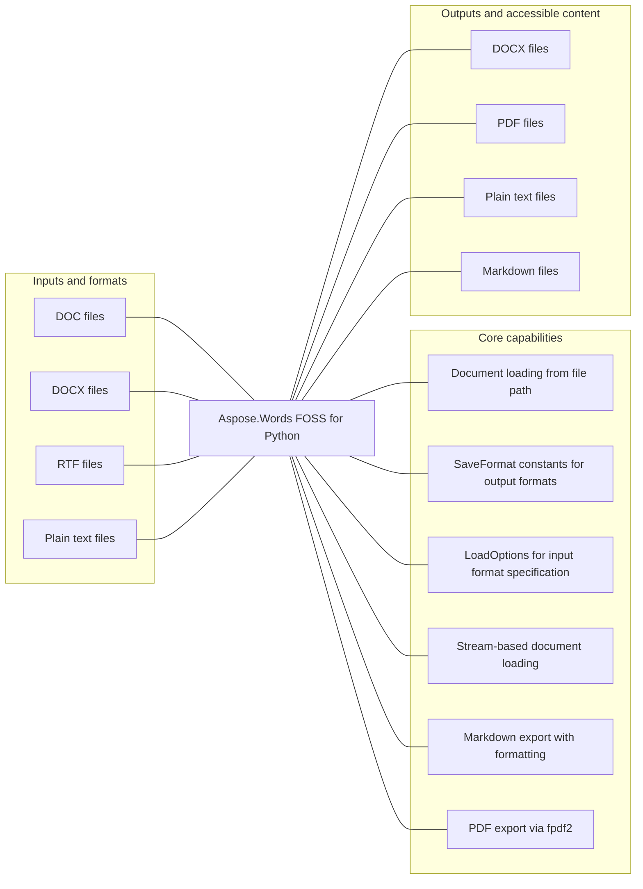

# Aspose.Words FOSS for Python

[](https://pypi.org/project/aspose-words-foss/)   [](LICENSE) [](https://github.com/aspose-words-foss/Aspose.Words-FOSS-for-Python/graphs/contributors)

Aspose.Words FOSS for Python provides Document loading from file path for developers using Python.

## Navigation

- [At a glance](#at-a-glance)
- [Key capabilities](#key-capabilities)
- [Installation](#installation)
- [Quick start](#quick-start)
- [Scope and limitations](#scope-and-limitations)
- [License](#license)

## At a glance



## Key capabilities

- Document loading from file path.
- SaveFormat constants for output formats.
- LoadOptions for input format specification.
- Stream-based document loading.
- Markdown export with formatting.
- PDF export via fpdf2.

## Installation

```bash
python -m pip install aspose-words-foss
```

Requires Python >=3.10,<3.13.

Optional dependency groups declared in `pyproject.toml`:
- `dev`: `python -m pip install "aspose-words-foss[dev]"`

Required runtime dependencies declared in `pyproject.toml`: `olefile>=0.46`, `fpdf2>=2.7.5`, `pydantic>=2.0.0`.

## Quick start

### Minimal verified example

```python
import aspose.words_foss as aw

opts = aw.loading.LoadOptions()
```

## Scope and limitations

The package manifest classifies this release as **Beta**.

[Aspose.Words FOSS for Python](https://products.aspose.org/words/python/) and [Aspose.Words Enterprise Edition](https://products.aspose.com/words/python/) are separate products. This README documents the FOSS implementation; do not assume API or feature parity beyond verified behavior.

## License

This project is available under the [MIT License](LICENSE). It permits use, modification, distribution, and commercial use when the license and copyright notice are retained.
