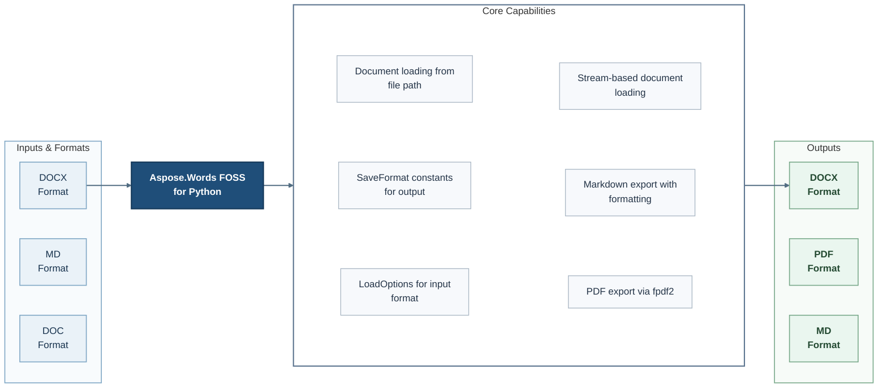

# Aspose.Words FOSS for Python

[](https://pypi.org/project/aspose-words-foss/)   [](LICENSE) [](https://github.com/aspose-words-foss/Aspose.Words-FOSS-for-Python/graphs/contributors)


Aspose.Words FOSS for Python is an open-source library for developers using Python. It reads DOCX files, MD files, and DOC files and writes DOCX files, PDF files, and MD files.

## Navigation

- [At a Glance](#at-a-glance)
- [Key Capabilities](#key-capabilities)
- [Installation](#installation)
- [Quick Start](#quick-start)
- [Additional Examples](#additional-examples)
- [API Reference](#api-reference)
- [Documentation and Resources](#documentation-and-resources)
- [Scope and Limitations](#scope-and-limitations)
- [Development and Testing](#development-and-testing)
- [License](#license)

## At a Glance



## Key Capabilities

- **Import DOCX files** - Load supported documents directly from filesystem paths. Available through the public `loading` and `Document` APIs.
- **Export DOCX files** - Select the requested output format when saving a document. Available through the public `SaveFormat` API.
- **Extract rich text and formatting from DOCX files** - Access text and its formatting data. Available through the public `Style` API.

- **DOC Support**: Word 97-2003 binary format reader via `olefile`

- **RTF Support**: Rich Text Format reader via OLE2 delegation

- **Markdown Import**: `.md` is parsed into the document model, not read as literal text — headings, bold/italic/strikethrough/inline code, ordered and nested lists, tables, block quotes, fenced code blocks, links, and base64-embedded images all become proper nodes, so Markdown converts to DOCX and PDF like any other input

- **Plain Text Input**: Read `.txt` files

- **File or Stream Input**: DOCX, DOC and RTF are auto-detected from magic bytes (anything else falls back to plain text); `LoadOptions.load_format` overrides the guess

## Installation

```bash
python -m pip install aspose-words-foss
```

Requires Python >=3.10,<3.13.

Install optional dependencies by scenario:

- Installing the `dev` extra: `python -m pip install "aspose-words-foss[dev]"`

Required runtime dependencies declared in `pyproject.toml`: `olefile>=0.46`, `fpdf2>=2.7.5`, `pydantic>=2.0.0`.

## Quick Start

```python
import aspose.words_foss as aw

opts = aw.loading.LoadOptions()
```

## Additional Examples

Expand this section to view examples for converting a document to markdown, exporting to PDF and DOCX, and extracting plain text.

<details>
<summary>View additional examples and results</summary>

### Convert a Document to Markdown

```python
import aspose.words_foss as aw

doc = aw.Document("input.docx")
doc.save("output.md", aw.SaveFormat.MARKDOWN)
```

### Export to PDF

```python
import aspose.words_foss as aw

doc = aw.Document("input.docx")
doc.save("output.pdf", aw.SaveFormat.PDF)
```

### Export to DOCX

```python
import aspose.words_foss as aw

doc = aw.Document("input.docx")
doc.save("output.docx", aw.SaveFormat.DOCX)
```

### Extract Plain Text

```python
import aspose.words_foss as aw

doc = aw.Document("input.docx")
text = doc.get_text()
```

</details>

## API Reference

The package documents 92 public types across 12 namespaces. Package namespaces include `aspose.words_foss`, `aspose.words_foss.converters`, `aspose.words_foss.doc_reader`, `aspose.words_foss.docx_reader`, `aspose.words_foss.docx_reader.ldm_builder`, `aspose.words_foss.docx_writer`, `aspose.words_foss.md_import`, `aspose.words_foss.model.enums`, `aspose.words_foss.parsers`, `aspose.words_foss.pdf_writer`, `aspose.words_foss.utils`. See the complete API reference under Documentation and Resources for members, signatures, and inherited APIs.

<details>
<summary>View public API by namespace</summary>

### Aspose.Words Namespace (`aspose.words_foss`)

| Type | Description |
| --- | --- |
| `Document(source=None, load_options=None, stream, data)` | Represents a words document through the Aspose.Words API. Supports retrieving child nodes, retrieving text, and saving document output. |
| `LoadFormat` | Enumerates load format values. |
| `LoadOptions()` | Configures Load operations through the Aspose.Words API. |
| `MarkdownLoadOptions()` | Configures Markdown Load operations through the Aspose.Words API. Inherits from `LoadOptions`. |
| `NodeType` | Represents a Node Type in the public words FOSS API for Aspose.Words. |
| `SaveFormat` | Enumerates save format values. |

### Aspose.Words.Converters Namespace (`aspose.words_foss.converters`)

| Type | Description |
| --- | --- |
| `ListHandler(options, reader=None)` | Represents a List Handler in the public converters API for Aspose.Words. Supports breaking list, formating list item, and retrieving list info. |
| `ParagraphConverter(options)` | Converts Paragraph content through the Aspose.Words API. Supports formating text, retrieving paragraph info, and retrieving run formatting. |
| `TableConverter(options)` | Converts Table content through the Aspose.Words API. |

### Aspose.Words.DOC Reader Namespace (`aspose.words_foss.doc_reader`)

| Type | Description |
| --- | --- |
| `DocFileReaderCore()` | Reads DOC File content through the Aspose.Words API. Supports converting content to light document, loading bytes, and loading file. Inherits from `DocTableBuilderMixin`, `DocFileReaderCore`. |

### Aspose.Words.DOCX Reader Namespace (`aspose.words_foss.docx_reader`)

| Type | Description |
| --- | --- |
| `A_NS` | Defines the `A_NS` public constant. |
| `COLOR_EMPTY` | Defines the `COLOR_EMPTY` public constant. |
| `CellData` | Represents a Cell Data in the public DOCX reader API for Aspose.Words. |
| `DocumentReader()` | Reads Document content through the Aspose.Words API. Supports loading bytes, loading file, and loading stream. Inherits from `LdmBuilderMixin`, `ShapeParserMixin`. |
| `MC_NS` | Defines the `MC_NS` public constant. |
| `NumberingInfo` | Represents a Numbering Info in the public DOCX reader API for Aspose.Words. |
| `NumberingLevel` | Represents a Numbering Level in the public DOCX reader API for Aspose.Words. |
| `PAGE_FIELD_SENTINEL` | Defines the `PAGE_FIELD_SENTINEL` public constant. |
| `PIC_NS` | Defines the `PIC_NS` public constant. |
| `ParagraphData` | Represents a Paragraph Data in the public DOCX reader API for Aspose.Words. |
| `R_NS` | Defines the `R_NS` public constant. |
| `RowData` | Represents a Row Data in the public DOCX reader API for Aspose.Words. |
| `RunData` | Represents a Run Data in the public DOCX reader API for Aspose.Words. |
| `TableData` | Represents a Table Data in the public DOCX reader API for Aspose.Words. |
| `WPG_NS` | Defines the `WPG_NS` public constant. |
| `WPS_NS` | Defines the `WPS_NS` public constant. |
| `WP_NS` | Defines the `WP_NS` public constant. |
| `W_NS` | Defines the `W_NS` public constant. |

### Aspose.Words.DOCX Writer Namespace (`aspose.words_foss.docx_writer`)

| Type | Description |
| --- | --- |
| `DocxWriterLossyWarning` | Represents a DOCX Writer Lossy Warning in the public DOCX writer API for Aspose.Words. Inherits from `UserWarning`. |
| `LdmDocxWriter(options=None)` | Writes Ldm DOCX output through the Aspose.Words API. Supports writing output and writing to bytes. |

### Aspose.Words.Drawing Namespace (`aspose.words_foss.drawing`)

| Type | Description |
| --- | --- |
| `ImageData` | Represents an Image Data in the public drawing API for Aspose.Words. Supports loading content from MIME. Inherits from `BaseModel`. |
| `ImageType` | Represents an Image Type in the public drawing API for Aspose.Words. |
| `Shape` | Represents a Shape in the public drawing API for Aspose.Words. Supports serializing content as body, serializing content as cell, and serializing content as paragraph. Inherits from `BaseModel`, `NodeCastMixin`. |
| `WrapType` | Represents a Wrap Type in the public drawing API for Aspose.Words. |

### Aspose.Words.Loading Namespace (`aspose.words_foss.loading`)

| Type | Description |
| --- | --- |
| `LoadFormat` | The `aspose.words_foss.loading` namespace re-exports `LoadFormat` from the primary `aspose.words_foss` namespace. |
| `LoadOptions()` | The `aspose.words_foss.loading` namespace re-exports `LoadOptions` from the primary `aspose.words_foss` namespace. |
| `MarkdownLoadOptions()` | The `aspose.words_foss.loading` namespace re-exports `MarkdownLoadOptions` from the primary `aspose.words_foss` namespace. |

### Aspose.Words.Md Import Namespace (`aspose.words_foss.md_import`)

| Type | Description |
| --- | --- |
| `AtxHeadingBlock(level)` | Represents an Atx Heading Block in the public md import API for Aspose.Words. Supports adding children and retrieving parent. Inherits from `HeadingBlock`. |
| `AutolinkBlock(text, uri)` | Represents an Autolink Block in the public md import API for Aspose.Words. Supports adding children and retrieving parent. Inherits from `Block`. |
| `Block(block_type)` | Represents a Block in the public md import API for Aspose.Words. Supports adding children and retrieving parent. |
| `BlockType` | Enumerates block type values. |
| `BoldInlineBlock()` | Represents a Bold Inline Block in the public md import API for Aspose.Words. Supports adding children and retrieving parent. Inherits from `Block`. |
| `BulletListItemBlock(marker)` | Represents a Bullet List Item Block in the public md import API for Aspose.Words. Supports adding children, retrieving level, and retrieving list container. Inherits from `ListItemBlock`. |
| `CellBlock(alignment=None)` | Represents a Cell Block in the public md import API for Aspose.Words. Supports adding children and retrieving parent. Inherits from `Block`. |
| `DocumentBlock()` | Represents a Document Block in the public md import API for Aspose.Words. Supports adding children and retrieving parent. Inherits from `Block`. |
| `FencedCodeBlock(code, info='', fence_char='`')` | Represents a Fenced Code Block in the public md import API for Aspose.Words. Supports adding children and retrieving parent. Inherits from `Block`. |
| `FootnoteDefinitionBlock(label)` | Represents a Footnote Definition Block in the public md import API for Aspose.Words. Supports adding children and retrieving parent. Inherits from `Block`. |
| `FootnoteReferenceBlock(label)` | Represents a Footnote Reference Block in the public md import API for Aspose.Words. Supports adding children and retrieving parent. Inherits from `Block`. |
| `HeadingBlock(block_type, level)` | Represents a Heading Block in the public md import API for Aspose.Words. Supports adding children and retrieving parent. Inherits from `Block`. |
| `HorizontalRuleBlock()` | Represents a Horizontal Rule Block in the public md import API for Aspose.Words. Supports adding children and retrieving parent. Inherits from `Block`. |
| `HtmlInsertOptions` | Configures HTML Insert operations through the Aspose.Words API. |
| `HtmlTagBlock(tag_name, raw_text, is_self_closing=False, is_closing=False, is_self_contained=False)` | Represents an HTML Tag Block in the public md import API for Aspose.Words. Supports adding children and retrieving parent. Inherits from `Block`. |
| `IndentedCodeBlock(code)` | Represents an Indented Code Block in the public md import API for Aspose.Words. Supports adding children and retrieving parent. Inherits from `Block`. |
| `InlineCodeBlock(code, delimiter_length=1)` | Represents an Inline Code Block in the public md import API for Aspose.Words. Supports adding children and retrieving parent. Inherits from `Block`. |
| `ItalicInlineBlock()` | Represents an Italic Inline Block in the public md import API for Aspose.Words. Supports adding children and retrieving parent. Inherits from `Block`. |
| `LineBreakBlock(is_hard=True)` | Represents a Line Break Block in the public md import API for Aspose.Words. Supports adding children and retrieving parent. Inherits from `Block`. |
| `LinkTextBlock(uri=None, title='', is_image=False, definition_label=None, raw_text='')` | Represents a Link Text Block in the public md import API for Aspose.Words. Supports adding children and retrieving parent. Inherits from `Block`. |
| `ListBlock(ordered, marker)` | Represents a List Block in the public md import API for Aspose.Words. Supports adding children and retrieving parent. Inherits from `Block`. |
| `ListItemBlock(block_type, marker, start_at=1)` | Represents a List Item Block in the public md import API for Aspose.Words. Supports retrieving level, retrieving list container, and adding children. Inherits from `Block`. |
| `ListMarker` | Represents a List Marker in the public md import API for Aspose.Words. |
| `MarkdownBlockLevel` | Enumerates markdown block level values. |
| `MarkdownDocumentBuilder()` | Builds Markdown Document through the Aspose.Words API. Supports clearing font, currenting footnote body, and ending hyperlink. |
| `MarkdownReaderContext(base_dir=None)` | Represents a Markdown Reader Context in the public md import API for Aspose.Words. Supports inserting image, opening content, and writing text. Inherits from `_StyleMixin`, `_ListMixin`. |
| `OrderedListItemBlock(start_at=1, marker=ListMarker.DOT)` | Represents an Ordered List Item Block in the public md import API for Aspose.Words. Supports adding children, retrieving level, and retrieving list container. Inherits from `ListItemBlock`. |
| `ParagraphBlock()` | Represents a Paragraph Block in the public md import API for Aspose.Words. Supports adding children and retrieving parent. Inherits from `Block`. |
| `QuoteBlock()` | Represents a Quote Block in the public md import API for Aspose.Words. Supports adding children and retrieving parent. Inherits from `Block`. |
| `RowBlock(is_header=False)` | Represents a Row Block in the public md import API for Aspose.Words. Supports adding children and retrieving parent. Inherits from `Block`. |
| `SetextHeadingBlock(level)` | Represents a Setext Heading Block in the public md import API for Aspose.Words. Supports adding children and retrieving parent. Inherits from `HeadingBlock`. |
| `StrikethroughBlock()` | Represents a Strikethrough Block in the public md import API for Aspose.Words. Supports adding children and retrieving parent. Inherits from `Block`. |
| `TableBlock(column_alignments)` | Represents a Table Block in the public md import API for Aspose.Words. Supports adding children and retrieving parent. Inherits from `Block`. |
| `TextBlock(text)` | Represents a Text Block in the public md import API for Aspose.Words. Supports adding children and retrieving parent. Inherits from `Block`. |
| `UnderlineBlock()` | Represents an Underline Block in the public md import API for Aspose.Words. Supports adding children and retrieving parent. Inherits from `Block`. |

### Aspose.Words.Parsers Namespace (`aspose.words_foss.parsers`)

| Type | Description |
| --- | --- |
| `NumberingParser()` | Represents a Numbering Parser in the public parsers API for Aspose.Words. Supports retrieving delimiter, retrieving level info, and retrieving list info. |
| `StyleParser` | Represents a Style Parser in the public parsers API for Aspose.Words. Supports extracting all styles, retrieving style chain, and checking whether setext heading. |

### Aspose.Words.PDF Writer Namespace (`aspose.words_foss.pdf_writer`)

| Type | Description |
| --- | --- |
| `LdmPdfWriter(options=None)` | Writes Ldm PDF output through the Aspose.Words API. Supports writing output. |

### Aspose.Words.DOCX Reader.Ldm Builder Namespace (`aspose.words_foss.docx_reader.ldm_builder`)

| Type | Description |
| --- | --- |
| `LdmBuilderMixin` | Represents a Ldm Builder Mixin in the public ldm builder API for Aspose.Words. Supports converting content to light document. |

### Aspose.Words.Model.Enums Namespace (`aspose.words_foss.model.enums`)

| Type | Description |
| --- | --- |
| `CellMerge` | Enumerates cell merge values. |
| `CellVerticalAlignment` | Enumerates cell vertical alignment values. |
| `HeightRule` | Enumerates height rule values. |
| `ImageType` | The `aspose.words_foss.model.enums` namespace re-exports `ImageType` from the primary `aspose.words_foss.drawing` namespace. |
| `LineSpacingRule` | Enumerates line spacing rule values. |
| `LineStyle` | Enumerates line style values. |
| `NumberStyle` | Enumerates number style values. |
| `Orientation` | Enumerates orientation values. |
| `ParagraphAlignment` | Enumerates paragraph alignment values. |
| `PreferredWidthType` | Enumerates preferred width type values. |
| `SectionStart` | Enumerates section start values. |
| `StyleIdentifier` | Enumerates style identifier values. |
| `StyleType` | Enumerates style type values. |
| `TabAlignment` | Enumerates tab alignment values. |
| `TabLeader` | Enumerates tab leader values. |
| `Underline` | Enumerates underline values. |

</details>

## Documentation and Resources

- **[Getting started guide](https://docs.aspose.org/words/python/)** - installation, walkthroughs, and feature guides for this library.
- Found a bug or have a feature request? [Open an issue](https://github.com/aspose-words-foss/Aspose.Words-FOSS-for-Python/issues) on GitHub.

<details>
<summary>View Additional Support Details</summary>

- **Issues**: [GitHub Issues](https://github.com/aspose-words-foss/Aspose.Words-FOSS-for-Python/issues)

</details>

## Scope and Limitations

The library targets the workflows listed above. Two specific constraints are listed below.

- `NEVER` disables them (raises :class:`zipfile.LargeFileError` if the archive exceeds 4 GB), `IF_NECESSARY` enables them only when required (Python default), `ALWAYS` currently behaves like `IF_NECESSARY` — forcing ZIP64 records unconditionally is not implemented.
- OoxmlCompliance.ISO29500_2008_STRICT is not supported by the FOSS writer; use ECMA376_2006 or ISO29500_2008_TRANSITIONAL.

The package manifest classifies this release as **Beta**.

This repository contains [Aspose.Words FOSS for Python](https://products.aspose.org/words/python/). For requirements beyond the FOSS scope described above, explore the [full-featured Aspose.Words Enterprise Edition](https://products.aspose.com/words/python/). It is a separate product, so features and APIs may differ.

## Development and Testing

### Focused Commands and Repository Scripts

```bash
python -m pip install -e .
```

## License

This project is available under the [MIT License](LICENSE). It permits use, modification, distribution, and commercial use when the license and copyright notice are retained.
