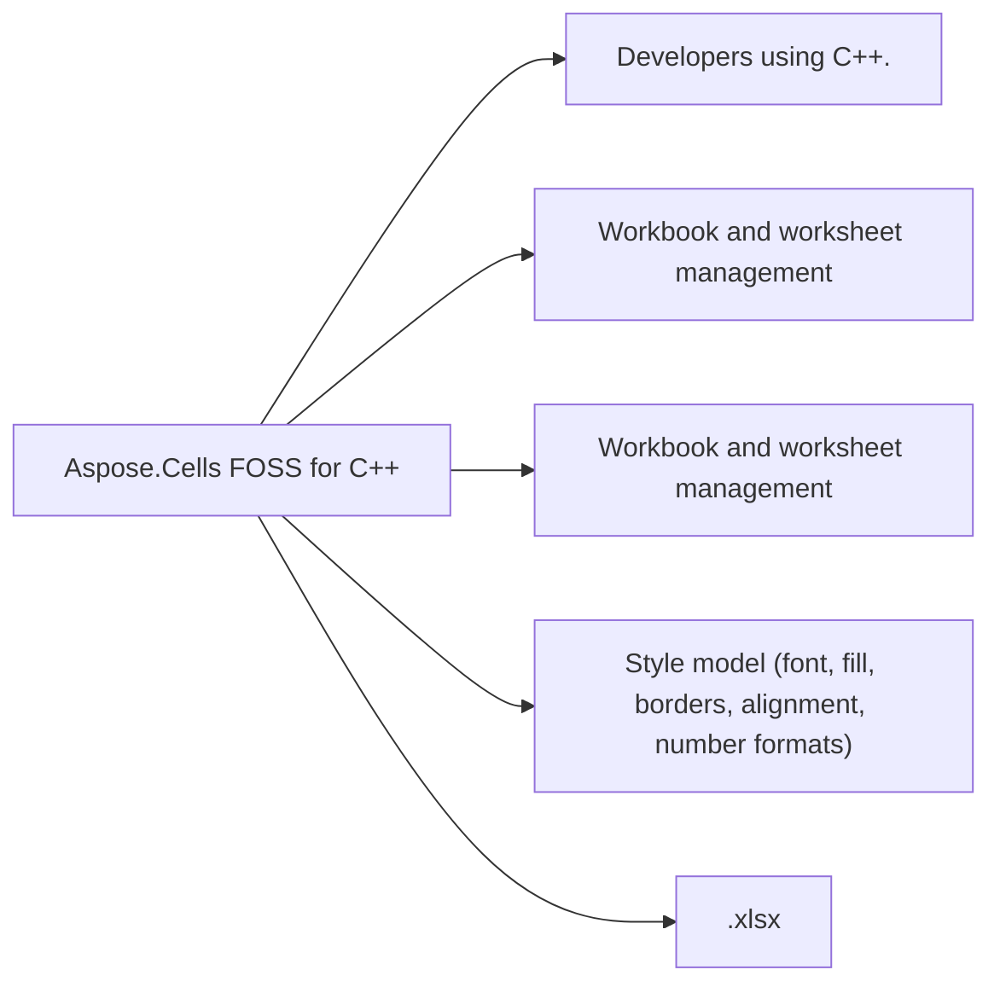

# Aspose.Cells FOSS for C++

[](https://www.nuget.org/packages/Aspose.cells.Cpp.FOSS) [](LICENSE)

Aspose.Cells FOSS is an open-source C++ library for creating, loading, editing, and saving Excel `.xlsx` workbooks without requiring Microsoft Excel.

## At a glance

- **For:** Developers using C++.
- **Problem solved:** Workbook and worksheet management. Style model (font, fill, borders, alignment, number formats).
- **Verified capabilities:** Workbook and worksheet management. Style model (font, fill, borders, alignment, number formats). .xlsx load/save from file paths and streams. Cell values, formulas, merges, and number formats. Conditional formatting, data validation, hyperlinks, names, comments.
- **Verified formats:** .xlsx.
- **Runtime:** 3.16



## In this README

- [Highlights](#highlights)
- [How to build](#how-to-build)
- [Quick Start](#quick-start)
- [Supported Areas](#supported-areas)
- [License](#license)
- [Support](#support)

## Installation

Install the package published for this repository:

```bash
nuget install Aspose.cells.Cpp.FOSS
```

The package was verified against NuGet.

## Highlights

- Aspose.Cells-compatible API surface for common XLSX scenarios
- `.xlsx` load/save from file paths and streams
- Cell values, formulas, styles, merges, and number formats
- Conditional formatting, data validation, hyperlinks, names, comments

## How to build

```bash
cd samples
mkdir build
cd build
cmake ..
cmake --build .
```

## Quick Start

### Create, style, and save a workbook

```cpp
#include "aspose/cells_foss/Workbook.h"
#include "aspose/cells_foss/WorksheetCollection.h"
#include "aspose/cells_foss/Worksheet.h"
#include "aspose/cells_foss/Cell.h"
#include "aspose/cells_foss/Style.h"
#include "aspose/cells_foss/Color.h"
#include "aspose/cells_foss/Font.h"

using namespace Aspose::Cells_FOSS;

int main() {
    Workbook workbook;
    Worksheet& sheet = workbook.GetWorksheets()[0];

    sheet.SetName("Products");
    sheet.GetCells()["A1"].PutValue("Product");
    sheet.GetCells()["B1"].PutValue("Price");
    sheet.GetCells()["A2"].PutValue("Apple");
    sheet.GetCells()["B2"].PutValue(2.99);
    sheet.GetCells()["A3"].PutValue("Orange");
    sheet.GetCells()["B3"].PutValue(1.99);
    sheet.GetCells()["B4"].SetFormula("=SUM(B2:B3)");

    Style headerStyle = sheet.GetCells()["A1"].GetStyle();
    Font font;
    font.SetBold(true);
    font.SetColor(Color::FromArgb(255, 255, 255, 255));
    headerStyle.SetFont(font);
    headerStyle.SetPattern(FillPattern::Solid);
    headerStyle.SetForegroundColor(Color::FromArgb(255, 34, 120, 212));
    sheet.GetCells()["A1"].SetStyle(headerStyle);
    sheet.GetCells()["B1"].SetStyle(headerStyle);

    workbook.Save("products.xlsx");
    return 0;
}

```

For a focused walkthrough of the APIs used in this example, see [Workbook](https://reference.aspose.org/cells/cpp/workbook/).

## Supported Areas

- Workbook and worksheet management
- Cells and formulas
- Style model (font, fill, borders, alignment, number formats)
- Worksheet settings (visibility, zoom, RTL, gridlines, protection)
- Hyperlinks and defined names
- Data validation and conditional formatting
- Page setup and print-related settings
- Document properties

## License

MIT. See [License/LICENSE.txt](https://github.com/aspose-cells-foss/Aspose.Cells-FOSS-for-Cpp/blob/main/License/LICENSE.txt).

## Support

- Issues: <https://github.com/aspose-cells-foss/Aspose.Cells-FOSS-for-Cpp/issues>