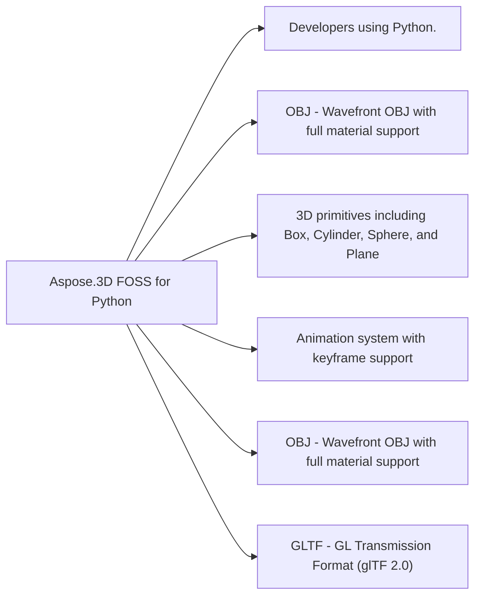

# Aspose.3D FOSS for Python

[](LICENSE)

A powerful, free, and open-source 3D file format library for Python. Aspose.3D FOSS for Python enables developers to create, manipulate, and convert 3D scenes and models programmatically. It supports popular 3D file formats including OBJ, STL, glTF, 3MF, and more, and is released under the permissive **MIT License**.

## At a glance

- **For:** Developers using Python.
- **Problem solved:** OBJ - Wavefront OBJ with full material support. GLTF - GL Transmission Format (glTF 2.0). STL - Stereo Lithography format. 3MF - 3D Manufacturing Format.
- **Verified capabilities:** 3D primitives including Box, Cylinder, Sphere, and Plane. Animation system with keyframe support. Scene management with hierarchical node structure. File format import and export for OBJ, GLTF, STL, and 3MF.
- **Verified formats:** OBJ - Wavefront OBJ with full material support. GLTF - GL Transmission Format (glTF 2.0). STL - Stereo Lithography format. 3MF - 3D Manufacturing Format.



## In this README

- [About Aspose.3D FOSS](#about-aspose3d-foss)
- [Features](#features)
- [Installation](#installation)
- [Quick Start](#quick-start)
- [Supported Formats](#supported-formats)
- [Python Version Support](#python-version-support)
- [Format-Specific Features](#format-specific-features)
- [Architecture](#architecture)
- [Contributing](#contributing)
- [License](#license)
- [Resources](#resources)
- [Acknowledgments](#acknowledgments)

## About Aspose.3D FOSS

Aspose.3D FOSS is the free, open-source edition of Aspose.3D. It shares the same public API design as the Aspose.3D for Python Enterprise Edition, so you can:

- **Build and ship 3D applications at no cost** under a permissive MIT License.
- **Start free and grow without rewriting code** — code written against the FOSS edition works with the Aspose.3D for Python Enterprise Edition.
- **Upgrade only when you need to** — when you require the broader feature set, higher performance, or proprietary format support of the [Aspose.3D for Python Enterprise Edition](https://products.aspose.com/3d/python-net/), simply swap in the Aspose.3D for Python Enterprise Edition, no API rewrites required.

The FOSS edition focuses on the most widely used open 3D formats. The Aspose.3D for Python Enterprise Edition additionally covers proprietary and high-performance scenarios such as rendering, advanced mesh operations, and formats like FBX, USD, PDF, and more.

## Features

- **Format Support**
  - OBJ - Import/export with materials, textures, and grouping
  - GLTF - GL Transmission Format with full PBR material support
  - STL - Stereo Lithography format for 3D printing
  - 3MF - 3D Manufacturing Format for modern 3D printing workflows

- **Scene Management**
  - Create and manipulate 3D scenes
  - Hierarchical node structure
  - Mesh and entity management
  - Material system with Lambert, Phong, and PBR materials

- **3D Primitives**
  - Vector math (Vector2, Vector3, Vector4, Matrix4, Quaternion)
  - Bounding boxes and transformations
  - Camera and light objects

- **Mesh Operations**
  - Triangulation support for polygon conversion
  - Mesh manipulation and modification

- **Animation System**
  - Keyframe animation support
  - Animation curves and interpolation

## Installation

```bash
pip install aspose-3d-foss
```

## Quick Start

### Minimal verified example

```python
from aspose.threed import Scene

scene = Scene()
```

This exact example was compiled against the source build at revision `ab1a2267a0ba6302311d0c7c4ad01494974c7d76`.

For a focused walkthrough of the APIs used in this example, see [How to Get Started with 3D in Python](https://kb.aspose.org/3d/python/how-to-get-started-3d-python/).

## Supported Formats

### Import (Implemented)
- **OBJ** - Wavefront OBJ with full material support
- **GLTF** - GL Transmission Format (glTF 2.0)
- **STL** - Stereo Lithography format
- **3MF** - 3D Manufacturing Format
- More formats coming soon...

### Export (Implemented)
- **OBJ** - Export with vertices, faces, and materials
- **GLTF** - Export to glTF 2.0 format
- **STL** - Export to STL format
- **3MF** - Export to 3MF format
- More formats coming soon...

## Python Version Support

- Python 3.7+
- Python 3.8+
- Python 3.9+
- Python 3.10+
- Python 3.11+
- Python 3.12+

## Format-Specific Features

### OBJ Format

**Import Features:**
- Vertices (v), texture coordinates (vt), vertex normals (vn)
- Faces (f) with multiple index formats
- Objects (o), groups (g), smoothing groups (s)
- Materials (usemtl, mtllib)

**Load Options:**
- `flip_coordinate_system` - Swap Y and Z coordinates
- `enable_materials` - Enable/disable material loading
- `scale` - Scale factor for all coordinates
- `normalize_normal` - Normalize normal vectors

**Save Options:**
- `apply_unit_scale` - Apply unit scaling
- `point_cloud` - Export as point cloud
- `verbose` - Verbose output
- `serialize_w` - Include W coordinate
- `enable_materials` - Export materials
- `flip_coordinate_system` - Flip coordinate system

### GLTF Format

**Features:**
- glTF 2.0 specification support
- PBR material system (metallic/roughness workflow)
- Mesh primitives with attributes
- Node hierarchy and transforms
- Texture and image support

### STL Format

**Features:**
- Binary and ASCII STL support
- Triangular mesh representation
- Unit conversion and scaling
- Import for 3D printing workflows

### 3MF Format

**Features:**
- 3D Manufacturing Format 1.2 support
- Rich metadata support
- Production-grade 3D printing
- Color and material support

## Architecture

The library is organized into several modules:

- `aspose.threed` - Core scene classes (Scene, Node, Entity)
- `aspose.threed.entities` - 3D entities (Mesh, Camera, Light)
- `aspose.threed.formats` - File format importers and exporters (OBJ, GLTF, STL, 3MF)
- `aspose.threed.shading` - Material system (Lambert, Phong, PBR materials)
- `aspose.threed.utilities` - Math utilities (vectors, matrices, quaternions)
- `aspose.threed.animation` - Animation system (keyframes, curves)

## Contributing

Contributions are welcome! Please feel free to submit issues and pull requests.

## License

This project is licensed under the **MIT License** — see the [LICENSE](LICENSE) file for details.

## Resources

### Aspose.3D FOSS — free & open source (aspose.org)
- [Aspose.3D FOSS for Python](https://products.aspose.org/3d/python/) — product page
- Aspose.3D FOSS family — all platforms (Python, .NET, Java, TypeScript)
- Aspose FOSS documentation — guides for all open-source libraries
- Aspose FOSS blog — tutorials and announcements

### Aspose.3D — Aspose.3D for Python Enterprise Edition (aspose.com)
- Aspose.3D for Python via .NET — Aspose.3D for Python Enterprise Edition
- Aspose.3D product family — overview
- Developer documentation — API guides
- API reference — complete API documentation
- Download / free trial — get the Aspose.3D for Python Enterprise Edition

### Community & support
- Aspose.3D support forum — questions and help
- [Free online 3D apps](https://products.aspose.app/3d/) — convert and view 3D files in your browser

## Acknowledgments

- Aspose.3D FOSS is inspired by the Aspose.3D API.
- 3D format specifications are maintained by various 3D software vendors and standards bodies.
