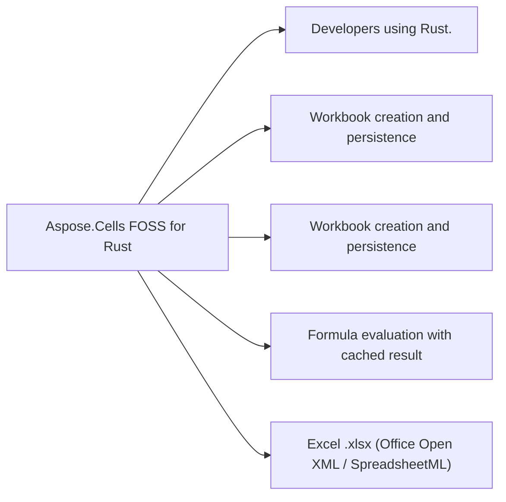

# Aspose.Cells FOSS for Rust

[](LICENSE)

A free, open-source, **pure-Rust** spreadsheet library that reads and writes Excel
`.xlsx` (Office Open XML / SpreadsheetML) workbooks. It exposes an API modeled after
Aspose.Cells, so the familiar
`Workbook` / `Worksheet` / `Cells` object model is available to Rust programs with no
proprietary runtime and no external Aspose dependency.

The OOXML packaging (ZIP container, relationships, shared strings, styles, worksheet XML,
charts, etc.) is implemented from scratch on top of a small set of general-purpose crates:
[`zip`](https://crates.io/crates/zip) (package container),
[`roxmltree`](https://crates.io/crates/roxmltree) (XML parsing),
[`chrono`](https://crates.io/crates/chrono) (date/time),
[`sha2`](https://crates.io/crates/sha2) / [`base64`](https://crates.io/crates/base64) /
[`getrandom`](https://crates.io/crates/getrandom) (protection hashing), and
[`serde_json`](https://crates.io/crates/serde_json).

## At a glance

- **For:** Developers using Rust.
- **Problem solved:** Workbook creation and persistence. Formula evaluation with cached result. XLSX file loading. List objects (Excel tables) with styles and totals.
- **Verified capabilities:** Workbook creation and persistence. Formula evaluation with cached result. XLSX file loading. List objects (Excel tables) with styles and totals.
- **Verified formats:** Excel .xlsx (Office Open XML / SpreadsheetML).
- **Current verified limitation:** Early-stage and evolving. The public API surface is broad but not everything Aspose.Cells supports is implemented, and some features are partial. Treat it as a work in progress.



## In this README

- [Status](#status)
- [Features](#features)
- [Installation](#installation)
- [Quick start](#quick-start)
- [Documentation](#documentation)
- [Samples](#samples)
- [Project layout](#project-layout)
- [License](#license)

## Status

Early-stage and evolving. The public API surface is broad but not everything Aspose.Cells
supports is implemented, and some features are partial. Treat it as a work in progress.

## Features

- **Workbooks & worksheets** - create, load, save, and round-trip `.xlsx` files;
  manage the worksheet collection, names, visibility, and view/protection settings
- **Cells & values** - strings, numbers, booleans, decimals, dates/times, and formulas
  with cached results; A1 and row/column indexed access
- **Styling** - fonts, fills, borders, number formats, and horizontal/vertical alignment
- **Rows & columns** - sizing, visibility, and merged cell areas
- **Data validation** - list, decimal, and custom rules
- **Conditional formatting** - basic and advanced format conditions
- **Hyperlinks & defined names**
- **Comments** - authors, notes, visibility, and sizing
- **Charts** - column and line charts
- **List objects (Excel tables)** - table styles and totals
- **Pictures & shapes** - embedded images, auto-shapes (rectangles, stars, arrows, symbols)
- **Auto-filters & sparklines**
- **Document properties** - core and extended workbook metadata
- **Page setup** - print settings, headers/footers, margins, and page breaks

## Installation

Clone the repository and build with Cargo:

```bash
git clone https://github.com/aspose-cells-foss/Aspose.Cells-FOSS-for-Rust.git
cd "Aspose.Cells FOSS for Rust - Github"
cargo build
```

To depend on it from another crate, add either a local path dependency:

```toml
[dependencies]
aspose-cells-foss-rust = { path = "../Aspose.Cells FOSS for Rust - Github" }
```

Or a Git dependency after the repository is live:

```toml
[dependencies]
aspose-cells-foss-rust = { git = "https://github.com/aspose-cells-foss/Aspose.Cells-FOSS-for-Rust.git" }
```

The package name is `aspose-cells-foss-rust` and the library is imported as
`aspose_cells_foss_rust`.

Requires a recent stable Rust toolchain (2021 edition).

## Quick start

The library is imported as `aspose_cells_foss_rust`:

### Minimal verified example

```rust
use aspose_cells_foss_rust::Workbook;

fn main() {
    let _workbook = Workbook::default();
}
```

This exact example was compiled against the source build at revision `0339b7e7dcb65c3ac0f77ddbe0effb69c83f0e2e`.

For a focused walkthrough of the APIs used in this example, see [Quickstart](https://docs.aspose.org/cells/rust/getting-started/quickstart/).

## Documentation

- **Samples** - see [samples/README.md](samples/README.md) for runnable examples
- **Contributor notes** - see [AGENTS.md](AGENTS.md) for architecture and conventions

Generate local API docs with `cargo doc --no-deps --open`.

Published API docs are deployed by GitHub Pages through
[`pages.yml`](.github/workflows/pages.yml). After enabling `Settings -> Pages -> GitHub Actions`
in the repository, pushes to `main` or `master` automatically rebuild and publish the rustdoc site.

## Samples

Runnable examples covering each feature area live in [`samples/`](samples/), with an
overview in [samples/README.md](samples/README.md). Each is registered as a binary, so run
any of them from the repository root:

```bash
cargo run --bin sample_basic
```

Generated workbooks are written under `output/samples/`. Examples include:

| Sample | Focus |
|---|---|
| `basic.rs` | Cell values, formulas, and round-trip loading |
| `styles.rs` | Style creation and inspection |
| `worksheet_settings.rs` | Visibility, view settings, rows, columns, and merges |
| `validations.rs` | List, decimal, and custom data validations |
| `conditional_formatting.rs` | Basic and advanced conditional formatting |
| `hyperlinks_and_names.rs` | Hyperlinks and defined names |
| `pagesetup.rs` | Print settings, headers/footers, margins, and breaks |
| `comments.rs` | Cell comments with authors, notes, and sizing |
| `charts.rs` | Column and line charts |
| `list_objects.rs` | Excel tables with styles and totals |
| `pictures.rs` | Embedding worksheet images |
| `shapes.rs` | Drawing shapes (rectangles, stars, arrows, symbols) |
| `document_properties.rs` | Workbook metadata and core/extended properties |

## Project layout

```text
src/
  lib.rs                     # Crate root; re-exports the public API
  Aspose.Cells_FOSS/
    api.rs                   # Wires the modules together
    Core/                    # Internal data models
    Packaging/               # OOXML package (ZIP) reading/writing
    Xml/                     # SpreadsheetML XML mappers
    Validation/              # Workbook validation
    ...                      # One module per public type (Workbook, Cell, Style, ...)
samples/                     # Runnable feature examples
```

## License

Licensed under the [MIT License](LICENSE.txt).

## Known limitations

- Early-stage and evolving. The public API surface is broad but not everything Aspose.Cells supports is implemented, and some features are partial. Treat it as a work in progress.
