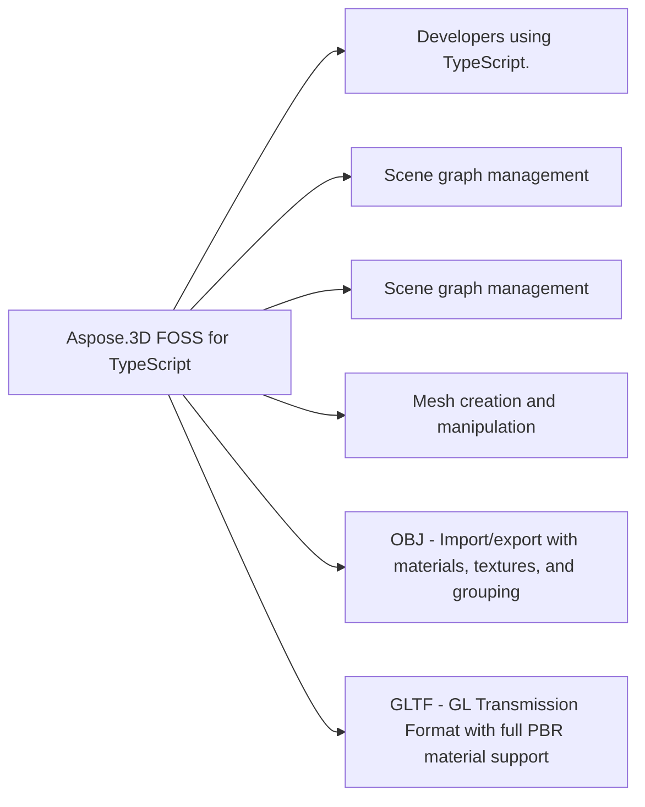

# Aspose.3D FOSS for TypeScript

[](LICENSE)

A powerful and open-source 3D file format library for TypeScript/JavaScript. Aspose.3D for TypeScript enables developers to create, manipulate, and convert 3D scenes and models programmatically in Node.js and browser environments. Supports popular 3D file formats including OBJ, STL, FBX, GLTF, and more.

## At a glance

- **For:** Developers using TypeScript.
- **Problem solved:** Scene graph management. Mesh creation and manipulation. Vector math primitives. Material system with Lambert, Phong, and PBR materials.
- **Verified capabilities:** Scene graph management. Mesh creation and manipulation. Vector math primitives. Material system with Lambert, Phong, and PBR materials. Keyframe animation support. File format detection. Polygon triangulation. Camera and light entities.
- **Verified formats:** OBJ - Import/export with materials, textures, and grouping. GLTF - GL Transmission Format with full PBR material support. STL - Stereo Lithography format for 3D printing. 3MF - 3D Manufacturing Format for modern 3D printing workflows. FBX - Autodesk FBX format support. Collada - COLLADA (DAE) format support.
- **Runtime:** ES2020



## In this README

- [Features](#features)
- [Installation](#installation)
- [Quick Start](#quick-start)
- [Supported Formats](#supported-formats)
- [Documentation](#documentation)
- [TypeScript Version Support](#typescript-version-support)
- [Build & Test](#build-test)
- [Format-Specific Features](#format-specific-features)
- [Architecture](#architecture)
- [Examples](#examples)
- [Contributing](#contributing)
- [License](#license)
- [Acknowledgments](#acknowledgments)

## Features

- **Format Support**
  - OBJ - Import/export with materials, textures, and grouping
  - GLTF - GL Transmission Format with full PBR material support
  - STL - Stereo Lithography format for 3D printing
  - 3MF - 3D Manufacturing Format for modern 3D printing workflows
  - FBX - Autodesk FBX format support
  - Collada - COLLADA (DAE) format support

- **Scene Management**
  - Create and manipulate 3D scenes
  - Hierarchical node structure
  - Mesh and entity management
  - Material system with Lambert, Phong, and PBR materials

- **3D Primitives**
  - Vector math (Vector2, Vector3, Vector4, Matrix4, Quaternion)
  - Bounding boxes and transformations
  - Camera and light objects
  - 2D bounding boxes (BoundingBox2D)

- **Mesh Operations**
  - Triangulation support for polygon conversion
  - Mesh manipulation and modification
  - Vertex element management

- **Animation System**
  - Keyframe animation support
  - Animation curves and interpolation
  - Animation clips and channels

## Installation

```bash
npm install @aspose/3d
```

Or add to your `package.json`:

```json
{
  "dependencies": {
    "@aspose/3d": "^24.12.0"
  }
}
```

## Quick Start

### Minimal verified example

```typescript
import { Scene } from '@aspose/3d/dist/aspose/threed';

const scene = new Scene();
console.log(scene);
```

This exact example was compiled against the source build at revision `227894a1120c22b9b6522564e23dc1d14c8fc39a`.

For a focused walkthrough of the APIs used in this example, see [How to Get Started with Aspose.3D FOSS for TypeScript](https://kb.aspose.org/3d/typescript/how-to-get-started-3d-typescript/).

## Supported Formats

### Import (Implemented)
- **OBJ** - Wavefront OBJ with full material support
- **GLTF** - GL Transmission Format (glTF 2.0)
- **STL** - Stereo Lithography format
- **3MF** - 3D Manufacturing Format
- **FBX** - Autodesk FBX format
- **Collada** - COLLADA (DAE) format
- More formats coming soon...

### Export (Implemented)
- **OBJ** - Export with vertices, faces, and materials
- **GLTF** - Export to glTF 2.0 format
- **STL** - Export to STL format
- **3MF** - Export to 3MF format
- **FBX** - Export to FBX format
- **Collada** - Export to COLLADA format
- More formats coming soon...

## Documentation

- API Reference - Complete API documentation (Python API, same structure as TypeScript)

## TypeScript Version Support

- TypeScript 5.0+
- Node.js 16+
- Node.js 18+
- Node.js 20+
- Node.js 22+
- Modern browsers (ES2020+)

## Build & Test

```bash
# Install dependencies
npm install

# Build the project
npm run build

# Run tests
npm run test

# Type checking
npm run typecheck

# Linting
npm run lint
```

## Format-Specific Features

### OBJ Format

**Import Features:**
- Vertices (v), texture coordinates (vt), vertex normals (vn)
- Faces (f) with multiple index formats
- Objects (o), groups (g), smoothing groups (s)
- Materials (usemtl, mtllib)

**Load Options:**
- `flipCoordinateSystem` - Swap Y and Z coordinates
- `enableMaterials` - Enable/disable material loading
- `scale` - Scale factor for all coordinates
- `normalizeNormal` - Normalize normal vectors

**Save Options:**
- `applyUnitScale` - Apply unit scaling
- `pointCloud` - Export as point cloud
- `verbose` - Verbose output
- `serializeW` - Include W coordinate
- `enableMaterials` - Export materials
- `flipCoordinateSystem` - Flip coordinate system

### GLTF Format

**Features:**
- glTF 2.0 specification support
- PBR material system (metallic/roughness workflow)
- Mesh primitives with attributes
- Node hierarchy and transforms
- Texture and image support

### STL Format

**Features:**
- Binary and ASCII STL support
- Triangular mesh representation
- Unit conversion and scaling
- Import for 3D printing workflows

### 3MF Format

**Features:**
- 3D Manufacturing Format 1.2 support
- Rich metadata support
- Production-grade 3D printing
- Color and material support

### FBX Format

**Features:**
- Autodesk FBX format support
- Scene hierarchy and nodes
- Mesh and geometry data
- Animation data
- Materials and textures

### Collada Format

**Features:**
- COLLADA (DAE) format support
- Asset information and unit scaling
- Geometry and mesh data
- Materials and effects
- Animation clips

## Architecture

The library is organized into several modules:

- `@aspose/3d` - Core scene classes (Scene, Node, Entity)
- `@aspose/3d/entities` - 3D entities (Mesh, Camera, Light, PolygonModifier)
- `@aspose/3d/formats` - File format importers and exporters (OBJ, GLTF, STL, 3MF, FBX, Collada)
- `@aspose/3d/formats/obj` - OBJ format implementation
- `@aspose/3d/formats/gltf` - GLTF format implementation
- `@aspose/3d/formats/stl` - STL format implementation
- `@aspose/3d/formats/3mf` - 3MF format implementation
- `@aspose/3d/formats/fbx` - FBX format implementation
- `@aspose/3d/formats/collada` - Collada format implementation
- `@aspose/3d/shading` - Material system (Lambert, Phong, PBR materials)
- `@aspose/3d/utilities` - Math utilities (vectors, matrices, quaternions, bounding boxes)
- `@aspose/3d/animation` - Animation system (keyframes, curves)

## Examples

See the `examples/` directory for code examples demonstrating:

- Creating 3D scenes programmatically
- Importing and exporting various file formats
- Working with meshes and vertices
- Using materials and lighting
- Animation scenarios

## Contributing

Contributions are welcome! Please feel free to submit issues and pull requests.

1. Fork the repository
2. Create your feature branch (`git checkout -b feature/AmazingFeature`)
3. Commit your changes (`git commit -m 'Add some AmazingFeature'`)
4. Push to the branch (`git push origin feature/AmazingFeature`)
5. Open a Pull Request

## License

This project is licensed under the MIT License - see the [LICENSE](LICENSE) file for details.

## Acknowledgments

- Aspose.3D for Python is inspired by the original Aspose.3D API
- 3D format specification maintained by various 3D software vendors
- Built with TypeScript and Node.js standards
