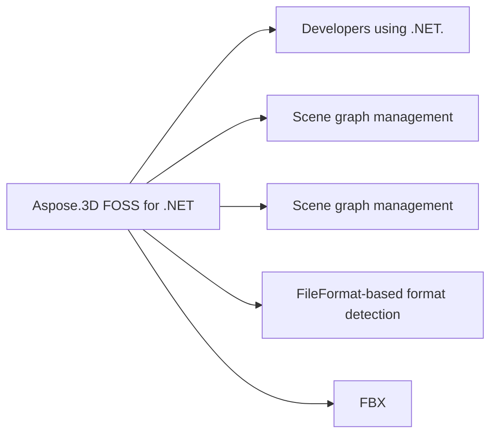

# Aspose.3D FOSS for .NET

Maintainer-authored product explanation.

## At a glance

- **For:** Developers using .NET.
- **Problem solved:** Scene graph management. FileFormat-based format detection. Scene save to file. Open file format loader.
- **Verified capabilities:** Scene graph management. FileFormat-based format detection. Scene save to file. Open file format loader. Node hierarchy management. Entity rendering support.
- **Verified formats:** FBX.
- **Runtime:** netcoreapp3.1

## In this README

- [Installation](#installation)
- [Quick Start](#quick-start)
- [Support](#support)

## Support

Open an issue with a reproducible case.

## Known limitations

- License management APIs not available
