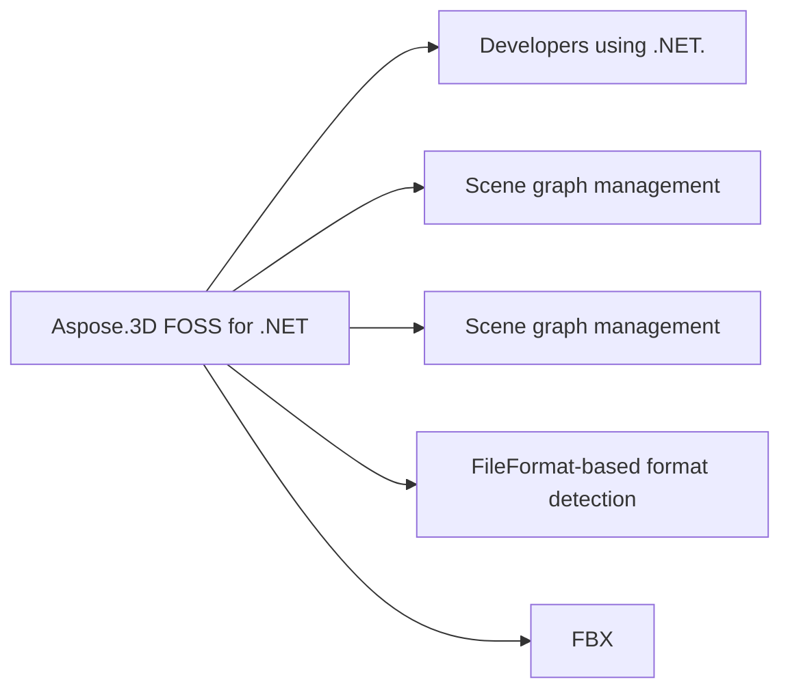

# Aspose.3D FOSS for .NET

[](https://www.nuget.org/packages/Aspose.3d.FOSS) [](https://www.nuget.org/packages/Aspose.3d.FOSS) [](LICENSE)

A free and open-source implementation of Aspose.3D for .NET, released under the permissive **MIT License**. It provides an API-compatible, open-source alternative for working with 3D scenes and models in .NET, supporting common formats such as OBJ, STL, FBX, and glTF.

## At a glance

- **For:** Developers using .NET.
- **Problem solved:** Scene graph management. FileFormat-based format detection. Scene save to file. Open file format loader.
- **Verified capabilities:** Scene graph management. FileFormat-based format detection. Scene save to file. Open file format loader. Node hierarchy management. Entity rendering support.
- **Verified formats:** FBX.
- **Runtime:** netcoreapp3.1
- **Current verified limitation:** License management APIs not available.



## In this README

- [About Aspose.3D FOSS](#about-aspose3d-foss)
- [Status](#status)
- [Limitations](#limitations)
- [Installation](#installation)
- [Quick Start](#quick-start)
- [Documentation & Resources](#documentation-resources)
- [Contributing](#contributing)
- [License](#license)
- [Resources](#resources)
- [Acknowledgments](#acknowledgments)

## About Aspose.3D FOSS

Aspose.3D FOSS is the free, open-source edition of Aspose.3D. It shares the same public API design as the commercial Aspose.3D On-Premise library, so you can:

- **Build and ship 3D applications at no cost** under a permissive MIT License.
- **Start free and grow without rewriting code** — code written against the FOSS edition works with the commercial edition.
- **Upgrade only when you need to** — when you require the broader feature set, higher performance, rendering, or proprietary format support of the [commercial On-Premise edition](https://products.aspose.com/3d/net/), simply swap in the commercial package, no API rewrites required.

The FOSS edition focuses on the most widely used open 3D formats. The commercial edition additionally covers proprietary and high-performance scenarios such as rendering, advanced mesh operations, and formats like USD, PDF, A3DW, JT, and more.

## Status

**This is a work-in-progress FOSS implementation.**

Currently implementing core functionality:
- Scene graph management
- Basic geometry primitives
- Common file format support (OBJ, STL, FBX, glTF)

## Limitations

Some advanced features are not available in this FOSS version:
- License/trial management APIs (not applicable to an open-source project)
- Rendering functionality
- Advanced mesh operations
- Proprietary formats (A3DW, PDF, USD, JT)

For the full feature set, consider the [commercial Aspose.3D for .NET On-Premise API](https://products.aspose.com/3d/net/).

## Repository-verified constraints

- License management APIs not available

## Installation

```bash
dotnet add package Aspose.3D.FOSS
```

## Quick Start

### Minimal verified example

```dotnet
using Aspose.ThreeD; var scene = new Scene(); scene.Save(System.IO.Path.GetTempFileName());
```

This exact example was compiled against the source build at revision `6a209e8fc3dfc305df39a417037e32a4d4c7b2be`.

## Documentation & Resources

See [AGENTS.md](AGENTS.md) for implementation status and development guidelines.

## Contributing

Contributions are welcome! Please feel free to submit issues and pull requests.

## License

This project is licensed under the **MIT License** — see the [LICENSE](LICENSE) file for details.

## Resources

### Aspose.3D FOSS — free & open source (aspose.org)
- [Aspose.3D FOSS for .NET](https://products.aspose.org/3d/net/) — product page
- [Aspose.3D FOSS family](https://products.aspose.org/3d/) — all platforms (Python, .NET, Java, TypeScript)
- [Aspose FOSS documentation](https://docs.aspose.org/) — guides for all open-source libraries
- [Aspose FOSS blog](https://blog.aspose.org/) — tutorials and announcements

### Aspose.3D — commercial On-Premise edition (aspose.com)
- [Aspose.3D for .NET](https://products.aspose.com/3d/net/) — full-featured commercial edition
- [Aspose.3D product family](https://products.aspose.com/3d) — overview
- [Developer documentation](https://docs.aspose.com/3d/net/) — API guides
- [API reference](https://reference.aspose.com/3d/net/) — complete API documentation
- [Download / free trial](https://releases.aspose.com/3d/net/) — get the commercial package

### Community & support
- [Aspose.3D support forum](https://forum.aspose.com/c/3d/19) — questions and help
- [Free online 3D apps](https://products.aspose.app/3d/) — convert and view 3D files in your browser

## Acknowledgments

This is a clean-room FOSS implementation designed for API compatibility with Aspose.3D for .NET.
