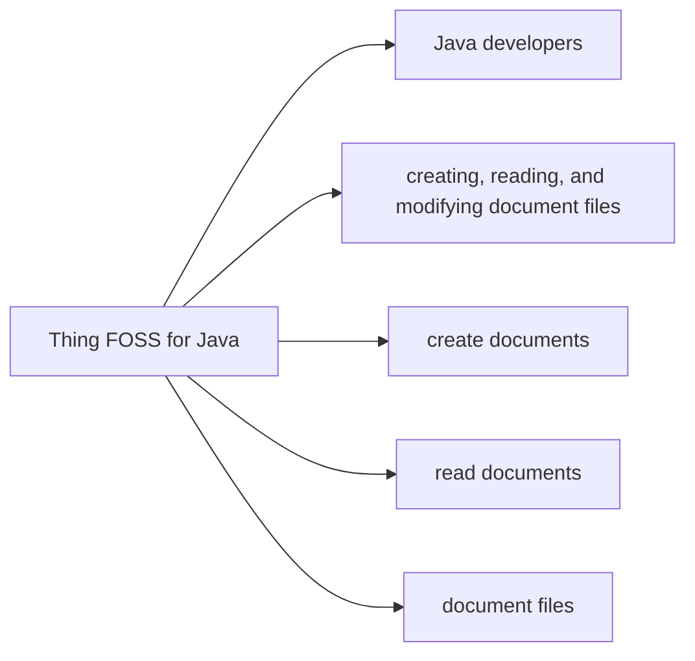

# Thing FOSS for Java

[](LICENSE)

Example FOSS for Java is a Java library for creating, reading, and modifying document files.

## At a glance

- **For:** Java developers
- **Problem solved:** creating, reading, and modifying document files



## In this README

- [Quick Start](#quick-start)

## Quick Start

### Minimal verified example

```java
public class Example {}
```

This exact example was compiled against the source build at revision `4f257135c7df46e4155a184ea638c71fa4d710aa`.


Existing local guidance.

## Known limitations

- Fixture scope is intentionally minimal
