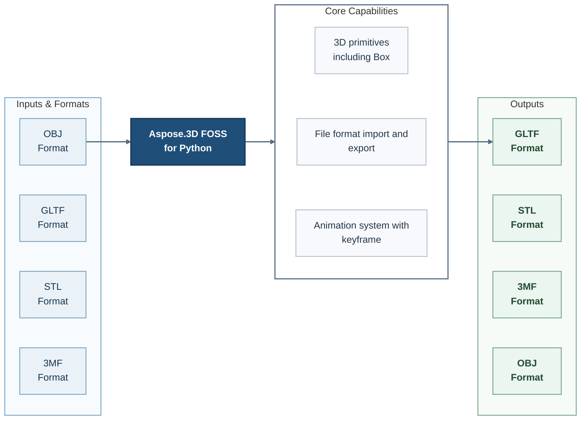

# Aspose.3D FOSS for Python

[](https://github.com/aspose-3d-foss/Aspose.3D-FOSS-for-Python/tree/ee05c1ba9153ef5916b7a108406c794f2e464d01)   [](LICENSE) [](https://github.com/aspose-3d-foss/Aspose.3D-FOSS-for-Python/graphs/contributors)


Aspose.3D FOSS for Python is a Python package that enables developers to create and manipulate 3D scenes using built-in primitives and industry-standard file formats.

Developers can construct 3D models using a rich set of primitives including Box, Cylinder, Sphere, Plane, Dish, Circle, Ellipse, and Frustum, all accessible through a unified Python API.

The library supports file format import and export for OBJ, GLTF, STL, and 3MF, enabling seamless integration into workflows that rely on these widely used 3D exchange formats.

An integrated animation system with keyframe support allows developers to define and playback time-based transformations for 3D objects within a scene.

## Navigation

- [At a Glance](#at-a-glance)
- [Key Capabilities](#key-capabilities)
- [Installation](#installation)
- [Quick Start](#quick-start)
- [Additional Examples](#additional-examples)
- [API Reference](#api-reference)
- [API Method Index](#api-method-index)
- [Documentation & Resources](#documentation-resources)
- [Scope and Limitations](#scope-and-limitations)
- [Development and Testing](#development-and-testing)
- [License](#license)

## At a Glance



## Key Capabilities

- **Create 3D primitives** - Create standard 3D primitives including Box, Cylinder, Sphere, Plane, Dish, Circle, Ellipse, and Frustum using the library's entity classes.
- **Import and export common 3D formats** - Import and export files in OBJ, GLTF, STL, and 3MF formats, supporting both scene loading and saving workflows.
- **Build animations with keyframes** - Construct animations using the keyframe-based animation system, supporting interpolation and timeline control.
- **Process additional formats via Aspose support** - Leverage Aspose-proven format support to import FBX and OBJ files, and export to GLTF, STL, 3MF, COLLADA, and PDF formats using dedicated save or import options.

- Export the same `Scene` model back out to OBJ, STL, GLTF/GLB, or 3MF with `Scene.save(...)`
  (COLLADA import is supported; COLLADA export is not currently reachable through the public
  API — see [Scope and limitations](#scope-and-limitations)).

## Installation

Install the aspose-3d-foss package from PyPI. The package version 26.1.0 has been verified by source build in an isolated Python environment, and its public imports and example execution were confirmed.

The package supports Python versions 3.7 through 3.12, as confirmed by isolated generation and validation of PKG-INFO metadata from setup.py.

The package is published under the name aspose-3d-foss in the root of the repository, with version 26.1.0 declared in setup.py.

Install the package directly from its source repository:

```bash
git clone https://github.com/aspose-3d-foss/Aspose.3D-FOSS-for-Python.git
cd Aspose.3D-FOSS-for-Python
git checkout --detach ee05c1ba9153ef5916b7a108406c794f2e464d01
python -m pip install .
```

Use source installation for the `aspose-3d-foss` distribution.

## Quick Start

The verified example demonstrates how to instantiate a new 3D scene using the public API. It imports the Scene class from aspose.threed and constructs an empty Scene instance, confirming that the installed package (aspose-3d-foss version 26.1.0) exposes the expected public surface and executes correctly on Python >=3.7.

The package exposes a comprehensive public API surface across nine top-level modules: aspose.threed, aspose.threed.animation, aspose.threed.deformers, aspose.threed.entities, aspose.threed.formats, aspose.threed.profiles, aspose.threed.render, aspose.threed.shading, and aspose.threed.utilities. This includes support for file format import and export for OBJ, GLTF, STL, and 3MF, as well as an animation system with keyframe support.

```python
from aspose.threed import Scene

scene = Scene()
```

## Additional Examples

Expand this section to view examples for exploring the scene and ObjLoadOptions APIs, assigning a PBR material and exporting to GLTF, import a COLLADA file, and converting a parametric primitive to a mesh, plus 2 more workflows.

<details>
<summary>View additional examples and results</summary>

### Explore the Scene and ObjLoadOptions APIs

```python
from aspose.threed import Scene
from aspose.threed.formats.obj import ObjLoadOptions

scene = Scene()
options = ObjLoadOptions()
options.enable_materials = True
scene.open("model.obj", options)

for node in scene.root_node.child_nodes:
    if node.entity:
        mesh = node.entity
        print(f"Mesh: {node.name}")
        print(f"  Vertices: {len(mesh.control_points)}")
        print(f"  Polygons: {mesh.polygon_count}")
```

### Explore the Scene and GltfSaveOptions APIs

```python
from aspose.threed import Scene
from aspose.threed.formats.gltf import GltfSaveOptions

scene = Scene()
scene.open("mesh.stl")

options = GltfSaveOptions()
options.binary_mode = True
scene.save("mesh.glb", options)
```

### Assign a PBR Material and Export to GLTF

```python
import io
import json
from aspose.threed import Scene, FileFormat
from aspose.threed.entities import Mesh
from aspose.threed.utilities import Vector3, Vector4
from aspose.threed.formats.gltf import GltfSaveOptions
from aspose.threed.shading import PbrMaterial

scene = Scene()
mesh = Mesh("TestMesh")
mesh.control_points.add(Vector4(0.0, 0.0, 0.0, 1.0))
mesh.control_points.add(Vector4(1.0, 0.0, 0.0, 1.0))
mesh.control_points.add(Vector4(0.0, 1.0, 0.0, 1.0))
mesh.create_polygon(0, 1, 2)

albedo = Vector3(0.8, 0.2, 0.3)
material = PbrMaterial("RedMaterial", albedo)
material.metallic_factor = 0.5
material.roughness_factor = 0.7

node = scene.root_node.create_child_node("TestNode")
node.entity = mesh
node.material = material

stream = io.BytesIO()

options = GltfSaveOptions(FileFormat.get_format_by_extension(".gltf"))
options.binary_mode = False
scene.save(stream, options)

stream.seek(0)
gltf_data = json.loads(stream.read().decode("utf-8"))
print(gltf_data["materials"][0]["pbrMetallicRoughness"])
```

### Import a COLLADA File

```python
from aspose.threed import Scene
from aspose.threed.formats.collada.ColladaLoadOptions import ColladaLoadOptions

scene = Scene()
options = ColladaLoadOptions()
scene.open("model.dae", options)

print(f"Child nodes: {len(scene.root_node.child_nodes)}")
```

### Convert a Parametric Primitive to a Mesh

```python
from aspose.threed.entities import Box

box = Box(10, 20, 30)
mesh = box.to_mesh()
print(f"Control points: {len(mesh.control_points)}")
```

### Build a Cube and Export It to 3MF

```python
import io
from aspose.threed import Scene
from aspose.threed.entities import Mesh
from aspose.threed.utilities import Vector4
from aspose.threed.formats import ThreeMfSaveOptions

scene = Scene()
mesh = Mesh("cube")
for point in [
    Vector4(0, 0, 0, 1), Vector4(1, 0, 0, 1), Vector4(1, 1, 0, 1), Vector4(0, 1, 0, 1),
    Vector4(0, 0, 1, 1), Vector4(1, 0, 1, 1), Vector4(1, 1, 1, 1), Vector4(0, 1, 1, 1),
]:
    mesh.control_points.add(point)

mesh.create_polygon(0, 1, 2)
mesh.create_polygon(0, 2, 3)
mesh.create_polygon(4, 7, 6)
mesh.create_polygon(4, 6, 5)
mesh.create_polygon(0, 4, 5)
mesh.create_polygon(0, 5, 1)
mesh.create_polygon(2, 6, 7)
mesh.create_polygon(2, 7, 3)
mesh.create_polygon(0, 3, 7)
mesh.create_polygon(0, 7, 4)
mesh.create_polygon(1, 5, 6)
mesh.create_polygon(1, 6, 2)

node = scene.root_node.create_child_node("cube")
node.entity = mesh

stream = io.BytesIO()
options = ThreeMfSaveOptions()
options.enable_compression = False
scene.save(stream, options)
```

</details>

## API Reference

The package documents 354 public types across 13 namespaces. Package namespaces include `aspose.threed`, `aspose.threed.animation`, `aspose.threed.deformers`, `aspose.threed.entities`, `aspose.threed.formats`, `aspose.threed.formats.gltf`, `aspose.threed.formats.obj`, `aspose.threed.formats.stl`, `aspose.threed.formats.threemf`, `aspose.threed.profiles`, `aspose.threed.render`, `aspose.threed.shading`, `aspose.threed.utilities`. See the complete API reference under Documentation & Resources for members, signatures, and inherited APIs.

<details>
<summary>View public API by namespace</summary>

### Aspose.3D Namespace (`aspose.threed`)

| Type | Description |
| --- | --- |
| `threed.A3DObject.A3DObject(name=None)` | Represents an A3 D Object in the public threed API for Aspose.3D. Supports finding property, retrieving property, and removing property. Inherits from `INamedObject`. |
| `threed.animation.AnimationChannel.AnimationChannel(name=None)` | Represents an Animation Channel in the public threed API for Aspose.3D. Supports finding property, retrieving property, and removing property. Inherits from `KeyframeSequence`. |
| `threed.animation.AnimationClip.AnimationClip(name=None)` | Represents an Animation Clip in the public threed API for Aspose.3D. Supports creating animation node, finding property, and retrieving property. Inherits from `SceneObject`. |
| `threed.animation.AnimationNode.AnimationNode(name=None)` | Represents an Animation Node in the public threed API for Aspose.3D. Supports creating bind point, finding bind point, and retrieving bind point. Inherits from `A3DObject`. |
| `threed.utilities.ArrayList.ArrayListAdapter(data=None)` | Represents an Array List Adapter in the public threed API for Aspose.3D. Supports adding ranges, appending content, and clearing content. Inherits from `Generic[T]`. |
| `threed.AssetInfo.AssetInfo(name=None)` | Represents an Asset Info in the public threed API for Aspose.3D. Supports finding property, retrieving property, and removing property. Inherits from `A3DObject`. |
| `Axis` | Represents an Axis in the public threed API for Aspose.3D. |
| `threed.AxisSystem.AxisSystem(*args)` | Represents an Axis System in the public threed API for Aspose.3D. |
| `threed.animation.BindPoint.BindPoint(scene, prop)` | Represents a Bind Point in the public threed API for Aspose.3D. Supports adding channels, binding keyframe sequence, and channelsing count. Inherits from `A3DObject`. |
| `threed.BonePose.BonePose()` | Represents a Bone Pose in the public threed API for Aspose.3D. Supports finding property, retrieving property, and removing property. Inherits from `A3DObject`. |
| `threed.utilities.BoundingBox2D.BoundingBox2D(minimum=None, maximum=None)` | Represents a Bounding Box2 D in the public threed API for Aspose.3D. |
| `BoundingBoxExtent` | Represents a Bounding Box Extent in the public threed API for Aspose.3D. |
| `threed.entities.Box.Box(name=None, length=1.0, width=1.0, height=1.0, length_segments=1, width_segments=1, height_segments=1)` | Represents a Box in the public threed API for Aspose.3D. Supports converting content to mesh, adding elements, and creating element. Inherits from `Primitive`. |
| `threed.entities.Camera.Camera(name=None, projection_type=None)` | Represents a Camera in the public threed API for Aspose.3D. Supports finding property, retrieving bounding box, and retrieving property. Inherits from `Entity`. |
| `threed.entities.Circle.Circle(name=None, radius=1.0, segments=16, theta_start=0.0, theta_length=math.pi * 2)` | Represents a Circle in the public threed API for Aspose.3D. Supports converting content to mesh, adding elements, and creating element. Inherits from `Primitive`. |
| `ComposeOrder` | Represents a Compose Order in the public threed API for Aspose.3D. |
| `CoordinateSystem` | Represents a Coordinate System in the public threed API for Aspose.3D. |
| `threed.entities.Curve.Curve(name=None)` | Represents a Curve in the public threed API for Aspose.3D. Supports finding property, retrieving property, and removing property. Inherits from `Entity`. |
| `threed.CustomObject.CustomObject(name=None)` | Represents a Custom Object in the public threed API for Aspose.3D. Supports finding property, retrieving property, and removing property. Inherits from `A3DObject`. |
| `threed.entities.Cylinder.Cylinder(name=None, radius_top=1.0, radius_bottom=1.0, height=1.0, radial_segments=32, height_segments=1, open_ended=False, theta_start=0.0, theta_length=math.pi * 2)` | Represents a Cylinder in the public threed API for Aspose.3D. Supports converting content to mesh, adding elements, and creating element. Inherits from `Primitive`. |
| `threed.entities.Dish.Dish(name=None, radius=10.0, height=5.0, width_segments=32, height_segments=16)` | Represents a Dish in the public threed API for Aspose.3D. Supports retrieving bounding box, converting content to mesh, and adding elements. Inherits from `Primitive`. |
| `threed.entities.Ellipse.Ellipse(name=None, radius_x=1.0, radius_y=1.0, segments=16, theta_start=0.0, theta_length=math.pi * 2)` | Represents an Ellipse in the public threed API for Aspose.3D. Supports converting content to mesh, adding elements, and creating element. Inherits from `Primitive`. |
| `threed.Entity.Entity(name=None)` | Represents an Entity in the public threed API for Aspose.3D. Supports finding property, retrieving property, and removing property. Inherits from `SceneObject`. |
| `threed.ExportException.ExportException(msg)` | Signals an export condition; derives from `Exception`. |
| `threed.animation.Extrapolation.Extrapolation()` | Represents an Extrapolation in the public threed API for Aspose.3D. |
| `ExtrapolationType` | Enumerates extrapolation type values. |
| `threed.utilities.FMatrix4.FMatrix4(m00=0.0, m01=0.0, m02=0.0, m03=0.0, m10=0.0, m11=0.0, m12=0.0, m13=0.0, m20=0.0, m21=0.0, m22=0.0, m23=0.0, m30=0.0, m31=0.0, m32=0.0, m33=0.0)` | Represents an F Matrix4 in the public threed API for Aspose.3D. |
| `threed.FileContentType.FileContentType(value=None, name=None)` | Represents a File Content Type in the public threed API for Aspose.3D. |
| `threed.FileFormat.FileFormat()` | Represents a File Format in the public threed API for Aspose.3D. Supports creating load options, creating save options, and detecting changes. |
| `threed.FileFormatType.FileFormatType(extension=None)` | Represents a File Format Type in the public threed API for Aspose.3D. |
| `threed.entities.Frustum.Frustum(name=None, radius_top=1.0, radius_bottom=1.0, height=1.0, radial_segments=32, height_segments=1, theta_start=0.0, theta_length=math.pi * 2)` | Represents a Frustum in the public threed API for Aspose.3D. Supports converting content to mesh, adding elements, and creating element. Inherits from `Primitive`. |
| `threed.entities.Geometry.Geometry(name=None)` | Represents a Geometry in the public threed API for Aspose.3D. Supports adding elements, creating element, and creating element uv. Inherits from `Entity`. |
| `threed.GlobalTransform.GlobalTransform(matrix)` | Represents a Global Transform in the public threed API for Aspose.3D. |
| `threed.Group.Group(name)` | Represents a Group in the public threed API for Aspose.3D. Supports finding property, retrieving property, and removing property. Inherits from `A3DObject`. |
| `INamedObject` | Represents an I Named Object in the public threed API for Aspose.3D. |
| `IOExtension` | Represents an IO Extension in the public threed API for Aspose.3D. Supports writing output. |
| `threed.ImageRenderOptions.ImageRenderOptions()` | Configures Image Render operations through the Aspose.3D API. Supports finding property, retrieving property, and removing property. Inherits from `A3DObject`. |
| `threed.ImportException.ImportException(msg)` | Signals an import condition; derives from `Exception`. |
| `Interpolation` | Enumerates interpolation values. |
| `threed.animation.KeyFrame.KeyFrame(curve, time)` | Represents a Key Frame in the public threed API for Aspose.3D. |
| `threed.animation.KeyframeSequence.KeyframeSequence(name=None)` | Represents a Keyframe Sequence in the public threed API for Aspose.3D. Supports finding property, retrieving property, and removing property. Inherits from `A3DObject`. |
| `threed.entities.Light.Light(name=None, light_type=None)` | Represents a Light in the public threed API for Aspose.3D. Supports finding property, retrieving bounding box, and retrieving property. Inherits from `Camera`. |
| `threed.entities.LinearExtrusion.LinearExtrusion(name=None, shape=None, height=1.0)` | Represents a Linear Extrusion in the public threed API for Aspose.3D. Supports finding property, retrieving property, and removing property. Inherits from `Entity`. |
| `MathUtils` | Represents a Math Utils in the public threed API for Aspose.3D. |
| `threed.entities.Mesh.Mesh(name=None, height_map=None, transform=None, tri_mesh=None)` | Represents a Mesh in the public threed API for Aspose.3D. Supports creating polygon, retrieving bounding box, and retrieving polygon size. Inherits from `Geometry`. |
| `threed.Node.Node(name=None, entity=None)` | Represents a Node in the public threed API for Aspose.3D. Supports adding child nodes, adding entities, and creating child node. Inherits from `SceneObject`. |
| `threed.utilities.ParseException.ParseException(msg)` | Signals a parse condition; derives from `Exception`. |
| `threed.entities.Plane.Plane(name=None, length=1.0, width=1.0, length_segments=1, width_segments=1)` | Represents a Plane in the public threed API for Aspose.3D. Supports converting content to mesh, adding elements, and creating element. Inherits from `Primitive`. |
| `threed.entities.PolygonBuilder.PolygonBuilder(mesh)` | Builds Polygon through the Aspose.3D API. Supports adding vertexs. |
| `threed.Pose.Pose(name=None)` | Represents a Pose in the public threed API for Aspose.3D. Supports adding bone poses, finding property, and retrieving property. Inherits from `A3DObject`, `INamedObject`. |
| `PoseType` | Enumerates pose type values. |
| `threed.entities.Primitive.Primitive(name=None)` | Represents a Primitive in the public threed API for Aspose.3D. Supports adding elements, creating element, and creating element uv. Inherits from `Geometry`. |
| `threed.Property.Property(name, value=None)` | Represents a Property in the public threed API for Aspose.3D. Supports retrieving bind point, retrieving extra, and retrieving keyframe sequence. |
| `threed.PropertyCollection.PropertyCollection()` | Represents a Property Collection in the public threed API for Aspose.3D. Supports finding property and removing property. |
| `PropertyFlags` | Represents a Property Flags in the public threed API for Aspose.3D. |
| `threed.utilities.Rect.Rect(x=0, y=0, width=0, height=0)` | Represents a Rect in the public threed API for Aspose.3D. |
| `threed.utilities.RelativeRectangle.RelativeRectangle(left=0, top=0, width=0, height=0)` | Represents a Relative Rectangle in the public threed API for Aspose.3D. Supports converting content to absolute. |
| `RotationOrder` | Represents a Rotation Order in the public threed API for Aspose.3D. |
| `threed.Scene.Scene(entity=None, parent_scene=None, name=None)` | Represents a Scene in the public threed API for Aspose.3D. Supports clearing content, creating animation clip, and loading content from file. Inherits from `SceneObject`. |
| `threed.SceneObject.SceneObject(name=None)` | Represents a Scene Object in the public threed API for Aspose.3D. Supports finding property, retrieving property, and removing property. Inherits from `A3DObject`. |
| `threed.utilities.SemanticAttribute.SemanticAttribute(semantic, alias=None)` | Represents a Semantic Attribute in the public threed API for Aspose.3D. |
| `threed.entities.Sphere.Sphere(name=None, radius=1.0, width_segments=16, height_segments=16, phi_start=0.0, phi_length=math.pi * 2, theta_start=0.0, theta_length=math.pi * 2)` | Represents a Sphere in the public threed API for Aspose.3D. Supports converting content to mesh, adding elements, and creating element. Inherits from `Primitive`. |
| `StepMode` | Enumerates step mode values. |
| `threed.Transform.Transform(name=None)` | Represents a Transform in the public threed API for Aspose.3D. Supports setting euler angles, setting geometric rotation, and setting geometric scaling. Inherits from `A3DObject`. |
| `threed.utilities.TransformBuilder.TransformBuilder(initial=None, order=None)` | Builds Transform through the Aspose.3D API. |
| `threed.TrialException.TrialException(msg=None)` | Signals a trial condition; derives from `Exception`. |
| `Vertex` | Represents a Vertex in the public threed API for Aspose.3D. |
| `threed.utilities.VertexDeclaration.VertexDeclaration()` | Represents a Vertex Declaration in the public threed API for Aspose.3D. |
| `VertexField` | Represents a Vertex Field in the public threed API for Aspose.3D. |
| `VertexFieldDataType` | Represents a Vertex Field Data Type in the public threed API for Aspose.3D. |
| `VertexFieldSemantic` | Represents a Vertex Field Semantic in the public threed API for Aspose.3D. |
| `WeightedMode` | Enumerates weighted mode values. |

### Aspose.3D.Animation Namespace (`aspose.threed.animation`)

| Type | Description |
| --- | --- |
| `threed.animation.AnimationChannel.AnimationChannel(name=None)` | The `aspose.threed.animation` namespace re-exports `AnimationChannel` from the primary `aspose.threed` namespace. |
| `threed.animation.AnimationClip.AnimationClip(name=None)` | The `aspose.threed.animation` namespace re-exports `AnimationClip` from the primary `aspose.threed` namespace. |
| `threed.animation.AnimationNode.AnimationNode(name=None)` | The `aspose.threed.animation` namespace re-exports `AnimationNode` from the primary `aspose.threed` namespace. |
| `threed.animation.BindPoint.BindPoint(scene, prop)` | The `aspose.threed.animation` namespace re-exports `BindPoint` from the primary `aspose.threed` namespace. |
| `threed.animation.Extrapolation.Extrapolation()` | The `aspose.threed.animation` namespace re-exports `Extrapolation` from the primary `aspose.threed` namespace. |
| `ExtrapolationType` | The `aspose.threed.animation` namespace re-exports `ExtrapolationType` from the primary `aspose.threed` namespace. |
| `Interpolation` | The `aspose.threed.animation` namespace re-exports `Interpolation` from the primary `aspose.threed` namespace. |
| `threed.animation.KeyFrame.KeyFrame(curve, time)` | The `aspose.threed.animation` namespace re-exports `KeyFrame` from the primary `aspose.threed` namespace. |
| `threed.animation.KeyframeSequence.KeyframeSequence(name=None)` | The `aspose.threed.animation` namespace re-exports `KeyframeSequence` from the primary `aspose.threed` namespace. |
| `StepMode` | The `aspose.threed.animation` namespace re-exports `StepMode` from the primary `aspose.threed` namespace. |
| `WeightedMode` | The `aspose.threed.animation` namespace re-exports `WeightedMode` from the primary `aspose.threed` namespace. |

### Aspose.3D.Deformers Namespace (`aspose.threed.deformers`)

| Type | Description |
| --- | --- |
| `threed.deformers.Bone.Bone(name=None)` | Represents a Bone in the public deformers API for Aspose.3D. Supports retrieving weight, setting weight, and finding property. Inherits from `A3DObject`. |
| `BoneLinkMode` | Represents a Bone Link Mode in the public deformers API for Aspose.3D. |
| `threed.deformers.Deformer.Deformer(name=None)` | Represents a Deformer in the public deformers API for Aspose.3D. Supports finding property, retrieving property, and removing property. Inherits from `A3DObject`. |
| `threed.deformers.MorphTargetChannel.MorphTargetChannel(name=None)` | Represents a Morph Target Channel in the public deformers API for Aspose.3D. Supports retrieving weight, setting weight, and finding property. Inherits from `A3DObject`. |
| `threed.deformers.MorphTargetDeformer.MorphTargetDeformer(name=None)` | Represents a Morph Target Deformer in the public deformers API for Aspose.3D. Supports finding property, retrieving property, and removing property. Inherits from `Deformer`. |
| `threed.deformers.SkinDeformer.SkinDeformer(name=None)` | Represents a Skin Deformer in the public deformers API for Aspose.3D. Supports finding property, retrieving property, and removing property. Inherits from `Deformer`. |

### Aspose.3D.Entities Namespace (`aspose.threed.entities`)

| Type | Description |
| --- | --- |
| `threed.entities.ApertureMode.ApertureMode(name=None)` | Represents an Aperture Mode in the public entities API for Aspose.3D. |
| `threed.entities.BooleanOperand.BooleanOperand(operand=None)` | Represents a Boolean Operand in the public entities API for Aspose.3D. |
| `BooleanOperation` | Represents a Boolean Operation in the public entities API for Aspose.3D. |
| `threed.entities.BooleanOperator.BooleanOperator(operation=None, first=None, second=None)` | Represents a Boolean Operator in the public entities API for Aspose.3D. Supports finding property, retrieving property, and removing property. Inherits from `Entity`. |
| `threed.entities.Box.Box(name=None, length=1.0, width=1.0, height=1.0, length_segments=1, width_segments=1, height_segments=1)` | The `aspose.threed.entities` namespace re-exports `Box` from the primary `aspose.threed` namespace. |
| `threed.entities.Camera.Camera(name=None, projection_type=None)` | The `aspose.threed.entities` namespace re-exports `Camera` from the primary `aspose.threed` namespace. |
| `threed.entities.Circle.Circle(name=None, radius=1.0, segments=16, theta_start=0.0, theta_length=math.pi * 2)` | The `aspose.threed.entities` namespace re-exports `Circle` from the primary `aspose.threed` namespace. |
| `threed.entities.CompositeCurve.CompositeCurve()` | Represents a Composite Curve in the public entities API for Aspose.3D. Supports finding property, retrieving property, and removing property. Inherits from `Curve`. |
| `threed.entities.Curve.Curve(name=None)` | The `aspose.threed.entities` namespace re-exports `Curve` from the primary `aspose.threed` namespace. |
| `CurveDimension` | Represents a Curve Dimension in the public entities API for Aspose.3D. |
| `threed.entities.Cylinder.Cylinder(name=None, radius_top=1.0, radius_bottom=1.0, height=1.0, radial_segments=32, height_segments=1, open_ended=False, theta_start=0.0, theta_length=math.pi * 2)` | The `aspose.threed.entities` namespace re-exports `Cylinder` from the primary `aspose.threed` namespace. |
| `threed.entities.Dish.Dish(name=None, radius=10.0, height=5.0, width_segments=32, height_segments=16)` | The `aspose.threed.entities` namespace re-exports `Dish` from the primary `aspose.threed` namespace. |
| `threed.entities.Ellipse.Ellipse(name=None, radius_x=1.0, radius_y=1.0, segments=16, theta_start=0.0, theta_length=math.pi * 2)` | The `aspose.threed.entities` namespace re-exports `Ellipse` from the primary `aspose.threed` namespace. |
| `threed.entities.EndPoint.EndPoint(*args)` | Represents an End Point in the public entities API for Aspose.3D. |
| `threed.entities.Frustum.Frustum(name=None, radius_top=1.0, radius_bottom=1.0, height=1.0, radial_segments=32, height_segments=1, theta_start=0.0, theta_length=math.pi * 2)` | The `aspose.threed.entities` namespace re-exports `Frustum` from the primary `aspose.threed` namespace. |
| `threed.entities.Geometry.Geometry(name=None)` | The `aspose.threed.entities` namespace re-exports `Geometry` from the primary `aspose.threed` namespace. |
| `threed.entities.HalfSpace.HalfSpace(*args)` | Represents a Half Space in the public entities API for Aspose.3D. |
| `IIndexedVertexElement` | Represents an I Indexed Vertex Element in the public entities API for Aspose.3D. |
| `IMeshConvertible` | Represents an I Mesh Convertible in the public entities API for Aspose.3D. |
| `threed.Entity.Entity(name=None)` | Represents an I Orientable in the public entities API for Aspose.3D. Supports finding property, retrieving property, and removing property. Inherits from `Entity`. |
| `threed.entities.Light.Light(name=None, light_type=None)` | The `aspose.threed.entities` namespace re-exports `Light` from the primary `aspose.threed` namespace. |
| `threed.entities.LightType.LightType(name=None)` | Represents a Light Type in the public entities API for Aspose.3D. |
| `threed.entities.Line.Line(name=None)` | Represents a Line in the public entities API for Aspose.3D. Supports finding property, retrieving property, and removing property. Inherits from `Curve`. |
| `threed.entities.LinearExtrusion.LinearExtrusion(name=None, shape=None, height=1.0)` | The `aspose.threed.entities` namespace re-exports `LinearExtrusion` from the primary `aspose.threed` namespace. |
| `MappingMode` | Represents a Mapping Mode in the public entities API for Aspose.3D. |
| `threed.entities.Mesh.Mesh(name=None, height_map=None, transform=None, tri_mesh=None)` | The `aspose.threed.entities` namespace re-exports `Mesh` from the primary `aspose.threed` namespace. |
| `threed.entities.NurbsCurve.NurbsCurve(name=None)` | Represents a Nurbs Curve in the public entities API for Aspose.3D. Supports finding property, retrieving property, and removing property. Inherits from `Curve`. |
| `threed.entities.NurbsDirection.NurbsDirection()` | Represents a Nurbs Direction in the public entities API for Aspose.3D. |
| `threed.entities.NurbsSurface.NurbsSurface(name=None)` | Represents a Nurbs Surface in the public entities API for Aspose.3D. Supports adding elements, creating element, and creating element uv. Inherits from `Geometry`. |
| `NurbsType` | Represents a Nurbs Type in the public entities API for Aspose.3D. |
| `threed.entities.Patch.Patch(name=None)` | Represents a Patch in the public entities API for Aspose.3D. Supports adding elements, creating element, and creating element uv. Inherits from `Geometry`. |
| `threed.entities.PatchDirection.PatchDirection()` | Represents a Patch Direction in the public entities API for Aspose.3D. |
| `PatchDirectionType` | Represents a Patch Direction Type in the public entities API for Aspose.3D. |
| `threed.entities.Plane.Plane(name=None, length=1.0, width=1.0, length_segments=1, width_segments=1)` | The `aspose.threed.entities` namespace re-exports `Plane` from the primary `aspose.threed` namespace. |
| `threed.entities.PointCloud.PointCloud(name=None)` | Represents a Point Cloud in the public entities API for Aspose.3D. Supports retrieving entity renderer key. |
| `threed.entities.PolygonBuilder.PolygonBuilder(mesh)` | The `aspose.threed.entities` namespace re-exports `PolygonBuilder` from the primary `aspose.threed` namespace. |
| `PolygonModifier` | Represents a Polygon Modifier in the public entities API for Aspose.3D. |
| `threed.entities.Primitive.Primitive(name=None)` | The `aspose.threed.entities` namespace re-exports `Primitive` from the primary `aspose.threed` namespace. |
| `threed.entities.ProjectionType.ProjectionType(name=None)` | Represents a Projection Type in the public entities API for Aspose.3D. |
| `threed.entities.Pyramid.Pyramid(name=None, xbottom=10.0, ybottom=10.0, xtop=5.0, ytop=5.0, height=5.0)` | Represents a Pyramid in the public entities API for Aspose.3D. Supports converting content to mesh, adding elements, and creating element. Inherits from `Primitive`. |
| `threed.entities.RectangularTorus.RectangularTorus(name=None, inner_radius=17.0, outer_radius=20.0, height=20.0, arc=math.pi, angle_start=0.0, radial_segments=10)` | Represents a Rectangular Torus in the public entities API for Aspose.3D. Supports converting content to mesh, adding elements, and creating element. Inherits from `Primitive`. |
| `ReferenceMode` | Represents a Reference Mode in the public entities API for Aspose.3D. |
| `threed.entities.RevolvedAreaSolid.RevolvedAreaSolid(name=None)` | Represents a Revolved Area Solid in the public entities API for Aspose.3D. Supports finding property, retrieving property, and removing property. Inherits from `Curve`. |
| `threed.entities.RotationMode.RotationMode(name=None)` | Represents a Rotation Mode in the public entities API for Aspose.3D. |
| `threed.entities.Shape.Shape(name=None)` | Represents a Shape in the public entities API for Aspose.3D. Supports finding property, retrieving property, and removing property. Inherits from `Curve`. |
| `threed.entities.Skeleton.Skeleton(name=None)` | Represents a Skeleton in the public entities API for Aspose.3D. Supports finding property, retrieving property, and removing property. Inherits from `Entity`. |
| `SkeletonType` | Represents a Skeleton Type in the public entities API for Aspose.3D. |
| `threed.entities.Sphere.Sphere(name=None, radius=1.0, width_segments=16, height_segments=16, phi_start=0.0, phi_length=math.pi * 2, theta_start=0.0, theta_length=math.pi * 2)` | The `aspose.threed.entities` namespace re-exports `Sphere` from the primary `aspose.threed` namespace. |
| `threed.entities.SplitMeshPolicy.SplitMeshPolicy(name=None)` | Represents a Split Mesh Policy in the public entities API for Aspose.3D. |
| `threed.entities.SweptAreaSolid.SweptAreaSolid(name=None)` | Represents a Swept Area Solid in the public entities API for Aspose.3D. Supports finding property, retrieving property, and removing property. Inherits from `Curve`. |
| `TextureMapping` | Represents a Texture Mapping in the public entities API for Aspose.3D. |
| `threed.entities.Torus.Torus(name=None, radius=1.0, tube=0.25, radial_segments=32, tubular_segments=16, arc=math.pi * 2)` | Represents a Torus in the public entities API for Aspose.3D. Supports converting content to mesh, adding elements, and creating element. Inherits from `Primitive`. |
| `threed.entities.TransformedCurve.TransformedCurve(name=None)` | Represents a Transformed Curve in the public entities API for Aspose.3D. Supports finding property, retrieving property, and removing property. Inherits from `Curve`. |
| `threed.entities.TriMesh.TriMesh(name=None)` | Represents a Tri Mesh in the public entities API for Aspose.3D. Supports finding property, retrieving property, and removing property. Inherits from `Entity`. |
| `threed.entities.TrimmedCurve.TrimmedCurve(name=None)` | Represents a Trimmed Curve in the public entities API for Aspose.3D. Supports finding property, retrieving property, and removing property. Inherits from `Curve`. |
| `threed.entities.VertexElement.VertexElement(element_type, name='', mapping_mode=None, reference_mode=None)` | Represents a Vertex Element in the public entities API for Aspose.3D. Supports clearing content and setting indices. |
| `threed.entities.VertexElementBinormal.VertexElementBinormal(name='', mapping_mode=None, reference_mode=None)` | Represents a Vertex Element Binormal in the public entities API for Aspose.3D. Supports clearing content, copying the current value to a destination, and setting data. Inherits from `VertexElementFVector`. |
| `threed.entities.VertexElementDoublesTemplate.VertexElementDoublesTemplate(element_type=None, name='', mapping_mode=None, reference_mode=None)` | Represents a Vertex Element Doubles Template in the public entities API for Aspose.3D. Supports clearing content, copying the current value to a destination, and setting data. Inherits from `VertexElement`. |
| `threed.entities.VertexElement.VertexElement(element_type, name='', mapping_mode=None, reference_mode=None)` | Represents a Vertex Element Edge Crease in the public entities API for Aspose.3D. Inherits from `VertexElement`. |
| `threed.entities.VertexElementFVector.VertexElementFVector(element_type, name='', mapping_mode=None, reference_mode=None)` | Represents a Vertex Element F Vector in the public entities API for Aspose.3D. Supports clearing content, copying the current value to a destination, and setting data. Inherits from `VertexElement`. |
| `threed.entities.VertexElement.VertexElement(element_type, name='', mapping_mode=None, reference_mode=None)` | Represents a Vertex Element Hole in the public entities API for Aspose.3D. Inherits from `VertexElement`. |
| `threed.entities.VertexElementIntsTemplate.VertexElementIntsTemplate(element_type=None, name='', mapping_mode=None, reference_mode=None)` | Represents a Vertex Element Ints Template in the public entities API for Aspose.3D. Supports clearing content, copying the current value to a destination, and setting data. Inherits from `VertexElement`. |
| `threed.entities.VertexElement.VertexElement(element_type, name='', mapping_mode=None, reference_mode=None)` | Represents a Vertex Element Material in the public entities API for Aspose.3D. Inherits from `VertexElement`. |
| `threed.entities.VertexElementNormal.VertexElementNormal(name='', mapping_mode=None, reference_mode=None)` | Represents a Vertex Element Normal in the public entities API for Aspose.3D. Supports clearing content, copying the current value to a destination, and setting data. Inherits from `VertexElementFVector`. |
| `threed.entities.VertexElement.VertexElement(element_type, name='', mapping_mode=None, reference_mode=None)` | Represents a Vertex Element Polygon Group in the public entities API for Aspose.3D. Inherits from `VertexElement`. |
| `threed.entities.VertexElementSmoothingGroup.VertexElementSmoothingGroup(name='', mapping_mode=None, reference_mode=None)` | Represents a Vertex Element Smoothing Group in the public entities API for Aspose.3D. Supports clearing content, copying the current value to a destination, and setting data. Inherits from `VertexElementIntsTemplate`. |
| `threed.entities.VertexElement.VertexElement(element_type, name='', mapping_mode=None, reference_mode=None)` | Represents a Vertex Element Specular in the public entities API for Aspose.3D. Inherits from `VertexElement`. |
| `threed.entities.VertexElementTangent.VertexElementTangent(name='', mapping_mode=None, reference_mode=None)` | Represents a Vertex Element Tangent in the public entities API for Aspose.3D. Supports clearing content, copying the current value to a destination, and setting data. Inherits from `VertexElementFVector`. |
| `threed.entities.VertexElementTemplate.VertexElementTemplate(mapping_mode=None, reference_mode=None)` | Represents a Vertex Element Template in the public entities API for Aspose.3D. Supports clearing content, copying the current value to a destination, and setting data. Inherits from `VertexElement`, `Generic[T]`. |
| `VertexElementType` | Represents a Vertex Element Type in the public entities API for Aspose.3D. |
| `threed.entities.VertexElementUV.VertexElementUV(texture_mapping=None, name='', mapping_mode=None, reference_mode=None)` | Represents a Vertex Element UV in the public entities API for Aspose.3D. Supports adding datas, clearing content, and copying the current value to a destination. Inherits from `VertexElementFVector`. |
| `threed.entities.VertexElement.VertexElement(element_type, name='', mapping_mode=None, reference_mode=None)` | Represents a Vertex Element User Data in the public entities API for Aspose.3D. Inherits from `VertexElement`. |
| `threed.entities.VertexElement.VertexElement(element_type, name='', mapping_mode=None, reference_mode=None)` | Represents a Vertex Element Vector4 in the public entities API for Aspose.3D. Inherits from `VertexElement`. |
| `threed.entities.VertexElementVertexColor.VertexElementVertexColor(name='', mapping_mode=None, reference_mode=None)` | Represents a Vertex Element Vertex Color in the public entities API for Aspose.3D. Supports clearing content, copying the current value to a destination, and setting data. Inherits from `VertexElementFVector`. |
| `threed.entities.VertexElement.VertexElement(element_type, name='', mapping_mode=None, reference_mode=None)` | Represents a Vertex Element Vertex Crease in the public entities API for Aspose.3D. Inherits from `VertexElement`. |
| `threed.entities.VertexElement.VertexElement(element_type, name='', mapping_mode=None, reference_mode=None)` | Represents a Vertex Element Visibility in the public entities API for Aspose.3D. Inherits from `VertexElement`. |
| `threed.entities.VertexElement.VertexElement(element_type, name='', mapping_mode=None, reference_mode=None)` | Represents a Vertex Element Weight in the public entities API for Aspose.3D. Inherits from `VertexElement`. |

### Aspose.3D.Formats Namespace (`aspose.threed.formats`)

| Type | Description |
| --- | --- |
| `A3dwSaveOptions` | Configures A3dw output through the Aspose.3D API. |
| `AmfSaveOptions` | Configures Amf output through the Aspose.3D API. |
| `threed.formats.collada.ColladaLoadOptions.ColladaLoadOptions()` | Configures COLLADA Load operations through the Aspose.3D API. Inherits from `LoadOptions`. |
| `threed.formats.collada.ColladaSaveOptions.ColladaSaveOptions()` | Configures COLLADA output through the Aspose.3D API. Inherits from `SaveOptions`. |
| `ColladaTransformStyle` | Represents a COLLADA Transform Style in the public formats API for Aspose.3D. |
| `Discreet3dsLoadOptions` | Configures Discreet3ds Load operations through the Aspose.3D API. |
| `Discreet3dsSaveOptions` | Configures Discreet3ds output through the Aspose.3D API. |
| `DracoCompressionLevel` | Represents a Draco Compression Level in the public formats API for Aspose.3D. |
| `DracoFormat` | Represents a Draco Format in the public formats API for Aspose.3D. |
| `DracoSaveOptions` | Configures Draco output through the Aspose.3D API. |
| `threed.formats.Exporter.Exporter()` | Represents an Exporter in the public formats API for Aspose.3D. |
| `threed.formats.fbx.FbxLoadOptions.FbxLoadOptions(format=None)` | Configures FBX Load operations through the Aspose.3D API. Inherits from `LoadOptions`. |
| `threed.formats.fbx.FbxSaveOptions.FbxSaveOptions(format=None)` | Configures FBX output through the Aspose.3D API. Inherits from `SaveOptions`. |
| `threed.formats.FormatDetector.FormatDetector()` | Represents a Format Detector in the public formats API for Aspose.3D. |
| `GltfEmbeddedImageFormat` | Represents a GLTF Embedded Image Format in the public formats API for Aspose.3D. |
| `threed.formats.gltf.GltfLoadOptions.GltfLoadOptions()` | Configures GLTF Load operations through the Aspose.3D API. Inherits from `LoadOptions`. |
| `threed.formats.gltf.GltfSaveOptions.GltfSaveOptions(file_format=None)` | Configures GLTF output through the Aspose.3D API. Inherits from `SaveOptions`. |
| `Html5SaveOptions` | Configures Html5 output through the Aspose.3D API. |
| `threed.formats.IOConfig.IOConfig()` | Represents an IO Config in the public formats API for Aspose.3D. |
| `threed.formats.IOService.IOService()` | Represents an IO Service in the public formats API for Aspose.3D. Supports creating exporter, creating importer, and detecting format. |
| `threed.formats.Importer.Importer()` | Represents an Importer in the public formats API for Aspose.3D. |
| `JtLoadOptions` | Configures Jt Load operations through the Aspose.3D API. |
| `threed.formats.LoadOptions.LoadOptions()` | Configures Load operations through the Aspose.3D API. Inherits from `IOConfig`. |
| `Microsoft3MFFormat` | Represents a Microsoft3 MF Format in the public formats API for Aspose.3D. |
| `Microsoft3MFSaveOptions` | Configures Microsoft3 MF output through the Aspose.3D API. |
| `threed.formats.obj.ObjLoadOptions.ObjLoadOptions()` | Configures OBJ Load operations through the Aspose.3D API. Inherits from `LoadOptions`. |
| `threed.formats.obj.ObjSaveOptions.ObjSaveOptions()` | Configures OBJ output through the Aspose.3D API. Inherits from `SaveOptions`. |
| `PdfFormat` | Represents a PDF Format in the public formats API for Aspose.3D. |
| `PdfLightingScheme` | Represents a PDF Lighting Scheme in the public formats API for Aspose.3D. |
| `PdfLoadOptions` | Configures PDF Load operations through the Aspose.3D API. |
| `PdfRenderMode` | Represents a PDF Render Mode in the public formats API for Aspose.3D. |
| `threed.formats.PdfSaveOptions.PdfSaveOptions()` | Configures PDF output through the Aspose.3D API. |
| `Plugin` | Represents a Plugin in the public formats API for Aspose.3D. Supports creating load options, creating save options, and retrieving exporter. Inherits from `ABC`. |
| `PlyFormat` | Represents a Ply Format in the public formats API for Aspose.3D. |
| `PlyLoadOptions` | Configures Ply Load operations through the Aspose.3D API. |
| `PlySaveOptions` | Configures Ply output through the Aspose.3D API. |
| `RvmFormat` | Represents a Rvm Format in the public formats API for Aspose.3D. |
| `RvmLoadOptions` | Configures Rvm Load operations through the Aspose.3D API. |
| `RvmSaveOptions` | Configures Rvm output through the Aspose.3D API. |
| `threed.formats.SaveOptions.SaveOptions()` | Configures 3D output through the Aspose.3D API. Inherits from `IOConfig`. |
| `threed.formats.stl.StlLoadOptions.StlLoadOptions()` | Configures STL Load operations through the Aspose.3D API. Inherits from `LoadOptions`. |
| `threed.formats.stl.StlSaveOptions.StlSaveOptions(file_format=None)` | Configures STL output through the Aspose.3D API. Inherits from `SaveOptions`. |
| `ThreeMfFormat` | Represents a Three Mf Format in the public formats API for Aspose.3D. Supports creating load options, creating save options, and retrieving object type. |
| `threed.formats.threemf.ThreeMfLoadOptions.ThreeMfLoadOptions()` | Configures Three Mf Load operations through the Aspose.3D API. Inherits from `LoadOptions`. |
| `threed.formats.threemf.ThreeMfSaveOptions.ThreeMfSaveOptions()` | Configures Three Mf output through the Aspose.3D API. Inherits from `SaveOptions`. |
| `UsdSaveOptions` | Configures Usd output through the Aspose.3D API. |

### Aspose.3D.Profiles Namespace (`aspose.threed.profiles`)

| Type | Description |
| --- | --- |
| `threed.profiles.ArbitraryProfile.ArbitraryProfile(name=None)` | Represents an Arbitrary Profile in the public profiles API for Aspose.3D. Supports adding holes, finding property, and retrieving entity renderer key. Inherits from `Profile`. |
| `threed.profiles.CShape.CShape(name=None)` | Represents a C Shape in the public profiles API for Aspose.3D. Supports retrieving extent, finding property, and retrieving entity renderer key. Inherits from `ParameterizedProfile`. |
| `threed.profiles.CenterLineProfile.CenterLineProfile(name=None, curve=None, thickness=1.0)` | Represents a Center Line Profile in the public profiles API for Aspose.3D. Supports finding property, retrieving entity renderer key, and retrieving property. Inherits from `Profile`. |
| `threed.profiles.CircleShape.CircleShape(name=None, radius=5.0)` | Represents a Circle Shape in the public profiles API for Aspose.3D. Supports retrieving extent, finding property, and retrieving entity renderer key. Inherits from `ParameterizedProfile`. |
| `threed.profiles.EllipseShape.EllipseShape(name=None, semi_axis1=5.0, semi_axis2=5.0)` | Represents an Ellipse Shape in the public profiles API for Aspose.3D. Supports retrieving extent, finding property, and retrieving entity renderer key. Inherits from `ParameterizedProfile`. |
| `threed.profiles.FontFile.FontFile(name=None)` | Represents a Font File in the public profiles API for Aspose.3D. Supports finding property, retrieving property, and removing property. Inherits from `A3DObject`. |
| `threed.profiles.HShape.HShape(name=None, width=10.0, depth=10.0, web_thickness=1.0, flange_thickness=1.0)` | Represents an H Shape in the public profiles API for Aspose.3D. Supports retrieving extent, finding property, and retrieving entity renderer key. Inherits from `ParameterizedProfile`. |
| `threed.profiles.HollowCircleShape.HollowCircleShape(name=None)` | Represents a Hollow Circle Shape in the public profiles API for Aspose.3D. Supports retrieving extent, finding property, and retrieving entity renderer key. Inherits from `CircleShape`. |
| `threed.profiles.HollowRectangleShape.HollowRectangleShape(name=None)` | Represents a Hollow Rectangle Shape in the public profiles API for Aspose.3D. Supports retrieving extent, finding property, and retrieving entity renderer key. Inherits from `RectangleShape`. |
| `threed.profiles.LShape.LShape(name=None)` | Represents an L Shape in the public profiles API for Aspose.3D. Supports retrieving extent, finding property, and retrieving entity renderer key. Inherits from `ParameterizedProfile`. |
| `threed.profiles.MirroredProfile.MirroredProfile(base_profile=None)` | Represents a Mirrored Profile in the public profiles API for Aspose.3D. Supports finding property, retrieving entity renderer key, and retrieving property. Inherits from `Profile`. |
| `threed.profiles.ParameterizedProfile.ParameterizedProfile(name=None)` | Represents a Parameterized Profile in the public profiles API for Aspose.3D. Supports retrieving extent, finding property, and retrieving entity renderer key. Inherits from `Profile`. |
| `threed.profiles.Profile.Profile(name=None)` | Represents a Profile in the public profiles API for Aspose.3D. Supports retrieving entity renderer key, finding property, and retrieving property. Inherits from `Entity`. |
| `threed.profiles.RectangleShape.RectangleShape(name=None, width=10.0, depth=10.0)` | Represents a Rectangle Shape in the public profiles API for Aspose.3D. Supports retrieving extent, finding property, and retrieving entity renderer key. Inherits from `ParameterizedProfile`. |
| `threed.profiles.TShape.TShape(name=None)` | Represents a T Shape in the public profiles API for Aspose.3D. Supports retrieving extent, finding property, and retrieving entity renderer key. Inherits from `ParameterizedProfile`. |
| `threed.profiles.Text.Text(name=None)` | Represents a Text in the public profiles API for Aspose.3D. Supports finding property, retrieving entity renderer key, and retrieving property. Inherits from `Profile`. |
| `threed.profiles.TrapeziumShape.TrapeziumShape(name=None)` | Represents a Trapezium Shape in the public profiles API for Aspose.3D. Supports retrieving extent, finding property, and retrieving entity renderer key. Inherits from `ParameterizedProfile`. |
| `threed.profiles.UShape.UShape(name=None)` | Represents an U Shape in the public profiles API for Aspose.3D. Supports retrieving extent, finding property, and retrieving entity renderer key. Inherits from `ParameterizedProfile`. |
| `threed.profiles.ZShape.ZShape(name=None)` | Represents a Z Shape in the public profiles API for Aspose.3D. Supports retrieving extent, finding property, and retrieving entity renderer key. Inherits from `ParameterizedProfile`. |

### Aspose.3D.Render Namespace (`aspose.threed.render`)

| Type | Description |
| --- | --- |
| `BlendFactor` | Represents a Blend Factor in the public render API for Aspose.3D. |
| `CompareFunction` | Represents a Compare Function in the public render API for Aspose.3D. |
| `CubeFace` | Represents a Cube Face in the public render API for Aspose.3D. |
| `CullFaceMode` | Represents a Cull Face Mode in the public render API for Aspose.3D. |
| `threed.render.DescriptorSetUpdater.DescriptorSetUpdater()` | Represents a Descriptor Set Updater in the public render API for Aspose.3D. |
| `DrawOperation` | Represents a Draw Operation in the public render API for Aspose.3D. |
| `DriverException` | Signals a driver condition; derives from `Exception`. |
| `threed.render.EntityRenderer.EntityRenderer()` | Renders Entity content through the Aspose.3D API. |
| `threed.render.EntityRendererFeatures.EntityRendererFeatures()` | Represents an Entity Renderer Features in the public render API for Aspose.3D. |
| `threed.render.EntityRendererKey.EntityRendererKey(name)` | Represents an Entity Renderer Key in the public render API for Aspose.3D. |
| `FrontFace` | Represents a Front Face in the public render API for Aspose.3D. |
| `threed.render.GLSLSource.GLSLSource(source)` | Represents a GLSL Source in the public render API for Aspose.3D. |
| `threed.render.IBuffer.IBuffer()` | Represents an I Buffer in the public render API for Aspose.3D. |
| `threed.render.ICommandList.ICommandList()` | Represents an I Command List in the public render API for Aspose.3D. |
| `threed.render.IDescriptorSet.IDescriptorSet()` | Represents an I Descriptor Set in the public render API for Aspose.3D. |
| `threed.render.IIndexBuffer.IIndexBuffer()` | Represents an I Index Buffer in the public render API for Aspose.3D. |
| `threed.render.IPipeline.IPipeline()` | Represents an I Pipeline in the public render API for Aspose.3D. |
| `threed.render.IRenderQueue.IRenderQueue()` | Represents an I Render Queue in the public render API for Aspose.3D. |
| `threed.render.IRenderTarget.IRenderTarget()` | Represents an I Render Target in the public render API for Aspose.3D. |
| `threed.render.IRenderTexture.IRenderTexture()` | Represents an I Render Texture in the public render API for Aspose.3D. |
| `threed.render.IRenderWindow.IRenderWindow()` | Represents an I Render Window in the public render API for Aspose.3D. |
| `threed.render.ITexture1D.ITexture1D()` | Represents an I Texture1 D in the public render API for Aspose.3D. |
| `threed.render.ITexture2D.ITexture2D()` | Represents an I Texture2 D in the public render API for Aspose.3D. |
| `threed.render.ITextureCodec.ITextureCodec()` | Represents an I Texture Codec in the public render API for Aspose.3D. |
| `threed.render.ITextureCubemap.ITextureCubemap()` | Represents an I Texture Cubemap in the public render API for Aspose.3D. |
| `threed.render.ITextureDecoder.ITextureDecoder()` | Represents an I Texture Decoder in the public render API for Aspose.3D. |
| `threed.render.ITextureEncoder.ITextureEncoder()` | Represents an I Texture Encoder in the public render API for Aspose.3D. |
| `threed.render.ITextureUnit.ITextureUnit()` | Represents an I Texture Unit in the public render API for Aspose.3D. |
| `threed.render.IVertexBuffer.IVertexBuffer()` | Represents an I Vertex Buffer in the public render API for Aspose.3D. |
| `IndexDataType` | Represents an Index Data Type in the public render API for Aspose.3D. |
| `InitializationException` | Signals an initialization condition; derives from `Exception`. |
| `PixelFormat` | Represents a Pixel Format in the public render API for Aspose.3D. |
| `PixelMapMode` | Represents a Pixel Map Mode in the public render API for Aspose.3D. |
| `threed.render.PixelMapping.PixelMapping()` | Represents a Pixel Mapping in the public render API for Aspose.3D. |
| `PolygonMode` | Represents a Polygon Mode in the public render API for Aspose.3D. |
| `threed.render.PostProcessing.PostProcessing()` | Represents a Post Processing in the public render API for Aspose.3D. |
| `threed.render.PresetShaders.PresetShaders()` | Represents a Preset Shaders in the public render API for Aspose.3D. |
| `threed.render.PushConstant.PushConstant()` | Represents a Push Constant in the public render API for Aspose.3D. |
| `threed.render.RenderFactory.RenderFactory()` | Represents a Render Factory in the public render API for Aspose.3D. |
| `threed.render.RenderParameters.RenderParameters()` | Represents a Render Parameters in the public render API for Aspose.3D. |
| `RenderQueueGroupId` | Represents a Render Queue Group Id in the public render API for Aspose.3D. |
| `threed.render.RenderResource.RenderResource()` | Stores Render resource data through the Aspose.3D API. |
| `threed.render.RenderStage.RenderStage()` | Represents a Render Stage in the public render API for Aspose.3D. |
| `threed.render.RenderState.RenderState()` | Stores Render state through the Aspose.3D API. |
| `threed.render.Renderer.Renderer()` | Renders 3D content through the Aspose.3D API. |
| `threed.render.RendererVariableManager.RendererVariableManager()` | Represents a Renderer Variable Manager in the public render API for Aspose.3D. |
| `threed.render.SPIRVSource.SPIRVSource()` | Represents an SPIRV Source in the public render API for Aspose.3D. |
| `ShaderException` | Signals a shader condition; derives from `Exception`. |
| `threed.render.ShaderProgram.ShaderProgram()` | Represents a Shader Program in the public render API for Aspose.3D. |
| `threed.render.ShaderSet.ShaderSet()` | Represents a Shader Set in the public render API for Aspose.3D. |
| `threed.render.ShaderSource.ShaderSource()` | Represents a Shader Source in the public render API for Aspose.3D. |
| `ShaderStage` | Represents a Shader Stage in the public render API for Aspose.3D. |
| `threed.render.ShaderVariable.ShaderVariable()` | Represents a Shader Variable in the public render API for Aspose.3D. |
| `StencilAction` | Represents a Stencil Action in the public render API for Aspose.3D. |
| `threed.render.StencilState.StencilState()` | Stores Stencil state through the Aspose.3D API. |
| `threed.render.TextureCodec.TextureCodec()` | Represents a Texture Codec in the public render API for Aspose.3D. |
| `threed.render.TextureData.TextureData()` | Represents a Texture Data in the public render API for Aspose.3D. |
| `TextureType` | Represents a Texture Type in the public render API for Aspose.3D. |
| `threed.render.Viewport.Viewport(x, y, width, height, min_depth=0.0, max_depth=1.0)` | Represents a Viewport in the public render API for Aspose.3D. |
| `threed.render.WindowHandle.WindowHandle()` | Represents a Window Handle in the public render API for Aspose.3D. |

### Aspose.3D.Shading Namespace (`aspose.threed.shading`)

| Type | Description |
| --- | --- |
| `AlphaSource` | Represents an Alpha Source in the public shading API for Aspose.3D. |
| `threed.shading.LambertMaterial.LambertMaterial(name=None)` | Represents a Lambert Material in the public shading API for Aspose.3D. Supports finding property, retrieving property, and removing property. Inherits from `Material`. |
| `threed.shading.Material.Material(name=None)` | Represents a Material in the public shading API for Aspose.3D. Supports finding property, retrieving property, and removing property. Inherits from `A3DObject`. |
| `threed.shading.PbrMaterial.PbrMaterial(name=None, albedo=None)` | Represents a PBR Material in the public shading API for Aspose.3D. Supports loading content from material, finding property, and retrieving property. Inherits from `Material`. |
| `threed.shading.PbrSpecularMaterial.PbrSpecularMaterial(*args)` | Represents a PBR Specular Material in the public shading API for Aspose.3D. |
| `threed.shading.PhongMaterial.PhongMaterial(name=None)` | Represents a Phong Material in the public shading API for Aspose.3D. Supports finding property, retrieving property, and removing property. Inherits from `LambertMaterial`. |
| `threed.shading.ShaderMaterial.ShaderMaterial(*args)` | Represents a Shader Material in the public shading API for Aspose.3D. |
| `threed.shading.ShaderTechnique.ShaderTechnique()` | Represents a Shader Technique in the public shading API for Aspose.3D. |
| `threed.shading.Texture.Texture(*args)` | Represents a Texture in the public shading API for Aspose.3D. |
| `threed.shading.TextureBase.TextureBase()` | Represents a Texture Base in the public shading API for Aspose.3D. |
| `TextureFilter` | Represents a Texture Filter in the public shading API for Aspose.3D. |
| `TextureSlot` | Represents a Texture Slot in the public shading API for Aspose.3D. |
| `WrapMode` | Represents a Wrap Mode in the public shading API for Aspose.3D. |

### Aspose.3D.Utilities Namespace (`aspose.threed.utilities`)

| Type | Description |
| --- | --- |
| `threed.utilities.ArrayList.ArrayListAdapter(data=None)` | The `aspose.threed.utilities` namespace re-exports `ArrayListAdapter` from the primary `aspose.threed` namespace. |
| `threed.utilities.BoundingBox.BoundingBox(*args)` | Represents a Bounding Box in the public utilities API for Aspose.3D. Supports retrieving infinite and retrieving null. |
| `threed.utilities.BoundingBox2D.BoundingBox2D(minimum=None, maximum=None)` | The `aspose.threed.utilities` namespace re-exports `BoundingBox2D` from the primary `aspose.threed` namespace. |
| `BoundingBoxExtent` | The `aspose.threed.utilities` namespace re-exports `BoundingBoxExtent` from the primary `aspose.threed` namespace. |
| `ComposeOrder` | The `aspose.threed.utilities` namespace re-exports `ComposeOrder` from the primary `aspose.threed` namespace. |
| `threed.utilities.FMatrix4.FMatrix4(m00=0.0, m01=0.0, m02=0.0, m03=0.0, m10=0.0, m11=0.0, m12=0.0, m13=0.0, m20=0.0, m21=0.0, m22=0.0, m23=0.0, m30=0.0, m31=0.0, m32=0.0, m33=0.0)` | The `aspose.threed.utilities` namespace re-exports `FMatrix4` from the primary `aspose.threed` namespace. |
| `threed.utilities.FVector2.FVector2(x=None, y=0.0)` | Represents an F Vector2 in the public utilities API for Aspose.3D. |
| `threed.utilities.FVector3.FVector3(x=None, y=0.0, z=0.0)` | Represents an F Vector3 in the public utilities API for Aspose.3D. Supports uniting x, uniting y, and uniting z. |
| `threed.utilities.FVector4.FVector4(x=None, y=0.0, z=0.0, w=0.0)` | Represents an F Vector4 in the public utilities API for Aspose.3D. |
| `threed.utilities.FileSystem.FileSystem()` | Represents a File System in the public utilities API for Aspose.3D. |
| `IOExtension` | The `aspose.threed.utilities` namespace re-exports `IOExtension` from the primary `aspose.threed` namespace. |
| `MathUtils` | The `aspose.threed.utilities` namespace re-exports `MathUtils` from the primary `aspose.threed` namespace. |
| `threed.utilities.Matrix4.Matrix4(*args)` | Represents a Matrix4 in the public utilities API for Aspose.3D. Supports retrieving identity, rotating from euler, and setting trs. |
| `threed.utilities.ParseException.ParseException(msg)` | The `aspose.threed.utilities` namespace re-exports `ParseException` from the primary `aspose.threed` namespace. |
| `threed.utilities.Quaternion.Quaternion(w=None, x=0.0, y=0.0, z=0.0)` | Represents a Quaternion in the public utilities API for Aspose.3D. Supports eulering angles, loading content from angle axis, and loading content from euler angle. |
| `threed.utilities.Rect.Rect(x=0, y=0, width=0, height=0)` | The `aspose.threed.utilities` namespace re-exports `Rect` from the primary `aspose.threed` namespace. |
| `threed.utilities.RelativeRectangle.RelativeRectangle(left=0, top=0, width=0, height=0)` | The `aspose.threed.utilities` namespace re-exports `RelativeRectangle` from the primary `aspose.threed` namespace. |
| `RotationOrder` | The `aspose.threed.utilities` namespace re-exports `RotationOrder` from the primary `aspose.threed` namespace. |
| `threed.utilities.SemanticAttribute.SemanticAttribute(semantic, alias=None)` | The `aspose.threed.utilities` namespace re-exports `SemanticAttribute` from the primary `aspose.threed` namespace. |
| `threed.utilities.TransformBuilder.TransformBuilder(initial=None, order=None)` | The `aspose.threed.utilities` namespace re-exports `TransformBuilder` from the primary `aspose.threed` namespace. |
| `threed.utilities.Vector2.Vector2(x=0.0, y=0.0)` | Represents a Vector2 in the public utilities API for Aspose.3D. |
| `threed.utilities.Vector3.Vector3(x=None, y=0.0, z=0.0)` | Represents a Vector3 in the public utilities API for Aspose.3D. Supports angling between. |
| `threed.utilities.Vector4.Vector4(*args)` | Represents a Vector4 in the public utilities API for Aspose.3D. |
| `Vertex` | The `aspose.threed.utilities` namespace re-exports `Vertex` from the primary `aspose.threed` namespace. |
| `threed.utilities.VertexDeclaration.VertexDeclaration()` | The `aspose.threed.utilities` namespace re-exports `VertexDeclaration` from the primary `aspose.threed` namespace. |
| `VertexField` | The `aspose.threed.utilities` namespace re-exports `VertexField` from the primary `aspose.threed` namespace. |
| `VertexFieldDataType` | The `aspose.threed.utilities` namespace re-exports `VertexFieldDataType` from the primary `aspose.threed` namespace. |
| `VertexFieldSemantic` | The `aspose.threed.utilities` namespace re-exports `VertexFieldSemantic` from the primary `aspose.threed` namespace. |
| `Watermark` | Represents a Watermark in the public utilities API for Aspose.3D. |

### Aspose.3D.Formats.GLTF Namespace (`aspose.threed.formats.gltf`)

| Type | Description |
| --- | --- |
| `threed.formats.gltf.GltfExporter.GltfExporter()` | Represents a GLTF Exporter in the public GLTF API for Aspose.3D. Supports supportsing format. Inherits from `Exporter`. |
| `GltfFormat` | Represents a GLTF Format in the public GLTF API for Aspose.3D. Supports creating load options and creating save options. |
| `threed.formats.gltf.GltfFormatDetector.GltfFormatDetector()` | Represents a GLTF Format Detector in the public GLTF API for Aspose.3D. Supports detecting changes. Inherits from `FormatDetector`. |
| `threed.formats.gltf.GltfImporter.GltfImporter()` | Represents a GLTF Importer in the public GLTF API for Aspose.3D. Supports importing scene and supportsing format. Inherits from `Importer`. |
| `threed.formats.gltf.GltfLoadOptions.GltfLoadOptions()` | The `aspose.threed.formats.gltf` namespace re-exports `GltfLoadOptions` from the primary `aspose.threed.formats` namespace. |
| `threed.formats.gltf.GltfPlugin.GltfPlugin()` | Represents a GLTF Plugin in the public GLTF API for Aspose.3D. Supports creating load options, creating save options, and retrieving exporter. Inherits from `Plugin`. |
| `threed.formats.gltf.GltfSaveOptions.GltfSaveOptions(file_format=None)` | The `aspose.threed.formats.gltf` namespace re-exports `GltfSaveOptions` from the primary `aspose.threed.formats` namespace. |

### Aspose.3D.Formats.OBJ Namespace (`aspose.threed.formats.obj`)

| Type | Description |
| --- | --- |
| `threed.formats.obj.ObjExporter.ObjExporter()` | Represents an OBJ Exporter in the public OBJ API for Aspose.3D. Supports supportsing format. Inherits from `Exporter`. |
| `threed.FileFormat.FileFormat()` | Represents an OBJ Format in the public OBJ API for Aspose.3D. Supports creating load options, creating save options, and detecting changes. Inherits from `FileFormat`. |
| `threed.formats.obj.ObjFormatDetector.ObjFormatDetector()` | Represents an OBJ Format Detector in the public OBJ API for Aspose.3D. Supports detecting changes. Inherits from `FormatDetector`. |
| `threed.formats.obj.ObjImporter.ObjImporter()` | Represents an OBJ Importer in the public OBJ API for Aspose.3D. Supports importing scene and supportsing format. Inherits from `Importer`. |
| `threed.formats.obj.ObjLoadOptions.ObjLoadOptions()` | The `aspose.threed.formats.obj` namespace re-exports `ObjLoadOptions` from the primary `aspose.threed.formats` namespace. |
| `threed.formats.obj.ObjSaveOptions.ObjSaveOptions()` | The `aspose.threed.formats.obj` namespace re-exports `ObjSaveOptions` from the primary `aspose.threed.formats` namespace. |

### Aspose.3D.Formats.STL Namespace (`aspose.threed.formats.stl`)

| Type | Description |
| --- | --- |
| `threed.formats.stl.StlExporter.StlExporter()` | Represents an STL Exporter in the public STL API for Aspose.3D. Supports supportsing format. Inherits from `Exporter`. |
| `StlFormat` | Represents an STL Format in the public STL API for Aspose.3D. Supports creating load options and creating save options. |
| `threed.formats.stl.StlImporter.StlImporter()` | Represents an STL Importer in the public STL API for Aspose.3D. Supports importing scene and supportsing format. Inherits from `Importer`. |
| `threed.formats.stl.StlLoadOptions.StlLoadOptions()` | The `aspose.threed.formats.stl` namespace re-exports `StlLoadOptions` from the primary `aspose.threed.formats` namespace. |
| `threed.formats.stl.StlSaveOptions.StlSaveOptions(file_format=None)` | The `aspose.threed.formats.stl` namespace re-exports `StlSaveOptions` from the primary `aspose.threed.formats` namespace. |

### Aspose.3D.Formats.3MF Namespace (`aspose.threed.formats.threemf`)

| Type | Description |
| --- | --- |
| `threed.formats.threemf.ThreeMfFormatDetector.ThreeMfFormatDetector()` | Represents a Three Mf Format Detector in the public threemf API for Aspose.3D. Supports detecting changes. Inherits from `FormatDetector`. |
| `threed.formats.threemf.ThreeMfLoadOptions.ThreeMfLoadOptions()` | The `aspose.threed.formats.threemf` namespace re-exports `ThreeMfLoadOptions` from the primary `aspose.threed.formats` namespace. |
| `threed.formats.threemf.ThreeMfSaveOptions.ThreeMfSaveOptions()` | The `aspose.threed.formats.threemf` namespace re-exports `ThreeMfSaveOptions` from the primary `aspose.threed.formats` namespace. |

- `Scene`

  - `open(file_or_stream, options)`, `save(file_or_stream, format_or_options)`, `from_file(file_name)`

  - `root_node`, `sub_scenes`, `asset_info`, `animation_clips`

  - `create_animation_clip(name)`, `clear()`

- `Node`

  - `create_child_node(node_name, entity, material) -> 'Node'`

  - `add_entity(entity)`, `add_child_node(node)`, `merge(node)`

  - `entity`, `entities`, `material`, `materials`, `child_nodes`, `parent_node`

  - `transform`, `global_transform`, `visible`, `excluded`

  - `evaluate_global_transform(with_geometric_transform)`, `get_bounding_box()`

  - `get_bounding_box()`, `parent_node`, `parent_nodes`, `excluded`, `name`

- `Transform` / `GlobalTransform`

- `Box`, `Cylinder`, `Sphere`, `Torus`, `Pyramid`, `Dish`, `Circle`, `Ellipse`, `Frustum`

  - each exposes `to_mesh() -> 'Mesh'` to convert the parameterized primitive into a concrete mesh

- `Camera`, `Light`

  - `near_plane`, `far_plane`, `field_of_view`, `direction`, `target`, `up`

- `Material` (base) — `get_texture(slot_name)`, `set_texture(slot_name, texture)`

- `LambertMaterial` — `emissive_color`, `ambient_color`, `diffuse_color`, `transparent_color`, `transparency`

- `PhongMaterial(LambertMaterial)` — adds `specular_color`, `specular_factor`, `shininess`, `reflection_color`

- `PbrMaterial` — `albedo`, `metallic_factor`, `roughness_factor`, `albedo_texture`, `normal_texture`, `occlusion_texture`, `emissive_texture`, `emissive_color`

- `ObjLoadOptions` — `flip_coordinate_system`, `enable_materials`, `scale`, `normalize_normal`

- `ObjSaveOptions` — `apply_unit_scale`, `point_cloud`, `verbose`, `serialize_w`,
  `enable_materials`, `flip_coordinate_system`, `axis_system`

- `StlLoadOptions` / `StlSaveOptions` — `binary_mode` (save only), `scale`, `flip_coordinate_system`

- `GltfLoadOptions` / `GltfSaveOptions` — `binary_mode` (save only), `flip_tex_coord_v`

- `ColladaLoadOptions` / `ColladaSaveOptions` — `flip_coordinate_system`, `enable_materials`
  (save only), `indented` (save only)

- `ThreeMfLoadOptions` / `ThreeMfSaveOptions` — `flip_coordinate_system`, `enable_compression`
  (save only), `build_all` (save only), `pretty_print` (save only), `unit` (save only)

- `FbxLoadOptions` / `FbxSaveOptions` — `compatible_mode`, `export_textures`, `embed_textures` (see [Scope and limitations](#scope-and-limitations))

- `FileFormat` — `detect(stream, file_name)`, `get_format_by_extension(extension_name)`, `can_import`, `can_export`

- `Matrix4` — `translate()`, `scale()`, `rotate()`, `decompose()`, `inverse()`, `get_identity()`

- `Quaternion` — `slerp(t, v1, v2)`, `to_matrix()`, `from_euler_angle()`, `from_angle_axis()`

- `BoundingBox` — `minimum`, `maximum`, `center`, `size`, `merge()`, `contains()`

- `AnimationNode` — `create_bind_point(obj, prop_name)`, `get_keyframe_sequence(target, prop_name,
  channel_name, create)`, `bind_points`, `sub_animations`

- `AnimationChannel` (extends `KeyframeSequence`) — `component_type`, `default_value`,
  `keyframe_sequence`

- `KeyframeSequence` — `add(time, value, interpolation)`, `key_frames`, `pre_behavior`/
  `post_behavior` (`Extrapolation`)

- `KeyFrame` — `time`, `value`, `interpolation` (`Interpolation`), tangent/weight fields
  (`tangent_weight_mode`, `step_mode`, `tension`, `continuity`, `bias`)

- `BindPoint`, `Interpolation`, `Extrapolation`/`ExtrapolationType`, `StepMode`, `WeightedMode`

</details>

## API Method Index

<details>
<summary>View documented public members</summary>

| Type | Member | Description |
| --- | --- | --- |
| `A3DObject` | `A3DObject.name: str` | Gets the `name` property on `A3DObject`. |
| `AnimationChannel` | `AnimationChannel.add(time, value, interpolation=Interpolation.LINEAR)` | Calls the `add` operation on `AnimationChannel`. Inherited from `KeyframeSequence`. |
| `AnimationChannel` | `AnimationChannel.component_type` | Gets the `component_type` property on `AnimationChannel`. |
| `AnimationChannel` | `AnimationChannel.default_value: Any` | Gets the `default_value` property on `AnimationChannel`. |
| `AnimationChannel` | `AnimationChannel.key_frames: List['KeyFrame']` | Gets the `key_frames` property on `AnimationChannel`. Inherited from `KeyframeSequence`. |
| `AnimationChannel` | `AnimationChannel.keyframe_sequence: KeyframeSequence` | Gets the `keyframe_sequence` property on `AnimationChannel`. |
| `AnimationChannel` | `AnimationChannel.name: str` | Gets the `name` property on `AnimationChannel`. Inherited from `KeyframeSequence`. |
| `AnimationChannel` | `AnimationChannel.post_behavior: Extrapolation` | Gets the `post_behavior` property on `AnimationChannel`. Inherited from `KeyframeSequence`. |
| `AnimationChannel` | `AnimationChannel.pre_behavior: Extrapolation` | Gets the `pre_behavior` property on `AnimationChannel`. Inherited from `KeyframeSequence`. |
| `AnimationClip` | `AnimationClip.animations: List['AnimationNode']` | Gets the `animations` property on `AnimationClip`. |
| `AnimationClip` | `AnimationClip.name: str` | Gets the `name` property on `AnimationClip`. |
| `AnimationClip` | `AnimationClip.scene` | Gets the `scene` property on `AnimationClip`. Inherited from `SceneObject`. |
| `AnimationClip` | `AnimationClip.start: float` | Gets the `start` property on `AnimationClip`. |
| `AnimationClip` | `AnimationClip.stop: float` | Gets the `stop` property on `AnimationClip`. |
| `AnimationNode` | `AnimationNode.bind_points: List['BindPoint']` | Gets the `bind_points` property on `AnimationNode`. |
| `AnimationNode` | `AnimationNode.create_bind_point(obj, prop_name) -> 'BindPoint'` | Supports creating bind point through `AnimationNode`. |
| `AnimationNode` | `AnimationNode.get_keyframe_sequence(target, prop_name, channel_name=None, create=True) -> 'KeyframeSequence'` | Supports retrieving keyframe sequence through `AnimationNode`. |
| `AnimationNode` | `AnimationNode.name: str` | Gets the `name` property on `AnimationNode`. |
| `AnimationNode` | `AnimationNode.sub_animations: List['AnimationNode']` | Gets the `sub_animations` property on `AnimationNode`. |
| `ArbitraryProfile` | `ArbitraryProfile.excluded: bool` | Gets the `excluded` property on `ArbitraryProfile`. Inherited from `Entity`. |
| `ArbitraryProfile` | `ArbitraryProfile.get_bounding_box() -> BoundingBox` | Declares the `get_bounding_box` operation on `ArbitraryProfile` (not yet implemented). Inherited from `Entity`. |
| `ArbitraryProfile` | `ArbitraryProfile.name: str` | Gets the `name` property on `ArbitraryProfile`. Inherited from `A3DObject`. |
| `ArbitraryProfile` | `ArbitraryProfile.parent_node: Optional['Node']` | Gets the `parent_node` property on `ArbitraryProfile`. Inherited from `Entity`. |
| `ArbitraryProfile` | `ArbitraryProfile.parent_nodes: List['Node']` | Gets the `parent_nodes` property on `ArbitraryProfile`. Inherited from `Entity`. |
| `ArbitraryProfile` | `ArbitraryProfile.scene` | Gets the `scene` property on `ArbitraryProfile`. Inherited from `SceneObject`. |
| `ArrayListAdapter` | `ArrayListAdapter.add(item)` | Calls the `add` operation on `ArrayListAdapter`. |
| `ArrayListAdapter` | `ArrayListAdapter.clear()` | Supports clearing content through `ArrayListAdapter`. |
| `AssetInfo` | `AssetInfo.axis_system` | Gets the `axis_system` property on `AssetInfo`. |
| `AssetInfo` | `AssetInfo.name: str` | Gets the `name` property on `AssetInfo`. Inherited from `A3DObject`. |
| `AxisSystem` | `AxisSystem.up: 'Axis'` | Gets the `up` property on `AxisSystem`. |
| `BindPoint` | `BindPoint.get_keyframe_sequence(channel_name) -> 'KeyframeSequence'` | Supports retrieving keyframe sequence through `BindPoint`. |
| `BindPoint` | `BindPoint.name: str` | Gets the `name` property on `BindPoint`. |
| `Bone` | `Bone.name: str` | Gets the `name` property on `Bone`. Inherited from `A3DObject`. |
| `Bone` | `Bone.node: 'Node'` | Gets the `node` property on `Bone`. |
| `Bone` | `Bone.transform: 'Matrix4'` | Gets the `transform` property on `Bone`. |
| `BonePose` | `BonePose.name: str` | Gets the `name` property on `BonePose`. Inherited from `A3DObject`. |
| `BonePose` | `BonePose.node: Node` | Gets the `node` property on `BonePose`. |
| `BooleanOperator` | `BooleanOperator.excluded: bool` | Gets the `excluded` property on `BooleanOperator`. Inherited from `Entity`. |
| `BooleanOperator` | `BooleanOperator.get_bounding_box() -> BoundingBox` | Declares the `get_bounding_box` operation on `BooleanOperator` (not yet implemented). Inherited from `Entity`. |
| `BooleanOperator` | `BooleanOperator.name: str` | Gets the `name` property on `BooleanOperator`. Inherited from `A3DObject`. |
| `BooleanOperator` | `BooleanOperator.parent_node: Optional['Node']` | Gets the `parent_node` property on `BooleanOperator`. Inherited from `Entity`. |
| `BooleanOperator` | `BooleanOperator.parent_nodes: List['Node']` | Gets the `parent_nodes` property on `BooleanOperator`. Inherited from `Entity`. |
| `BooleanOperator` | `BooleanOperator.scene` | Gets the `scene` property on `BooleanOperator`. Inherited from `SceneObject`. |
| `BoundingBox` | `BoundingBox.center` | Gets the `center` property on `BoundingBox`. |
| `BoundingBox` | `BoundingBox.contains(arg)` | Calls the `contains` operation on `BoundingBox`. |
| `BoundingBox` | `BoundingBox.maximum` | Gets the `maximum` property on `BoundingBox`. |
| `BoundingBox` | `BoundingBox.merge(*args)` | Calls the `merge` operation on `BoundingBox`. |
| `BoundingBox` | `BoundingBox.minimum` | Gets the `minimum` property on `BoundingBox`. |
| `BoundingBox` | `BoundingBox.scale() -> float` | Calls the `scale` operation on `BoundingBox`. |
| `BoundingBox` | `BoundingBox.size` | Gets the `size` property on `BoundingBox`. |
| `BoundingBox2D` | `BoundingBox2D.maximum: 'Vector2'` | Gets the `maximum` property on `BoundingBox2D`. |
| `BoundingBox2D` | `BoundingBox2D.merge(pt)` | Calls the `merge` operation on `BoundingBox2D`. |
| `BoundingBox2D` | `BoundingBox2D.minimum: 'Vector2'` | Gets the `minimum` property on `BoundingBox2D`. |
| `Box` | `Box.excluded: bool` | Gets the `excluded` property on `Box`. Inherited from `Entity`. |
| `Box` | `Box.get_bounding_box()` | Supports retrieving bounding box through `Box`. Inherited from `Geometry`. |
| `Box` | `Box.length: float` | Gets the `length` property on `Box`. |
| `Box` | `Box.name: str` | Gets the `name` property on `Box`. Inherited from `A3DObject`. |
| `Box` | `Box.parent_node: Optional['Node']` | Gets the `parent_node` property on `Box`. Inherited from `Entity`. |
| `Box` | `Box.parent_nodes: List['Node']` | Gets the `parent_nodes` property on `Box`. Inherited from `Entity`. |
| `Box` | `Box.scene` | Gets the `scene` property on `Box`. Inherited from `SceneObject`. |
| `Box` | `Box.to_mesh() -> 'Mesh'` | Supports converting content to mesh through `Box`. |
| `Box` | `Box.visible: bool` | Gets the `visible` property on `Box`. Inherited from `Geometry`. |
| `CShape` | `CShape.excluded: bool` | Gets the `excluded` property on `CShape`. Inherited from `Entity`. |
| `CShape` | `CShape.get_bounding_box() -> BoundingBox` | Declares the `get_bounding_box` operation on `CShape` (not yet implemented). Inherited from `Entity`. |
| `CShape` | `CShape.name: str` | Gets the `name` property on `CShape`. Inherited from `A3DObject`. |
| `CShape` | `CShape.parent_node: Optional['Node']` | Gets the `parent_node` property on `CShape`. Inherited from `Entity`. |
| `CShape` | `CShape.parent_nodes: List['Node']` | Gets the `parent_nodes` property on `CShape`. Inherited from `Entity`. |
| `CShape` | `CShape.scene` | Gets the `scene` property on `CShape`. Inherited from `SceneObject`. |
| `Camera` | `Camera.direction` | Gets the `direction` property on `Camera`. |
| `Camera` | `Camera.excluded: bool` | Gets the `excluded` property on `Camera`. |
| `Camera` | `Camera.far_plane: float` | Gets the `far_plane` property on `Camera`. |
| `Camera` | `Camera.field_of_view: float` | Gets the `field_of_view` property on `Camera`. |
| `Camera` | `Camera.get_bounding_box()` | Supports retrieving bounding box through `Camera`. |
| `Camera` | `Camera.name: str` | Gets the `name` property on `Camera`. |
| `Camera` | `Camera.near_plane: float` | Gets the `near_plane` property on `Camera`. |
| `Camera` | `Camera.parent_node` | Gets the `parent_node` property on `Camera`. |
| `Camera` | `Camera.parent_nodes` | Gets the `parent_nodes` property on `Camera`. |
| `Camera` | `Camera.scene` | Gets the `scene` property on `Camera`. Inherited from `SceneObject`. |
| `Camera` | `Camera.target` | Gets the `target` property on `Camera`. |
| `Camera` | `Camera.up` | Gets the `up` property on `Camera`. |
| `CenterLineProfile` | `CenterLineProfile.excluded: bool` | Gets the `excluded` property on `CenterLineProfile`. Inherited from `Entity`. |
| `CenterLineProfile` | `CenterLineProfile.get_bounding_box() -> BoundingBox` | Declares the `get_bounding_box` operation on `CenterLineProfile` (not yet implemented). Inherited from `Entity`. |
| `CenterLineProfile` | `CenterLineProfile.name: str` | Gets the `name` property on `CenterLineProfile`. Inherited from `A3DObject`. |
| `CenterLineProfile` | `CenterLineProfile.parent_node: Optional['Node']` | Gets the `parent_node` property on `CenterLineProfile`. Inherited from `Entity`. |
| `CenterLineProfile` | `CenterLineProfile.parent_nodes: List['Node']` | Gets the `parent_nodes` property on `CenterLineProfile`. Inherited from `Entity`. |
| `CenterLineProfile` | `CenterLineProfile.scene` | Gets the `scene` property on `CenterLineProfile`. Inherited from `SceneObject`. |
| `Circle` | `Circle.excluded: bool` | Gets the `excluded` property on `Circle`. Inherited from `Entity`. |
| `Circle` | `Circle.get_bounding_box()` | Supports retrieving bounding box through `Circle`. Inherited from `Geometry`. |
| `Circle` | `Circle.name: str` | Gets the `name` property on `Circle`. Inherited from `A3DObject`. |
| `Circle` | `Circle.parent_node: Optional['Node']` | Gets the `parent_node` property on `Circle`. Inherited from `Entity`. |
| `Circle` | `Circle.parent_nodes: List['Node']` | Gets the `parent_nodes` property on `Circle`. Inherited from `Entity`. |
| `Circle` | `Circle.scene` | Gets the `scene` property on `Circle`. Inherited from `SceneObject`. |
| `Circle` | `Circle.to_mesh() -> 'Mesh'` | Supports converting content to mesh through `Circle`. |
| `Circle` | `Circle.visible: bool` | Gets the `visible` property on `Circle`. Inherited from `Geometry`. |
| `CircleShape` | `CircleShape.excluded: bool` | Gets the `excluded` property on `CircleShape`. Inherited from `Entity`. |
| `CircleShape` | `CircleShape.get_bounding_box() -> BoundingBox` | Declares the `get_bounding_box` operation on `CircleShape` (not yet implemented). Inherited from `Entity`. |
| `CircleShape` | `CircleShape.name: str` | Gets the `name` property on `CircleShape`. Inherited from `A3DObject`. |
| `CircleShape` | `CircleShape.parent_node: Optional['Node']` | Gets the `parent_node` property on `CircleShape`. Inherited from `Entity`. |
| `CircleShape` | `CircleShape.parent_nodes: List['Node']` | Gets the `parent_nodes` property on `CircleShape`. Inherited from `Entity`. |
| `CircleShape` | `CircleShape.scene` | Gets the `scene` property on `CircleShape`. Inherited from `SceneObject`. |
| `ColladaLoadOptions` | `ColladaLoadOptions.flip_coordinate_system: bool` | Gets the `flip_coordinate_system` property on `ColladaLoadOptions`. |
| `ColladaSaveOptions` | `ColladaSaveOptions.enable_materials: bool` | Gets the `enable_materials` property on `ColladaSaveOptions`. |
| `ColladaSaveOptions` | `ColladaSaveOptions.export_textures: bool` | Gets the `export_textures` property on `ColladaSaveOptions`. Inherited from `SaveOptions`. |
| `ColladaSaveOptions` | `ColladaSaveOptions.flip_coordinate_system: bool` | Gets the `flip_coordinate_system` property on `ColladaSaveOptions`. |
| `ColladaSaveOptions` | `ColladaSaveOptions.indented: bool` | Gets the `indented` property on `ColladaSaveOptions`. |
| `CompositeCurve` | `CompositeCurve.excluded: bool` | Gets the `excluded` property on `CompositeCurve`. Inherited from `Entity`. |
| `CompositeCurve` | `CompositeCurve.get_bounding_box() -> BoundingBox` | Declares the `get_bounding_box` operation on `CompositeCurve` (not yet implemented). Inherited from `Entity`. |
| `CompositeCurve` | `CompositeCurve.name: str` | Gets the `name` property on `CompositeCurve`. Inherited from `A3DObject`. |
| `CompositeCurve` | `CompositeCurve.parent_node: Optional['Node']` | Gets the `parent_node` property on `CompositeCurve`. Inherited from `Entity`. |
| `CompositeCurve` | `CompositeCurve.parent_nodes: List['Node']` | Gets the `parent_nodes` property on `CompositeCurve`. Inherited from `Entity`. |
| `CompositeCurve` | `CompositeCurve.scene` | Gets the `scene` property on `CompositeCurve`. Inherited from `SceneObject`. |
| `Curve` | `Curve.excluded: bool` | Gets the `excluded` property on `Curve`. Inherited from `Entity`. |
| `Curve` | `Curve.get_bounding_box() -> BoundingBox` | Declares the `get_bounding_box` operation on `Curve` (not yet implemented). Inherited from `Entity`. |
| `Curve` | `Curve.name: str` | Gets the `name` property on `Curve`. Inherited from `A3DObject`. |
| `Curve` | `Curve.parent_node: Optional['Node']` | Gets the `parent_node` property on `Curve`. Inherited from `Entity`. |
| `Curve` | `Curve.parent_nodes: List['Node']` | Gets the `parent_nodes` property on `Curve`. Inherited from `Entity`. |
| `Curve` | `Curve.scene` | Gets the `scene` property on `Curve`. Inherited from `SceneObject`. |
| `CustomObject` | `CustomObject.name: str` | Gets the `name` property on `CustomObject`. Inherited from `A3DObject`. |
| `Cylinder` | `Cylinder.excluded: bool` | Gets the `excluded` property on `Cylinder`. Inherited from `Entity`. |
| `Cylinder` | `Cylinder.get_bounding_box()` | Supports retrieving bounding box through `Cylinder`. Inherited from `Geometry`. |
| `Cylinder` | `Cylinder.name: str` | Gets the `name` property on `Cylinder`. Inherited from `A3DObject`. |
| `Cylinder` | `Cylinder.parent_node: Optional['Node']` | Gets the `parent_node` property on `Cylinder`. Inherited from `Entity`. |
| `Cylinder` | `Cylinder.parent_nodes: List['Node']` | Gets the `parent_nodes` property on `Cylinder`. Inherited from `Entity`. |
| `Cylinder` | `Cylinder.scene` | Gets the `scene` property on `Cylinder`. Inherited from `SceneObject`. |
| `Cylinder` | `Cylinder.to_mesh()` | Supports converting content to mesh through `Cylinder`. |
| `Cylinder` | `Cylinder.visible: bool` | Gets the `visible` property on `Cylinder`. Inherited from `Geometry`. |
| `Deformer` | `Deformer.name: str` | Gets the `name` property on `Deformer`. Inherited from `A3DObject`. |
| `Dish` | `Dish.excluded: bool` | Gets the `excluded` property on `Dish`. Inherited from `Entity`. |
| `Dish` | `Dish.get_bounding_box()` | Supports retrieving bounding box through `Dish`. |
| `Dish` | `Dish.name: str` | Gets the `name` property on `Dish`. Inherited from `A3DObject`. |
| `Dish` | `Dish.parent_node: Optional['Node']` | Gets the `parent_node` property on `Dish`. Inherited from `Entity`. |
| `Dish` | `Dish.parent_nodes: List['Node']` | Gets the `parent_nodes` property on `Dish`. Inherited from `Entity`. |
| `Dish` | `Dish.scene` | Gets the `scene` property on `Dish`. Inherited from `SceneObject`. |
| `Dish` | `Dish.to_mesh() -> 'Mesh'` | Supports converting content to mesh through `Dish`. |
| `Dish` | `Dish.visible: bool` | Gets the `visible` property on `Dish`. Inherited from `Geometry`. |
| `Ellipse` | `Ellipse.excluded: bool` | Gets the `excluded` property on `Ellipse`. Inherited from `Entity`. |
| `Ellipse` | `Ellipse.get_bounding_box()` | Supports retrieving bounding box through `Ellipse`. Inherited from `Geometry`. |
| `Ellipse` | `Ellipse.name: str` | Gets the `name` property on `Ellipse`. Inherited from `A3DObject`. |
| `Ellipse` | `Ellipse.parent_node: Optional['Node']` | Gets the `parent_node` property on `Ellipse`. Inherited from `Entity`. |
| `Ellipse` | `Ellipse.parent_nodes: List['Node']` | Gets the `parent_nodes` property on `Ellipse`. Inherited from `Entity`. |
| `Ellipse` | `Ellipse.scene` | Gets the `scene` property on `Ellipse`. Inherited from `SceneObject`. |
| `Ellipse` | `Ellipse.to_mesh() -> 'Mesh'` | Supports converting content to mesh through `Ellipse`. |
| `Ellipse` | `Ellipse.visible: bool` | Gets the `visible` property on `Ellipse`. Inherited from `Geometry`. |
| `EllipseShape` | `EllipseShape.excluded: bool` | Gets the `excluded` property on `EllipseShape`. Inherited from `Entity`. |
| `EllipseShape` | `EllipseShape.get_bounding_box() -> BoundingBox` | Declares the `get_bounding_box` operation on `EllipseShape` (not yet implemented). Inherited from `Entity`. |
| `EllipseShape` | `EllipseShape.name: str` | Gets the `name` property on `EllipseShape`. Inherited from `A3DObject`. |
| `EllipseShape` | `EllipseShape.parent_node: Optional['Node']` | Gets the `parent_node` property on `EllipseShape`. Inherited from `Entity`. |
| `EllipseShape` | `EllipseShape.parent_nodes: List['Node']` | Gets the `parent_nodes` property on `EllipseShape`. Inherited from `Entity`. |
| `EllipseShape` | `EllipseShape.scene` | Gets the `scene` property on `EllipseShape`. Inherited from `SceneObject`. |
| `Entity` | `Entity.excluded: bool` | Gets the `excluded` property on `Entity`. |
| `Entity` | `Entity.get_bounding_box() -> BoundingBox` | Declares the `get_bounding_box` operation on `Entity` (not yet implemented). |
| `Entity` | `Entity.name: str` | Gets the `name` property on `Entity`. Inherited from `A3DObject`. |
| `Entity` | `Entity.parent_node: Optional['Node']` | Gets the `parent_node` property on `Entity`. |
| `Entity` | `Entity.parent_nodes: List['Node']` | Gets the `parent_nodes` property on `Entity`. |
| `Entity` | `Entity.scene` | Gets the `scene` property on `Entity`. Inherited from `SceneObject`. |
| `EntityRenderer` | `EntityRenderer.name` | Gets the `name` property on `EntityRenderer`. |
| `EntityRenderer` | `EntityRenderer.render(entity, context)` | Declares the `render` operation on `EntityRenderer` (not yet implemented). |
| `FMatrix4` | `FMatrix4.inverse() -> 'FMatrix4'` | Declares the `inverse` operation on `FMatrix4` (not yet implemented). |
| `FVector2` | `FVector2.dot(other) -> float` | Calls the `dot` operation on `FVector2`. |
| `FVector2` | `FVector2.length() -> float` | Calls the `length` operation on `FVector2`. |
| `FVector2` | `FVector2.normalize() -> 'FVector2'` | Calls the `normalize` operation on `FVector2`. |
| `FVector2` | `FVector2.x: float` | Gets the `x` property on `FVector2`. |
| `FVector2` | `FVector2.y: float` | Gets the `y` property on `FVector2`. |
| `FVector3` | `FVector3.normalize() -> 'FVector3'` | Calls the `normalize` operation on `FVector3`. |
| `FVector3` | `FVector3.x: float` | Gets the `x` property on `FVector3`. |
| `FVector3` | `FVector3.y: float` | Gets the `y` property on `FVector3`. |
| `FVector3` | `FVector3.z: float` | Gets the `z` property on `FVector3`. |
| `FVector4` | `FVector4.w: float` | Gets the `w` property on `FVector4`. |
| `FVector4` | `FVector4.x: float` | Gets the `x` property on `FVector4`. |
| `FVector4` | `FVector4.y: float` | Gets the `y` property on `FVector4`. |
| `FVector4` | `FVector4.z: float` | Gets the `z` property on `FVector4`. |
| `FbxLoadOptions` | `FbxLoadOptions.compatible_mode: bool` | Gets the `compatible_mode` property on `FbxLoadOptions`. |
| `FbxSaveOptions` | `FbxSaveOptions.embed_textures: bool` | Gets the `embed_textures` property on `FbxSaveOptions`. |
| `FbxSaveOptions` | `FbxSaveOptions.enable_compression: bool` | Gets the `enable_compression` property on `FbxSaveOptions`. |
| `FbxSaveOptions` | `FbxSaveOptions.export_textures: bool` | Gets the `export_textures` property on `FbxSaveOptions`. |
| `FileFormat` | `FileFormat.can_export: bool` | Gets the `can_export` property on `FileFormat`. |
| `FileFormat` | `FileFormat.can_import: bool` | Gets the `can_import` property on `FileFormat`. |
| `FileFormat` | `FileFormat.detect(stream=None, file_name=None) -> Optional['FileFormat']` | Supports detecting changes through `FileFormat`. |
| `FileFormat` | `FileFormat.formats: List['FileFormat']` | Gets the `formats` property on `FileFormat`. |
| `FileFormat` | `FileFormat.get_format_by_extension(extension_name) -> Optional['FileFormat']` | Supports retrieving format by extension through `FileFormat`. |
| `FontFile` | `FontFile.from_file(file_name) -> 'FontFile'` | Declares the `from_file` operation on `FontFile` (not yet implemented). |
| `FontFile` | `FontFile.name: str` | Gets the `name` property on `FontFile`. Inherited from `A3DObject`. |
| `FormatDetector` | `FormatDetector.detect(stream, file_name) -> 'FileFormat'` | Declares the `detect` operation on `FormatDetector` (not yet implemented). |
| `Frustum` | `Frustum.excluded: bool` | Gets the `excluded` property on `Frustum`. Inherited from `Entity`. |
| `Frustum` | `Frustum.get_bounding_box()` | Supports retrieving bounding box through `Frustum`. Inherited from `Geometry`. |
| `Frustum` | `Frustum.name: str` | Gets the `name` property on `Frustum`. Inherited from `A3DObject`. |
| `Frustum` | `Frustum.parent_node: Optional['Node']` | Gets the `parent_node` property on `Frustum`. Inherited from `Entity`. |
| `Frustum` | `Frustum.parent_nodes: List['Node']` | Gets the `parent_nodes` property on `Frustum`. Inherited from `Entity`. |
| `Frustum` | `Frustum.scene` | Gets the `scene` property on `Frustum`. Inherited from `SceneObject`. |
| `Frustum` | `Frustum.to_mesh() -> 'Mesh'` | Supports converting content to mesh through `Frustum`. |
| `Frustum` | `Frustum.visible: bool` | Gets the `visible` property on `Frustum`. Inherited from `Geometry`. |
| `Geometry` | `Geometry.excluded: bool` | Gets the `excluded` property on `Geometry`. Inherited from `Entity`. |
| `Geometry` | `Geometry.get_bounding_box()` | Supports retrieving bounding box through `Geometry`. |
| `Geometry` | `Geometry.name: str` | Gets the `name` property on `Geometry`. Inherited from `A3DObject`. |
| `Geometry` | `Geometry.parent_node: Optional['Node']` | Gets the `parent_node` property on `Geometry`. Inherited from `Entity`. |
| `Geometry` | `Geometry.parent_nodes: List['Node']` | Gets the `parent_nodes` property on `Geometry`. Inherited from `Entity`. |
| `Geometry` | `Geometry.scene` | Gets the `scene` property on `Geometry`. Inherited from `SceneObject`. |
| `Geometry` | `Geometry.visible: bool` | Gets the `visible` property on `Geometry`. |
| `GlobalTransform` | `GlobalTransform.euler_angles: Vector3` | Gets the `euler_angles` property on `GlobalTransform`. |
| `GlobalTransform` | `GlobalTransform.rotation: Quaternion` | Gets the `rotation` property on `GlobalTransform`. |
| `GlobalTransform` | `GlobalTransform.scale: Vector3` | Gets the `scale` property on `GlobalTransform`. |
| `GlobalTransform` | `GlobalTransform.transform_matrix: Matrix4` | Gets the `transform_matrix` property on `GlobalTransform`. |
| `GlobalTransform` | `GlobalTransform.translation: Vector3` | Gets the `translation` property on `GlobalTransform`. |
| `GltfFormat` | `GltfFormat.can_export: bool` | Gets the `can_export` property on `GltfFormat`. |
| `GltfFormat` | `GltfFormat.can_import: bool` | Gets the `can_import` property on `GltfFormat`. |
| `GltfFormat` | `GltfFormat.formats: List` | Gets the `formats` property on `GltfFormat`. |
| `GltfFormatDetector` | `GltfFormatDetector.detect(stream, file_name) -> 'FileFormat'` | Supports detecting changes through `GltfFormatDetector`. |
| `GltfLoadOptions` | `GltfLoadOptions.flip_tex_coord_v: bool` | Gets the `flip_tex_coord_v` property on `GltfLoadOptions`. |
| `GltfSaveOptions` | `GltfSaveOptions.binary_mode: bool` | Gets the `binary_mode` property on `GltfSaveOptions`. |
| `GltfSaveOptions` | `GltfSaveOptions.export_textures: bool` | Gets the `export_textures` property on `GltfSaveOptions`. Inherited from `SaveOptions`. |
| `GltfSaveOptions` | `GltfSaveOptions.flip_tex_coord_v: bool` | Gets the `flip_tex_coord_v` property on `GltfSaveOptions`. |
| `Group` | `Group.name: str` | Gets the `name` property on `Group`. Inherited from `A3DObject`. |
| `HShape` | `HShape.excluded: bool` | Gets the `excluded` property on `HShape`. Inherited from `Entity`. |
| `HShape` | `HShape.get_bounding_box() -> BoundingBox` | Declares the `get_bounding_box` operation on `HShape` (not yet implemented). Inherited from `Entity`. |
| `HShape` | `HShape.name: str` | Gets the `name` property on `HShape`. Inherited from `A3DObject`. |
| `HShape` | `HShape.parent_node: Optional['Node']` | Gets the `parent_node` property on `HShape`. Inherited from `Entity`. |
| `HShape` | `HShape.parent_nodes: List['Node']` | Gets the `parent_nodes` property on `HShape`. Inherited from `Entity`. |
| `HShape` | `HShape.scene` | Gets the `scene` property on `HShape`. Inherited from `SceneObject`. |
| `HalfSpace` | `HalfSpace.excluded: bool` | Gets the `excluded` property on `HalfSpace`. |
| `HalfSpace` | `HalfSpace.get_bounding_box()` | Declares the `get_bounding_box` operation on `HalfSpace` (not yet implemented). |
| `HalfSpace` | `HalfSpace.name: str` | Gets the `name` property on `HalfSpace`. |
| `HalfSpace` | `HalfSpace.parent_node` | Gets the `parent_node` property on `HalfSpace`. |
| `HalfSpace` | `HalfSpace.parent_nodes` | Gets the `parent_nodes` property on `HalfSpace`. |
| `HalfSpace` | `HalfSpace.scene` | Gets the `scene` property on `HalfSpace`. |
| `HollowCircleShape` | `HollowCircleShape.excluded: bool` | Gets the `excluded` property on `HollowCircleShape`. Inherited from `Entity`. |
| `HollowCircleShape` | `HollowCircleShape.get_bounding_box() -> BoundingBox` | Declares the `get_bounding_box` operation on `HollowCircleShape` (not yet implemented). Inherited from `Entity`. |
| `HollowCircleShape` | `HollowCircleShape.name: str` | Gets the `name` property on `HollowCircleShape`. Inherited from `A3DObject`. |
| `HollowCircleShape` | `HollowCircleShape.parent_node: Optional['Node']` | Gets the `parent_node` property on `HollowCircleShape`. Inherited from `Entity`. |
| `HollowCircleShape` | `HollowCircleShape.parent_nodes: List['Node']` | Gets the `parent_nodes` property on `HollowCircleShape`. Inherited from `Entity`. |
| `HollowCircleShape` | `HollowCircleShape.scene` | Gets the `scene` property on `HollowCircleShape`. Inherited from `SceneObject`. |
| `HollowRectangleShape` | `HollowRectangleShape.excluded: bool` | Gets the `excluded` property on `HollowRectangleShape`. Inherited from `Entity`. |
| `HollowRectangleShape` | `HollowRectangleShape.get_bounding_box() -> BoundingBox` | Declares the `get_bounding_box` operation on `HollowRectangleShape` (not yet implemented). Inherited from `Entity`. |
| `HollowRectangleShape` | `HollowRectangleShape.name: str` | Gets the `name` property on `HollowRectangleShape`. Inherited from `A3DObject`. |
| `HollowRectangleShape` | `HollowRectangleShape.parent_node: Optional['Node']` | Gets the `parent_node` property on `HollowRectangleShape`. Inherited from `Entity`. |
| `HollowRectangleShape` | `HollowRectangleShape.parent_nodes: List['Node']` | Gets the `parent_nodes` property on `HollowRectangleShape`. Inherited from `Entity`. |
| `HollowRectangleShape` | `HollowRectangleShape.scene` | Gets the `scene` property on `HollowRectangleShape`. Inherited from `SceneObject`. |
| `IBuffer` | `IBuffer.size` | Gets the `size` property on `IBuffer`. |
| `IDescriptorSet` | `IDescriptorSet.set_texture(binding, texture)` | Declares the `set_texture` operation on `IDescriptorSet` (not yet implemented). |
| `IMeshConvertible` | `IMeshConvertible.to_mesh() -> 'Mesh'` | Declares the `to_mesh` operation on `IMeshConvertible` (not yet implemented). |
| `INamedObject` | `INamedObject.name: str` | Gets the `name` property on `INamedObject`. |
| `IOrientable` | `IOrientable.direction` | Gets the `direction` property on `IOrientable`. |
| `IOrientable` | `IOrientable.excluded: bool` | Gets the `excluded` property on `IOrientable`. Inherited from `Entity`. |
| `IOrientable` | `IOrientable.get_bounding_box() -> BoundingBox` | Declares the `get_bounding_box` operation on `IOrientable` (not yet implemented). Inherited from `Entity`. |
| `IOrientable` | `IOrientable.name: str` | Gets the `name` property on `IOrientable`. Inherited from `A3DObject`. |
| `IOrientable` | `IOrientable.parent_node: Optional['Node']` | Gets the `parent_node` property on `IOrientable`. Inherited from `Entity`. |
| `IOrientable` | `IOrientable.parent_nodes: List['Node']` | Gets the `parent_nodes` property on `IOrientable`. Inherited from `Entity`. |
| `IOrientable` | `IOrientable.scene` | Gets the `scene` property on `IOrientable`. Inherited from `SceneObject`. |
| `IOrientable` | `IOrientable.target` | Gets the `target` property on `IOrientable`. |
| `ImageRenderOptions` | `ImageRenderOptions.name: str` | Gets the `name` property on `ImageRenderOptions`. Inherited from `A3DObject`. |
| `KeyFrame` | `KeyFrame.bias: float` | Gets the `bias` property on `KeyFrame`. |
| `KeyFrame` | `KeyFrame.continuity: float` | Gets the `continuity` property on `KeyFrame`. |
| `KeyFrame` | `KeyFrame.interpolation: Interpolation` | Gets the `interpolation` property on `KeyFrame`. |
| `KeyFrame` | `KeyFrame.step_mode: StepMode` | Gets the `step_mode` property on `KeyFrame`. |
| `KeyFrame` | `KeyFrame.tangent_weight_mode: WeightedMode` | Gets the `tangent_weight_mode` property on `KeyFrame`. |
| `KeyFrame` | `KeyFrame.tension: float` | Gets the `tension` property on `KeyFrame`. |
| `KeyFrame` | `KeyFrame.time: float` | Gets the `time` property on `KeyFrame`. |
| `KeyFrame` | `KeyFrame.value: float` | Gets the `value` property on `KeyFrame`. |
| `KeyframeSequence` | `KeyframeSequence.add(time, value, interpolation=Interpolation.LINEAR)` | Calls the `add` operation on `KeyframeSequence`. |
| `KeyframeSequence` | `KeyframeSequence.key_frames: List['KeyFrame']` | Gets the `key_frames` property on `KeyframeSequence`. |
| `KeyframeSequence` | `KeyframeSequence.name: str` | Gets the `name` property on `KeyframeSequence`. |
| `KeyframeSequence` | `KeyframeSequence.post_behavior: Extrapolation` | Gets the `post_behavior` property on `KeyframeSequence`. |
| `KeyframeSequence` | `KeyframeSequence.pre_behavior: Extrapolation` | Gets the `pre_behavior` property on `KeyframeSequence`. |
| `LShape` | `LShape.excluded: bool` | Gets the `excluded` property on `LShape`. Inherited from `Entity`. |
| `LShape` | `LShape.get_bounding_box() -> BoundingBox` | Declares the `get_bounding_box` operation on `LShape` (not yet implemented). Inherited from `Entity`. |
| `LShape` | `LShape.name: str` | Gets the `name` property on `LShape`. Inherited from `A3DObject`. |
| `LShape` | `LShape.parent_node: Optional['Node']` | Gets the `parent_node` property on `LShape`. Inherited from `Entity`. |
| `LShape` | `LShape.parent_nodes: List['Node']` | Gets the `parent_nodes` property on `LShape`. Inherited from `Entity`. |
| `LShape` | `LShape.scene` | Gets the `scene` property on `LShape`. Inherited from `SceneObject`. |
| `LambertMaterial` | `LambertMaterial.ambient_color: 'Vector3'` | Gets the `ambient_color` property on `LambertMaterial`. |
| `LambertMaterial` | `LambertMaterial.diffuse_color: 'Vector3'` | Gets the `diffuse_color` property on `LambertMaterial`. |
| `LambertMaterial` | `LambertMaterial.emissive_color: 'Vector3'` | Gets the `emissive_color` property on `LambertMaterial`. |
| `LambertMaterial` | `LambertMaterial.get_texture(slot_name)` | Declares the `get_texture` operation on `LambertMaterial` (not yet implemented). Inherited from `Material`. |
| `LambertMaterial` | `LambertMaterial.name: str` | Gets the `name` property on `LambertMaterial`. Inherited from `A3DObject`. |
| `LambertMaterial` | `LambertMaterial.set_texture(slot_name, texture)` | Declares the `set_texture` operation on `LambertMaterial` (not yet implemented). Inherited from `Material`. |
| `LambertMaterial` | `LambertMaterial.transparency: float` | Gets the `transparency` property on `LambertMaterial`. |
| `LambertMaterial` | `LambertMaterial.transparent_color: 'Vector3'` | Gets the `transparent_color` property on `LambertMaterial`. |
| `Light` | `Light.direction` | Gets the `direction` property on `Light`. Inherited from `Camera`. |
| `Light` | `Light.excluded: bool` | Gets the `excluded` property on `Light`. Inherited from `Camera`. |
| `Light` | `Light.far_plane: float` | Gets the `far_plane` property on `Light`. Inherited from `Camera`. |
| `Light` | `Light.field_of_view: float` | Gets the `field_of_view` property on `Light`. Inherited from `Camera`. |
| `Light` | `Light.get_bounding_box()` | Supports retrieving bounding box through `Light`. Inherited from `Camera`. |
| `Light` | `Light.name: str` | Gets the `name` property on `Light`. Inherited from `Camera`. |
| `Light` | `Light.near_plane: float` | Gets the `near_plane` property on `Light`. Inherited from `Camera`. |
| `Light` | `Light.parent_node` | Gets the `parent_node` property on `Light`. Inherited from `Camera`. |
| `Light` | `Light.parent_nodes` | Gets the `parent_nodes` property on `Light`. Inherited from `Camera`. |
| `Light` | `Light.scene` | Gets the `scene` property on `Light`. Inherited from `SceneObject`. |
| `Light` | `Light.target` | Gets the `target` property on `Light`. Inherited from `Camera`. |
| `Light` | `Light.up` | Gets the `up` property on `Light`. Inherited from `Camera`. |
| `Line` | `Line.excluded: bool` | Gets the `excluded` property on `Line`. Inherited from `Entity`. |
| `Line` | `Line.get_bounding_box() -> BoundingBox` | Declares the `get_bounding_box` operation on `Line` (not yet implemented). Inherited from `Entity`. |
| `Line` | `Line.name: str` | Gets the `name` property on `Line`. Inherited from `A3DObject`. |
| `Line` | `Line.parent_node: Optional['Node']` | Gets the `parent_node` property on `Line`. Inherited from `Entity`. |
| `Line` | `Line.parent_nodes: List['Node']` | Gets the `parent_nodes` property on `Line`. Inherited from `Entity`. |
| `Line` | `Line.scene` | Gets the `scene` property on `Line`. Inherited from `SceneObject`. |
| `LinearExtrusion` | `LinearExtrusion.center: bool` | Gets the `center` property on `LinearExtrusion`. |
| `LinearExtrusion` | `LinearExtrusion.direction: 'Vector3'` | Gets the `direction` property on `LinearExtrusion`. |
| `LinearExtrusion` | `LinearExtrusion.excluded: bool` | Gets the `excluded` property on `LinearExtrusion`. Inherited from `Entity`. |
| `LinearExtrusion` | `LinearExtrusion.get_bounding_box() -> BoundingBox` | Declares the `get_bounding_box` operation on `LinearExtrusion` (not yet implemented). Inherited from `Entity`. |
| `LinearExtrusion` | `LinearExtrusion.name: str` | Gets the `name` property on `LinearExtrusion`. Inherited from `A3DObject`. |
| `LinearExtrusion` | `LinearExtrusion.parent_node: Optional['Node']` | Gets the `parent_node` property on `LinearExtrusion`. Inherited from `Entity`. |
| `LinearExtrusion` | `LinearExtrusion.parent_nodes: List['Node']` | Gets the `parent_nodes` property on `LinearExtrusion`. Inherited from `Entity`. |
| `LinearExtrusion` | `LinearExtrusion.scene` | Gets the `scene` property on `LinearExtrusion`. Inherited from `SceneObject`. |
| `LinearExtrusion` | `LinearExtrusion.to_mesh() -> 'Mesh'` | Declares the `to_mesh` operation on `LinearExtrusion` (not yet implemented). |
| `Material` | `Material.get_texture(slot_name)` | Declares the `get_texture` operation on `Material` (not yet implemented). |
| `Material` | `Material.name: str` | Gets the `name` property on `Material`. Inherited from `A3DObject`. |
| `Material` | `Material.set_texture(slot_name, texture)` | Declares the `set_texture` operation on `Material` (not yet implemented). |
| `Matrix4` | `Matrix4.decompose(translation, scaling, rotation)` | Calls the `decompose` operation on `Matrix4`. |
| `Matrix4` | `Matrix4.get_identity() -> 'Matrix4'` | Supports retrieving identity through `Matrix4`. |
| `Matrix4` | `Matrix4.inverse() -> 'Matrix4'` | Calls the `inverse` operation on `Matrix4`. |
| `Matrix4` | `Matrix4.normalize() -> 'Matrix4'` | Calls the `normalize` operation on `Matrix4`. |
| `Matrix4` | `Matrix4.rotate(angle, axis=None) -> 'Matrix4'` | Calls the `rotate` operation on `Matrix4`. |
| `Matrix4` | `Matrix4.scale(sx, sy=None, sz=None) -> 'Matrix4'` | Calls the `scale` operation on `Matrix4`. |
| `Matrix4` | `Matrix4.translate(tx, ty=None, tz=None) -> 'Matrix4'` | Calls the `translate` operation on `Matrix4`. |
| `Mesh` | `Mesh.create_polygon(*args)` | Supports creating polygon through `Mesh`. |
| `Mesh` | `Mesh.difference(a, b) -> 'Mesh'` | Declares the `difference` operation on `Mesh` (not yet implemented). |
| `Mesh` | `Mesh.do_boolean(op, a, transform_a, b, transform_b) -> 'Mesh'` | Declares the `do_boolean` operation on `Mesh` (not yet implemented). |
| `Mesh` | `Mesh.excluded: bool` | Gets the `excluded` property on `Mesh`. Inherited from `Entity`. |
| `Mesh` | `Mesh.get_bounding_box()` | Supports retrieving bounding box through `Mesh`. |
| `Mesh` | `Mesh.intersect(a, b) -> 'Mesh'` | Declares the `intersect` operation on `Mesh` (not yet implemented). |
| `Mesh` | `Mesh.name: str` | Gets the `name` property on `Mesh`. Inherited from `A3DObject`. |
| `Mesh` | `Mesh.parent_node: Optional['Node']` | Gets the `parent_node` property on `Mesh`. Inherited from `Entity`. |
| `Mesh` | `Mesh.parent_nodes: List['Node']` | Gets the `parent_nodes` property on `Mesh`. Inherited from `Entity`. |
| `Mesh` | `Mesh.polygon_count: int` | Gets the `polygon_count` property on `Mesh`. |
| `Mesh` | `Mesh.polygons: List[List[int]]` | Gets the `polygons` property on `Mesh`. |
| `Mesh` | `Mesh.scene` | Gets the `scene` property on `Mesh`. Inherited from `SceneObject`. |
| `Mesh` | `Mesh.to_mesh() -> 'Mesh'` | Supports converting content to mesh through `Mesh`. |
| `Mesh` | `Mesh.triangulate() -> 'Mesh'` | Calls the `triangulate` operation on `Mesh`. |
| `Mesh` | `Mesh.union(a, b) -> 'Mesh'` | Declares the `union` operation on `Mesh` (not yet implemented). |
| `Mesh` | `Mesh.visible: bool` | Gets the `visible` property on `Mesh`. Inherited from `Geometry`. |
| `MirroredProfile` | `MirroredProfile.excluded: bool` | Gets the `excluded` property on `MirroredProfile`. Inherited from `Entity`. |
| `MirroredProfile` | `MirroredProfile.get_bounding_box() -> BoundingBox` | Declares the `get_bounding_box` operation on `MirroredProfile` (not yet implemented). Inherited from `Entity`. |
| `MirroredProfile` | `MirroredProfile.name: str` | Gets the `name` property on `MirroredProfile`. Inherited from `A3DObject`. |
| `MirroredProfile` | `MirroredProfile.parent_node: Optional['Node']` | Gets the `parent_node` property on `MirroredProfile`. Inherited from `Entity`. |
| `MirroredProfile` | `MirroredProfile.parent_nodes: List['Node']` | Gets the `parent_nodes` property on `MirroredProfile`. Inherited from `Entity`. |
| `MirroredProfile` | `MirroredProfile.scene` | Gets the `scene` property on `MirroredProfile`. Inherited from `SceneObject`. |
| `MorphTargetChannel` | `MorphTargetChannel.name: str` | Gets the `name` property on `MorphTargetChannel`. Inherited from `A3DObject`. |
| `MorphTargetDeformer` | `MorphTargetDeformer.name: str` | Gets the `name` property on `MorphTargetDeformer`. Inherited from `A3DObject`. |
| `Node` | `Node.add_child_node(node)` | Supports adding child nodes through `Node`. |
| `Node` | `Node.add_entity(entity)` | Supports adding entities through `Node`. |
| `Node` | `Node.asset_info` | Gets the `asset_info` property on `Node`. |
| `Node` | `Node.child_nodes: List['Node']` | Gets the `child_nodes` property on `Node`. |
| `Node` | `Node.entities: List['Entity']` | Gets the `entities` property on `Node`. |
| `Node` | `Node.entity: Optional['Entity']` | Gets the `entity` property on `Node`. |
| `Node` | `Node.evaluate_global_transform(with_geometric_transform) -> Matrix4` | Supports evaluating global transform through `Node`. |
| `Node` | `Node.excluded: bool` | Gets the `excluded` property on `Node`. |
| `Node` | `Node.get_bounding_box() -> BoundingBox` | Supports retrieving bounding box through `Node`. |
| `Node` | `Node.global_transform: GlobalTransform` | Gets the `global_transform` property on `Node`. |
| `Node` | `Node.material: Optional['Material']` | Gets the `material` property on `Node`. |
| `Node` | `Node.materials: List['Material']` | Gets the `materials` property on `Node`. |
| `Node` | `Node.merge(node)` | Calls the `merge` operation on `Node`. |
| `Node` | `Node.name: str` | Gets the `name` property on `Node`. Inherited from `A3DObject`. |
| `Node` | `Node.parent_node: Optional['Node']` | Gets the `parent_node` property on `Node`. |
| `Node` | `Node.scene` | Gets the `scene` property on `Node`. Inherited from `SceneObject`. |
| `Node` | `Node.transform: Transform` | Gets the `transform` property on `Node`. |
| `Node` | `Node.visible: bool` | Gets the `visible` property on `Node`. |
| `NurbsCurve` | `NurbsCurve.evaluate(steps)` | Declares the `evaluate` operation on `NurbsCurve` (not yet implemented). |
| `NurbsCurve` | `NurbsCurve.excluded: bool` | Gets the `excluded` property on `NurbsCurve`. Inherited from `Entity`. |
| `NurbsCurve` | `NurbsCurve.get_bounding_box() -> BoundingBox` | Declares the `get_bounding_box` operation on `NurbsCurve` (not yet implemented). Inherited from `Entity`. |
| `NurbsCurve` | `NurbsCurve.name: str` | Gets the `name` property on `NurbsCurve`. Inherited from `A3DObject`. |
| `NurbsCurve` | `NurbsCurve.parent_node: Optional['Node']` | Gets the `parent_node` property on `NurbsCurve`. Inherited from `Entity`. |
| `NurbsCurve` | `NurbsCurve.parent_nodes: List['Node']` | Gets the `parent_nodes` property on `NurbsCurve`. Inherited from `Entity`. |
| `NurbsCurve` | `NurbsCurve.scene` | Gets the `scene` property on `NurbsCurve`. Inherited from `SceneObject`. |
| `NurbsSurface` | `NurbsSurface.excluded: bool` | Gets the `excluded` property on `NurbsSurface`. Inherited from `Entity`. |
| `NurbsSurface` | `NurbsSurface.get_bounding_box()` | Supports retrieving bounding box through `NurbsSurface`. Inherited from `Geometry`. |
| `NurbsSurface` | `NurbsSurface.name: str` | Gets the `name` property on `NurbsSurface`. Inherited from `A3DObject`. |
| `NurbsSurface` | `NurbsSurface.parent_node: Optional['Node']` | Gets the `parent_node` property on `NurbsSurface`. Inherited from `Entity`. |
| `NurbsSurface` | `NurbsSurface.parent_nodes: List['Node']` | Gets the `parent_nodes` property on `NurbsSurface`. Inherited from `Entity`. |
| `NurbsSurface` | `NurbsSurface.scene` | Gets the `scene` property on `NurbsSurface`. Inherited from `SceneObject`. |
| `NurbsSurface` | `NurbsSurface.to_mesh()` | Declares the `to_mesh` operation on `NurbsSurface` (not yet implemented). |
| `NurbsSurface` | `NurbsSurface.visible: bool` | Gets the `visible` property on `NurbsSurface`. Inherited from `Geometry`. |
| `ObjFormat` | `ObjFormat.can_export: bool` | Gets the `can_export` property on `ObjFormat`. |
| `ObjFormat` | `ObjFormat.can_import: bool` | Gets the `can_import` property on `ObjFormat`. |
| `ObjFormat` | `ObjFormat.detect(stream=None, file_name=None) -> Optional['FileFormat']` | Supports detecting changes through `ObjFormat`. Inherited from `FileFormat`. |
| `ObjFormat` | `ObjFormat.formats: List` | Gets the `formats` property on `ObjFormat`. |
| `ObjFormat` | `ObjFormat.get_format_by_extension(extension_name) -> Optional['FileFormat']` | Supports retrieving format by extension through `ObjFormat`. Inherited from `FileFormat`. |
| `ObjFormatDetector` | `ObjFormatDetector.detect(stream, file_name) -> 'FileFormat'` | Supports detecting changes through `ObjFormatDetector`. |
| `ObjLoadOptions` | `ObjLoadOptions.enable_materials: bool` | Gets the `enable_materials` property on `ObjLoadOptions`. |
| `ObjLoadOptions` | `ObjLoadOptions.flip_coordinate_system: bool` | Gets the `flip_coordinate_system` property on `ObjLoadOptions`. |
| `ObjLoadOptions` | `ObjLoadOptions.normalize_normal: bool` | Gets the `normalize_normal` property on `ObjLoadOptions`. |
| `ObjLoadOptions` | `ObjLoadOptions.scale: float` | Gets the `scale` property on `ObjLoadOptions`. |
| `ObjSaveOptions` | `ObjSaveOptions.apply_unit_scale: bool` | Gets the `apply_unit_scale` property on `ObjSaveOptions`. |
| `ObjSaveOptions` | `ObjSaveOptions.axis_system: 'AxisSystem'` | Gets the `axis_system` property on `ObjSaveOptions`. |
| `ObjSaveOptions` | `ObjSaveOptions.enable_materials: bool` | Gets the `enable_materials` property on `ObjSaveOptions`. |
| `ObjSaveOptions` | `ObjSaveOptions.export_textures: bool` | Gets the `export_textures` property on `ObjSaveOptions`. Inherited from `SaveOptions`. |
| `ObjSaveOptions` | `ObjSaveOptions.flip_coordinate_system: bool` | Gets the `flip_coordinate_system` property on `ObjSaveOptions`. |
| `ObjSaveOptions` | `ObjSaveOptions.point_cloud: bool` | Gets the `point_cloud` property on `ObjSaveOptions`. |
| `ObjSaveOptions` | `ObjSaveOptions.serialize_w: bool` | Gets the `serialize_w` property on `ObjSaveOptions`. |
| `ObjSaveOptions` | `ObjSaveOptions.verbose: bool` | Gets the `verbose` property on `ObjSaveOptions`. |
| `ParameterizedProfile` | `ParameterizedProfile.excluded: bool` | Gets the `excluded` property on `ParameterizedProfile`. Inherited from `Entity`. |
| `ParameterizedProfile` | `ParameterizedProfile.get_bounding_box() -> BoundingBox` | Declares the `get_bounding_box` operation on `ParameterizedProfile` (not yet implemented). Inherited from `Entity`. |
| `ParameterizedProfile` | `ParameterizedProfile.name: str` | Gets the `name` property on `ParameterizedProfile`. Inherited from `A3DObject`. |
| `ParameterizedProfile` | `ParameterizedProfile.parent_node: Optional['Node']` | Gets the `parent_node` property on `ParameterizedProfile`. Inherited from `Entity`. |
| `ParameterizedProfile` | `ParameterizedProfile.parent_nodes: List['Node']` | Gets the `parent_nodes` property on `ParameterizedProfile`. Inherited from `Entity`. |
| `ParameterizedProfile` | `ParameterizedProfile.scene` | Gets the `scene` property on `ParameterizedProfile`. Inherited from `SceneObject`. |
| `Patch` | `Patch.excluded: bool` | Gets the `excluded` property on `Patch`. Inherited from `Entity`. |
| `Patch` | `Patch.get_bounding_box()` | Supports retrieving bounding box through `Patch`. Inherited from `Geometry`. |
| `Patch` | `Patch.name: str` | Gets the `name` property on `Patch`. Inherited from `A3DObject`. |
| `Patch` | `Patch.parent_node: Optional['Node']` | Gets the `parent_node` property on `Patch`. Inherited from `Entity`. |
| `Patch` | `Patch.parent_nodes: List['Node']` | Gets the `parent_nodes` property on `Patch`. Inherited from `Entity`. |
| `Patch` | `Patch.scene` | Gets the `scene` property on `Patch`. Inherited from `SceneObject`. |
| `Patch` | `Patch.visible: bool` | Gets the `visible` property on `Patch`. Inherited from `Geometry`. |
| `PbrMaterial` | `PbrMaterial.albedo: 'Vector3'` | Gets the `albedo` property on `PbrMaterial`. |
| `PbrMaterial` | `PbrMaterial.albedo_texture` | Gets the `albedo_texture` property on `PbrMaterial`. |
| `PbrMaterial` | `PbrMaterial.emissive_color: 'Vector3'` | Gets the `emissive_color` property on `PbrMaterial`. |
| `PbrMaterial` | `PbrMaterial.emissive_texture` | Gets the `emissive_texture` property on `PbrMaterial`. |
| `PbrMaterial` | `PbrMaterial.get_texture(slot_name)` | Declares the `get_texture` operation on `PbrMaterial` (not yet implemented). Inherited from `Material`. |
| `PbrMaterial` | `PbrMaterial.metallic_factor: float` | Gets the `metallic_factor` property on `PbrMaterial`. |
| `PbrMaterial` | `PbrMaterial.name: str` | Gets the `name` property on `PbrMaterial`. Inherited from `A3DObject`. |
| `PbrMaterial` | `PbrMaterial.normal_texture` | Gets the `normal_texture` property on `PbrMaterial`. |
| `PbrMaterial` | `PbrMaterial.occlusion_texture` | Gets the `occlusion_texture` property on `PbrMaterial`. |
| `PbrMaterial` | `PbrMaterial.roughness_factor: float` | Gets the `roughness_factor` property on `PbrMaterial`. |
| `PbrMaterial` | `PbrMaterial.set_texture(slot_name, texture)` | Declares the `set_texture` operation on `PbrMaterial` (not yet implemented). Inherited from `Material`. |
| `PbrMaterial` | `PbrMaterial.transparency: float` | Gets the `transparency` property on `PbrMaterial`. |
| `PbrSpecularMaterial` | `PbrSpecularMaterial.emissive_color` | Gets the `emissive_color` property on `PbrSpecularMaterial`. |
| `PbrSpecularMaterial` | `PbrSpecularMaterial.emissive_texture: 'TextureBase'` | Gets the `emissive_texture` property on `PbrSpecularMaterial`. |
| `PbrSpecularMaterial` | `PbrSpecularMaterial.get_texture(slot_name) -> 'TextureBase'` | Declares the `get_texture` operation on `PbrSpecularMaterial` (not yet implemented). |
| `PbrSpecularMaterial` | `PbrSpecularMaterial.name: str` | Gets the `name` property on `PbrSpecularMaterial`. |
| `PbrSpecularMaterial` | `PbrSpecularMaterial.normal_texture: 'TextureBase'` | Gets the `normal_texture` property on `PbrSpecularMaterial`. |
| `PbrSpecularMaterial` | `PbrSpecularMaterial.set_texture(slot_name, texture) -> None` | Declares the `set_texture` operation on `PbrSpecularMaterial` (not yet implemented). |
| `PbrSpecularMaterial` | `PbrSpecularMaterial.transparency: float` | Gets the `transparency` property on `PbrSpecularMaterial`. |
| `PhongMaterial` | `PhongMaterial.ambient_color: 'Vector3'` | Gets the `ambient_color` property on `PhongMaterial`. Inherited from `LambertMaterial`. |
| `PhongMaterial` | `PhongMaterial.diffuse_color: 'Vector3'` | Gets the `diffuse_color` property on `PhongMaterial`. Inherited from `LambertMaterial`. |
| `PhongMaterial` | `PhongMaterial.emissive_color: 'Vector3'` | Gets the `emissive_color` property on `PhongMaterial`. Inherited from `LambertMaterial`. |
| `PhongMaterial` | `PhongMaterial.get_texture(slot_name)` | Declares the `get_texture` operation on `PhongMaterial` (not yet implemented). Inherited from `Material`. |
| `PhongMaterial` | `PhongMaterial.name: str` | Gets the `name` property on `PhongMaterial`. Inherited from `A3DObject`. |
| `PhongMaterial` | `PhongMaterial.reflection_color: 'Vector3'` | Gets the `reflection_color` property on `PhongMaterial`. |
| `PhongMaterial` | `PhongMaterial.set_texture(slot_name, texture)` | Declares the `set_texture` operation on `PhongMaterial` (not yet implemented). Inherited from `Material`. |
| `PhongMaterial` | `PhongMaterial.shininess: float` | Gets the `shininess` property on `PhongMaterial`. |
| `PhongMaterial` | `PhongMaterial.specular_color: 'Vector3'` | Gets the `specular_color` property on `PhongMaterial`. |
| `PhongMaterial` | `PhongMaterial.specular_factor: float` | Gets the `specular_factor` property on `PhongMaterial`. |
| `PhongMaterial` | `PhongMaterial.transparency: float` | Gets the `transparency` property on `PhongMaterial`. Inherited from `LambertMaterial`. |
| `PhongMaterial` | `PhongMaterial.transparent_color: 'Vector3'` | Gets the `transparent_color` property on `PhongMaterial`. Inherited from `LambertMaterial`. |
| `Plane` | `Plane.excluded: bool` | Gets the `excluded` property on `Plane`. Inherited from `Entity`. |
| `Plane` | `Plane.get_bounding_box()` | Supports retrieving bounding box through `Plane`. Inherited from `Geometry`. |
| `Plane` | `Plane.length: float` | Gets the `length` property on `Plane`. |
| `Plane` | `Plane.name: str` | Gets the `name` property on `Plane`. Inherited from `A3DObject`. |
| `Plane` | `Plane.parent_node: Optional['Node']` | Gets the `parent_node` property on `Plane`. Inherited from `Entity`. |
| `Plane` | `Plane.parent_nodes: List['Node']` | Gets the `parent_nodes` property on `Plane`. Inherited from `Entity`. |
| `Plane` | `Plane.scene` | Gets the `scene` property on `Plane`. Inherited from `SceneObject`. |
| `Plane` | `Plane.to_mesh() -> 'Mesh'` | Supports converting content to mesh through `Plane`. |
| `Plane` | `Plane.up: Vector3` | Gets the `up` property on `Plane`. |
| `Plane` | `Plane.visible: bool` | Gets the `visible` property on `Plane`. Inherited from `Geometry`. |
| `PolygonModifier` | `PolygonModifier.triangulate(arg1, arg2=None, arg3=False, arg4=None) -> Union[None, 'Mesh', List[List[int]]]` | Calls the `triangulate` operation on `PolygonModifier`. |
| `Pose` | `Pose.name: str` | Gets the `name` property on `Pose`. Inherited from `A3DObject`. |
| `Primitive` | `Primitive.excluded: bool` | Gets the `excluded` property on `Primitive`. Inherited from `Entity`. |
| `Primitive` | `Primitive.get_bounding_box()` | Supports retrieving bounding box through `Primitive`. Inherited from `Geometry`. |
| `Primitive` | `Primitive.name: str` | Gets the `name` property on `Primitive`. Inherited from `A3DObject`. |
| `Primitive` | `Primitive.parent_node: Optional['Node']` | Gets the `parent_node` property on `Primitive`. Inherited from `Entity`. |
| `Primitive` | `Primitive.parent_nodes: List['Node']` | Gets the `parent_nodes` property on `Primitive`. Inherited from `Entity`. |
| `Primitive` | `Primitive.scene` | Gets the `scene` property on `Primitive`. Inherited from `SceneObject`. |
| `Primitive` | `Primitive.to_mesh()` | Declares the `to_mesh` operation on `Primitive` (not yet implemented). |
| `Primitive` | `Primitive.visible: bool` | Gets the `visible` property on `Primitive`. Inherited from `Geometry`. |
| `Profile` | `Profile.excluded: bool` | Gets the `excluded` property on `Profile`. Inherited from `Entity`. |
| `Profile` | `Profile.get_bounding_box() -> BoundingBox` | Declares the `get_bounding_box` operation on `Profile` (not yet implemented). Inherited from `Entity`. |
| `Profile` | `Profile.name: str` | Gets the `name` property on `Profile`. Inherited from `A3DObject`. |
| `Profile` | `Profile.parent_node: Optional['Node']` | Gets the `parent_node` property on `Profile`. Inherited from `Entity`. |
| `Profile` | `Profile.parent_nodes: List['Node']` | Gets the `parent_nodes` property on `Profile`. Inherited from `Entity`. |
| `Profile` | `Profile.scene` | Gets the `scene` property on `Profile`. Inherited from `SceneObject`. |
| `Property` | `Property.get_keyframe_sequence(anim, create) -> 'KeyframeSequence'` | Supports retrieving keyframe sequence through `Property`. |
| `Property` | `Property.name: str` | Gets the `name` property on `Property`. |
| `Property` | `Property.value` | Gets the `value` property on `Property`. |
| `Pyramid` | `Pyramid.excluded: bool` | Gets the `excluded` property on `Pyramid`. Inherited from `Entity`. |
| `Pyramid` | `Pyramid.get_bounding_box()` | Supports retrieving bounding box through `Pyramid`. Inherited from `Geometry`. |
| `Pyramid` | `Pyramid.name: str` | Gets the `name` property on `Pyramid`. Inherited from `A3DObject`. |
| `Pyramid` | `Pyramid.parent_node: Optional['Node']` | Gets the `parent_node` property on `Pyramid`. Inherited from `Entity`. |
| `Pyramid` | `Pyramid.parent_nodes: List['Node']` | Gets the `parent_nodes` property on `Pyramid`. Inherited from `Entity`. |
| `Pyramid` | `Pyramid.scene` | Gets the `scene` property on `Pyramid`. Inherited from `SceneObject`. |
| `Pyramid` | `Pyramid.to_mesh() -> 'Mesh'` | Supports converting content to mesh through `Pyramid`. |
| `Pyramid` | `Pyramid.visible: bool` | Gets the `visible` property on `Pyramid`. Inherited from `Geometry`. |
| `Quaternion` | `Quaternion.dot(q) -> float` | Calls the `dot` operation on `Quaternion`. |
| `Quaternion` | `Quaternion.euler_angles() -> 'Vector3'` | Supports eulering angles through `Quaternion`. |
| `Quaternion` | `Quaternion.from_angle_axis(a, axis) -> 'Quaternion'` | Supports loading content from angle axis through `Quaternion`. |
| `Quaternion` | `Quaternion.from_euler_angle(pitch, yaw, roll) -> 'Quaternion'` | Supports loading content from euler angle through `Quaternion`. |
| `Quaternion` | `Quaternion.get_IDENTITY() -> 'Quaternion'` | Supports retrieving identity through `Quaternion`. |
| `Quaternion` | `Quaternion.get_keyframe_sequence(anim, create)` | Declares the `get_keyframe_sequence` operation on `Quaternion` (not yet implemented). |
| `Quaternion` | `Quaternion.inverse() -> 'Quaternion'` | Calls the `inverse` operation on `Quaternion`. |
| `Quaternion` | `Quaternion.length: float` | Gets the `length` property on `Quaternion`. |
| `Quaternion` | `Quaternion.normalize() -> 'Quaternion'` | Calls the `normalize` operation on `Quaternion`. |
| `Quaternion` | `Quaternion.slerp(t, v1, v2) -> 'Quaternion'` | Calls the `slerp` operation on `Quaternion`. |
| `Quaternion` | `Quaternion.to_matrix(translation=None) -> 'Matrix4'` | Supports converting content to matrix through `Quaternion`. |
| `Quaternion` | `Quaternion.w: float` | Gets the `w` property on `Quaternion`. |
| `Quaternion` | `Quaternion.x: float` | Gets the `x` property on `Quaternion`. |
| `Quaternion` | `Quaternion.y: float` | Gets the `y` property on `Quaternion`. |
| `Quaternion` | `Quaternion.z: float` | Gets the `z` property on `Quaternion`. |
| `Rect` | `Rect.contains(x, y) -> bool` | Calls the `contains` operation on `Rect`. |
| `Rect` | `Rect.x: int` | Gets the `x` property on `Rect`. |
| `Rect` | `Rect.y: int` | Gets the `y` property on `Rect`. |
| `RectangleShape` | `RectangleShape.excluded: bool` | Gets the `excluded` property on `RectangleShape`. Inherited from `Entity`. |
| `RectangleShape` | `RectangleShape.get_bounding_box() -> BoundingBox` | Declares the `get_bounding_box` operation on `RectangleShape` (not yet implemented). Inherited from `Entity`. |
| `RectangleShape` | `RectangleShape.name: str` | Gets the `name` property on `RectangleShape`. Inherited from `A3DObject`. |
| `RectangleShape` | `RectangleShape.parent_node: Optional['Node']` | Gets the `parent_node` property on `RectangleShape`. Inherited from `Entity`. |
| `RectangleShape` | `RectangleShape.parent_nodes: List['Node']` | Gets the `parent_nodes` property on `RectangleShape`. Inherited from `Entity`. |
| `RectangleShape` | `RectangleShape.scene` | Gets the `scene` property on `RectangleShape`. Inherited from `SceneObject`. |
| `RectangularTorus` | `RectangularTorus.excluded: bool` | Gets the `excluded` property on `RectangularTorus`. Inherited from `Entity`. |
| `RectangularTorus` | `RectangularTorus.get_bounding_box()` | Supports retrieving bounding box through `RectangularTorus`. Inherited from `Geometry`. |
| `RectangularTorus` | `RectangularTorus.name: str` | Gets the `name` property on `RectangularTorus`. Inherited from `A3DObject`. |
| `RectangularTorus` | `RectangularTorus.parent_node: Optional['Node']` | Gets the `parent_node` property on `RectangularTorus`. Inherited from `Entity`. |
| `RectangularTorus` | `RectangularTorus.parent_nodes: List['Node']` | Gets the `parent_nodes` property on `RectangularTorus`. Inherited from `Entity`. |
| `RectangularTorus` | `RectangularTorus.scene` | Gets the `scene` property on `RectangularTorus`. Inherited from `SceneObject`. |
| `RectangularTorus` | `RectangularTorus.to_mesh() -> 'Mesh'` | Supports converting content to mesh through `RectangularTorus`. |
| `RectangularTorus` | `RectangularTorus.visible: bool` | Gets the `visible` property on `RectangularTorus`. Inherited from `Geometry`. |
| `Renderer` | `Renderer.frustum: 'Frustum'` | Gets the `frustum` property on `Renderer`. |
| `Renderer` | `Renderer.material` | Gets the `material` property on `Renderer`. |
| `Renderer` | `Renderer.node: 'Node'` | Gets the `node` property on `Renderer`. |
| `Renderer` | `Renderer.render(render_target) -> None` | Declares the `render` operation on `Renderer` (not yet implemented). |
| `RevolvedAreaSolid` | `RevolvedAreaSolid.excluded: bool` | Gets the `excluded` property on `RevolvedAreaSolid`. Inherited from `Entity`. |
| `RevolvedAreaSolid` | `RevolvedAreaSolid.get_bounding_box() -> BoundingBox` | Declares the `get_bounding_box` operation on `RevolvedAreaSolid` (not yet implemented). Inherited from `Entity`. |
| `RevolvedAreaSolid` | `RevolvedAreaSolid.name: str` | Gets the `name` property on `RevolvedAreaSolid`. Inherited from `A3DObject`. |
| `RevolvedAreaSolid` | `RevolvedAreaSolid.parent_node: Optional['Node']` | Gets the `parent_node` property on `RevolvedAreaSolid`. Inherited from `Entity`. |
| `RevolvedAreaSolid` | `RevolvedAreaSolid.parent_nodes: List['Node']` | Gets the `parent_nodes` property on `RevolvedAreaSolid`. Inherited from `Entity`. |
| `RevolvedAreaSolid` | `RevolvedAreaSolid.scene` | Gets the `scene` property on `RevolvedAreaSolid`. Inherited from `SceneObject`. |
| `SaveOptions` | `SaveOptions.export_textures: bool` | Gets the `export_textures` property on `SaveOptions`. |
| `Scene` | `Scene.animation_clips: List['AnimationClip']` | Gets the `animation_clips` property on `Scene`. |
| `Scene` | `Scene.asset_info: AssetInfo` | Gets the `asset_info` property on `Scene`. |
| `Scene` | `Scene.clear()` | Supports clearing content through `Scene`. |
| `Scene` | `Scene.create_animation_clip(name) -> 'AnimationClip'` | Supports creating animation clip through `Scene`. |
| `Scene` | `Scene.from_file(file_name)` | Supports loading content from file through `Scene`. |
| `Scene` | `Scene.name: str` | Gets the `name` property on `Scene`. Inherited from `A3DObject`. |
| `Scene` | `Scene.open(file_or_stream, options=None)` | Supports opening content through `Scene`. |
| `Scene` | `Scene.render(camera, file_name_or_bitmap, size=None, format=None, options=None)` | Declares the `render` operation on `Scene` (not yet implemented). |
| `Scene` | `Scene.root_node` | Gets the `root_node` property on `Scene`. |
| `Scene` | `Scene.save(file_or_stream, format_or_options=None)` | Supports saving document output through `Scene`. |
| `Scene` | `Scene.scene` | Gets the `scene` property on `Scene`. Inherited from `SceneObject`. |
| `Scene` | `Scene.sub_scenes: List['Scene']` | Gets the `sub_scenes` property on `Scene`. |
| `SceneObject` | `SceneObject.name: str` | Gets the `name` property on `SceneObject`. Inherited from `A3DObject`. |
| `SceneObject` | `SceneObject.scene` | Gets the `scene` property on `SceneObject`. |
| `ShaderMaterial` | `ShaderMaterial.get_texture(slot_name) -> 'TextureBase'` | Declares the `get_texture` operation on `ShaderMaterial` (not yet implemented). |
| `ShaderMaterial` | `ShaderMaterial.name: str` | Gets the `name` property on `ShaderMaterial`. |
| `ShaderMaterial` | `ShaderMaterial.set_texture(slot_name, texture) -> None` | Declares the `set_texture` operation on `ShaderMaterial` (not yet implemented). |
| `ShaderTechnique` | `ShaderTechnique.name` | Gets the `name` property on `ShaderTechnique`. |
| `Shape` | `Shape.excluded: bool` | Gets the `excluded` property on `Shape`. Inherited from `Entity`. |
| `Shape` | `Shape.get_bounding_box() -> BoundingBox` | Declares the `get_bounding_box` operation on `Shape` (not yet implemented). Inherited from `Entity`. |
| `Shape` | `Shape.name: str` | Gets the `name` property on `Shape`. Inherited from `A3DObject`. |
| `Shape` | `Shape.parent_node: Optional['Node']` | Gets the `parent_node` property on `Shape`. Inherited from `Entity`. |
| `Shape` | `Shape.parent_nodes: List['Node']` | Gets the `parent_nodes` property on `Shape`. Inherited from `Entity`. |
| `Shape` | `Shape.scene` | Gets the `scene` property on `Shape`. Inherited from `SceneObject`. |
| `Skeleton` | `Skeleton.excluded: bool` | Gets the `excluded` property on `Skeleton`. Inherited from `Entity`. |
| `Skeleton` | `Skeleton.get_bounding_box() -> BoundingBox` | Declares the `get_bounding_box` operation on `Skeleton` (not yet implemented). Inherited from `Entity`. |
| `Skeleton` | `Skeleton.mesh` | Gets the `mesh` property on `Skeleton`. |
| `Skeleton` | `Skeleton.name: str` | Gets the `name` property on `Skeleton`. Inherited from `A3DObject`. |
| `Skeleton` | `Skeleton.parent_node: Optional['Node']` | Gets the `parent_node` property on `Skeleton`. Inherited from `Entity`. |
| `Skeleton` | `Skeleton.parent_nodes: List['Node']` | Gets the `parent_nodes` property on `Skeleton`. Inherited from `Entity`. |
| `Skeleton` | `Skeleton.scene` | Gets the `scene` property on `Skeleton`. Inherited from `SceneObject`. |
| `Skeleton` | `Skeleton.size: float` | Gets the `size` property on `Skeleton`. |
| `SkinDeformer` | `SkinDeformer.name: str` | Gets the `name` property on `SkinDeformer`. Inherited from `A3DObject`. |
| `Sphere` | `Sphere.excluded: bool` | Gets the `excluded` property on `Sphere`. Inherited from `Entity`. |
| `Sphere` | `Sphere.get_bounding_box()` | Supports retrieving bounding box through `Sphere`. Inherited from `Geometry`. |
| `Sphere` | `Sphere.name: str` | Gets the `name` property on `Sphere`. Inherited from `A3DObject`. |
| `Sphere` | `Sphere.parent_node: Optional['Node']` | Gets the `parent_node` property on `Sphere`. Inherited from `Entity`. |
| `Sphere` | `Sphere.parent_nodes: List['Node']` | Gets the `parent_nodes` property on `Sphere`. Inherited from `Entity`. |
| `Sphere` | `Sphere.scene` | Gets the `scene` property on `Sphere`. Inherited from `SceneObject`. |
| `Sphere` | `Sphere.to_mesh()` | Supports converting content to mesh through `Sphere`. |
| `Sphere` | `Sphere.visible: bool` | Gets the `visible` property on `Sphere`. Inherited from `Geometry`. |
| `StlFormat` | `StlFormat.can_export: bool` | Gets the `can_export` property on `StlFormat`. |
| `StlFormat` | `StlFormat.can_import: bool` | Gets the `can_import` property on `StlFormat`. |
| `StlFormat` | `StlFormat.formats: List` | Gets the `formats` property on `StlFormat`. |
| `StlLoadOptions` | `StlLoadOptions.flip_coordinate_system: bool` | Gets the `flip_coordinate_system` property on `StlLoadOptions`. |
| `StlLoadOptions` | `StlLoadOptions.scale: float` | Gets the `scale` property on `StlLoadOptions`. |
| `StlSaveOptions` | `StlSaveOptions.binary_mode: bool` | Gets the `binary_mode` property on `StlSaveOptions`. |
| `StlSaveOptions` | `StlSaveOptions.export_textures: bool` | Gets the `export_textures` property on `StlSaveOptions`. Inherited from `SaveOptions`. |
| `StlSaveOptions` | `StlSaveOptions.flip_coordinate_system: bool` | Gets the `flip_coordinate_system` property on `StlSaveOptions`. |
| `StlSaveOptions` | `StlSaveOptions.scale: float` | Gets the `scale` property on `StlSaveOptions`. |
| `SweptAreaSolid` | `SweptAreaSolid.excluded: bool` | Gets the `excluded` property on `SweptAreaSolid`. Inherited from `Entity`. |
| `SweptAreaSolid` | `SweptAreaSolid.get_bounding_box() -> BoundingBox` | Declares the `get_bounding_box` operation on `SweptAreaSolid` (not yet implemented). Inherited from `Entity`. |
| `SweptAreaSolid` | `SweptAreaSolid.name: str` | Gets the `name` property on `SweptAreaSolid`. Inherited from `A3DObject`. |
| `SweptAreaSolid` | `SweptAreaSolid.parent_node: Optional['Node']` | Gets the `parent_node` property on `SweptAreaSolid`. Inherited from `Entity`. |
| `SweptAreaSolid` | `SweptAreaSolid.parent_nodes: List['Node']` | Gets the `parent_nodes` property on `SweptAreaSolid`. Inherited from `Entity`. |
| `SweptAreaSolid` | `SweptAreaSolid.scene` | Gets the `scene` property on `SweptAreaSolid`. Inherited from `SceneObject`. |
| `TShape` | `TShape.excluded: bool` | Gets the `excluded` property on `TShape`. Inherited from `Entity`. |
| `TShape` | `TShape.get_bounding_box() -> BoundingBox` | Declares the `get_bounding_box` operation on `TShape` (not yet implemented). Inherited from `Entity`. |
| `TShape` | `TShape.name: str` | Gets the `name` property on `TShape`. Inherited from `A3DObject`. |
| `TShape` | `TShape.parent_node: Optional['Node']` | Gets the `parent_node` property on `TShape`. Inherited from `Entity`. |
| `TShape` | `TShape.parent_nodes: List['Node']` | Gets the `parent_nodes` property on `TShape`. Inherited from `Entity`. |
| `TShape` | `TShape.scene` | Gets the `scene` property on `TShape`. Inherited from `SceneObject`. |
| `Text` | `Text.excluded: bool` | Gets the `excluded` property on `Text`. Inherited from `Entity`. |
| `Text` | `Text.get_bounding_box() -> BoundingBox` | Declares the `get_bounding_box` operation on `Text` (not yet implemented). Inherited from `Entity`. |
| `Text` | `Text.name: str` | Gets the `name` property on `Text`. Inherited from `A3DObject`. |
| `Text` | `Text.parent_node: Optional['Node']` | Gets the `parent_node` property on `Text`. Inherited from `Entity`. |
| `Text` | `Text.parent_nodes: List['Node']` | Gets the `parent_nodes` property on `Text`. Inherited from `Entity`. |
| `Text` | `Text.scene` | Gets the `scene` property on `Text`. Inherited from `SceneObject`. |
| `Texture` | `Texture.name: str` | Gets the `name` property on `Texture`. |
| `Texture` | `Texture.set_rotation(u, v) -> None` | Declares the `set_rotation` operation on `Texture` (not yet implemented). |
| `Texture` | `Texture.set_scale(u, v) -> None` | Declares the `set_scale` operation on `Texture` (not yet implemented). |
| `Texture` | `Texture.set_translation(u, v) -> None` | Declares the `set_translation` operation on `Texture` (not yet implemented). |
| `TextureBase` | `TextureBase.name` | Gets the `name` property on `TextureBase`. |
| `ThreeMfFormat` | `ThreeMfFormat.can_export: bool` | Gets the `can_export` property on `ThreeMfFormat`. |
| `ThreeMfFormat` | `ThreeMfFormat.can_import: bool` | Gets the `can_import` property on `ThreeMfFormat`. |
| `ThreeMfFormat` | `ThreeMfFormat.formats: List` | Gets the `formats` property on `ThreeMfFormat`. |
| `ThreeMfFormatDetector` | `ThreeMfFormatDetector.detect(stream, file_name) -> 'FileFormat'` | Supports detecting changes through `ThreeMfFormatDetector`. |
| `ThreeMfLoadOptions` | `ThreeMfLoadOptions.flip_coordinate_system: bool` | Gets the `flip_coordinate_system` property on `ThreeMfLoadOptions`. |
| `ThreeMfSaveOptions` | `ThreeMfSaveOptions.build_all: bool` | Gets the `build_all` property on `ThreeMfSaveOptions`. |
| `ThreeMfSaveOptions` | `ThreeMfSaveOptions.enable_compression: bool` | Gets the `enable_compression` property on `ThreeMfSaveOptions`. |
| `ThreeMfSaveOptions` | `ThreeMfSaveOptions.export_textures: bool` | Gets the `export_textures` property on `ThreeMfSaveOptions`. Inherited from `SaveOptions`. |
| `ThreeMfSaveOptions` | `ThreeMfSaveOptions.flip_coordinate_system: bool` | Gets the `flip_coordinate_system` property on `ThreeMfSaveOptions`. |
| `ThreeMfSaveOptions` | `ThreeMfSaveOptions.pretty_print: bool` | Gets the `pretty_print` property on `ThreeMfSaveOptions`. |
| `ThreeMfSaveOptions` | `ThreeMfSaveOptions.unit: str` | Gets the `unit` property on `ThreeMfSaveOptions`. |
| `Torus` | `Torus.excluded: bool` | Gets the `excluded` property on `Torus`. Inherited from `Entity`. |
| `Torus` | `Torus.get_bounding_box()` | Supports retrieving bounding box through `Torus`. Inherited from `Geometry`. |
| `Torus` | `Torus.name: str` | Gets the `name` property on `Torus`. Inherited from `A3DObject`. |
| `Torus` | `Torus.parent_node: Optional['Node']` | Gets the `parent_node` property on `Torus`. Inherited from `Entity`. |
| `Torus` | `Torus.parent_nodes: List['Node']` | Gets the `parent_nodes` property on `Torus`. Inherited from `Entity`. |
| `Torus` | `Torus.scene` | Gets the `scene` property on `Torus`. Inherited from `SceneObject`. |
| `Torus` | `Torus.to_mesh() -> 'Mesh'` | Supports converting content to mesh through `Torus`. |
| `Torus` | `Torus.visible: bool` | Gets the `visible` property on `Torus`. Inherited from `Geometry`. |
| `Transform` | `Transform.euler_angles: Vector3` | Gets the `euler_angles` property on `Transform`. |
| `Transform` | `Transform.name: str` | Gets the `name` property on `Transform`. Inherited from `A3DObject`. |
| `Transform` | `Transform.rotation: Quaternion` | Gets the `rotation` property on `Transform`. |
| `Transform` | `Transform.scaling: Vector3` | Gets the `scaling` property on `Transform`. |
| `Transform` | `Transform.set_rotation(rw, rx, ry, rz) -> 'Transform'` | Supports setting rotation through `Transform`. |
| `Transform` | `Transform.set_scale(sx, sy, sz) -> 'Transform'` | Supports setting scale through `Transform`. |
| `Transform` | `Transform.set_translation(tx, ty, tz) -> 'Transform'` | Supports setting translation through `Transform`. |
| `Transform` | `Transform.transform_matrix: Matrix4` | Gets the `transform_matrix` property on `Transform`. |
| `Transform` | `Transform.translation: Vector3` | Gets the `translation` property on `Transform`. |
| `TransformBuilder` | `TransformBuilder.rotate(q) -> 'TransformBuilder'` | Declares the `rotate` operation on `TransformBuilder` (not yet implemented). |
| `TransformBuilder` | `TransformBuilder.scale(s) -> 'TransformBuilder'` | Declares the `scale` operation on `TransformBuilder` (not yet implemented). |
| `TransformBuilder` | `TransformBuilder.translate(tx, ty, tz) -> 'TransformBuilder'` | Declares the `translate` operation on `TransformBuilder` (not yet implemented). |
| `TransformedCurve` | `TransformedCurve.excluded: bool` | Gets the `excluded` property on `TransformedCurve`. Inherited from `Entity`. |
| `TransformedCurve` | `TransformedCurve.get_bounding_box() -> BoundingBox` | Declares the `get_bounding_box` operation on `TransformedCurve` (not yet implemented). Inherited from `Entity`. |
| `TransformedCurve` | `TransformedCurve.name: str` | Gets the `name` property on `TransformedCurve`. Inherited from `A3DObject`. |
| `TransformedCurve` | `TransformedCurve.parent_node: Optional['Node']` | Gets the `parent_node` property on `TransformedCurve`. Inherited from `Entity`. |
| `TransformedCurve` | `TransformedCurve.parent_nodes: List['Node']` | Gets the `parent_nodes` property on `TransformedCurve`. Inherited from `Entity`. |
| `TransformedCurve` | `TransformedCurve.scene` | Gets the `scene` property on `TransformedCurve`. Inherited from `SceneObject`. |
| `TransformedCurve` | `TransformedCurve.transform` | Gets the `transform` property on `TransformedCurve`. |
| `TrapeziumShape` | `TrapeziumShape.excluded: bool` | Gets the `excluded` property on `TrapeziumShape`. Inherited from `Entity`. |
| `TrapeziumShape` | `TrapeziumShape.get_bounding_box() -> BoundingBox` | Declares the `get_bounding_box` operation on `TrapeziumShape` (not yet implemented). Inherited from `Entity`. |
| `TrapeziumShape` | `TrapeziumShape.name: str` | Gets the `name` property on `TrapeziumShape`. Inherited from `A3DObject`. |
| `TrapeziumShape` | `TrapeziumShape.parent_node: Optional['Node']` | Gets the `parent_node` property on `TrapeziumShape`. Inherited from `Entity`. |
| `TrapeziumShape` | `TrapeziumShape.parent_nodes: List['Node']` | Gets the `parent_nodes` property on `TrapeziumShape`. Inherited from `Entity`. |
| `TrapeziumShape` | `TrapeziumShape.scene` | Gets the `scene` property on `TrapeziumShape`. Inherited from `SceneObject`. |
| `TriMesh` | `TriMesh.excluded: bool` | Gets the `excluded` property on `TriMesh`. Inherited from `Entity`. |
| `TriMesh` | `TriMesh.get_bounding_box() -> BoundingBox` | Declares the `get_bounding_box` operation on `TriMesh` (not yet implemented). Inherited from `Entity`. |
| `TriMesh` | `TriMesh.name: str` | Gets the `name` property on `TriMesh`. Inherited from `A3DObject`. |
| `TriMesh` | `TriMesh.parent_node: Optional['Node']` | Gets the `parent_node` property on `TriMesh`. Inherited from `Entity`. |
| `TriMesh` | `TriMesh.parent_nodes: List['Node']` | Gets the `parent_nodes` property on `TriMesh`. Inherited from `Entity`. |
| `TriMesh` | `TriMesh.scene` | Gets the `scene` property on `TriMesh`. Inherited from `SceneObject`. |
| `TrimmedCurve` | `TrimmedCurve.excluded: bool` | Gets the `excluded` property on `TrimmedCurve`. Inherited from `Entity`. |
| `TrimmedCurve` | `TrimmedCurve.get_bounding_box() -> BoundingBox` | Declares the `get_bounding_box` operation on `TrimmedCurve` (not yet implemented). Inherited from `Entity`. |
| `TrimmedCurve` | `TrimmedCurve.name: str` | Gets the `name` property on `TrimmedCurve`. Inherited from `A3DObject`. |
| `TrimmedCurve` | `TrimmedCurve.parent_node: Optional['Node']` | Gets the `parent_node` property on `TrimmedCurve`. Inherited from `Entity`. |
| `TrimmedCurve` | `TrimmedCurve.parent_nodes: List['Node']` | Gets the `parent_nodes` property on `TrimmedCurve`. Inherited from `Entity`. |
| `TrimmedCurve` | `TrimmedCurve.scene` | Gets the `scene` property on `TrimmedCurve`. Inherited from `SceneObject`. |
| `UShape` | `UShape.excluded: bool` | Gets the `excluded` property on `UShape`. Inherited from `Entity`. |
| `UShape` | `UShape.get_bounding_box() -> BoundingBox` | Declares the `get_bounding_box` operation on `UShape` (not yet implemented). Inherited from `Entity`. |
| `UShape` | `UShape.name: str` | Gets the `name` property on `UShape`. Inherited from `A3DObject`. |
| `UShape` | `UShape.parent_node: Optional['Node']` | Gets the `parent_node` property on `UShape`. Inherited from `Entity`. |
| `UShape` | `UShape.parent_nodes: List['Node']` | Gets the `parent_nodes` property on `UShape`. Inherited from `Entity`. |
| `UShape` | `UShape.scene` | Gets the `scene` property on `UShape`. Inherited from `SceneObject`. |
| `Vector2` | `Vector2.length: float` | Gets the `length` property on `Vector2`. |
| `Vector2` | `Vector2.x: float` | Gets the `x` property on `Vector2`. |
| `Vector2` | `Vector2.y: float` | Gets the `y` property on `Vector2`. |
| `Vector3` | `Vector3.cross(rhs) -> 'Vector3'` | Calls the `cross` operation on `Vector3`. |
| `Vector3` | `Vector3.dot(rhs) -> float` | Calls the `dot` operation on `Vector3`. |
| `Vector3` | `Vector3.length: float` | Gets the `length` property on `Vector3`. |
| `Vector3` | `Vector3.normalize() -> 'Vector3'` | Calls the `normalize` operation on `Vector3`. |
| `Vector3` | `Vector3.x: float` | Gets the `x` property on `Vector3`. |
| `Vector3` | `Vector3.y: float` | Gets the `y` property on `Vector3`. |
| `Vector3` | `Vector3.z: float` | Gets the `z` property on `Vector3`. |
| `Vector4` | `Vector4.w: float` | Gets the `w` property on `Vector4`. |
| `Vector4` | `Vector4.x: float` | Gets the `x` property on `Vector4`. |
| `Vector4` | `Vector4.y: float` | Gets the `y` property on `Vector4`. |
| `Vector4` | `Vector4.z: float` | Gets the `z` property on `Vector4`. |
| `VertexDeclaration` | `VertexDeclaration.clear()` | Declares the `clear` operation on `VertexDeclaration` (not yet implemented). |
| `VertexDeclaration` | `VertexDeclaration.size: int` | Gets the `size` property on `VertexDeclaration`. |
| `VertexElement` | `VertexElement.clear()` | Supports clearing content through `VertexElement`. |
| `VertexElement` | `VertexElement.name: str` | Gets the `name` property on `VertexElement`. |
| `VertexElementBinormal` | `VertexElementBinormal.clear()` | Supports clearing content through `VertexElementBinormal`. Inherited from `VertexElementFVector`. |
| `VertexElementBinormal` | `VertexElementBinormal.name: str` | Gets the `name` property on `VertexElementBinormal`. Inherited from `VertexElement`. |
| `VertexElementDoublesTemplate` | `VertexElementDoublesTemplate.clear()` | Supports clearing content through `VertexElementDoublesTemplate`. |
| `VertexElementDoublesTemplate` | `VertexElementDoublesTemplate.name: str` | Gets the `name` property on `VertexElementDoublesTemplate`. Inherited from `VertexElement`. |
| `VertexElementEdgeCrease` | `VertexElementEdgeCrease.clear()` | Declares the `clear` operation on `VertexElementEdgeCrease` (not yet implemented). |
| `VertexElementEdgeCrease` | `VertexElementEdgeCrease.name: str` | Gets the `name` property on `VertexElementEdgeCrease`. Inherited from `VertexElement`. |
| `VertexElementFVector` | `VertexElementFVector.clear()` | Supports clearing content through `VertexElementFVector`. |
| `VertexElementFVector` | `VertexElementFVector.name: str` | Gets the `name` property on `VertexElementFVector`. Inherited from `VertexElement`. |
| `VertexElementHole` | `VertexElementHole.clear()` | Declares the `clear` operation on `VertexElementHole` (not yet implemented). |
| `VertexElementHole` | `VertexElementHole.name: str` | Gets the `name` property on `VertexElementHole`. Inherited from `VertexElement`. |
| `VertexElementIntsTemplate` | `VertexElementIntsTemplate.clear()` | Supports clearing content through `VertexElementIntsTemplate`. |
| `VertexElementIntsTemplate` | `VertexElementIntsTemplate.name: str` | Gets the `name` property on `VertexElementIntsTemplate`. Inherited from `VertexElement`. |
| `VertexElementMaterial` | `VertexElementMaterial.clear()` | Declares the `clear` operation on `VertexElementMaterial` (not yet implemented). |
| `VertexElementMaterial` | `VertexElementMaterial.name: str` | Gets the `name` property on `VertexElementMaterial`. Inherited from `VertexElement`. |
| `VertexElementNormal` | `VertexElementNormal.clear()` | Supports clearing content through `VertexElementNormal`. Inherited from `VertexElementFVector`. |
| `VertexElementNormal` | `VertexElementNormal.name: str` | Gets the `name` property on `VertexElementNormal`. Inherited from `VertexElement`. |
| `VertexElementPolygonGroup` | `VertexElementPolygonGroup.clear()` | Declares the `clear` operation on `VertexElementPolygonGroup` (not yet implemented). |
| `VertexElementPolygonGroup` | `VertexElementPolygonGroup.name: str` | Gets the `name` property on `VertexElementPolygonGroup`. Inherited from `VertexElement`. |
| `VertexElementSmoothingGroup` | `VertexElementSmoothingGroup.clear()` | Supports clearing content through `VertexElementSmoothingGroup`. Inherited from `VertexElementIntsTemplate`. |
| `VertexElementSmoothingGroup` | `VertexElementSmoothingGroup.name: str` | Gets the `name` property on `VertexElementSmoothingGroup`. Inherited from `VertexElement`. |
| `VertexElementSpecular` | `VertexElementSpecular.clear()` | Declares the `clear` operation on `VertexElementSpecular` (not yet implemented). |
| `VertexElementSpecular` | `VertexElementSpecular.name: str` | Gets the `name` property on `VertexElementSpecular`. Inherited from `VertexElement`. |
| `VertexElementTangent` | `VertexElementTangent.clear()` | Supports clearing content through `VertexElementTangent`. Inherited from `VertexElementFVector`. |
| `VertexElementTangent` | `VertexElementTangent.name: str` | Gets the `name` property on `VertexElementTangent`. Inherited from `VertexElement`. |
| `VertexElementTemplate` | `VertexElementTemplate.clear()` | Supports clearing content through `VertexElementTemplate`. |
| `VertexElementTemplate` | `VertexElementTemplate.name: str` | Gets the `name` property on `VertexElementTemplate`. Inherited from `VertexElement`. |
| `VertexElementUV` | `VertexElementUV.clear()` | Supports clearing content through `VertexElementUV`. Inherited from `VertexElementFVector`. |
| `VertexElementUV` | `VertexElementUV.name: str` | Gets the `name` property on `VertexElementUV`. Inherited from `VertexElement`. |
| `VertexElementUserData` | `VertexElementUserData.clear()` | Declares the `clear` operation on `VertexElementUserData` (not yet implemented). |
| `VertexElementUserData` | `VertexElementUserData.name: str` | Gets the `name` property on `VertexElementUserData`. Inherited from `VertexElement`. |
| `VertexElementVector4` | `VertexElementVector4.clear()` | Declares the `clear` operation on `VertexElementVector4` (not yet implemented). |
| `VertexElementVector4` | `VertexElementVector4.name: str` | Gets the `name` property on `VertexElementVector4`. Inherited from `VertexElement`. |
| `VertexElementVertexColor` | `VertexElementVertexColor.clear()` | Supports clearing content through `VertexElementVertexColor`. Inherited from `VertexElementFVector`. |
| `VertexElementVertexColor` | `VertexElementVertexColor.name: str` | Gets the `name` property on `VertexElementVertexColor`. Inherited from `VertexElement`. |
| `VertexElementVertexCrease` | `VertexElementVertexCrease.clear()` | Declares the `clear` operation on `VertexElementVertexCrease` (not yet implemented). |
| `VertexElementVertexCrease` | `VertexElementVertexCrease.name: str` | Gets the `name` property on `VertexElementVertexCrease`. Inherited from `VertexElement`. |
| `VertexElementVisibility` | `VertexElementVisibility.clear()` | Declares the `clear` operation on `VertexElementVisibility` (not yet implemented). |
| `VertexElementVisibility` | `VertexElementVisibility.name: str` | Gets the `name` property on `VertexElementVisibility`. Inherited from `VertexElement`. |
| `VertexElementWeight` | `VertexElementWeight.clear()` | Declares the `clear` operation on `VertexElementWeight` (not yet implemented). |
| `VertexElementWeight` | `VertexElementWeight.name: str` | Gets the `name` property on `VertexElementWeight`. Inherited from `VertexElement`. |
| `VertexField` | `VertexField.size: int` | Gets the `size` property on `VertexField`. |
| `ZShape` | `ZShape.excluded: bool` | Gets the `excluded` property on `ZShape`. Inherited from `Entity`. |
| `ZShape` | `ZShape.get_bounding_box() -> BoundingBox` | Declares the `get_bounding_box` operation on `ZShape` (not yet implemented). Inherited from `Entity`. |
| `ZShape` | `ZShape.name: str` | Gets the `name` property on `ZShape`. Inherited from `A3DObject`. |
| `ZShape` | `ZShape.parent_node: Optional['Node']` | Gets the `parent_node` property on `ZShape`. Inherited from `Entity`. |
| `ZShape` | `ZShape.parent_nodes: List['Node']` | Gets the `parent_nodes` property on `ZShape`. Inherited from `Entity`. |
| `ZShape` | `ZShape.scene` | Gets the `scene` property on `ZShape`. Inherited from `SceneObject`. |

</details>

## Documentation & Resources

- **[Getting started guide](https://docs.aspose.org/3d/python/)** - installation, walkthroughs, and feature guides for this library.
- **[How-to guides and FAQ](https://kb.aspose.org/3d/python/)** - task-focused answers for common product questions.
- **[Full API reference](https://reference.aspose.org/3d/python/)** - the complete browsable reference for the public API.
- Found a bug or have a feature request? [Open an issue](https://github.com/aspose-3d-foss/Aspose.3D-FOSS-for-Python/issues) on GitHub.

## Scope and Limitations

The library supports importing and exporting OBJ, GLTF, STL, and 3MF files. Input and output support is available for each of these formats.

Mesh boolean operations (do_boolean, union, difference, and intersect) are not implemented. NURBS curve evaluation and surface-to-mesh conversion are also not implemented. Scene rendering and output generation via the Renderer class are not implemented, and COLLADA export through Scene.save is blocked due to an unimplemented FBX exporter format check. FBX export is not implemented.

The library targets the workflows listed above. Five specific constraints are listed below.

- Mesh boolean operations do_boolean, union, difference, and intersect are not implemented.
- NURBS curve evaluation and surface-to-mesh conversion are not implemented.
- COLLADA export through Scene.save is blocked because an earlier FBX exporter format check is not implemented.
- FBX export is not implemented.
- Scene and renderer output generation are not implemented.

- `Line.make_default_indices` is not implemented in this FOSS package.
- `EndPoint.is_cartesian_point` is not implemented in this FOSS package.
- `Texture.uv_scale` is not implemented in this FOSS package.
- `EndPoint.as_value` is not implemented in this FOSS package.
- `Texture.content` is not implemented in this FOSS package.
- `TransformBuilder.compose_order` is not implemented in this FOSS package.
- `VertexElementEdgeCrease.set_data` is not implemented in this FOSS package.
- `Renderer.execute` is not implemented in this FOSS package.

## Development and Testing

The repository includes 34 test files.

### Tests

- [`tests/test_3mf_exporter.py`](tests/test_3mf_exporter.py)
- [`tests/test_3mf_importer.py`](tests/test_3mf_importer.py)
- [`tests/test_3mf_material_export.py`](tests/test_3mf_material_export.py)
- [`tests/test_3mf_materials.py`](tests/test_3mf_materials.py)
- [`tests/test_3mf_roundtrip.py`](tests/test_3mf_roundtrip.py)
- [`tests/test_array_list_adapter.py`](tests/test_array_list_adapter.py)
- [`tests/test_collada_exporter.py`](tests/test_collada_exporter.py)
- [`tests/test_collada_importer.py`](tests/test_collada_importer.py)
- [Browse all test files](tests)

### Focused Commands and Repository Scripts

```bash
python -m pip install -e .
```

```bash
python -m pytest tests
```

## License

This project is available under the [MIT License](LICENSE). It permits use, modification, distribution, and commercial use when the license and copyright notice are retained.
