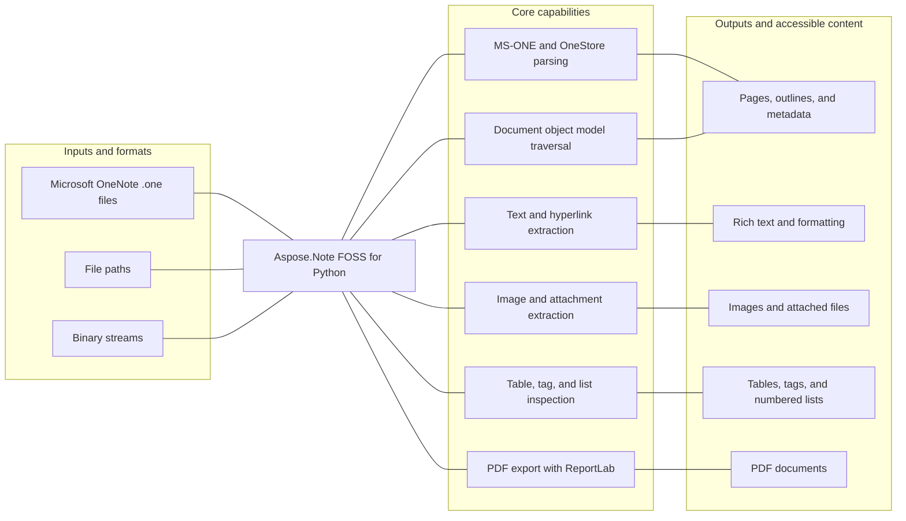

# Aspose.Note FOSS for Python

[](https://pypi.org/project/aspose-note/) [](https://pypi.org/project/aspose-note/) [](https://github.com/aspose-note-foss/Aspose.Note-FOSS-for-Python/actions/workflows/ci.yml) [](LICENSE) [](https://github.com/aspose-note-foss/Aspose.Note-FOSS-for-Python/graphs/contributors)

Aspose.Note FOSS for Python is a free, open-source Python library for reading Microsoft OneNote
`.one` files through an Aspose.Note-compatible API. It parses MS-ONE/OneStore data into a
traversable document object model, extracts structured content, and exports documents to PDF.

## Navigation

- [At a glance](#at-a-glance)
- [Key capabilities](#key-capabilities)
- [Installation](#installation)
- [Quick start](#quick-start)
- [Additional examples](#additional-examples)
- [API reference](#api-reference)
- [Scope and limitations](#scope-and-limitations)
- [Development and testing](#development-and-testing)
- [Third-party notices](#third-party-notices)
- [License](#license)

## At a glance



## Key capabilities

- Read `.one` documents from a file path or binary stream.
- Navigate an Aspose-style document object model with pages, outlines, and type-based search.
- Extract rich text, formatting runs, hyperlinks, images, attached files, and document metadata.
- Inspect tables, OneNote tags, numbered lists, and nested outline elements.
- Traverse documents with `DocumentVisitor`.
- Export documents to PDF through `Document.Save(..., SaveFormat.Pdf)` using ReportLab.

## Installation

Install the library from PyPI:

```bash
python -m pip install aspose-note
```

Install PDF export support:

```bash
python -m pip install "aspose-note[pdf]"
```

The package supports Python 3.10 and later.

## Quick start

Load a OneNote document and inspect its pages:

```python
from aspose.note import Document

doc = Document("testfiles/SimpleTable.one")
print(doc.DisplayName)
pages = list(doc)
print(len(pages))

for page in pages:
    print(page.Title.TitleText.Text)
```

Export a document to PDF:

```python
from aspose.note import Document, SaveFormat

doc = Document("testfiles/FormattedRichText.one")
doc.Save("out.pdf", SaveFormat.Pdf)
```

## Additional examples

Runnable scripts and sample OneNote documents are available in the
[`examples`](examples/) directory. The most common operations are collected below without
obscuring the primary installation and quick-start path.

<details>
<summary>View additional examples</summary>

### Extract all text

```python
from aspose.note import Document, RichText

doc = Document("testfiles/FormattedRichText.one")
texts = [rt.Text for rt in doc.GetChildNodes(RichText)]
print("\n".join(texts))
```

### Save all images

```python
from aspose.note import Document, Image

doc = Document("testfiles/3ImagesWithDifferentAlignment.one")
for i, img in enumerate(doc.GetChildNodes(Image), start=1):
    name = img.FileName or f"image_{i}.bin"
    with open(name, "wb") as f:
        f.write(img.Bytes)
```

### Export with PDF options

```python
from aspose.note import Document, SaveFormat
from aspose.note.saving import PdfSaveOptions

doc = Document("testfiles/TagSizes.one")
opts = PdfSaveOptions(
  JpegQuality=90,
)
doc.Save("out.pdf", opts)
```

### Load from a binary stream

```python
from pathlib import Path
from aspose.note import Document

one_path = Path("testfiles/SimpleTable.one")
with one_path.open("rb") as f:
  doc = Document(f)

print(doc.DisplayName)
print(len(list(doc)))
```

### Traverse the document structure

```python
from aspose.note import Document, Page, Outline, OutlineElement, RichText

doc = Document("testfiles/SimpleTable.one")

for page in doc.GetChildNodes(Page):
  title = page.Title.TitleText.Text if page.Title and page.Title.TitleText else "(no title)"
  print(f"# {title}")

  for outline in page.GetChildNodes(Outline):
    for oe in outline.GetChildNodes(OutlineElement):
      texts = [rt.Text for rt in oe.GetChildNodes(RichText)]
      if texts:
        print("-", " ".join(t.strip() for t in texts if t.strip()))
```

### Count nodes with DocumentVisitor

```python
from aspose.note import Document, DocumentVisitor, Page, Image, RichText


class Counter(DocumentVisitor):
  def __init__(self) -> None:
    self.pages = 0
    self.rich_texts = 0
    self.images = 0

  def VisitPageStart(self, page: Page) -> None:
    self.pages += 1

  def VisitRichTextStart(self, rich_text: RichText) -> None:
    self.rich_texts += 1

  def VisitImageStart(self, image: Image) -> None:
    self.images += 1


doc = Document("testfiles/3ImagesWithDifferentAlignment.one")
counter = Counter()
doc.Accept(counter)
print(counter.pages, counter.rich_texts, counter.images)
```

### Extract hyperlinks

```python
from aspose.note import Document, RichText

doc = Document("testfiles/FormattedRichText.one")
for rt in doc.GetChildNodes(RichText):
  for run in rt.TextRuns:
    if run.Style.IsHyperlink and run.Style.HyperlinkAddress:
      print(run.Text, "->", run.Style.HyperlinkAddress)
```

### Inspect OneNote tags

```python
from aspose.note import Document, RichText, Image, Table

doc = Document("testfiles/TagSizes.one")


def dump_tags(kind: str, tags) -> None:
  for t in tags:
    print(kind, "tag:", t.Label, t.Icon)


for rt in doc.GetChildNodes(RichText):
  dump_tags("RichText", rt.Tags)

for img in doc.GetChildNodes(Image):
  dump_tags("Image", img.Tags)

for tbl in doc.GetChildNodes(Table):
  dump_tags("Table", tbl.Tags)
```

### Read tables

```python
from aspose.note import Document, Table, TableRow, TableCell, RichText

doc = Document("testfiles/SimpleTable.one")

for table in doc.GetChildNodes(Table):
  print("Table columns:", [column.Width for column in table.Columns])
  for row_index, row in enumerate(table.GetChildNodes(TableRow), start=1):
    cells = row.GetChildNodes(TableCell)
    values: list[str] = []
    for cell in cells:
      cell_text = " ".join(rt.Text for rt in cell.GetChildNodes(RichText)).strip()
      values.append(cell_text)
    print(f"Row {row_index}:", values)
```

### Extract attached files

```python
from aspose.note import Document, AttachedFile

doc = Document("testfiles/OnePageWithFile.one")

for i, af in enumerate(doc.GetChildNodes(AttachedFile), start=1):
  name = af.FileName or f"attachment_{i}.bin"
  with open(name, "wb") as f:
    f.write(af.Bytes)
  print("saved:", name)
```

### Inspect numbered lists

```python
from aspose.note import Document, OutlineElement

doc = Document("testfiles/NumberedListWithTags.one")

for oe in doc.GetChildNodes(OutlineElement):
  nl = oe.NumberList
  if nl is None:
    continue
  print(
    "format=", nl.Format,
    "number_format=", nl.NumberFormat,
    "restart=", nl.Restart,
  )
```

</details>

## API reference

The supported public entry points are `aspose.note` and `aspose.note.saving`. Everything under
`aspose.note._internal` is an implementation detail and may change. The primary entry point is
`Document`, which loads a OneNote document, exposes its page hierarchy, supports traversal and
type-based searches, and saves supported output formats.

<details>
<summary>View the supported public API surface</summary>

### Document and traversal

- `Document(source=None, load_options=None)`
  - `DisplayName: str | None`
  - `CreationTime: datetime | None`
  - iteration with `for page in document: ...`
  - `FileFormat -> FileFormat` with best-effort detection
  - `GetPageHistory(page) -> PageHistory`
  - `DetectLayoutChanges()`
  - `Save(target, format_or_options=None)` with `SaveFormat.Pdf`
- `PageHistory`
  - `Current: Page`
  - `Count: int`
  - `IsReadOnly: bool`
  - iteration and indexing over historical revisions
- `DocumentVisitor`
  - `VisitDocumentStart/End`
  - `VisitPageStart/End`
  - `VisitTitleStart/End`
  - `VisitOutlineStart/End`
  - `VisitOutlineElementStart/End`
  - `VisitRichTextStart/End`
  - `VisitImageStart/End`
- `Node`
  - `ParentNode`
  - `Document`
  - `Accept(visitor)`
- Container nodes including `Document`, `Page`, `Title`, `Outline`, `OutlineElement`, `Image`,
  `Table`, `TableRow`, and `TableCell`
  - `FirstChild`, `LastChild`
  - `AppendChildLast(node)`, `AppendChildFirst(node)`, `InsertChild(index, node)`,
    `RemoveChild(node)`
  - `GetEnumerator()` and iteration
  - `GetChildNodes(Type) -> list[Type]`

### Document structure

- `Page`
  - `Title: Title | None`
  - `Author: str | None`
  - `CreationTime: datetime | None`
  - `LastModifiedTime: datetime | None`
  - `Level: int | None`
  - `Clone(deep=False) -> Page`
- `Title`
  - `TitleText: RichText | None`
  - `TitleDate: RichText | None`
  - `TitleTime: RichText | None`
- `Outline`
  - `HorizontalOffset`, `VerticalOffset`, `MaxWidth`
  - `MaxHeight`, `MinWidth`, `ReservedWidth`, `IndentPosition`
  - `DescendantsCannotBeMoved`, `LastModifiedTime`
- `OutlineElement`
  - `NumberList: NumberList | None`

### Content

- `RichText(Node)`
  - `Text: str`
  - `TextRuns: list[TextRun]`
  - `ParagraphStyle: ParagraphStyle`
  - `Length: int`
  - `Alignment: HorizontalAlignment | None`
  - `Tags: list[NoteTag]`
  - `Append(text, style=None) -> RichText`
  - `Replace(old_value, new_value) -> RichText`
  - `IndexOf(...) -> int`
- `TextRun`
  - `Text: str`
  - `Style: TextStyle`
- `ParagraphStyle`
  - default paragraph-level formatting for `RichText.ParagraphStyle`
- `TextStyle`
  - `IsBold`, `IsItalic`, `IsUnderline`, `IsStrikethrough`, `IsSuperscript`, `IsSubscript`
  - `IsHidden`, `IsMathFormatting`
  - `FontName`, `FontSize`, `FontColor`, `Highlight`, `Language`, `FontStyle`
  - `IsHyperlink`, `HyperlinkAddress`
- `Image`
  - `FileName`, `Bytes`, `Width`, `Height`
  - `AlternativeTextTitle`, `AlternativeTextDescription`
  - `HyperlinkUrl`, `Tags`
  - `Replace(image) -> None`
- `AttachedFile(Node)`
  - `FileName`, `Bytes`, `Tags`
- `Table`
  - `Columns: list[TableColumn]`
  - `IsBordersVisible: bool`
  - `Tags: list[NoteTag]`
- `TableColumn`
  - `Width: float | None`
  - `LockedWidth: bool`
- `TableRow`, `TableCell`
- `NoteTag`
  - `Label`, `Icon`, `Status`, `Highlight`, `CreationTime`, `CompletedTime`, `FontColor`
  - `CreateYellowStar()`, `CreateQuestionMark()`
- `NumberList`
  - `Format`, `NumberFormat`, `Font`, `FontSize`, `FontColor`
  - `IsBold`, `IsItalic`, `Restart`
  - `GetNumberedListHeader(number) -> str`

### Load and save options

- `LoadOptions`
  - `DocumentPassword: str | None`
  - `LoadHistory: bool`
- `aspose.note.saving.SaveOptions`
  - abstract compatibility base type
  - `SaveFormat: SaveFormat`
  - `PageIndex`, `PageCount`, `FontsSubsystem`
- `aspose.note.saving.PdfSaveOptions`
  - `PageIndex`, `PageCount`
  - `ImageCompression`, `JpegQuality`, `PageSettings`, `PageSplittingAlgorithm`

### Enums

- `SaveFormat`: `Pdf`
- `FileFormat`: `OneNote2010`, `OneNoteOnline`, `OneNote2007`
- `HorizontalAlignment`: `Left`, `Center`, `Right`
- `NodeType`: `Document`, `Page`, `Outline`, `OutlineElement`, `RichText`, `Image`, `Table`,
  `AttachedFile`

### Exceptions

- `FileCorruptedException`
- `IncorrectDocumentStructureException`
- `IncorrectPasswordException`
- `UnsupportedFileFormatException`
- `UnsupportedSaveFormatException`

</details>

## Scope and limitations

This project focuses on reading `.one` files and representing their contents as a Python document
object model. Writing changes back to `.one` files is not implemented. Password-protected or
encrypted documents are not supported, and PDF is currently the only implemented save format.

For workflows that require broader writing, conversion, or compatibility support, see
[Aspose.Note Enterprise Edition](https://products.aspose.com/note/).

## Development and testing

Install the repository with PDF support and run the test suite:

```bash
python -m pip install -e ".[pdf]"
python -m pytest -q
```

Install the base package from a local checkout:

```bash
python -m pip install -e .
```

Install the complete semantic PDF test dependencies:

```bash
python -m pip install -e ".[pdf,test-pdf]"
```

<details>
<summary>View the PDF golden-test workflow</summary>

Golden PDFs are stored under `tests/goldens/pdf/` with JSON manifests extracted from the generated
documents. The test suite compares manifests instead of raw PDF bytes so results remain stable
across platforms and ReportLab internals. The PDF writer uses deterministic Base-14 fonts by
default. Set `ASPOSE_NOTE_PDF_USE_SYSTEM_FONTS=1` only when inspecting Windows system fonts
locally.

Regenerate every baseline:

```bash
python tools/regenerate_pdf_goldens.py
```

Regenerate selected cases:

```bash
python tools/regenerate_pdf_goldens.py --case formatted_richtext --case simple_table
```

Run the verification suite:

```bash
python -m unittest tests.test_aspose_note_pdf_goldens -v
```

On mismatch, generated PDFs and manifests are written to
`tests/out/pdf_golden_failures/`. When available, `PyMuPDF` renders visual diff artifacts;
`pdftoppm` is used as the fallback renderer.

Maintainers can publish releases through the
[PyPI release page](https://pypi.org/manage/project/aspose-note/releases/).

</details>

## Third-party notices

Dependencies and incorporated third-party components, including ReportLab used for PDF export, are
documented in [THIRD_PARTY_NOTICES.md](THIRD_PARTY_NOTICES.md).

## License

This project is licensed under the [MIT License](LICENSE). The MIT License permits use, copying,
modification, distribution, sublicensing, and commercial use, provided its copyright and
permission notice are retained. The software is provided without warranty.
