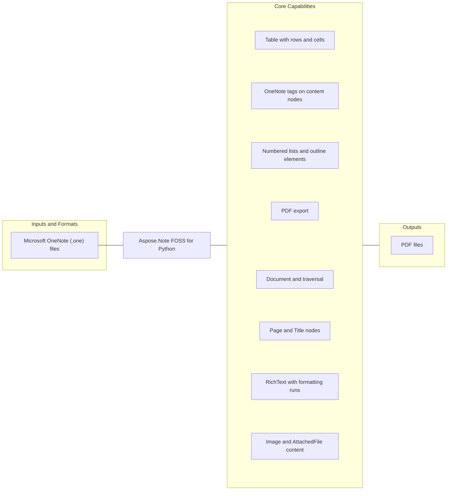

# Aspose.Note FOSS for Python

[](https://pypi.org/project/aspose-note/)   [](LICENSE) [](https://github.com/aspose-note-foss/Aspose.Note-FOSS-for-Python/graphs/contributors)

Aspose.Note FOSS for Python is an open-source library for developers using Python. It reads Microsoft OneNote (.one) files and writes PDF files.

## Navigation

- [At a Glance](#at-a-glance)
- [Key Capabilities](#key-capabilities)
- [Installation](#installation)
- [Quick Start](#quick-start)
- [Additional Examples](#additional-examples)
- [API Reference](#api-reference)
- [Documentation and Resources](#documentation-and-resources)
- [Scope and Limitations](#scope-and-limitations)
- [Development and Testing](#development-and-testing)
- [Third-Party Notices](#third-party-notices)
- [License](#license)

## At a Glance



## Key Capabilities

- **Read and traverse Microsoft OneNote (.one) files in Python** - Navigate document content through the public `DocumentVisitor`, `Node`, and `Document` APIs.
- **Access OneNote pages and page titles** - Inspect page and title nodes through the public `Node`, `Page`, and `Title` APIs.
- **Extract rich text and formatting from OneNote files** - Work with formatted text through the public `TextRun`, `RichText`, and `TextStyle` APIs.
- **Extract images and attached files from OneNote files** - Access images and attached-file content through the public `AttachedFile` and `Image` APIs.
- **Read OneNote tables, rows, and cells** - Traverse tables, rows, and cells through the public `TableRow`, `TableCell`, and `Table` APIs.
- **Inspect tags in OneNote documents** - Inspect tags on content nodes through the public `NoteTag` and `Node` APIs.
- **Read numbered lists and outline elements in OneNote documents** - Inspect numbered lists and outline structures through the public `NumberList`, `OutlineElement`, and `Outline` APIs.
- **Convert OneNote files to PDF** - Export supported output through the public `SaveFormat` API.

## Installation

```bash
python -m pip install aspose-note
```

Requires Python 3.10 or later.

Optional dependency groups declared in `pyproject.toml`:
- `dev`: `python -m pip install "aspose-note[dev]"`
- `pdf`: `python -m pip install "aspose-note[pdf]"`
- `test-pdf`: `python -m pip install "aspose-note[test-pdf]"`

- optional capability: `python -m pip install reportlab`

## Quick Start

```python
from aspose.note import Document, Image

doc = Document("testfiles/3ImagesWithDifferentAlignment.one")
for i, img in enumerate(doc.GetChildNodes(Image), start=1):
    name = img.FileName or f"image_{i}.bin"
    with open(name, "wb") as f:
        f.write(img.Bytes)
```

## Additional Examples

Expand this section to view examples for inspecting document metadata and page titles, exporting to PDF, extracting all text from an MS OneNote document, loading an MS OneNote document from a binary stream, and browsing repository example files, plus 8 more workflows.

<details>
<summary>View additional examples and results</summary>

### Inspect Document Metadata and Page Titles

```python
from aspose.note import Document

doc = Document("testfiles/SimpleTable.one")
print(doc.DisplayName)
pages = list(doc)
print(len(pages))


for page in pages:
    print(page.Title.TitleText.Text)
```

### Export to PDF

```python
from aspose.note import Document, SaveFormat

doc = Document("testfiles/FormattedRichText.one")
doc.Save("out.pdf", SaveFormat.Pdf)
```

### Extract All Text from an MS OneNote Document

```python
from aspose.note import Document, RichText

doc = Document("testfiles/FormattedRichText.one")
texts = [rt.Text for rt in doc.GetChildNodes(RichText)]
print("\n".join(texts))
```

### Export an MS OneNote Document to PDF

```python
from aspose.note import Document, SaveFormat
from aspose.note.saving import PdfSaveOptions

doc = Document("testfiles/TagSizes.one")
opts = PdfSaveOptions(
  JpegQuality=90,
)
doc.Save("out.pdf", opts)
```

### Load an MS OneNote Document from a Binary Stream

```python
from pathlib import Path
from aspose.note import Document

one_path = Path("testfiles/SimpleTable.one")
with one_path.open("rb") as f:
  doc = Document(f)

print(doc.DisplayName)
print(len(list(doc)))
```

### Traverse MS OneNote Document Structure (DOM) and Print a Simple Outline

```python
from aspose.note import Document, Page, Outline, OutlineElement, RichText

doc = Document("testfiles/SimpleTable.one")

for page in doc.GetChildNodes(Page):
  title = page.Title.TitleText.Text if page.Title and page.Title.TitleText else "(no title)"
  print(f"# {title}")

  for outline in page.GetChildNodes(Outline):
    for oe in outline.GetChildNodes(OutlineElement):

      texts = [rt.Text for rt in oe.GetChildNodes(RichText)]
      if texts:
        print("-", " ".join(t.strip() for t in texts if t.strip()))
```

### Count MS OneNote DOM Nodes with `DocumentVisitor`

```python
from aspose.note import Document, DocumentVisitor, Page, Image, RichText


class Counter(DocumentVisitor):
  def __init__(self) -> None:
    self.pages = 0
    self.rich_texts = 0
    self.images = 0

  def VisitPageStart(self, page: Page) -> None:
    self.pages += 1

  def VisitRichTextStart(self, rich_text: RichText) -> None:
    self.rich_texts += 1

  def VisitImageStart(self, image: Image) -> None:
    self.images += 1


doc = Document("testfiles/3ImagesWithDifferentAlignment.one")
counter = Counter()
doc.Accept(counter)
print(counter.pages, counter.rich_texts, counter.images)
```

### Extract Hyperlinks from Formatted Text in an MS OneNote Document

```python
from aspose.note import Document, RichText

doc = Document("testfiles/FormattedRichText.one")
for rt in doc.GetChildNodes(RichText):
  for run in rt.TextRuns:
    if run.Style.IsHyperlink and run.Style.HyperlinkAddress:
      print(run.Text, "->", run.Style.HyperlinkAddress)
```

### Inspect MS OneNote Tags (NoteTag) Across the Document

```python
from aspose.note import Document, RichText, Image, Table

doc = Document("testfiles/TagSizes.one")

def dump_tags(kind: str, tags) -> None:
  for t in tags:
    print(kind, "tag:", t.Label, t.Icon)

for rt in doc.GetChildNodes(RichText):
  dump_tags("RichText", rt.Tags)

for img in doc.GetChildNodes(Image):
  dump_tags("Image", img.Tags)

for tbl in doc.GetChildNodes(Table):
  dump_tags("Table", tbl.Tags)
```

### Work with Tables in an MS OneNote Document (Rows/Cells)

```python
from aspose.note import Document, Table, TableRow, TableCell, RichText

doc = Document("testfiles/SimpleTable.one")

for table in doc.GetChildNodes(Table):
  print("Table columns:", [column.Width for column in table.Columns])
  for row_index, row in enumerate(table.GetChildNodes(TableRow), start=1):
    cells = row.GetChildNodes(TableCell)
    values: list[str] = []
    for cell in cells:
      cell_text = " ".join(rt.Text for rt in cell.GetChildNodes(RichText)).strip()
      values.append(cell_text)
    print(f"Row {row_index}:", values)
```

### Extract Attached Files from an MS OneNote Document

```python
from aspose.note import Document, AttachedFile

doc = Document("testfiles/OnePageWithFile.one")

for i, af in enumerate(doc.GetChildNodes(AttachedFile), start=1):
  name = af.FileName or f"attachment_{i}.bin"
  with open(name, "wb") as f:
    f.write(af.Bytes)
  print("saved:", name)
```

### Inspect Numbered Lists in an MS OneNote Document

```python
from aspose.note import Document, OutlineElement

doc = Document("testfiles/NumberedListWithTags.one")

for oe in doc.GetChildNodes(OutlineElement):
  nl = oe.NumberList
  if nl is None:
    continue
  print(
    "format=", nl.Format,
    "number_format=", nl.NumberFormat,
    "restart=", nl.Restart,
  )
```

### Repository Example Files

- [`export_pdf.py`](examples/export_pdf.py)
- [`extract_text.py`](examples/extract_text.py)
- [`save_images.py`](examples/save_images.py)


</details>

## API Reference

The package declares 75 public exports across 7 verified namespaces.

<details>
<summary>View public API by namespace</summary>

### Aspose.Note Namespace (`aspose.note`)

| Type | Description |
| --- | --- |
| `AttachedFile` | Attached file: access to bytes, access to file name, and access to tags. Inherits from `Node`. Includes 3 additional verified members. |
| `Document` | Document: detect layout changes, retrieve page history, and save document output. Inherits from `CompositeNode`. Includes 14 additional verified members. |
| `DocumentVisitor` | Document visitor: visit document, visit image, and visit outline element. Includes 11 additional verified members. |
| `FileCorruptedException` | Signals a file corrupted condition; derives from `AsposeNoteError`. |
| `FileFormat` | Enumerates file format values. Values include `OneNote2007`, `OneNote2010`, and `OneNoteOnline` and 1 more. |
| `HorizontalAlignment` | Enumerates horizontal alignment values. Values include `Center`, `Left`, and `Right`. |
| `Image` | Image: replace content, access to alignment, and access to bytes. Inherits from `CompositeNode`. Includes 17 additional verified members. |
| `IncorrectDocumentStructureException` | Signals an incorrect document structure condition; derives from `AsposeNoteError`. |
| `IncorrectPasswordException` | Signals an incorrect password condition; derives from `AsposeNoteError`. |
| `License` | License: configure package licensing. |
| `LoadOptions` | Load options: access to document password and access to load history. |
| `Metered` | Metered: configure metered licensing keys. |
| `Node` | Node: traverse with a visitor, access to document, and access to parent node. |
| `NodeType` | Enumerates node type values. Values include `AttachedFile`, `Image`, and `Outline` and 5 more. |
| `NoteTag` | Note tag: create musical note, create question mark, and create yellow star. Includes 7 additional verified members. |
| `NumberList` | Number list: retrieve numbered list header, access to font, and access to font color. Includes 7 additional verified members. |
| `Outline` | Outline: access to descendants cannot be moved, access to horizontal offset, and access to indent position. Inherits from `CompositeNode`. Includes 17 additional verified members. |
| `OutlineElement` | Outline element: access to number list, traverse with a visitor, and append child nodes. Inherits from `CompositeNode`. Includes 9 additional verified members. |
| `Page` | Page: clone content, access to author, and access to background color. Inherits from `CompositeNode`. Includes 20 additional verified members. |
| `PageHistory` | Page history: add, clear content, and contains. Includes 11 additional verified members. |
| `ParagraphStyle` | Paragraph style: create default values and access to font style. |
| `RichText` | Rich text: append content, clear content, and find content. Inherits from `Node`. Includes 20 additional verified members. |
| `SaveFormat` | Enumerates save format values. Values include `Pdf`. |
| `Table` | Table: access to columns, access to tags, and traverse with a visitor. Inherits from `CompositeNode`. Includes 10 additional verified members. |
| `TableCell` | Table cell: traverse with a visitor, append child nodes, and retrieve child nodes. Inherits from `CompositeNode`. Includes 8 additional verified members. |
| `TableColumn` | Table column: access to locked width and access to width. |
| `TableRow` | Table row: traverse with a visitor, append child nodes, and retrieve child nodes. Inherits from `CompositeNode`. Includes 8 additional verified members. |
| `TagStatus` | Enumerates tag status values. Values include `Completed`, `Disabled`, and `Open`. |
| `TextRun` | Text run: access to style and access to text. |
| `TextStyle` | Text style: create default values, create default ms one note title date style, and create default ms one note title text style. Includes 17 additional verified members. |
| `Title` | Title: retrieve child nodes, access to title date, and access to title text. Inherits from `Node`. Includes 5 additional verified members. |
| `UnsupportedFileFormatException` | Signals an unsupported format condition; derives from `AsposeNoteError`. |
| `UnsupportedSaveFormatException` | Signals an unsupported save format condition; derives from `AsposeNoteError`. |

### Aspose.Note.Enums Namespace (`aspose.note.enums`)

| Type | Description |
| --- | --- |
| `FileFormat` | The `aspose.note.enums` namespace re-exports `FileFormat` from the primary `aspose.note` namespace. |
| `HorizontalAlignment` | The `aspose.note.enums` namespace re-exports `HorizontalAlignment` from the primary `aspose.note` namespace. |
| `NodeType` | The `aspose.note.enums` namespace re-exports `NodeType` from the primary `aspose.note` namespace. |
| `SaveFormat` | The `aspose.note.enums` namespace re-exports `SaveFormat` from the primary `aspose.note` namespace. |
| `TagStatus` | The `aspose.note.enums` namespace re-exports `TagStatus` from the primary `aspose.note` namespace. |

### Aspose.Note.Exceptions Namespace (`aspose.note.exceptions`)

| Type | Description |
| --- | --- |
| `AsposeNoteError` | Signals an aspose note error condition; derives from `Exception`. |
| `FileCorruptedException` | The `aspose.note.exceptions` namespace re-exports `FileCorruptedException` from the primary `aspose.note` namespace. |
| `IncorrectDocumentStructureException` | The `aspose.note.exceptions` namespace re-exports `IncorrectDocumentStructureException` from the primary `aspose.note` namespace. |
| `IncorrectPasswordException` | The `aspose.note.exceptions` namespace re-exports `IncorrectPasswordException` from the primary `aspose.note` namespace. |
| `UnsupportedFileFormatException` | The `aspose.note.exceptions` namespace re-exports `UnsupportedFileFormatException` from the primary `aspose.note` namespace. |
| `UnsupportedSaveFormatException` | The `aspose.note.exceptions` namespace re-exports `UnsupportedSaveFormatException` from the primary `aspose.note` namespace. |

### Aspose.Note.Model Namespace (`aspose.note.model`)

| Type | Description |
| --- | --- |
| `AttachedFile` | The `aspose.note.model` namespace re-exports `AttachedFile` from the primary `aspose.note` namespace. |
| `CompositeNode` | Composite node: append child nodes, retrieve child nodes, and insert content. Inherits from `Node`. Includes 8 additional verified members. |
| `Document` | The `aspose.note.model` namespace re-exports `Document` from the primary `aspose.note` namespace. |
| `DocumentVisitor` | The `aspose.note.model` namespace re-exports `DocumentVisitor` from the primary `aspose.note` namespace. |
| `Image` | The `aspose.note.model` namespace re-exports `Image` from the primary `aspose.note` namespace. |
| `License` | The `aspose.note.model` namespace re-exports `License` from the primary `aspose.note` namespace. |
| `LoadOptions` | The `aspose.note.model` namespace re-exports `LoadOptions` from the primary `aspose.note` namespace. |
| `Metered` | The `aspose.note.model` namespace re-exports `Metered` from the primary `aspose.note` namespace. |
| `Node` | The `aspose.note.model` namespace re-exports `Node` from the primary `aspose.note` namespace. |
| `NoteTag` | The `aspose.note.model` namespace re-exports `NoteTag` from the primary `aspose.note` namespace. |
| `NumberList` | The `aspose.note.model` namespace re-exports `NumberList` from the primary `aspose.note` namespace. |
| `Outline` | The `aspose.note.model` namespace re-exports `Outline` from the primary `aspose.note` namespace. |
| `OutlineElement` | The `aspose.note.model` namespace re-exports `OutlineElement` from the primary `aspose.note` namespace. |
| `Page` | The `aspose.note.model` namespace re-exports `Page` from the primary `aspose.note` namespace. |
| `PageHistory` | The `aspose.note.model` namespace re-exports `PageHistory` from the primary `aspose.note` namespace. |
| `ParagraphStyle` | The `aspose.note.model` namespace re-exports `ParagraphStyle` from the primary `aspose.note` namespace. |
| `PdfSaveOptions` | PDF save options: access to save format. Inherits from `SaveOptions`. |
| `RichText` | The `aspose.note.model` namespace re-exports `RichText` from the primary `aspose.note` namespace. |
| `SaveOptions` | Save options: access to save format. |
| `Table` | The `aspose.note.model` namespace re-exports `Table` from the primary `aspose.note` namespace. |
| `TableCell` | The `aspose.note.model` namespace re-exports `TableCell` from the primary `aspose.note` namespace. |
| `TableColumn` | The `aspose.note.model` namespace re-exports `TableColumn` from the primary `aspose.note` namespace. |
| `TableRow` | The `aspose.note.model` namespace re-exports `TableRow` from the primary `aspose.note` namespace. |
| `TextRun` | The `aspose.note.model` namespace re-exports `TextRun` from the primary `aspose.note` namespace. |
| `TextStyle` | The `aspose.note.model` namespace re-exports `TextStyle` from the primary `aspose.note` namespace. |
| `Title` | The `aspose.note.model` namespace re-exports `Title` from the primary `aspose.note` namespace. |

### Aspose.Note.Saving Namespace (`aspose.note.saving`)

| Type | Description |
| --- | --- |
| `PdfSaveOptions` | The `aspose.note.saving` namespace re-exports `PdfSaveOptions` from the primary `aspose.note.model` namespace. |
| `SaveOptions` | The `aspose.note.saving` namespace re-exports `SaveOptions` from the primary `aspose.note.model` namespace. |

### Aspose.Note.Saving.Options Namespace (`aspose.note.saving.options`)

| Type | Description |
| --- | --- |
| `PdfSaveOptions` | The `aspose.note.saving.options` namespace re-exports `PdfSaveOptions` from the primary `aspose.note.model` namespace. |
| `SaveOptions` | The `aspose.note.saving.options` namespace re-exports `SaveOptions` from the primary `aspose.note.model` namespace. |

### Aspose.Note.Saving.PDF Writer Namespace (`aspose.note.saving.pdf_writer`)

| Type | Description |
| --- | --- |
| `write_pdf` | Public function for write PDF operations. |

</details>

## Documentation and Resources

- **[Getting started guide](https://docs.aspose.org/note/python/)** - installation, walkthroughs, and feature guides for this library.
- **[How-to guides and FAQ](https://kb.aspose.org/note/python/)** - task-focused answers for common product questions.
- **[Full API reference](https://reference.aspose.org/note/python/)** - the complete browsable reference for the public API.
- Found a bug or have a feature request? [Open an issue](https://github.com/aspose-note-foss/Aspose.Note-FOSS-for-Python/issues) on GitHub.

## Scope and Limitations

- Password-protected documents are not supported
- Unsupported format/options argument
- Only PDF save is supported
- Only PDF file targets are supported for save operations
- PDF export requires ReportLab

For requirements beyond the FOSS scope described above, explore the [full-featured Aspose.Note Enterprise Edition](https://products.aspose.com/note/). It is a separate product, so features and APIs may differ.

## Development and Testing

The repository includes 13 test files, 1 maintenance tool, 13 golden assets, 2 source-bound validation commands.

<details>
<summary>View development and testing resources</summary>

### Tests

- [`tests/test_aspose_note_compat_smoke.py`](tests/test_aspose_note_compat_smoke.py)
- [`tests/test_aspose_note_dom_content.py`](tests/test_aspose_note_dom_content.py)
- [`tests/test_aspose_note_dom_document.py`](tests/test_aspose_note_dom_document.py)
- [`tests/test_aspose_note_exceptions_and_stubs.py`](tests/test_aspose_note_exceptions_and_stubs.py)
- [`tests/test_aspose_note_history.py`](tests/test_aspose_note_history.py)
- [Browse all test files](tests)

### Tools

- [`tools/regenerate_pdf_goldens.py`](tools/regenerate_pdf_goldens.py)

### Goldens

- [`tests/goldens/pdf/attached_file_with_tag.manifest.json`](tests/goldens/pdf/attached_file_with_tag.manifest.json)
- [`tests/goldens/pdf/formatted_richtext.manifest.json`](tests/goldens/pdf/formatted_richtext.manifest.json)
- [`tests/goldens/pdf/image_with_tag.manifest.json`](tests/goldens/pdf/image_with_tag.manifest.json)
- [`tests/goldens/pdf/images_with_alignment.manifest.json`](tests/goldens/pdf/images_with_alignment.manifest.json)
- [`tests/goldens/pdf/numbered_list_with_tags.manifest.json`](tests/goldens/pdf/numbered_list_with_tags.manifest.json)
- [`tests/goldens/pdf/one_page_with_file.manifest.json`](tests/goldens/pdf/one_page_with_file.manifest.json)
- [`tests/goldens/pdf/page_with_subpage.manifest.json`](tests/goldens/pdf/page_with_subpage.manifest.json)
- [`tests/goldens/pdf/page_with_subpage.pdf`](tests/goldens/pdf/page_with_subpage.pdf)
- [Browse all golden assets](tests/goldens)

### Focused Commands and Repository Scripts

```bash
python -m pip install -e .
```

```bash
python -m unittest discover -s tests -p "test_*.py"
```


</details>

## Third-Party Notices

Third-party attribution and dependency license notices are recorded in [THIRD_PARTY_NOTICES.md](THIRD_PARTY_NOTICES.md).

## License

This project is available under the [MIT License](LICENSE). It permits use, modification, distribution, and commercial use when the license and copyright notice are retained.
