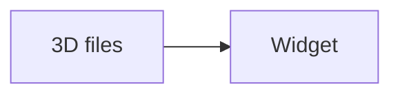

# Widget

A 3D library for Python developers.

[At a glance](#at-a-glance) | [Usage](#usage)

## At a glance

## Usage

Run the example.

For broader capabilities, see the [Enterprise Edition](https://products.aspose.com/3d/).
