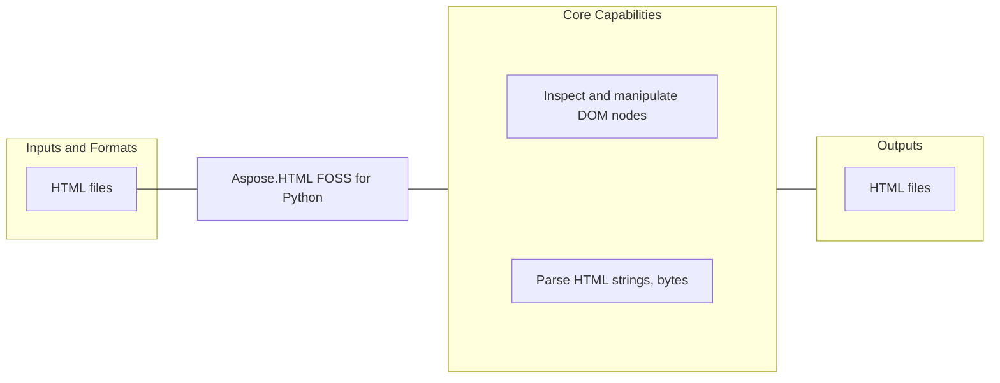

# Aspose.HTML FOSS for Python

  [](LICENSE) [](https://github.com/aspose-html-foss/Aspose.HTML-FOSS-for-Python/graphs/contributors)


Aspose.HTML FOSS for Python is an open-source library for developers using Python. It reads HTML files and writes HTML files.

## Navigation

- [At a Glance](#at-a-glance)
- [Key Capabilities](#key-capabilities)
- [Installation](#installation)
- [Quick Start](#quick-start)
- [Additional Examples](#additional-examples)
- [API Reference](#api-reference)
- [Documentation and Resources](#documentation-and-resources)
- [Scope and Limitations](#scope-and-limitations)
- [Development and Testing](#development-and-testing)
- [Contributing](#contributing)
- [Security](#security)
- [License](#license)

## At a Glance



## Key Capabilities

- **Parse HTML strings, bytes, fragments, and files into a DOM document** - Build in-memory document structures through the public `DocumentFragment` and `Document` APIs.
- **Inspect and manipulate DOM nodes, elements, attributes, text, comments, and document fragments** - Work directly with the public object model through the public `DocumentFragment`, `Node`, and `Text` APIs.

## Installation

Use the library from a clone of its source repository:

```bash
git clone https://github.com/aspose-html-foss/Aspose.HTML-FOSS-for-Python.git
cd Aspose.HTML-FOSS-for-Python
```

The package imports as `aspose_html` from the repository's `src` directory (add it to `PYTHONPATH`).

Required runtime dependencies declared in `pyproject.toml`: `skia-python>=87.0,<145`.

## Quick Start

```python
from aspose_html import HTMLDocument, serialise
document = HTMLDocument.parse('<main id=content><h1>Hello</h1></main>')
content = document.get_element_by_id('content')
paragraph = document.create_element('p')
paragraph.text_content = 'Updated through the DOM API.'
content.append_child(paragraph)
print(serialise(content))
```

## Additional Examples

Expand this section to view examples for exploring the HTMLDocument APIs, parse and reading HTML, creating DOM nodes, working with URLs, and browsing repository example files.

<details>
<summary>View additional examples and results</summary>

### Explore the HTMLDocument APIs

```python
from aspose_html import HTMLDocument, serialise

document = HTMLDocument.parse("""
<!doctype html>
<html>
  <body>
    <main id="content">
      <h1>Hello HTML</h1>
      <p class="lead">Created with Aspose.HTML FOSS for Python.</p>
    </main>
  </body>
</html>
""")

content = document.get_element_by_id("content")
paragraph = document.create_element("p")
paragraph.text_content = "DOM updates are represented in the document tree."
content.append_child(paragraph)

print(serialise(content))
```

### Parse and Read HTML

```python
from aspose_html import HTMLDocument

document = HTMLDocument.parse("<article><h1>News</h1><p>Hello</p></article>")
heading = document.get_elements_by_tag_name("h1").item(0)

print(heading.text_content)
```

### Create DOM Nodes

```python
from aspose_html.dom import Document
from aspose_html import serialise

document = Document()
section = document.create_element("section")
section.set_attribute("class", "card")
section.text_content = "Generated content"

document.append_child(section)
print(serialise(document))
```

### Work with URLs

```python
from aspose_html import URL

url = URL("https://example.com/articles?id=10")
url.search_params.set("page", "2")

print(str(url))
```

### Repository Example Files

- [`parse_and_update.py`](examples/parse_and_update.py)
- [`url_search_params.py`](examples/url_search_params.py)

</details>

## API Reference

The package documents 271 public types across 10 namespaces. Package namespaces include `aspose_html`, `aspose_html.css`, `aspose_html.cssom`, `aspose_html.dom`, `aspose_html.dom.html`, `aspose_html.encoding`, `aspose_html.js`, `aspose_html.layout`, `aspose_html.tokenizer`, `aspose_html.tree`, `aspose_html.url`. See the complete API reference under Documentation and Resources for members, signatures, and inherited APIs.

<details>
<summary>View public API by namespace</summary>

### Aspose.HTML Namespace (`aspose_html`)

| Type | Description |
| --- | --- |
| `DOMParser` | Represents a DOM Parser in the public Aspose.HTML API. Supports parsing from string. |
| `HTMLDocument` | Represents an HTML document through the Aspose.HTML API. Supports loading content and parsing fragment. |
| `URL(href, base=None)` | Represents a URL in the public Aspose.HTML API. Supports caning parse. |
| `URLParseError` | Represents a URL Parse Error in the public Aspose.HTML API. Inherits from `ValueError`. |
| `URLSearchParams(init=None)` | Represents a URL Search Params in the public Aspose.HTML API. Supports appending content and checking for content. |
| `XMLSerializer` | Represents an XML Serializer in the public Aspose.HTML API. Supports serializing to string. |

### Aspose.HTML.Cssom Namespace (`aspose_html.cssom`)

| Type | Description |
| --- | --- |
| `CSS` | Represents a CSS in the public cssom API for Aspose.HTML. |
| `CSSCounterStyleRule(name, body_text='')` | Represents a CSS Counter Style Rule in the public cssom API for Aspose.HTML. Inherits from `CSSRule`. |
| `CSSFontFaceRule(style)` | Represents a CSS Font Face Rule in the public cssom API for Aspose.HTML. Inherits from `CSSRule`. |
| `CSSImportRule(href, media='')` | Represents a CSS Import Rule in the public cssom API for Aspose.HTML. Inherits from `CSSRule`. |
| `CSSKeyframeRule(key_text, style)` | Represents a CSS Keyframe Rule in the public cssom API for Aspose.HTML. Inherits from `CSSRule`. |
| `CSSKeyframesRule(name)` | Represents a CSS Keyframes Rule in the public cssom API for Aspose.HTML. Supports appending rule, deleting rule, and finding rule. Inherits from `CSSRule`. |
| `CSSLayerBlockRule(name)` | Represents a CSS Layer Block Rule in the public cssom API for Aspose.HTML. Supports deleting rule and inserting rule. Inherits from `CSSRule`. |
| `CSSLayerStatementRule(name_list)` | Represents a CSS Layer Statement Rule in the public cssom API for Aspose.HTML. Inherits from `CSSRule`. |
| `CSSMediaRule(media_text)` | Represents a CSS Media Rule in the public cssom API for Aspose.HTML. Supports deleting rule and inserting rule. Inherits from `CSSRule`. |
| `CSSNamespaceRule(namespace_uri, prefix=None)` | Represents a CSS Namespace Rule in the public cssom API for Aspose.HTML. Inherits from `CSSRule`. |
| `CSSPageRule(selector_text, style)` | Represents a CSS Page Rule in the public cssom API for Aspose.HTML. Inherits from `CSSRule`. |
| `CSSPropertyRule(name, syntax, inherits, initial_value)` | Represents a CSS Property Rule in the public cssom API for Aspose.HTML. Inherits from `CSSRule`. |
| `CSSRule()` | Represents a CSS Rule in the public cssom API for Aspose.HTML. |
| `CSSRuleList(provider)` | Represents a CSS Rule List in the public cssom API for Aspose.HTML. |
| `CSSStyleRule(selector_text, style)` | Represents a CSS Style Rule in the public cssom API for Aspose.HTML. Inherits from `CSSRule`. |
| `CSSStyleSheet()` | Represents a CSS Style Sheet in the public cssom API for Aspose.HTML. Supports adding rules, deleting rule, and loading content from text. |
| `CSSSupportsRule(condition_text)` | Represents a CSS Supports Rule in the public cssom API for Aspose.HTML. Supports deleting rule and inserting rule. Inherits from `CSSRule`. |

### Aspose.HTML.DOM Namespace (`aspose_html.dom`)

| Type | Description |
| --- | --- |
| `AbortController()` | Represents an Abort Controller in the public DOM API for Aspose.HTML. |
| `AbortSignal()` | Represents an Abort Signal in the public DOM API for Aspose.HTML. |
| `AbstractRange` | Represents an Abstract Range in the public DOM API for Aspose.HTML. |
| `Attr(name, value='', owner_element=None, owner_document=None, namespace_uri=None, local_name_ns=None)` | Represents an Attr in the public DOM API for Aspose.HTML. Supports adding event listeners, appending child nodes, and cloning node. Inherits from `Node`. |
| `BarProp` | Represents a Bar Prop in the public DOM API for Aspose.HTML. |
| `BroadcastChannel` | Represents a Broadcast Channel in the public DOM API for Aspose.HTML. |
| `CDATASection(data='', owner_document=None)` | Represents a CDATA Section in the public DOM API for Aspose.HTML. Supports adding event listeners, appending child nodes, and appending data. Inherits from `Text`. |
| `CSSStyleDeclaration(owner_element)` | Represents a CSS Style Declaration in the public DOM API for Aspose.HTML. Supports retrieving property priority, retrieving property value, and removing property. |
| `CharacterData(node_type, data='', owner_document=None)` | Represents a Character Data in the public DOM API for Aspose.HTML. Supports appending data, deleting data, and inserting data. Inherits from `Node`. |
| `Comment(data='', owner_document=None)` | Represents a Comment in the public DOM API for Aspose.HTML. Supports adding event listeners, appending child nodes, and appending data. Inherits from `CharacterData`. |
| `ComputedStyleDeclaration(properties)` | Represents a Computed Style Declaration in the public DOM API for Aspose.HTML. Supports retrieving property value. |
| `Console` | Represents a Console in the public DOM API for Aspose.HTML. |
| `Crypto` | Represents a Crypto in the public DOM API for Aspose.HTML. |
| `CustomElementRegistry(document)` | Represents a Custom Element Registry in the public DOM API for Aspose.HTML. Supports retrieving name and whening defined. |
| `CustomEvent(type, bubbles, cancelable, detail)` | Represents a Custom Event in the public DOM API for Aspose.HTML. Supports initing custom event, initing event, and preventing default. Inherits from `Event`. |
| `DOMConfiguration()` | Represents a DOM Configuration in the public DOM API for Aspose.HTML. Supports caning set parameter, retrieving parameter, and setting parameter. |
| `DOMException(message='')` | Signals a DOM condition; derives from `Exception`. |
| `DOMImplementation(document=None)` | Represents a DOM Implementation in the public DOM API for Aspose.HTML. Supports creating document, creating document type, and creating HTML document. |
| `DOMParser` | The `aspose_html.dom` namespace re-exports `DOMParser` from the primary `aspose_html` namespace. |
| `DOMRect(x=0.0, y=0.0, width=0.0, height=0.0)` | Represents a DOM Rect in the public DOM API for Aspose.HTML. |
| `DOMRectList(rects)` | Represents a DOM Rect List in the public DOM API for Aspose.HTML. |
| `DOMStringMap(owner_element)` | Represents a DOM String Map in the public DOM API for Aspose.HTML. |
| `DOMTokenList(owner_element, attr_name='class')` | Represents a DOM Token List in the public DOM API for Aspose.HTML. Supports foring each, removing content, and replacing content. |
| `DataCloneError` | Represents a Data Clone Error in the public DOM API for Aspose.HTML. |
| `Document()` | Represents an HTML document through the Aspose.HTML API. Supports adopting node, appending content, and attaching style sheet. Inherits from `Node`. |
| `DocumentFragment(owner_document=None)` | Represents a Document Fragment in the public DOM API for Aspose.HTML. Supports appending content, querying elements with CSS selectors, and replacing children. Inherits from `Node`. |
| `DocumentPosition` | Represents a Document Position in the public DOM API for Aspose.HTML. |
| `DocumentType(name, public_id='', system_id='', owner_document=None)` | Represents a Document Type in the public DOM API for Aspose.HTML. Supports adding event listeners, appending child nodes, and cloning node. Inherits from `Node`. |
| `Element(local_name, namespace_uri=None, prefix=None, owner_document=None)` | Represents an Element in the public DOM API for Aspose.HTML. Supports appending content, attaching shadow, and checking visibility. Inherits from `Node`. |
| `ErrorEvent(type, bubbles, cancelable, message, filename, lineno, colno, error)` | Represents an Error Event in the public DOM API for Aspose.HTML. Supports initing event, preventing default, and stoping immediate propagation. Inherits from `Event`. |
| `Event(type, bubbles, cancelable)` | Represents an Event in the public DOM API for Aspose.HTML. Supports initing event, preventing default, and stoping immediate propagation. |
| `EventTarget()` | Represents an Event Target in the public DOM API for Aspose.HTML. Supports adding event listeners, dispatching event, and removing event listener. |
| `FocusEvent(type, bubbles, cancelable, detail, related_target)` | Represents a Focus Event in the public DOM API for Aspose.HTML. Supports initing event, preventing default, and stoping immediate propagation. Inherits from `UIEvent`. |
| `FormData(form=None)` | Represents a Form Data in the public DOM API for Aspose.HTML. Supports appending content and checking for content. |
| `Element(local_name, namespace_uri=None, prefix=None, owner_document=None)` | Represents an HTML Address Element in the public DOM API for Aspose.HTML. Supports adding event listeners, appending content, and appending child nodes. Inherits from `HTMLElement`. |
| `Element(local_name, namespace_uri=None, prefix=None, owner_document=None)` | Represents an HTML Anchor Element in the public DOM API for Aspose.HTML. Supports adding event listeners, appending content, and appending child nodes. Inherits from `HTMLElement`. |
| `Element(local_name, namespace_uri=None, prefix=None, owner_document=None)` | Represents an HTML Area Element in the public DOM API for Aspose.HTML. Supports adding event listeners, appending content, and appending child nodes. Inherits from `HTMLElement`. |
| `Element(local_name, namespace_uri=None, prefix=None, owner_document=None)` | Represents an HTML Article Element in the public DOM API for Aspose.HTML. Supports adding event listeners, appending content, and appending child nodes. Inherits from `HTMLElement`. |
| `Element(local_name, namespace_uri=None, prefix=None, owner_document=None)` | Represents an HTML Aside Element in the public DOM API for Aspose.HTML. Supports adding event listeners, appending content, and appending child nodes. Inherits from `HTMLElement`. |
| `Element(local_name, namespace_uri=None, prefix=None, owner_document=None)` | Represents an HTML Audio Element in the public DOM API for Aspose.HTML. Supports adding event listeners, adding text tracks, and appending content. Inherits from `HTMLMediaElement`. |
| `Element(local_name, namespace_uri=None, prefix=None, owner_document=None)` | Represents an HTMLBR Element in the public DOM API for Aspose.HTML. Supports adding event listeners, appending content, and appending child nodes. Inherits from `HTMLElement`. |
| `Element(local_name, namespace_uri=None, prefix=None, owner_document=None)` | Represents an HTML Base Element in the public DOM API for Aspose.HTML. Supports adding event listeners, appending content, and appending child nodes. Inherits from `HTMLElement`. |
| `Element(local_name, namespace_uri=None, prefix=None, owner_document=None)` | Represents an HTML Body Element in the public DOM API for Aspose.HTML. Supports adding event listeners, appending content, and appending child nodes. Inherits from `HTMLElement`. |
| `Element(local_name, namespace_uri=None, prefix=None, owner_document=None)` | Represents an HTML Button Element in the public DOM API for Aspose.HTML. Supports adding event listeners, appending content, and appending child nodes. Inherits from `_ConstraintValidationMixin`, `HTMLElement`. |
| `Element(local_name, namespace_uri=None, prefix=None, owner_document=None)` | Represents an HTML Canvas Element in the public DOM API for Aspose.HTML. Supports retrieving context, converting content to blob, and converting content to data URL. Inherits from `HTMLElement`. |
| `HTMLCollection(live_list)` | Represents an HTML Collection in the public DOM API for Aspose.HTML. Supports nameding item. |
| `Element(local_name, namespace_uri=None, prefix=None, owner_document=None)` | Represents an HTMLD List Element in the public DOM API for Aspose.HTML. Supports adding event listeners, appending content, and appending child nodes. Inherits from `HTMLElement`. |
| `Element(local_name, namespace_uri=None, prefix=None, owner_document=None)` | Represents an HTML Data Element in the public DOM API for Aspose.HTML. Supports adding event listeners, appending content, and appending child nodes. Inherits from `HTMLElement`. |
| `Node(node_type, owner_document=None)` | Represents a Node in the public DOM API for Aspose.HTML. Supports appending child nodes, cloning node, and comparing document position. Inherits from `EventTarget`, `ABC`. |
| `NodeList(live_list)` | Represents a Node List in the public DOM API for Aspose.HTML. |
| `Window(document)` | Represents a Window in the public DOM API for Aspose.HTML. Supports canceling animation frame, canceling idle callback, and clearing interval. Inherits from `EventTarget`. |
| `Element(local_name, namespace_uri=None, prefix=None, owner_document=None)` | Represents an HTML Input Element in the public DOM API for Aspose.HTML. Supports setting range text, setting selection range, and showing picker. Inherits from `_ConstraintValidationMixin`, `HTMLElement`. |
| `Element(local_name, namespace_uri=None, prefix=None, owner_document=None)` | Represents an HTML Media Element in the public DOM API for Aspose.HTML. Supports adding text tracks, caning play type, and loading content. Inherits from `HTMLElement`. |
| `Element(local_name, namespace_uri=None, prefix=None, owner_document=None)` | Represents an HTML Element in the public DOM API for Aspose.HTML. Supports hiding popover, showing popover, and toggling popover. Inherits from `Element`. |
| `Element(local_name, namespace_uri=None, prefix=None, owner_document=None)` | Represents an HTML Text Area Element in the public DOM API for Aspose.HTML. Supports setting range text, setting selection range, and adding event listeners. Inherits from `_ConstraintValidationMixin`, `HTMLElement`. |
| `Element(local_name, namespace_uri=None, prefix=None, owner_document=None)` | Represents an HTML Table Element in the public DOM API for Aspose.HTML. Supports creating caption, creating t body, and creating t foot. Inherits from `HTMLElement`. |
| `Range(owner_document)` | Represents a Range in the public DOM API for Aspose.HTML. Supports cloning contents, cloning range, and comparing boundary points. Inherits from `AbstractRange`. |
| `Element(local_name, namespace_uri=None, prefix=None, owner_document=None)` | Represents an HTML Form Element in the public DOM API for Aspose.HTML. Supports checking validity, nameding item, and reporting validity. Inherits from `HTMLElement`. |
| `Element(local_name, namespace_uri=None, prefix=None, owner_document=None)` | Represents an HTML Image Element in the public DOM API for Aspose.HTML. Supports adding event listeners, appending content, and appending child nodes. Inherits from `HTMLElement`. |
| `Element(local_name, namespace_uri=None, prefix=None, owner_document=None)` | Represents an HTML Link Element in the public DOM API for Aspose.HTML. Supports adding event listeners, appending content, and appending child nodes. Inherits from `HTMLElement`. |
| `Element(local_name, namespace_uri=None, prefix=None, owner_document=None)` | Represents an HTML Select Element in the public DOM API for Aspose.HTML. Supports nameding item, removing content, and adding event listeners. Inherits from `_ConstraintValidationMixin`, `HTMLElement`. |
| `Element(local_name, namespace_uri=None, prefix=None, owner_document=None)` | Represents an HTMLI Frame Element in the public DOM API for Aspose.HTML. Supports retrieving SVG document, adding event listeners, and appending content. Inherits from `HTMLElement`. |
| `Element(local_name, namespace_uri=None, prefix=None, owner_document=None)` | Represents an HTML Object Element in the public DOM API for Aspose.HTML. Supports retrieving SVG document, adding event listeners, and appending content. Inherits from `_ConstraintValidationMixin`, `HTMLElement`. |
| `Selection(owner_document)` | Represents a Selection in the public DOM API for Aspose.HTML. Supports adding ranges, collapsing to end, and collapsing to start. |
| `Element(local_name, namespace_uri=None, prefix=None, owner_document=None)` | Represents an HTML Table Cell Element in the public DOM API for Aspose.HTML. Supports adding event listeners, appending content, and appending child nodes. Inherits from `HTMLElement`. |
| `MouseEvent(type, bubbles, cancelable, detail, button, buttons, client_x, client_y, screen_x, screen_y, alt_key, ctrl_key, meta_key, shift_key, related_target)` | Represents a Mouse Event in the public DOM API for Aspose.HTML. Supports initing event, preventing default, and stoping immediate propagation. Inherits from `UIEvent`. |
| `Element(local_name, namespace_uri=None, prefix=None, owner_document=None)` | Represents an HTML Script Element in the public DOM API for Aspose.HTML. Supports adding event listeners, appending content, and appending child nodes. Inherits from `HTMLElement`. |
| `TreeWalker(root, what_to_show=NodeFilter.SHOW_ALL, node_filter=None)` | Represents a Tree Walker in the public DOM API for Aspose.HTML. Supports firsting child, lasting child, and nexting node. |
| `ValidityState(value_missing, type_mismatch, pattern_mismatch, too_long, too_short, range_underflow, range_overflow, step_mismatch, bad_input, custom_error)` | Stores Validity state through the Aspose.HTML API. |
| `Element(local_name, namespace_uri=None, prefix=None, owner_document=None)` | Represents an HTML Table Row Element in the public DOM API for Aspose.HTML. Supports deleting cell, inserting cell, and adding event listeners. Inherits from `HTMLElement`. |
| `Element(local_name, namespace_uri=None, prefix=None, owner_document=None)` | Represents an HTML Video Element in the public DOM API for Aspose.HTML. Supports requesting picture in picture, adding event listeners, and adding text tracks. Inherits from `HTMLMediaElement`. |
| `Element(local_name, namespace_uri=None, prefix=None, owner_document=None)` | Represents an HTML Output Element in the public DOM API for Aspose.HTML. Supports adding event listeners, appending content, and appending child nodes. Inherits from `_ConstraintValidationMixin`, `HTMLElement`. |
| `KeyboardEvent(type, bubbles, cancelable, detail, key, code, location, repeat, is_composing, alt_key, ctrl_key, meta_key, shift_key)` | Represents a Keyboard Event in the public DOM API for Aspose.HTML. Supports initing event, preventing default, and stoping immediate propagation. Inherits from `UIEvent`. |
| `MutationRecord` | Represents a Mutation Record in the public DOM API for Aspose.HTML. |
| `Element(local_name, namespace_uri=None, prefix=None, owner_document=None)` | Represents an HTML Embed Element in the public DOM API for Aspose.HTML. Supports retrieving SVG document, adding event listeners, and appending content. Inherits from `HTMLElement`. |
| `Element(local_name, namespace_uri=None, prefix=None, owner_document=None)` | Represents an HTML Option Element in the public DOM API for Aspose.HTML. Supports adding event listeners, appending content, and appending child nodes. Inherits from `HTMLElement`. |
| `HTMLOptionsCollection(select_element)` | Represents an HTML Options Collection in the public DOM API for Aspose.HTML. Supports nameding item and removing content. |
| `Element(local_name, namespace_uri=None, prefix=None, owner_document=None)` | Represents an HTML Source Element in the public DOM API for Aspose.HTML. Supports adding event listeners, appending content, and appending child nodes. Inherits from `HTMLElement`. |
| `History(window)` | Represents a History in the public DOM API for Aspose.HTML. Supports pushing state and replacing state. |
| `NodeIterator(root, what_to_show=NodeFilter.SHOW_ALL, node_filter=None)` | Represents a Node Iterator in the public DOM API for Aspose.HTML. Supports nexting node and previousing node. |
| `Element(local_name, namespace_uri=None, prefix=None, owner_document=None)` | Represents an HTML Meter Element in the public DOM API for Aspose.HTML. Supports adding event listeners, appending content, and appending child nodes. Inherits from `HTMLElement`. |
| `Element(local_name, namespace_uri=None, prefix=None, owner_document=None)` | Represents an HTML Table Section Element in the public DOM API for Aspose.HTML. Supports deleting row, inserting row, and adding event listeners. Inherits from `HTMLElement`. |
| `Element(local_name, namespace_uri=None, prefix=None, owner_document=None)` | Represents an HTML Track Element in the public DOM API for Aspose.HTML. Supports adding event listeners, appending content, and appending child nodes. Inherits from `HTMLElement`. |
| `Element(local_name, namespace_uri=None, prefix=None, owner_document=None)` | Represents an HTML Meta Element in the public DOM API for Aspose.HTML. Supports adding event listeners, appending content, and appending child nodes. Inherits from `HTMLElement`. |
| `Element(local_name, namespace_uri=None, prefix=None, owner_document=None)` | Represents an HTML Table Col Element in the public DOM API for Aspose.HTML. Supports adding event listeners, appending content, and appending child nodes. Inherits from `HTMLElement`. |
| `Element(local_name, namespace_uri=None, prefix=None, owner_document=None)` | Represents an HTML Dialog Element in the public DOM API for Aspose.HTML. Supports showing modal, adding event listeners, and appending content. Inherits from `HTMLElement`. |
| `Element(local_name, namespace_uri=None, prefix=None, owner_document=None)` | Represents an HTML Field Set Element in the public DOM API for Aspose.HTML. Supports adding event listeners, appending content, and appending child nodes. Inherits from `_ConstraintValidationMixin`, `HTMLElement`. |
| `Element(local_name, namespace_uri=None, prefix=None, owner_document=None)` | Represents an HTMLO List Element in the public DOM API for Aspose.HTML. Supports adding event listeners, appending content, and appending child nodes. Inherits from `HTMLElement`. |
| `Element(local_name, namespace_uri=None, prefix=None, owner_document=None)` | Represents an HTML Style Element in the public DOM API for Aspose.HTML. Supports adding event listeners, appending content, and appending child nodes. Inherits from `HTMLElement`. |
| `Element(local_name, namespace_uri=None, prefix=None, owner_document=None)` | Represents an HTML Param Element in the public DOM API for Aspose.HTML. Supports adding event listeners, appending content, and appending child nodes. Inherits from `HTMLElement`. |
| `Element(local_name, namespace_uri=None, prefix=None, owner_document=None)` | Represents an HTML Progress Element in the public DOM API for Aspose.HTML. Supports adding event listeners, appending content, and appending child nodes. Inherits from `HTMLElement`. |
| `ParseError` | Represents a Parse Error in the public DOM API for Aspose.HTML. |
| `Element(local_name, namespace_uri=None, prefix=None, owner_document=None)` | Represents an HTMLLI Element in the public DOM API for Aspose.HTML. Supports adding event listeners, appending content, and appending child nodes. Inherits from `HTMLElement`. |
| `Element(local_name, namespace_uri=None, prefix=None, owner_document=None)` | Represents an HTML Label Element in the public DOM API for Aspose.HTML. Supports adding event listeners, appending content, and appending child nodes. Inherits from `HTMLElement`. |
| `InputEvent(type, bubbles, cancelable, detail, data, input_type, is_composing)` | Represents an Input Event in the public DOM API for Aspose.HTML. Supports initing event, preventing default, and stoping immediate propagation. Inherits from `UIEvent`. |
| `MutationObserver(callback)` | Represents a Mutation Observer in the public DOM API for Aspose.HTML. Supports taking records. |
| `NamedNodeMap()` | Represents a Named Node Map in the public DOM API for Aspose.HTML. Supports retrieving named item, removing named item, and setting named item. |
| `Text(data='', owner_document=None)` | Represents a Text in the public DOM API for Aspose.HTML. Supports spliting text, adding event listeners, and appending child nodes. Inherits from `CharacterData`. |
| `Element(local_name, namespace_uri=None, prefix=None, owner_document=None)` | Represents an HTML Details Element in the public DOM API for Aspose.HTML. Supports adding event listeners, appending content, and appending child nodes. Inherits from `HTMLElement`. |
| `Element(local_name, namespace_uri=None, prefix=None, owner_document=None)` | Represents an HTML Map Element in the public DOM API for Aspose.HTML. Supports adding event listeners, appending content, and appending child nodes. Inherits from `HTMLElement`. |
| `Element(local_name, namespace_uri=None, prefix=None, owner_document=None)` | Represents an HTML Mod Element in the public DOM API for Aspose.HTML. Supports adding event listeners, appending content, and appending child nodes. Inherits from `HTMLElement`. |
| `Element(local_name, namespace_uri=None, prefix=None, owner_document=None)` | Represents an HTML Opt Group Element in the public DOM API for Aspose.HTML. Supports adding event listeners, appending content, and appending child nodes. Inherits from `HTMLElement`. |
| `Element(local_name, namespace_uri=None, prefix=None, owner_document=None)` | Represents an HTML Template Element in the public DOM API for Aspose.HTML. Supports cloning node, adding event listeners, and appending content. Inherits from `HTMLElement`. |
| `HashChangeEvent(type='hashchange', old_url, new_url)` | Represents a Hash Change Event in the public DOM API for Aspose.HTML. Supports initing event, preventing default, and stoping immediate propagation. Inherits from `Event`. |
| `ProcessingInstruction(target, data='', owner_document=None)` | Represents a Processing Instruction in the public DOM API for Aspose.HTML. Supports adding event listeners, appending child nodes, and appending data. Inherits from `CharacterData`. |
| `StyleSheetList(provider)` | Represents a Style Sheet List in the public DOM API for Aspose.HTML. |
| `UIEvent(type, bubbles, cancelable, detail)` | Represents an UI Event in the public DOM API for Aspose.HTML. Supports initing event, preventing default, and stoping immediate propagation. Inherits from `Event`. |
| `Element(local_name, namespace_uri=None, prefix=None, owner_document=None)` | Represents an HTML Data List Element in the public DOM API for Aspose.HTML. Supports adding event listeners, appending content, and appending child nodes. Inherits from `HTMLElement`. |
| `Element(local_name, namespace_uri=None, prefix=None, owner_document=None)` | Represents an HTML Legend Element in the public DOM API for Aspose.HTML. Supports adding event listeners, appending content, and appending child nodes. Inherits from `HTMLElement`. |
| `Element(local_name, namespace_uri=None, prefix=None, owner_document=None)` | Represents an HTML Quote Element in the public DOM API for Aspose.HTML. Supports adding event listeners, appending content, and appending child nodes. Inherits from `HTMLElement`. |
| `Element(local_name, namespace_uri=None, prefix=None, owner_document=None)` | Represents an HTML Time Element in the public DOM API for Aspose.HTML. Supports adding event listeners, appending content, and appending child nodes. Inherits from `HTMLElement`. |
| `Element(local_name, namespace_uri=None, prefix=None, owner_document=None)` | Represents an HTML Title Element in the public DOM API for Aspose.HTML. Supports adding event listeners, appending content, and appending child nodes. Inherits from `HTMLElement`. |
| `PopStateEvent(type='popstate', state)` | Represents a Pop State Event in the public DOM API for Aspose.HTML. Supports initing event, preventing default, and stoping immediate propagation. Inherits from `Event`. |
| `StaticRange(init)` | Represents a Static Range in the public DOM API for Aspose.HTML. Supports converting content to string. Inherits from `AbstractRange`. |
| `Element(local_name, namespace_uri=None, prefix=None, owner_document=None)` | Represents an HTML Div Element in the public DOM API for Aspose.HTML. Supports adding event listeners, appending content, and appending child nodes. Inherits from `HTMLElement`. |
| `Element(local_name, namespace_uri=None, prefix=None, owner_document=None)` | Represents an HTML Fig Caption Element in the public DOM API for Aspose.HTML. Supports adding event listeners, appending content, and appending child nodes. Inherits from `HTMLElement`. |
| `Element(local_name, namespace_uri=None, prefix=None, owner_document=None)` | Represents an HTML Figure Element in the public DOM API for Aspose.HTML. Supports adding event listeners, appending content, and appending child nodes. Inherits from `HTMLElement`. |
| `Element(local_name, namespace_uri=None, prefix=None, owner_document=None)` | Represents an HTML Footer Element in the public DOM API for Aspose.HTML. Supports adding event listeners, appending content, and appending child nodes. Inherits from `HTMLElement`. |
| `Element(local_name, namespace_uri=None, prefix=None, owner_document=None)` | Represents an HTMLHR Element in the public DOM API for Aspose.HTML. Supports adding event listeners, appending content, and appending child nodes. Inherits from `HTMLElement`. |
| `Element(local_name, namespace_uri=None, prefix=None, owner_document=None)` | Represents an HTML Head Element in the public DOM API for Aspose.HTML. Supports adding event listeners, appending content, and appending child nodes. Inherits from `HTMLElement`. |
| `Element(local_name, namespace_uri=None, prefix=None, owner_document=None)` | Represents an HTML Header Element in the public DOM API for Aspose.HTML. Supports adding event listeners, appending content, and appending child nodes. Inherits from `HTMLElement`. |
| `Element(local_name, namespace_uri=None, prefix=None, owner_document=None)` | Represents an HTML Heading Element in the public DOM API for Aspose.HTML. Supports adding event listeners, appending content, and appending child nodes. Inherits from `HTMLElement`. |
| `Element(local_name, namespace_uri=None, prefix=None, owner_document=None)` | Represents an HTML HTML Element in the public DOM API for Aspose.HTML. Supports adding event listeners, appending content, and appending child nodes. Inherits from `HTMLElement`. |
| `Element(local_name, namespace_uri=None, prefix=None, owner_document=None)` | Represents an HTML Main Element in the public DOM API for Aspose.HTML. Supports adding event listeners, appending content, and appending child nodes. Inherits from `HTMLElement`. |
| `Element(local_name, namespace_uri=None, prefix=None, owner_document=None)` | Represents an HTML Mark Element in the public DOM API for Aspose.HTML. Supports adding event listeners, appending content, and appending child nodes. Inherits from `HTMLElement`. |
| `Element(local_name, namespace_uri=None, prefix=None, owner_document=None)` | Represents an HTML Menu Element in the public DOM API for Aspose.HTML. Supports adding event listeners, appending content, and appending child nodes. Inherits from `HTMLElement`. |
| `Element(local_name, namespace_uri=None, prefix=None, owner_document=None)` | Represents an HTML Nav Element in the public DOM API for Aspose.HTML. Supports adding event listeners, appending content, and appending child nodes. Inherits from `HTMLElement`. |
| `Element(local_name, namespace_uri=None, prefix=None, owner_document=None)` | Represents an HTML No Script Element in the public DOM API for Aspose.HTML. Supports adding event listeners, appending content, and appending child nodes. Inherits from `HTMLElement`. |
| `Element(local_name, namespace_uri=None, prefix=None, owner_document=None)` | Represents an HTML Paragraph Element in the public DOM API for Aspose.HTML. Supports adding event listeners, appending content, and appending child nodes. Inherits from `HTMLElement`. |
| `Element(local_name, namespace_uri=None, prefix=None, owner_document=None)` | Represents an HTML Picture Element in the public DOM API for Aspose.HTML. Supports adding event listeners, appending content, and appending child nodes. Inherits from `HTMLElement`. |
| `Element(local_name, namespace_uri=None, prefix=None, owner_document=None)` | Represents an HTML Pre Element in the public DOM API for Aspose.HTML. Supports adding event listeners, appending content, and appending child nodes. Inherits from `HTMLElement`. |
| `Element(local_name, namespace_uri=None, prefix=None, owner_document=None)` | Represents an HTML Ruby Element in the public DOM API for Aspose.HTML. Supports adding event listeners, appending content, and appending child nodes. Inherits from `HTMLElement`. |
| `Element(local_name, namespace_uri=None, prefix=None, owner_document=None)` | Represents an HTML Section Element in the public DOM API for Aspose.HTML. Supports adding event listeners, appending content, and appending child nodes. Inherits from `HTMLElement`. |
| `Element(local_name, namespace_uri=None, prefix=None, owner_document=None)` | Represents an HTML Small Element in the public DOM API for Aspose.HTML. Supports adding event listeners, appending content, and appending child nodes. Inherits from `HTMLElement`. |
| `Element(local_name, namespace_uri=None, prefix=None, owner_document=None)` | Represents an HTML Span Element in the public DOM API for Aspose.HTML. Supports adding event listeners, appending content, and appending child nodes. Inherits from `HTMLElement`. |
| `Element(local_name, namespace_uri=None, prefix=None, owner_document=None)` | Represents an HTML Summary Element in the public DOM API for Aspose.HTML. Supports adding event listeners, appending content, and appending child nodes. Inherits from `HTMLElement`. |
| `Element(local_name, namespace_uri=None, prefix=None, owner_document=None)` | Represents an HTML Table Caption Element in the public DOM API for Aspose.HTML. Supports adding event listeners, appending content, and appending child nodes. Inherits from `HTMLElement`. |
| `Element(local_name, namespace_uri=None, prefix=None, owner_document=None)` | Represents an HTMLU List Element in the public DOM API for Aspose.HTML. Supports adding event listeners, appending content, and appending child nodes. Inherits from `HTMLElement`. |
| `Element(local_name, namespace_uri=None, prefix=None, owner_document=None)` | Represents an HTML Unknown Element in the public DOM API for Aspose.HTML. Supports adding event listeners, appending content, and appending child nodes. Inherits from `HTMLElement`. |
| `Element(local_name, namespace_uri=None, prefix=None, owner_document=None)` | Represents an HTMLWBR Element in the public DOM API for Aspose.HTML. Supports adding event listeners, appending content, and appending child nodes. Inherits from `HTMLElement`. |
| `DOMException(message='')` | Signals a hierarchy request error condition; derives from `DOMException`. |
| `DOMException(message='')` | Signals an in use attribute error condition; derives from `DOMException`. |
| `DOMException(message='')` | Signals an index size error condition; derives from `DOMException`. |
| `IntersectionObserver` | Represents an Intersection Observer in the public DOM API for Aspose.HTML. |
| `IntersectionObserverEntry` | Represents an Intersection Observer Entry in the public DOM API for Aspose.HTML. |
| `DOMException(message='')` | Signals an invalid character error condition; derives from `DOMException`. |
| `DOMException(message='')` | Signals an invalid state error condition; derives from `DOMException`. |
| `Location` | Represents a Location in the public DOM API for Aspose.HTML. |
| `MediaQueryList` | Represents a Media Query List in the public DOM API for Aspose.HTML. |
| `MessageChannel` | Represents a Message Channel in the public DOM API for Aspose.HTML. |
| `MessagePort` | Represents a Message Port in the public DOM API for Aspose.HTML. |
| `Navigator` | Represents a Navigator in the public DOM API for Aspose.HTML. |
| `DOMException(message='')` | Signals a no modification allowed error condition; derives from `DOMException`. |
| `NodeFilter` | Represents a Node Filter in the public DOM API for Aspose.HTML. |
| `NodeType` | Represents a Node Type in the public DOM API for Aspose.HTML. |
| `DOMException(message='')` | Signals a not found error condition; derives from `DOMException`. |
| `DOMException(message='')` | Signals a not supported error condition; derives from `DOMException`. |
| `Performance` | Represents a Performance in the public DOM API for Aspose.HTML. |
| `PerformanceEntry` | Represents a Performance Entry in the public DOM API for Aspose.HTML. |
| `PerformanceTiming` | Represents a Performance Timing in the public DOM API for Aspose.HTML. |
| `ResizeObserver` | Represents a Resize Observer in the public DOM API for Aspose.HTML. |
| `ResizeObserverEntry` | Represents a Resize Observer Entry in the public DOM API for Aspose.HTML. |
| `Screen` | Represents a Screen in the public DOM API for Aspose.HTML. |
| `DOMException(message='')` | Signals a security error condition; derives from `DOMException`. |
| `Storage` | Represents a Storage in the public DOM API for Aspose.HTML. |
| `SubtleCrypto` | Represents a Subtle Crypto in the public DOM API for Aspose.HTML. |
| `DOMException(message='')` | Signals a syntax error condition; derives from `DOMException`. |
| `VisualViewport` | Represents a Visual Viewport in the public DOM API for Aspose.HTML. |
| `DOMException(message='')` | Signals a wrong document error condition; derives from `DOMException`. |

### Aspose.HTML.Encoding Namespace (`aspose_html.encoding`)

| Type | Description |
| --- | --- |
| `EncodingDetectionResult` | Stores Encoding Detection result data through the Aspose.HTML API. |
| `UnsupportedEncodingError` | Represents an Unsupported Encoding Error in the public encoding API for Aspose.HTML. Inherits from `ValueError`. |

### Aspose.HTML.Js Namespace (`aspose_html.js`)

| Type | Description |
| --- | --- |
| `JSContext(document)` | Represents a JS Context in the public js API for Aspose.HTML. Supports evaling module, importing stub, and registering module. |
| `JSEvaluationError` | Signals a JS evaluation error condition; derives from `Exception`. |
| `ModuleNotFoundError(specifier)` | Represents a Module Not Found Error in the public js API for Aspose.HTML. Inherits from `LookupError`. |
| `ModuleRegistry()` | Represents a Module Registry in the public js API for Aspose.HTML. |

### Aspose.HTML.Layout Namespace (`aspose_html.layout`)

| Type | Description |
| --- | --- |
| `BlockFragment` | Represents a Block Fragment in the public layout API for Aspose.HTML. |
| `BoxNode` | Represents a Box Node in the public layout API for Aspose.HTML. |
| `BoxRoot` | Represents a Box Root in the public layout API for Aspose.HTML. |
| `ComputedStyle(decl, epoch)` | Represents a Computed Style in the public layout API for Aspose.HTML. |
| `Display` | Represents a Display in the public layout API for Aspose.HTML. |
| `EdgeSizes` | Represents an Edge Sizes in the public layout API for Aspose.HTML. |
| `FragmentRoot` | Represents a Fragment Root in the public layout API for Aspose.HTML. |
| `InlineTextFragment` | Represents an Inline Text Fragment in the public layout API for Aspose.HTML. |
| `LineFragment` | Represents a Line Fragment in the public layout API for Aspose.HTML. |
| `PageFragment` | Represents a Page Fragment in the public layout API for Aspose.HTML. |
| `PageMarginBoxes` | Represents a Page Margin Boxes in the public layout API for Aspose.HTML. |
| `ShapedRun` | Represents a Shaped Run in the public layout API for Aspose.HTML. |

### Aspose.HTML.Tokenizer Namespace (`aspose_html.tokenizer`)

| Type | Description |
| --- | --- |
| `AnyToken` | Represents an Any Token in the public tokenizer API for Aspose.HTML. |
| `CharacterToken` | Represents a Character Token in the public tokenizer API for Aspose.HTML. |
| `CommentToken` | Represents a Comment Token in the public tokenizer API for Aspose.HTML. |
| `DoctypeToken` | Represents a Doctype Token in the public tokenizer API for Aspose.HTML. |
| `EndTagToken` | Represents an End Tag Token in the public tokenizer API for Aspose.HTML. |
| `EofToken` | Represents an Eof Token in the public tokenizer API for Aspose.HTML. |
| `StartTagToken` | Represents a Start Tag Token in the public tokenizer API for Aspose.HTML. |
| `Tokenizer(text, initial_state=TokenizerState.DATA)` | Represents a Tokenizer in the public tokenizer API for Aspose.HTML. Supports setting state and tokenizing fragment. |
| `TokenizerState` | Enumerates tokenizer state values. |

### Aspose.HTML.Tree Namespace (`aspose_html.tree`)

| Type | Description |
| --- | --- |
| `TreeBuilder(tokenizer, document, fragment_context=None)` | Builds Tree through the Aspose.HTML API. |

### Aspose.HTML.URL Namespace (`aspose_html.url`)

| Type | Description |
| --- | --- |
| `URL(href, base=None)` | The `aspose_html.url` namespace re-exports `URL` from the primary `aspose_html` namespace. |
| `URLParseError` | The `aspose_html.url` namespace re-exports `URLParseError` from the primary `aspose_html` namespace. |
| `URLSearchParams(init=None)` | The `aspose_html.url` namespace re-exports `URLSearchParams` from the primary `aspose_html` namespace. |

### Aspose.HTML.DOM.HTML Namespace (`aspose_html.dom.html`)

| Type | Description |
| --- | --- |
| `Element(local_name, namespace_uri=None, prefix=None, owner_document=None)` | The `aspose_html.dom.html` namespace re-exports `HTMLAddressElement` from the primary `aspose_html.dom` namespace. |
| `Element(local_name, namespace_uri=None, prefix=None, owner_document=None)` | The `aspose_html.dom.html` namespace re-exports `HTMLAnchorElement` from the primary `aspose_html.dom` namespace. |
| `Element(local_name, namespace_uri=None, prefix=None, owner_document=None)` | The `aspose_html.dom.html` namespace re-exports `HTMLAreaElement` from the primary `aspose_html.dom` namespace. |
| `Element(local_name, namespace_uri=None, prefix=None, owner_document=None)` | The `aspose_html.dom.html` namespace re-exports `HTMLArticleElement` from the primary `aspose_html.dom` namespace. |
| `Element(local_name, namespace_uri=None, prefix=None, owner_document=None)` | The `aspose_html.dom.html` namespace re-exports `HTMLAsideElement` from the primary `aspose_html.dom` namespace. |
| `Element(local_name, namespace_uri=None, prefix=None, owner_document=None)` | The `aspose_html.dom.html` namespace re-exports `HTMLAudioElement` from the primary `aspose_html.dom` namespace. |
| `Element(local_name, namespace_uri=None, prefix=None, owner_document=None)` | The `aspose_html.dom.html` namespace re-exports `HTMLBRElement` from the primary `aspose_html.dom` namespace. |
| `Element(local_name, namespace_uri=None, prefix=None, owner_document=None)` | The `aspose_html.dom.html` namespace re-exports `HTMLBaseElement` from the primary `aspose_html.dom` namespace. |
| `Element(local_name, namespace_uri=None, prefix=None, owner_document=None)` | The `aspose_html.dom.html` namespace re-exports `HTMLBodyElement` from the primary `aspose_html.dom` namespace. |
| `Element(local_name, namespace_uri=None, prefix=None, owner_document=None)` | The `aspose_html.dom.html` namespace re-exports `HTMLButtonElement` from the primary `aspose_html.dom` namespace. |
| `Element(local_name, namespace_uri=None, prefix=None, owner_document=None)` | The `aspose_html.dom.html` namespace re-exports `HTMLCanvasElement` from the primary `aspose_html.dom` namespace. |
| `Element(local_name, namespace_uri=None, prefix=None, owner_document=None)` | The `aspose_html.dom.html` namespace re-exports `HTMLDListElement` from the primary `aspose_html.dom` namespace. |
| `Element(local_name, namespace_uri=None, prefix=None, owner_document=None)` | The `aspose_html.dom.html` namespace re-exports `HTMLDataElement` from the primary `aspose_html.dom` namespace. |
| `Element(local_name, namespace_uri=None, prefix=None, owner_document=None)` | The `aspose_html.dom.html` namespace re-exports `HTMLDataListElement` from the primary `aspose_html.dom` namespace. |
| `Element(local_name, namespace_uri=None, prefix=None, owner_document=None)` | The `aspose_html.dom.html` namespace re-exports `HTMLDetailsElement` from the primary `aspose_html.dom` namespace. |
| `Element(local_name, namespace_uri=None, prefix=None, owner_document=None)` | The `aspose_html.dom.html` namespace re-exports `HTMLDialogElement` from the primary `aspose_html.dom` namespace. |
| `Element(local_name, namespace_uri=None, prefix=None, owner_document=None)` | The `aspose_html.dom.html` namespace re-exports `HTMLDivElement` from the primary `aspose_html.dom` namespace. |
| `Element(local_name, namespace_uri=None, prefix=None, owner_document=None)` | The `aspose_html.dom.html` namespace re-exports `HTMLEmbedElement` from the primary `aspose_html.dom` namespace. |
| `Element(local_name, namespace_uri=None, prefix=None, owner_document=None)` | The `aspose_html.dom.html` namespace re-exports `HTMLFieldSetElement` from the primary `aspose_html.dom` namespace. |
| `Element(local_name, namespace_uri=None, prefix=None, owner_document=None)` | The `aspose_html.dom.html` namespace re-exports `HTMLFigCaptionElement` from the primary `aspose_html.dom` namespace. |
| `Element(local_name, namespace_uri=None, prefix=None, owner_document=None)` | The `aspose_html.dom.html` namespace re-exports `HTMLFigureElement` from the primary `aspose_html.dom` namespace. |
| `Element(local_name, namespace_uri=None, prefix=None, owner_document=None)` | The `aspose_html.dom.html` namespace re-exports `HTMLFooterElement` from the primary `aspose_html.dom` namespace. |
| `Element(local_name, namespace_uri=None, prefix=None, owner_document=None)` | The `aspose_html.dom.html` namespace re-exports `HTMLFormElement` from the primary `aspose_html.dom` namespace. |
| `Element(local_name, namespace_uri=None, prefix=None, owner_document=None)` | The `aspose_html.dom.html` namespace re-exports `HTMLHRElement` from the primary `aspose_html.dom` namespace. |
| `Element(local_name, namespace_uri=None, prefix=None, owner_document=None)` | The `aspose_html.dom.html` namespace re-exports `HTMLHeadElement` from the primary `aspose_html.dom` namespace. |
| `Element(local_name, namespace_uri=None, prefix=None, owner_document=None)` | The `aspose_html.dom.html` namespace re-exports `HTMLHeaderElement` from the primary `aspose_html.dom` namespace. |
| `Element(local_name, namespace_uri=None, prefix=None, owner_document=None)` | The `aspose_html.dom.html` namespace re-exports `HTMLHeadingElement` from the primary `aspose_html.dom` namespace. |
| `Element(local_name, namespace_uri=None, prefix=None, owner_document=None)` | The `aspose_html.dom.html` namespace re-exports `HTMLHtmlElement` from the primary `aspose_html.dom` namespace. |
| `Element(local_name, namespace_uri=None, prefix=None, owner_document=None)` | The `aspose_html.dom.html` namespace re-exports `HTMLIFrameElement` from the primary `aspose_html.dom` namespace. |
| `Element(local_name, namespace_uri=None, prefix=None, owner_document=None)` | The `aspose_html.dom.html` namespace re-exports `HTMLImageElement` from the primary `aspose_html.dom` namespace. |
| `Element(local_name, namespace_uri=None, prefix=None, owner_document=None)` | The `aspose_html.dom.html` namespace re-exports `HTMLInputElement` from the primary `aspose_html.dom` namespace. |
| `Element(local_name, namespace_uri=None, prefix=None, owner_document=None)` | The `aspose_html.dom.html` namespace re-exports `HTMLLIElement` from the primary `aspose_html.dom` namespace. |
| `Element(local_name, namespace_uri=None, prefix=None, owner_document=None)` | The `aspose_html.dom.html` namespace re-exports `HTMLLabelElement` from the primary `aspose_html.dom` namespace. |
| `Element(local_name, namespace_uri=None, prefix=None, owner_document=None)` | The `aspose_html.dom.html` namespace re-exports `HTMLLegendElement` from the primary `aspose_html.dom` namespace. |
| `Element(local_name, namespace_uri=None, prefix=None, owner_document=None)` | The `aspose_html.dom.html` namespace re-exports `HTMLLinkElement` from the primary `aspose_html.dom` namespace. |
| `Element(local_name, namespace_uri=None, prefix=None, owner_document=None)` | The `aspose_html.dom.html` namespace re-exports `HTMLMainElement` from the primary `aspose_html.dom` namespace. |
| `Element(local_name, namespace_uri=None, prefix=None, owner_document=None)` | The `aspose_html.dom.html` namespace re-exports `HTMLMapElement` from the primary `aspose_html.dom` namespace. |
| `Element(local_name, namespace_uri=None, prefix=None, owner_document=None)` | The `aspose_html.dom.html` namespace re-exports `HTMLMarkElement` from the primary `aspose_html.dom` namespace. |
| `Element(local_name, namespace_uri=None, prefix=None, owner_document=None)` | The `aspose_html.dom.html` namespace re-exports `HTMLMediaElement` from the primary `aspose_html.dom` namespace. |
| `Element(local_name, namespace_uri=None, prefix=None, owner_document=None)` | The `aspose_html.dom.html` namespace re-exports `HTMLMenuElement` from the primary `aspose_html.dom` namespace. |
| `Element(local_name, namespace_uri=None, prefix=None, owner_document=None)` | The `aspose_html.dom.html` namespace re-exports `HTMLMetaElement` from the primary `aspose_html.dom` namespace. |
| `Element(local_name, namespace_uri=None, prefix=None, owner_document=None)` | The `aspose_html.dom.html` namespace re-exports `HTMLMeterElement` from the primary `aspose_html.dom` namespace. |
| `Element(local_name, namespace_uri=None, prefix=None, owner_document=None)` | The `aspose_html.dom.html` namespace re-exports `HTMLModElement` from the primary `aspose_html.dom` namespace. |
| `Element(local_name, namespace_uri=None, prefix=None, owner_document=None)` | The `aspose_html.dom.html` namespace re-exports `HTMLNavElement` from the primary `aspose_html.dom` namespace. |
| `Element(local_name, namespace_uri=None, prefix=None, owner_document=None)` | The `aspose_html.dom.html` namespace re-exports `HTMLNoScriptElement` from the primary `aspose_html.dom` namespace. |
| `Element(local_name, namespace_uri=None, prefix=None, owner_document=None)` | The `aspose_html.dom.html` namespace re-exports `HTMLOListElement` from the primary `aspose_html.dom` namespace. |
| `Element(local_name, namespace_uri=None, prefix=None, owner_document=None)` | The `aspose_html.dom.html` namespace re-exports `HTMLObjectElement` from the primary `aspose_html.dom` namespace. |
| `Element(local_name, namespace_uri=None, prefix=None, owner_document=None)` | The `aspose_html.dom.html` namespace re-exports `HTMLOptGroupElement` from the primary `aspose_html.dom` namespace. |

- Work with URL parsing and search parameters

For the stable API summary, see [PUBLIC_API.md](PUBLIC_API.md). For runnable scenarios, see [examples](examples).

</details>

## Documentation and Resources

- **[Full API reference](https://reference.aspose.org/html/python/)** - the complete browsable reference for the public API.
- Found a bug or have a feature request? [Open an issue](https://github.com/aspose-html-foss/Aspose.HTML-FOSS-for-Python/issues) on GitHub.

<details>
<summary>View Additional Documentation</summary>

See [CHANGELOG.md](CHANGELOG.md).

</details>

## Scope and Limitations

The library targets the workflows listed above. Seven specific constraints are listed below.

<details>
<summary>View specific limitations</summary>

- Always `None` — Trusted Types API is not implemented in headless mode.
- Live DOM lookup for the referenced `<datalist>` is not implemented; this stub always returns `None`.
- :not() with a selector list is not supported (Level 4, out of scope).
- Invalid CSS rule syntax: nested at-rule not supported.
- Unsupported or malformed members are treated as non-matching.
- Document.cookie is not supported in headless mode.
- Document.open() is not supported in static document processing mode.

</details>

The package manifest classifies this release as **Alpha**.

## Development and Testing

The repository includes 195 test files.

<details>
<summary>View development and testing resources</summary>

### Tests

- [`tests/encoding/test_encoding.py`](tests/encoding/test_encoding.py)
- [`tests/test_css/test_border_sub_shorthands.py`](tests/test_css/test_border_sub_shorthands.py)
- [`tests/test_css/test_cascade_full.py`](tests/test_css/test_cascade_full.py)
- [`tests/test_css/test_cascade_inheritance.py`](tests/test_css/test_cascade_inheritance.py)
- [`tests/test_css/test_cascade_property_table.py`](tests/test_css/test_cascade_property_table.py)
- [Browse all test files](tests)

### Focused Commands and Repository Scripts

```bash
python -m pip install -e .
```

```bash
python -m pytest tests
```

See [CONTRIBUTING.md](CONTRIBUTING.md).

</details>

## Contributing

See [`CONTRIBUTING.md`](CONTRIBUTING.md) for the repository's contribution guidance.

## Security

See [SECURITY.md](SECURITY.md).

## License

This project is available under the [MIT License](LICENSE). It permits use, modification, distribution, and commercial use when the license and copyright notice are retained.
