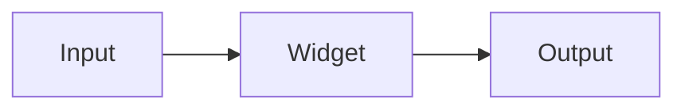

# Example FOSS for Python

A small, synthetic library used only as fixture content for the sealed transaction replay
attestor's tests. It is never installed, imported, or executed.

## Architecture



## Installation

```bash
pip install example-foss-for-python
```

## Usage

```python
from example_foss import Widget

widget = Widget(name="demo")
widget.render()
```

## Links

- Homepage: https://example-foss.example.org
- Documentation: https://example-foss.example.org/docs

## License

MIT
